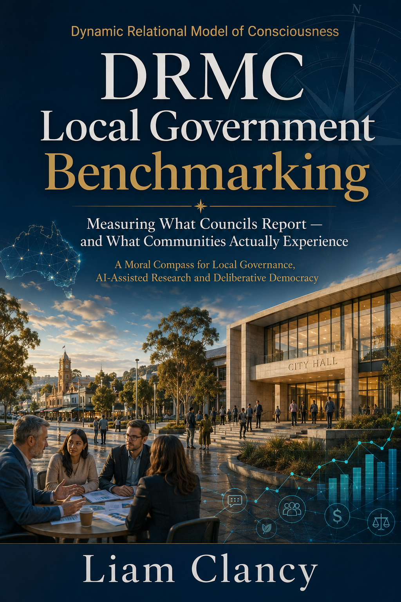

{width="8.23611111111111in" height="11.982906824146982in"}

**Chapter One**

**Local Government Is Where Democracy Becomes Visible**

Local government is where democracy leaves the press conference and becomes a footpath.

It becomes a road repair, a bin collection, a library program, a planning approval, a rate notice, a playground, a beach access ramp, a sports oval, a street tree, a stormwater drain, a main street upgrade, a community centre, a public toilet and occasionally a council agenda so long it appears to have been written as a test of human endurance.

This matters because local government is the level of democracy most people touch first. Federal politics may dominate the national argument. State governments may control the larger systems of health, education, policing, transport, planning and child protection. Councils, however, live closest to the skin of everyday life. They shape the practical conditions through which people experience place.

A council decision can alter how a resident gets to work, whether an older person feels safe walking to the shops, whether a young family can access a playground, whether a small business survives disruption, whether a person with disability can move through public space, whether a community feels heard and whether local character is strengthened or slowly replaced by a developer's brochure with lighting effects.

The Dynamic Relational Model of Consciousness, or DRMC, begins with a simple premise: consciousness is not sealed inside individual minds. It is shaped through bodies, places, histories, institutions, language, technology, economics, ecology, culture and power (Clancy, 2026). A person does not experience council as an abstract administrative machine. They experience it through the street they live on, the consultation they attended, the email that was never answered, the planning decision they did not understand, the park they love, the rate rise they resent and the feeling that someone either did or did not listen.

The DRMC Council Benchmarking Project has been developed to examine that space between what councils report and what communities actually experience.

Councils already report a great deal. They publish annual reports, budgets, strategic plans, long-term financial plans, asset management plans, meeting agendas, minutes, community consultation summaries and service delivery updates. These documents matter. They provide evidence. They support accountability. They allow residents, journalists, researchers, councillors and state agencies to examine what has been promised, funded, delivered or deferred.

The problem is not that councils fail to report. The problem is that reporting often measures activity more easily than experience.

A council may report that consultation occurred. The community may experience that process as tokenistic. A council may report that a project was delivered on budget. Residents may experience the result as ugly, inaccessible or disconnected from local character. A council may report financial discipline. Ratepayers may experience that discipline as cost shifting. A council may report climate commitments. Younger residents may experience delay as intergenerational failure. A council may report community engagement statistics. People who never participate may still be telling us something through their silence.

***Community experience is evidence.***

That sentence is central to this book. It does not mean every complaint is correct. It does not mean every rumour deserves a committee. It does not mean the loudest voice in the room represents the community. Local public discourse can be emotional, contradictory, misinformed, insightful, generous, furious and occasionally written by someone who believes capital letters are a governance strategy.

***Community experience still matters.***

It reveals what formal reporting often misses: trust, fairness, belonging, exclusion, consultation fatigue, symbolic loss, civic pride, ecological grief, place attachment, frustration, hope and the quiet erosion of confidence. These are not soft issues. They are governance conditions.

A council without trust becomes administratively functional and democratically brittle. A council without fairness becomes a service provider with a legitimacy problem. A council without place-based understanding can meet every statutory requirement while damaging the very identity it claims to serve. A council without ethical coherence can publish beautiful values statements while residents learn to read them as laminated fiction.

The DRMC does not reject conventional benchmarking. Financial indicators, service indicators, governance indicators and compliance measures are necessary. Nobody wants a council that speaks fluently about relational consciousness while the bins are missed, the roads collapse and the budget resembles a damp cardboard box pretending to be architecture.

***Practical performance still matters.***

The DRMC adds the missing layer. It asks what council performance does to the civic relationship. It asks whether decisions build trust or drain it, whether consultation changes outcomes or decorates them, whether public language clarifies or conceals, whether communities are treated as partners or managed as risks and whether future generations are protected from the convenience of today's short-term decisions.

This is the shift from compliance reporting to relational accountability.

Local government should not only be measured by what it delivers. It should also be measured by what it makes possible.

Does it make trust possible?

Does it make belonging possible?

Does it make fair participation possible?

Does it make ecological stewardship possible?

Does it make public reasoning possible?

Does it make intergenerational responsibility possible?

Does it make disagreement safer and more productive?

Does it make community voice consequential?

Those questions are the beginning of DRMC benchmarking.

They are also the beginning of a more honest conversation about local democracy.

**A Ten-Year Research Journey Before the First Council Report**

The DRMC did not begin in 2025.

The 2025 Holdfast Bay submission was a public expression of the model, not its origin. By that point the DRMC had already been developing for roughly a decade through reading, reflection, professional practice, community work, philosophical inquiry and direct observation of how people relate to place, power, identity and belonging.

The development of the DRMC drew from many intellectual streams. Edward de Bono's work on thinking systems helped sharpen the importance of mental frameworks, lateral thinking and the need to escape inherited patterns of perception (de Bono, 1970). Alain de Botton's philosophical writing helped make clear that ideas matter most when they return to daily life, relationships, architecture, work, status, anxiety and the ordinary struggle to live well (de Botton, 2000). Foucault provided a language for understanding how power moves through institutions, discourse, classification and normalisation rather than merely through visible command (Foucault, 1980). Derrida sharpened the suspicion that institutional language is never innocent and that what appears stable often depends on what has been excluded, suppressed or left unnamed (Derrida, 1976).

Those thinkers helped create the intellectual scaffolding. They were not the heart of the DRMC.

The heart of the DRMC comes from a deeper encounter with Australian Indigenous insights into Country, relational complexity, storylines, custodianship obligation, ancestry and belonging to place. The DRMC is not an Indigenous framework and does not claim ownership over Indigenous knowledge. It is not a substitute for Indigenous authority, cultural governance or First Nations-led methodologies. It is, however, profoundly shaped by the recognition that Australian Indigenous worldviews expose a major weakness in Western models of consciousness and governance: the habit of separating person from place, land from law, knowledge from relationship and responsibility from belonging.

In many Western administrative systems, place is treated as location. It becomes a parcel, boundary, asset, road reserve, zoning category, electorate, rateable property or development site. Australian Indigenous worldviews challenge that reduction. Country is not merely land. It is relation, memory, law, story, kinship, ecology, spirit and obligation. It is not scenery around human life. It is part of the living field through which identity, ethics and belonging are formed.

That insight changed the direction of the DRMC.

The model became less interested in consciousness as an abstract private state and more interested in consciousness as relationship. It became concerned with how people are shaped by where they are, who they belong to, what stories they inherit, what power structures constrain them, what languages are available to them, what histories remain unresolved and what futures they can imagine.

This is why place is foundational in the DRMC. Place is physical. It includes land, streets, parks, coastlines, buildings, transport routes, schools, libraries, homes, shopping strips, community centres, hospitals, industrial areas and natural systems. Place is also metaphysical. It includes memory, identity, story, belonging, grief, sacred meaning, civic pride, cultural authority, trauma, aspiration and imagined futures.

A council decision about a road is therefore never only about a road. It may also be about access, age, disability, safety, class, climate, local business, public trust and the memory of past decisions. A development proposal is never only about built form. It may also be about local character, ecological anxiety, housing pressure, inherited distrust, community identity and the feeling that a place is being rewritten without consent.

The DRMC emerged from trying to hold those realities together without flattening them into a single theory.

It is not a management model pretending to be philosophy. It is not a philosophy pretending to be a dashboard. It is a relational method for examining how consciousness, institutions and place shape one another.

That is why local government is such a powerful testing ground.

Councils work where these dimensions collide. They sit at the meeting point of roads and memory, budgets and belonging, regulation and identity, climate and suburbia, heritage and development, community voice and institutional defensiveness. They are close enough to everyday life to show whether a framework can actually explain anything useful.

A theory that cannot survive a council agenda probably should not be trusted with civilisation.

**The Limits of "Roads, Rates and Rubbish"**

Local government is often reduced to "roads, rates and rubbish". The phrase survives because it is simple, concrete and politically useful. It reminds councils not to drift too far into fashionable rhetoric while neglecting essential services.

As a theory of local government, however, it is hopelessly inadequate.

Roads are not just roads. They affect mobility, disability access, economic participation, traffic safety, urban design, emissions, walkability, ageing, social connection and local business viability.

Rates are not just rates. They are an expression of fiscal ethics: who pays, who benefits, who is protected, who is priced out and how the burden of local public life is distributed.

Rubbish is not just rubbish. Waste policy touches environmental responsibility, consumption, public health, circular economy design, behavioural expectations and intergenerational stewardship.

Even the most practical council services are relational. They shape the terms on which people inhabit place.

The mistake in conventional performance reporting is not that it measures practical things. The mistake is that it often treats practical things as if they were detached from meaning, trust, power and lived experience. A planning approval may be processed within statutory timeframes and still leave residents feeling that local character has been sacrificed. A consultation process may meet formal requirements and still fail the ethical test of influence. A budget may be balanced and still deepen perceptions of unfairness. A climate policy may be published and still fail to alter the community's sense of future confidence.

The DRMC Council Benchmarking Project asks councils to face these harder questions.

What did this decision do to trust?

Who benefited?

Who carried the burden?

Who was invited to participate?

Who was technically included yet practically excluded?

What histories were activated?

What place-based meanings were ignored?

What forms of evidence were privileged?

What narratives were used to justify the decision?

What ethical contradictions were left unresolved?

What risks are being passed to future generations?

These are not decorative questions. They are governance questions.

**From Local Submission to Statewide Benchmarking**

The DRMC Local Government Benchmarking Project did not begin as a finished system. It began as a local act of civic analysis.

In 2025, I submitted a DRMC-informed response to the City of Holdfast Bay's Business Plan consultation. That submission was not written as a neutral academic exercise. It was written as a resident, researcher and community development practitioner asking whether the council's budget and planning documents were telling the whole story. The concern was simple enough: the formal plan reported projects, capital works and financial allocations, yet it did not adequately reveal the relational condition of the community those decisions were meant to serve.

The submission examined capital works transparency, the balance between physical infrastructure and relational infrastructure, civic imagination, libraries, AI readiness, organisational culture, governance practice, community voice, hidden data gaps, informal housing arrangements, volunteer burnout, predictive planning and the possibility of new DRMC benchmarks for local government (Clancy, 2025).

In retrospect, that submission was the first council-facing field test of the model. It was not yet the full benchmarking system. It was the spark before the machinery had been built.

The Holdfast Bay submission also clarified a principle that remains central to this book: councils do not merely manage assets. They manage relationships to place. A road, library, coastal precinct, business plan, community safety budget or consultation process is not only an administrative item. It is a signal about what a council values, what it sees, what it misses and how it understands the people who live within its boundaries.

Since that submission, the DRMC has evolved significantly.

The project has moved from a single council critique to a broader South Australian council benchmarking program. Draft DRMC reports have now been prepared across multiple council types, including Adelaide Plains, Playford, Port Adelaide Enfield, Victor Harbor, Onkaparinga, Murray Bridge and Walkerville. Each council presents a different governance ecology. Some are managing explosive growth. Some are navigating coastal risk. Some are investing in cultural infrastructure. Some are wrestling with asset renewal, ratepayer affordability, climate resilience, social inclusion, housing pressure, representation reform or major capital works.

This variety matters. A model that only works in one council area is not a model. It is a local opinion with stationery.

The Adelaide Plains report shows how the DRMC can organise evidence around peri-urban growth, rate affordability, flood resilience, First Nations heritage, coastal amenity, democratic renewal and agricultural diversification (Clancy, 2026). The Playford report shows how the framework can capture rapid population growth, inclusive playspace design, disability access planning, major sport and recreation projects, waste-management pressures and urban greening (Clancy, 2026). Port Adelaide Enfield demonstrates the importance of cultural infrastructure, homelessness responses, climate resilience, social infrastructure planning and urban tree canopy (Clancy, 2026). Victor Harbor was one of the first to be measured against the Victorian Local Government Performance Reporting Framework comparability audit, identifying where South Australian public reporting does and does not support direct benchmarking (Clancy, 2026). Onkaparinga provides a major metropolitan case of institutional reform, financial repair, environmental advocacy, affordable housing strategy, reconciliation and representation review (Clancy, 2026). Murray Bridge extends the project into regional growth, riverfront place-making, international economic positioning and volunteer-based service delivery (Clancy, 2026). Walkerville tests the framework in a compact, high-capacity municipality where asset modelling, urban forest targets, recreation investment and cultural engagement become highly visible (Clancy, 2026).

These reports mark the second stage of the DRMC's development. The first stage asked whether the DRMC could help interpret one council's planning and engagement process. The second stage asks whether it can support repeatable, structured and comparable analysis across councils.

The answer is increasingly yes, with an important qualification.

The DRMC does not replace existing local government reporting. It does not pretend that financial ratios, asset renewal schedules, governance checklists, service data or audit reports are unnecessary. Those measures remain essential. The DRMC adds what those measures often struggle to capture: trust, fairness, place attachment, consultation quality, narrative credibility, social impact, cultural recognition, ecological anxiety, intergenerational responsibility and the lived experience of residents.

This is why the current work now extends beyond South Australia. The project is increasingly concerned with national local government reform. South Australia provides the initial testing ground because its councils offer diverse and accessible case studies, yet the larger question is national: how can Australian local government move from compliance reporting to relational accountability?

**Councils Do Not Act in a Bubble**

Local government is local, yet never only local.

Councils operate inside state legislation, federal funding arrangements, national housing policy, infrastructure grant systems, climate adaptation frameworks, digital regulation, energy markets and global economic shocks. A council may set rates locally, yet those rates are shaped by construction costs, insurance premiums, interest rates, petrol prices, labour shortages, supply chains and state-imposed responsibilities.

A council may design engagement locally, yet public trust is shaped by national politics, social media ecosystems, misinformation, media concentration and global ideological conflict.

This matters because residents often experience system pressure locally before they understand its causes. A rate rise arrives from council, yet the cost pressures may come from global energy markets, construction inflation, insurance costs, state waste levies, interest rates, supply-chain instability and the price of bitumen. A delayed infrastructure project may look like local incompetence, yet the cause may involve grant timing, procurement failures, contractor shortages or state planning decisions. A local business struggling during roadworks may blame the council, while also being hit by rent, fuel costs, labour shortages and online retail competition.

The DRMC does not excuse councils from accountability. It widens the field of accountability.

It asks how councils communicate these pressures, how they advocate upward to state and federal government, how they collaborate across systems and how they protect local communities from becoming the shock absorbers of policy failure elsewhere.

This is also where international politics enters the local frame. American political instability, fossil fuel lobbying, Republican deregulatory ideology, oligarchic corporate power and Trump-era policy volatility are not distant theatre for Australians to watch with popcorn and mild horror. They affect energy markets, climate policy momentum, investment confidence, misinformation ecosystems, digital platforms and the ideological struggle between public regulation and private power (Clancy, 2026).

Australia, New Zealand and the European Union have tended to move more strongly toward rights-based regulation, privacy protection, platform accountability and public-interest governance than the most aggressively deregulatory currents in the United States. That contrast matters for local government because councils increasingly operate in digital, climatic and economic environments shaped by forces far beyond municipal boundaries.

A council cannot control global petrol prices. It can, however, understand how transport dependency affects household stress, local business costs, service delivery, volunteering, event participation and community access. A council cannot regulate Silicon Valley. It can, however, understand how platforms shape youth wellbeing, public attention, misinformation and the quality of civic discourse.

The South Australian Government's advocacy for social media restrictions for children under sixteen is a useful example of this wider regulatory shift. It recognises that digital platforms are not neutral tools when they mediate childhood, identity, attention, peer belonging and corporate profit. Whether one agrees with every detail of the policy or not, the broader principle is highly relevant to the DRMC: technology must be judged by its relational effects, not only by its convenience or market success.

Councils sit inside this same moral landscape. They use digital engagement platforms. They record meetings. They deploy CCTV. They collect community data. They maintain social media channels. They increasingly use AI tools, dashboards, customer request systems and automated workflows. These technologies can strengthen participation, transparency and service delivery. They can also deepen exclusion, sanitise dissent, obscure responsibility or convert community life into behavioural data.

Technology is never only technical.

Through a DRMC lens, every tool has a relational consequence.

**Good Practice Matters**

This book will not only critique local government. That would be lazy and unfair. Councils are easy targets because their work is visible, contested and close to daily irritation. Anyone can mock a pothole. Far fewer people understand the governance, funding, staffing, regulatory and political pressures behind why it remains a pothole long enough to develop a social identity.

Good practice deserves attention.

The City of Onkaparinga provides a strong example of a large, complex metropolitan council attempting to manage growth, budget repair, environmental advocacy, reconciliation, housing pressure and community service demands at scale. Its complexity makes it useful for DRMC analysis because the council cannot be reduced to a single issue. Large councils are systems within systems. They contain coastal, suburban, rural, economic, cultural, ecological and intergenerational tensions.

Mayor Moira Were AM also offers a useful example of local leadership extending beyond municipal boundaries. The Onkaparinga draft report identifies her advocacy on marine health and harmful algal blooms affecting the Great Southern Reef as part of a broader environmental leadership role (Clancy, 2026). That kind of advocacy matters because councils are not merely service providers. At their best, they become place-based voices within state and national policy systems.

The City of Adelaide offers another kind of example. Lord Mayor Dr Jane Lomax-Smith AM demonstrates the importance of civic presence, public communication and symbolic leadership. Some mayors treat public visibility as an occasional duty. Others understand that visibility is part of the office itself. A civic leader who maintains regular public engagement helps narrate the city back to itself. That matters because cities are not held together by infrastructure alone. They are held together by story, confidence, ritual, recognition and the sense that someone is paying attention.

Leadership communication is not decoration. It is part of the civic field.

A mayor who communicates regularly can reduce distance between institution and community. A mayor who only appears during formal announcements risks becoming a signature block with a chain of office.

The DRMC is interested in this distinction because governance is not only what happens in formal meetings. It is also how institutions maintain relationship, visibility, credibility and trust over time.

**Why Artificial Intelligence Is Useful and Not Enough**

Artificial intelligence is central to the Council Benchmarking Project, but it is not the hero of the story.

AI can assist with the practical burden of benchmarking. It can process large volumes of publicly available council documents. It can help extract meeting decisions, identify recurring themes, compare strategic priorities, build source registers, classify consultation topics, detect repeated language, summarise budget items and identify evidence gaps. Used well, AI can help turn scattered public information into structured civic intelligence.

Used badly, it can produce polished nonsense at industrial speed.

The DRMC research protocol is blunt about this: AI-generated outputs are not citable evidence. They are research assistance outputs that point back to primary sources. Every factual claim, date, statistic, quotation or policy position must be verified against the original source document before being used (Clancy, 2026).

This principle is non-negotiable. The Council Benchmarking Project must not become another automated dashboard that pretends to be objective while hiding untested assumptions inside its machinery. AI can support research. It cannot replace ethical judgement, contextual knowledge, source verification, community interpretation or democratic accountability.

The ethical boundaries are equally important. The project uses public institutional records, official reports, published meeting documents, council strategies, budgets, consultation reports and other legitimate public sources. It does not profile private citizens. It does not scrape personal social media for individual analysis. It does not diagnose residents, councillors or communities. It does not convert civic life into surveillance.

That ethical position is not a bureaucratic footnote. It is central to the legitimacy of the whole project. A tool designed to strengthen democratic accountability must not become a new mechanism for institutional control. Councils already have enough ways to look busy while missing the point.

**From Compliance to Relational Accountability**

Compliance matters. It protects minimum standards. It creates procedural obligations. It produces records. It offers citizens some defence against arbitrary power. No serious person should dismiss compliance.

The problem is that compliance can become a ceiling instead of a floor.

A council can comply and still fail relationally. It can publish the required document, hold the required consultation, meet the required deadline, pass the required motion and still leave the community with the strong impression that nothing meaningful was open to influence. This is where trust begins to decay. Not always dramatically. Often slowly, in the ordinary accumulation of disappointment.

The DRMC identifies this as a relational problem before it becomes a political one.

Community opposition is often treated as a communications failure. That is sometimes true. Poor communication can turn manageable issues into bonfires. More often, however, opposition signals a deeper rupture. People oppose projects when place attachments, historical memory, cultural meaning, economic security, ecological concern and ethical expectations are ignored or mishandled. Community opposition is therefore not merely an obstacle to be overcome. It can be diagnostic information.

This does not mean councils should be expected to satisfy everyone. They cannot. Local government involves trade-offs, constraints, legal obligations, finite budgets, competing needs and the occasional resident who believes all public policy should be personally approved by their dog. Democratic maturity requires recognising complexity.

Complexity is not an excuse for opacity.

Trade-offs can be explained. Constraints can be made visible. Decisions can be justified plainly. Feedback can be acknowledged honestly. Community influence can be defined before engagement begins. Harms can be named. Benefits can be distributed more fairly. Uncertainty can be admitted. Mistakes can be repaired.

That is relational accountability.

It is the difference between saying, "We complied with the process," and saying, "Here is what we heard, here is what changed, here is what could not change, here is why, here is who benefits, here is who is affected and here is how we will remain accountable."

The first is administrative.

The second is democratic.

**What This Book Offers**

This book develops the DRMC Local Government Benchmarking Project as a practical framework for civic intelligence. It offers councils, communities, researchers, consultants and policymakers a way to integrate four forms of evidence:

reported council performance;

public institutional records;

community experience data;

DRMC relational analysis.

The aim is not to create a crude league table. Ranking councils may be useful in some contexts, but the deeper purpose is diagnostic. The project asks:

Where are councils strong?

Where are reporting systems thin?

Where is community experience missing?

Where is consultation failing?

Where are financial decisions creating social strain?

Where is environmental risk underweighted?

Where is language disguising conflict?

Where is trust being built?

Where is trust being exhausted?

Where are communities showing signs of friction, compression, attunement, reflection, transformation or disconnection?

The purpose is improvement, not humiliation. Improvement requires honesty. A benchmarking system that flatters everyone is useless. A benchmarking system that merely punishes is politically foolish. The DRMC seeks a harder middle path: ethically grounded, evidence-based, publicly accountable and open to complexity.

**The Central Argument**

The central argument of this book can be stated simply:

Local government should be measured not only by what it delivers, but by what it makes possible.

Does it make trust possible?

Does it make belonging possible?

Does it make fair participation possible?

Does it make public reasoning possible?

Does it make ecological responsibility possible?

Does it make intergenerational stewardship possible?

Does it make disagreement safer, clearer and more productive?

Does it make community voice consequential?

Does it make better futures imaginable?

These questions shift benchmarking from compliance reporting to relational accountability. They also shift local government from the defensive posture of proving performance toward the more mature task of learning with the community.

The DRMC Council Benchmarking Project does not pretend that councils can solve every social problem. They cannot. It does argue that councils are among the most important institutions shaping the everyday conditions of civic life. They influence whether communities feel connected or abandoned, consulted or processed, respected or managed, hopeful or resigned.

This is why the project matters.

When a council reports performance, the community is entitled to ask:

Yes, but did it measure our experience?

**Draft reference list for Chapter One**

Clancy, L. (2025) *Holdfast Bay DRMC Submission: Business Plan Review*. Unpublished submission.

Clancy, L. (2026) *Dynamic Relational Model of Consciousness: A Pluralistic Framework for Consciousness, Place, Ethics, Information, Agency and Systemic Transformation*. Unpublished working manuscript.

Clancy, L. (2026) *DRMC Matrix Structure: Dynamic Relational Model of Consciousness Application Document*. Revised edition. Unpublished working manuscript.

Clancy, L. (2026) *DRMC Council Benchmarking Report: Adelaide Plains Council*. Draft working report.

Clancy, L. (2026) *DRMC Council Benchmarking Report: City of Playford*. Draft working report.

Clancy, L. (2026) *DRMC Council Benchmarking Report: City of Port Adelaide and Enfield*. Draft working report.

Clancy, L. (2026) *DRMC Council Benchmarking Report: City of Victor Harbor*. Draft working report.

Clancy, L. (2026) *DRMC Council Benchmarking Report: City of Onkaparinga*. Draft working report.

Clancy, L. (2026) *DRMC Council Benchmarking Report: Rural City of Murray Bridge*. Draft working report.

Clancy, L. (2026) *DRMC Council Benchmarking Report: Town of Walkerville*. Draft working report.

de Bono, E. (1970) *Lateral Thinking: Creativity Step by Step*. New York: Harper & Row.

de Botton, A. (2000) *The Consolations of Philosophy*. London: Hamish Hamilton.

Derrida, J. (1976) *Of Grammatology*. Translated by G. C. Spivak. Baltimore: Johns Hopkins University Press.

Foucault, M. (1980) *Power/Knowledge: Selected Interviews and Other Writings 1972--1977*. Edited by C. Gordon. New York: Pantheon Books.

**Chapter Two**

**The Performance Reporting Gap**

Councils are not short of documents.

They produce annual reports, annual business plans, budgets, long-term financial plans, asset management plans, strategic plans, meeting agendas, minutes, consultation reports, grant reports, community plans, audit committee papers, development plans, waste strategies, transport strategies, climate strategies, disability access plans, reconciliation plans, open space plans and enough appendices to make a photocopier reconsider its life choices.

The problem is not the absence of reporting.

The problem is that much council reporting still struggles to answer the question residents most want answered:

**Is this council making life better in this place?**

That question sounds simple. It is not.

A council can report that it has adopted a budget. It can report a rate increase, capital works program, asset renewal allocation and operating position. It can list roads, footpaths, stormwater works, playground upgrades, community grants and environmental initiatives. It can publish compliance documents and satisfy statutory requirements.

Those reports may still fail to show whether residents trust the council, whether engagement changed anything, whether vulnerable groups experienced better access, whether public language matched public action, whether local identity was protected, whether climate risk was taken seriously, whether financial decisions felt fair and whether the community experienced the council as responsive or remote.

This is the performance reporting gap.

The DRMC Council Benchmarking Project begins by taking conventional reporting seriously. Financial sustainability matters. Asset renewal matters. Governance rules matter. Risk frameworks matter. Service delivery matters. A council cannot build civic trust on charming rhetoric while neglecting drainage, footpaths, waste services, planning administration and public toilets. Practical competence is not optional.

Competence alone is not enough.

The DRMC argues that council performance must be assessed through a wider relational field. A council's work has material consequences, yet it also has civic, emotional, cultural, ecological, narrative and ethical consequences. A rate rise is not only a number. It is a claim about fairness. A capital works project is not only expenditure. It is a claim about priority. A consultation process is not only participation. It is a claim about power. A tree strategy is not only environmental policy. It is a claim about future liveability. A reconciliation plan is not only symbolic language. It is a claim about history, Country and moral responsibility.

Traditional reporting often captures the action.

The DRMC asks what the action means.

**What Councils Already Report Well**

Many councils already report significant information well. The attached council reports show that strong public data exists when councils commit to clear planning, transparent budgeting and structured community information.

Salisbury provides one of the clearest examples. Its 2025/26 budget material identifies a 4.2 per cent average rate increase, a \$70.3 million infrastructure investment, a \$3.886 million operating surplus and \$37.6 million committed to asset renewal. The report also identifies net financial liabilities of \$95.9 million, described as moderate and sustainable, with long-term rates growth planned at CPI plus 0.6 per cent (Clancy, 2026). That is useful reporting because it gives residents more than a slogan. It provides a financial frame against which future performance can be tested.

Walkerville also provides a strong example of reporting that links budget discipline to asset intelligence. Its report identifies a 3.2 per cent rate increase, a \$1,487 minimum rate, major investment in recreation facilities, road and footpath renewal, CCTV and park upgrades. More importantly, Walkerville appears to have used predictive asset modelling to reduce its road capital budget by \$300,000 per year without reducing road quality, then reinvest those funds into strategic projects (Clancy, 2026). That is the kind of story councils should tell more often because it explains not only what was funded but why the decision was rational.

Burnside shows the value of measurable environmental reporting. Its report identifies a 2030 carbon-neutral target, recorded organisational emissions of 1,451 tonnes CO2 in 2023/24, more than 1,100 trees planted annually, 60 per cent kerbside waste diversion, 31 per cent canopy cover and more than 42,700 urban forest trees (Clancy, 2026). Those figures allow residents to see environmental performance as measurable civic work rather than green language sprinkled over a strategic plan like parsley.

Copper Coast demonstrates a different kind of reporting value. Its documents show a 5.5 per cent increase in general rate income, a \$6.71 billion valuation base and differential rate adjustments that reduced the rate in the dollar for most categories. The report also shows major regional issues such as water infrastructure constraints, FOGO expansion, coastal infrastructure, World Heritage ambitions and regional disability access planning (Clancy, 2026). That matters because regional councils must often explain performance within constraint rather than abundance.

Murray Bridge provides useful budget and growth data. Its draft Annual Business Plan identifies a \$73.4 million budget, a 4.8 per cent average rate rise, \$63.3 million in operating expenditure, \$9.4 million in asset renewal and a proposed increase in the vacant land differential from 30 per cent to 50 per cent to encourage development and support housing supply (Clancy, 2026). This shows how a council can connect rating policy to growth management and local economic strategy.

Marion provides a useful example of public responsiveness reporting. Its report identifies a 64.4 per cent Community Satisfaction Index through Snap Send Solve, placing Marion second highest among South Australian councils in that index. Marion also uses the Marion 100 Community Forum, a representative community panel formed in 2021, to provide feedback on strategic planning, annual business planning and communication strategies (Clancy, 2026). This indicates a council trying to develop more systematic listening channels beyond the standard "please complete our survey and hope someone reads it" model.

These examples show that councils are not starting from zero. There is already good practice across South Australia. The DRMC does not need to invent performance reporting from scratch.

It needs to connect the pieces.

**The Missing Layer**

Council reporting often becomes strongest where the numbers are clean.

Rates can be reported. Capital works can be listed. Assets can be valued. Grants can be counted. Tonnes of waste can be measured. Trees can be planted and recorded. Committee meetings can be scheduled. Policies can be adopted.

The harder questions are less tidy.

Did consultation build trust?

Did public opposition reveal a deeper place-based concern?

Did the council communicate trade-offs honestly?

Did a rate rise feel fair to households under pressure?

Did a major infrastructure project strengthen community identity or displace it?

Did a disability access plan alter lived access or merely satisfy a statutory expectation?

Did a reconciliation plan shift institutional behaviour or remain in the comfortable zone of ceremonial acknowledgement?

Did an environmental strategy change land-use decisions or sit politely beside them?

Did council leadership maintain civic confidence during conflict?

Those questions are harder because they involve relationship. They require interpretation. They cannot be answered by activity counts alone.

That is the missing layer.

The DRMC calls this the **community experience layer**. It sits between formal council reporting and lived civic reality. It does not replace financial, governance or service data. It interprets their social meaning.

A council may report that a consultation was held. The community experience layer asks whether the consultation had influence.

A council may report that an open space plan was endorsed. The community experience layer asks who participated, who did not, what groups were missing and what changes resulted from public feedback.

A council may report that a rate increase was modest. The community experience layer asks whether residents understand the reason, whether the burden is fairly distributed and whether cost-of-living pressures have been acknowledged in practical terms.

A council may report that a project is transformative. The community experience layer asks transformative for whom.

This is where DRMC benchmarking becomes more than a database.

It becomes a civic diagnostic method.

**Burnside: Strong Environmental Reporting, Weak Relational Governance**

Burnside is one of the clearest examples of why conventional reporting is not enough.

On paper, Burnside shows outstanding environmental performance. It reports a 2030 carbon-neutral ambition, low organisational emissions, strong tree planting, high canopy coverage, a multi-year Tree City of the World designation, recycled asphalt use, verge soakers, waste diversion and urban forest protection (Clancy, 2026). A conventional environmental dashboard would likely treat Burnside as a high performer. That would be fair as far as it goes.

The DRMC asks what else is happening in the civic field.

The same report identifies a significant governance and conduct crisis. A Sparke Helmore investigation substantiated four allegations against a councillor, including bullying and failures to act in a reasonable, just and respectful way. The report also cites public commentary describing factionalism, bullying, toxic exchanges and legal costs exceeding \$20,000 for the latest legal review (Clancy, 2026).

A narrow performance model may keep those matters separate.

Environment: strong.

Finance: under repair.

Governance: issue noted.

The DRMC refuses to leave them in separate boxes.

Governance culture affects the meaning of all other performance. A council can lead on tree canopy while losing trust through internal dysfunction. It can deliver strong environmental outcomes while residents become frustrated by conflict, legal cost and institutional distraction. It can look excellent in one domain while suffering relational damage in another.

This does not diminish Burnside's environmental achievements. It makes the assessment more honest.

The council is not simply "good" or "bad". It is a complex civic system with strong environmental stewardship and serious relational governance stress. That is exactly the kind of complexity conventional reporting often struggles to express.

**Salisbury: When Performance Reporting Starts to Join the Dots**

Salisbury shows how council reporting can move closer to the DRMC ideal when finance, growth, inclusion and strategic ambition are presented together.

The Salisbury report identifies a major \$200 million city centre transformation, a \$53.6 million social housing development, a 25-year Economic Development and Growth Strategy, an Ability Inclusion Strategy with 42 actions, water and stormwater initiatives, a FOGO and garden organics trial and substantial investment in sport and recreation (Clancy, 2026).

This matters because Salisbury is not merely reporting isolated projects. It is presenting a wider urban transformation agenda. Social housing, economic development, city centre renewal, disability inclusion, water stewardship and recreation infrastructure are all part of the same civic story.

The DRMC still asks hard questions.

Who benefits from the city centre transformation?

How will construction disruption be managed?

How will the 69 social housing apartments integrate with public space, service hubs and community safety?

How will inclusion commitments be measured over time?

How will water and environmental strategies adapt to heat, growth and industrial pressure?

How will public trust be maintained during an 18 to 24 month construction period?

Those questions do not undermine the project. They strengthen the performance framework around it.

Salisbury shows that councils can tell a broader story when they connect investment, inclusion, economic development and place. The DRMC then pushes the next step: turn that story into measurable relational accountability.

**Copper Coast: The Council Is Accountable, Yet Not in Control**

Copper Coast demonstrates another crucial point.

Councils do not act in a bubble.

The Copper Coast report identifies a region facing population growth and major development pressure, yet more than 1,000 homes across Yorke Peninsula are stalled because of insufficient SA Water network capacity. The report identifies the 680-home Riverbend lifestyle village and a 200-home Aspen project as affected by water infrastructure constraints. CEO Dylan Strong is recorded as calling for State Government intervention because the constraint is not unique to Copper Coast (Clancy, 2026).

This is a textbook DRMC example.

A resident may see housing delay as a local council failure. A developer may see regulatory failure. A state agency may see capital planning constraint. A council may see a regional growth bottleneck outside its direct control. A young worker may see another reason they cannot live near work. A local business may see labour shortage intensifying because housing supply cannot keep up.

The same issue has multiple relational locations.

Conventional reporting may list the project delay.

The DRMC maps the relational field around the delay.

Copper Coast is also managing World Heritage aspirations through Moonta Mines, coastal infrastructure, sand drift, FOGO leadership, tourism activation and regional disability inclusion (Clancy, 2026). That combination tells us something important about regional local government. Its performance cannot be measured only by internal efficiency. It must be understood through state infrastructure systems, tourism economies, heritage identity, environmental risk and regional population change.

This is why DRMC benchmarking must include external pressures.

A council may be accountable for local leadership without being in control of every system shaping local outcomes.

**Marion: Responsiveness Is Performance**

Marion shows another form of performance that deserves more attention.

Its report identifies high community satisfaction through Snap Send Solve and a structured community panel through Marion 100. The Snap Send Solve Community Satisfaction Index placed Marion second highest in South Australia at 64.4 per cent, while Marion 100 has provided ongoing feedback on strategic planning, annual business planning and communication strategies since 2021 (Clancy, 2026).

That is important because responsiveness is not merely customer service. It is a relational performance indicator.

When residents report an issue and see action, trust increases. When they report an issue and nothing happens, cynicism grows. When reporting tools are easy to use, civic participation becomes more accessible. When feedback disappears into a bureaucratic fog, residents learn that participation is mostly decorative.

Snap Send Solve is not democracy. No app should be handed a sash and asked to run for mayor. It can still become part of democratic experience when it reduces friction between resident observation and council action.

Marion's data also shows the limits of public searchability. The report marks several key items as not identified, including the CEO, elected member count, ward structure, rate increase, operating result, borrowings, debt, climate plan, audit committee details and risk registers (Clancy, 2026).

This is not necessarily proof that Marion lacks those systems. It shows that accessible public reporting may not make them easy to locate or compare. That distinction matters. The DRMC treats data gaps as evidence of reporting accessibility, not automatic evidence of poor performance.

A council may be doing the work.

The public may still struggle to see it.

That is a reporting problem.

**Murray Bridge: Regional Ambition and Governance Visibility**

Murray Bridge shows the reporting gap in another form.

Its draft Annual Business Plan identifies a \$73.4 million budget, a 4.8 per cent average rate rise, \$63.3 million in operating expenditure, \$9.4 million in asset renewal and a 21-day consultation process through Let's Talk Murray Bridge. It also shows a proposed vacant land differential increase designed to encourage development and support housing supply (Clancy, 2026).

The report also identifies regional ambition through riverfront revitalisation, the Sturt Reserve transformation, Swanport Road Masterplan, Murray Princess Wharf remediation, economic diplomacy with Dezhou in China and a volunteer workforce contributing more than 20,000 hours with an estimated value of approximately \$970,000 (Clancy, 2026).

That is a compelling civic story.

Murray Bridge is not merely maintaining roads. It is positioning itself as a growing regional city with riverfront identity, tourism potential, food and protein economy positioning and international engagement.

The performance gap appears in governance visibility. The report marks elected member count, ward structure, audit and risk committee evidence, risk policy, fraud policy, cyber security governance, complaints policy, procurement policy and business continuity as not identified in the public search results (Clancy, 2026).

Again, this may reflect search accessibility rather than absence. It still matters.

Regional ambition requires public confidence. Public confidence requires governance visibility. A council pursuing growth, investment and international positioning needs to make its governance systems easy to see, not just internally functional.

DRMC benchmarking therefore reads Murray Bridge as a council with strong strategic potential and notable public data gaps.

That is not an attack. It is a useful diagnostic.

**Walkerville: Small Council, High Intelligence**

Walkerville is a useful counterexample to the assumption that scale determines sophistication.

As one of South Australia's smallest councils, Walkerville could easily be dismissed as too compact to matter in a statewide benchmarking framework. That would be a mistake.

The report shows a council using predictive asset modelling, managing a \$220 million asset profile, investing in a \$12.4 million recreation precinct, maintaining a 22.6 per cent tree canopy target pathway toward 32 per cent by 2035 and delivering major community infrastructure without dramatic rate shock (Clancy, 2026).

Walkerville's example matters because it shows that good performance intelligence does not require enormous scale. A compact council can use asset data strategically. It can explain how savings from road budget optimisation are redirected into community infrastructure. It can align urban forest targets with intergenerational amenity. It can show how a recreation precinct becomes more than sport infrastructure.

A two-court recreation centre, bowling club redevelopment, upgraded oval, library services, home assistance, community bus and cultural engagement through the Myunggidja Adjika Bush Uses Track all reveal a council where physical infrastructure and relational infrastructure overlap (Clancy, 2026).

The DRMC reads that overlap as significant.

The building is not just a building.

The oval is not just an oval.

The trees are not just trees.

They are part of a compact civic ecology where access, memory, ageing, recreation, climate, culture, movement and belonging intersect.

That is why the DRMC insists on place-based analysis.

**The Problem With Data Gaps**

Every council report attached to this project contains data gaps.

Some are minor. Some are serious. Some reflect limitations in the current research process. Some reflect poor public accessibility. Some may reveal genuine weaknesses in public reporting.

The DRMC does not treat every data gap as a failure.

It treats every data gap as a question.

A missing cyber security report does not prove weak cyber governance. It tells us that cyber governance was not visible through accessible public sources used in the review.

A missing complaints policy does not prove poor complaint handling. It tells us that complaint handling may not be easy for the public to locate or compare.

A missing asset renewal ratio does not prove poor asset management. It tells us that public comparability is limited.

A missing participation count for consultation does not prove poor engagement. It tells us that residents cannot easily assess who participated, how representative the process was or whether feedback altered the outcome.

This matters because transparency is not only about publishing documents.

Transparency requires accessibility, comparability and interpretability.

A document buried three clicks deep in a PDF attachment to an agenda item may satisfy compliance. It may not satisfy democratic visibility. A table full of technical financial ratios may satisfy auditors. It may not tell a ratepayer whether council is financially sustainable in terms they can understand. A consultation report may summarise themes. It may not show what changed because of the feedback.

The DRMC calls this the difference between **available information** and **usable civic intelligence**.

Councils need the second.

**From Activity Reporting to Relational Accountability**

Activity reporting tells us what happened.

Relational accountability tells us what changed.

Activity reporting says:

A consultation was held.

A plan was adopted.

A playground was upgraded.

A strategy was endorsed.

A grant was received.

A rate increase was declared.

A committee met.

Relational accountability asks:

Who participated?

Who was absent?

What did the community say?

What changed because of the input?

Who benefits?

Who bears the cost?

What risks remain?

What future obligations were created?

What trust was built or damaged?

What place-based meaning was recognised or ignored?

This shift is not a luxury. It is the next stage of local government performance maturity.

The Victorian Local Government Performance Reporting Framework, financial ratios, annual reports and governance checklists all contribute important foundations. The DRMC does not reject them. It builds around them.

The missing layer is the lived civic relationship.

That relationship cannot be reduced to satisfaction scores, although satisfaction matters. It cannot be reduced to complaints, although complaints matter. It cannot be reduced to attendance numbers, although participation matters. It cannot be reduced to social media reaction, although public discourse matters.

The relationship has to be interpreted through multiple evidence streams.

That is the purpose of DRMC benchmarking.

**A Better Benchmarking Question**

Most benchmarking systems ask:

How does this council perform compared with similar councils?

That question remains useful.

The DRMC adds another question:

How does this council's reported performance compare with what the community actually experiences?

That question changes the whole exercise.

It prevents performance reporting from becoming self-congratulatory. It prevents community sentiment from becoming unstructured noise. It allows council documents, public data, resident surveys, consultation records, social impact indicators, media narratives and local knowledge to be read together.

The resulting picture is more complicated.

That is a strength.

Councils are complicated institutions operating in complicated places under complicated pressures. Any framework that makes them look simple is probably selling something.

The DRMC does not promise simplicity.

It promises a better map.

**Chapter Two Conclusion: Reporting Is Not Knowing**

Council reporting is necessary.

It is not the same as knowing.

A council may report its budget and still not know whether residents understand the trade-offs. It may report consultation and still not know whether people felt heard. It may report capital works and still not know whether projects strengthen belonging. It may report environmental targets and still not know whether communities believe the future is being protected. It may report inclusion strategies and still not know whether access improved for people with disability, older residents, young people, First Nations communities or culturally diverse groups.

The DRMC Council Benchmarking Project exists because the gap between reporting and knowing is now too large to ignore.

Local government needs performance intelligence that can hold finance and trust, assets and belonging, governance and culture, climate and memory, data and meaning.

The old model asks whether council complied.

The better model asks whether council strengthened the civic relationship.

That is the performance reporting gap.

That is also the opportunity.

**Draft Chapter Two Reference List**

Clancy, L. (2026) *City of Burnside DRMC Council Benchmarking Report*. Unpublished draft report.

Clancy, L. (2026) *City of Salisbury DRMC Council Benchmarking Report*. Unpublished draft report.

Clancy, L. (2026) *District Council of the Copper Coast DRMC Council Benchmarking Report*. Unpublished draft report.

Clancy, L. (2026) *City of Marion DRMC Council Benchmarking Report*. Unpublished draft report.

Clancy, L. (2026) *Rural City of Murray Bridge DRMC Council Benchmarking Report*. Unpublished draft report.

Clancy, L. (2026) *Town of Walkerville DRMC Council Benchmarking Report*. Unpublished draft report.

**Chapter Two**

**The Performance Reporting Gap**

Councils are not short of documents.

They produce annual reports, annual business plans, budgets, long-term financial plans, asset management plans, strategic plans, meeting agendas, minutes, consultation reports, grant reports, community plans, audit committee papers, development plans, waste strategies, transport strategies, climate strategies, disability access plans, reconciliation plans, open space plans and enough appendices to make a photocopier reconsider its life choices.

The problem is not the absence of reporting.

The problem is that much council reporting still struggles to answer the question residents most want answered:

**Is this council making life better in this place?**

That question sounds simple. It is not.

A council can report that it has adopted a budget. It can report a rate increase, capital works program, asset renewal allocation and operating position. It can list roads, footpaths, stormwater works, playground upgrades, community grants and environmental initiatives. It can publish compliance documents and satisfy statutory requirements.

Those reports may still fail to show whether residents trust the council, whether engagement changed anything, whether vulnerable groups experienced better access, whether public language matched public action, whether local identity was protected, whether climate risk was taken seriously, whether financial decisions felt fair and whether the community experienced the council as responsive or remote.

This is the performance reporting gap.

The DRMC Council Benchmarking Project begins by taking conventional reporting seriously. Financial sustainability matters. Asset renewal matters. Governance rules matter. Risk frameworks matter. Service delivery matters. A council cannot build civic trust on charming rhetoric while neglecting drainage, footpaths, waste services, planning administration and public toilets. Practical competence is not optional.

Competence alone is not enough.

The DRMC argues that council performance must be assessed through a wider relational field. A council's work has material consequences, yet it also has civic, emotional, cultural, ecological, narrative and ethical consequences. A rate rise is not only a number. It is a claim about fairness. A capital works project is not only expenditure. It is a claim about priority. A consultation process is not only participation. It is a claim about power. A tree strategy is not only environmental policy. It is a claim about future liveability. A reconciliation plan is not only symbolic language. It is a claim about history, Country and moral responsibility.

Traditional reporting often captures the action.

The DRMC asks what the action means.

**What Councils Already Report Well**

Many councils already report significant information well. The attached council reports show that strong public data exists when councils commit to clear planning, transparent budgeting and structured community information.

Salisbury provides one of the clearest examples. Its 2025/26 budget material identifies a 4.2 per cent average rate increase, a \$70.3 million infrastructure investment, a \$3.886 million operating surplus and \$37.6 million committed to asset renewal. The report also identifies net financial liabilities of \$95.9 million, described as moderate and sustainable, with long-term rates growth planned at CPI plus 0.6 per cent (Clancy, 2026). That is useful reporting because it gives residents more than a slogan. It provides a financial frame against which future performance can be tested.

Walkerville also provides a strong example of reporting that links budget discipline to asset intelligence. Its report identifies a 3.2 per cent rate increase, a \$1,487 minimum rate, major investment in recreation facilities, road and footpath renewal, CCTV and park upgrades. More importantly, Walkerville appears to have used predictive asset modelling to reduce its road capital budget by \$300,000 per year without reducing road quality, then reinvest those funds into strategic projects (Clancy, 2026). That is the kind of story councils should tell more often because it explains not only what was funded but why the decision was rational.

Burnside shows the value of measurable environmental reporting. Its report identifies a 2030 carbon-neutral target, recorded organisational emissions of 1,451 tonnes CO2 in 2023/24, more than 1,100 trees planted annually, 60 per cent kerbside waste diversion, 31 per cent canopy cover and more than 42,700 urban forest trees (Clancy, 2026). Those figures allow residents to see environmental performance as measurable civic work rather than green language sprinkled over a strategic plan like parsley.

Copper Coast demonstrates a different kind of reporting value. Its documents show a 5.5 per cent increase in general rate income, a \$6.71 billion valuation base and differential rate adjustments that reduced the rate in the dollar for most categories. The report also shows major regional issues such as water infrastructure constraints, FOGO expansion, coastal infrastructure, World Heritage ambitions and regional disability access planning (Clancy, 2026). That matters because regional councils must often explain performance within constraint rather than abundance.

Murray Bridge provides useful budget and growth data. Its draft Annual Business Plan identifies a \$73.4 million budget, a 4.8 per cent average rate rise, \$63.3 million in operating expenditure, \$9.4 million in asset renewal and a proposed increase in the vacant land differential from 30 per cent to 50 per cent to encourage development and support housing supply (Clancy, 2026). This shows how a council can connect rating policy to growth management and local economic strategy.

Marion provides a useful example of public responsiveness reporting. Its report identifies a 64.4 per cent Community Satisfaction Index through Snap Send Solve, placing Marion second highest among South Australian councils in that index. Marion also uses the Marion 100 Community Forum, a representative community panel formed in 2021, to provide feedback on strategic planning, annual business planning and communication strategies (Clancy, 2026). This indicates a council trying to develop more systematic listening channels beyond the standard "please complete our survey and hope someone reads it" model.

These examples show that councils are not starting from zero. There is already good practice across South Australia. The DRMC does not need to invent performance reporting from scratch.

It needs to connect the pieces.

**The Missing Layer**

Council reporting often becomes strongest where the numbers are clean.

Rates can be reported. Capital works can be listed. Assets can be valued. Grants can be counted. Tonnes of waste can be measured. Trees can be planted and recorded. Committee meetings can be scheduled. Policies can be adopted.

The harder questions are less tidy.

Did consultation build trust?

Did public opposition reveal a deeper place-based concern?

Did the council communicate trade-offs honestly?

Did a rate rise feel fair to households under pressure?

Did a major infrastructure project strengthen community identity or displace it?

Did a disability access plan alter lived access or merely satisfy a statutory expectation?

Did a reconciliation plan shift institutional behaviour or remain in the comfortable zone of ceremonial acknowledgement?

Did an environmental strategy change land-use decisions or sit politely beside them?

Did council leadership maintain civic confidence during conflict?

Those questions are harder because they involve relationship. They require interpretation. They cannot be answered by activity counts alone.

That is the missing layer.

The DRMC calls this the **community experience layer**. It sits between formal council reporting and lived civic reality. It does not replace financial, governance or service data. It interprets their social meaning.

A council may report that a consultation was held. The community experience layer asks whether the consultation had influence.

A council may report that an open space plan was endorsed. The community experience layer asks who participated, who did not, what groups were missing and what changes resulted from public feedback.

A council may report that a rate increase was modest. The community experience layer asks whether residents understand the reason, whether the burden is fairly distributed and whether cost-of-living pressures have been acknowledged in practical terms.

A council may report that a project is transformative. The community experience layer asks transformative for whom.

This is where DRMC benchmarking becomes more than a database.

It becomes a civic diagnostic method.

**Burnside: Strong Environmental Reporting, Weak Relational Governance**

Burnside is one of the clearest examples of why conventional reporting is not enough.

On paper, Burnside shows outstanding environmental performance. It reports a 2030 carbon-neutral ambition, low organisational emissions, strong tree planting, high canopy coverage, a multi-year Tree City of the World designation, recycled asphalt use, verge soakers, waste diversion and urban forest protection (Clancy, 2026). A conventional environmental dashboard would likely treat Burnside as a high performer. That would be fair as far as it goes.

The DRMC asks what else is happening in the civic field.

The same report identifies a significant governance and conduct crisis. A Sparke Helmore investigation substantiated four allegations against a councillor, including bullying and failures to act in a reasonable, just and respectful way. The report also cites public commentary describing factionalism, bullying, toxic exchanges and legal costs exceeding \$20,000 for the latest legal review (Clancy, 2026).

A narrow performance model may keep those matters separate.

Environment: strong.

Finance: under repair.

Governance: issue noted.

The DRMC refuses to leave them in separate boxes.

Governance culture affects the meaning of all other performance. A council can lead on tree canopy while losing trust through internal dysfunction. It can deliver strong environmental outcomes while residents become frustrated by conflict, legal cost and institutional distraction. It can look excellent in one domain while suffering relational damage in another.

This does not diminish Burnside's environmental achievements. It makes the assessment more honest.

The council is not simply "good" or "bad". It is a complex civic system with strong environmental stewardship and serious relational governance stress. That is exactly the kind of complexity conventional reporting often struggles to express.

**Salisbury: When Performance Reporting Starts to Join the Dots**

Salisbury shows how council reporting can move closer to the DRMC ideal when finance, growth, inclusion and strategic ambition are presented together.

The Salisbury report identifies a major \$200 million city centre transformation, a \$53.6 million social housing development, a 25-year Economic Development and Growth Strategy, an Ability Inclusion Strategy with 42 actions, water and stormwater initiatives, a FOGO and garden organics trial and substantial investment in sport and recreation (Clancy, 2026).

This matters because Salisbury is not merely reporting isolated projects. It is presenting a wider urban transformation agenda. Social housing, economic development, city centre renewal, disability inclusion, water stewardship and recreation infrastructure are all part of the same civic story.

The DRMC still asks hard questions.

Who benefits from the city centre transformation?

How will construction disruption be managed?

How will the 69 social housing apartments integrate with public space, service hubs and community safety?

How will inclusion commitments be measured over time?

How will water and environmental strategies adapt to heat, growth and industrial pressure?

How will public trust be maintained during an 18 to 24 month construction period?

Those questions do not undermine the project. They strengthen the performance framework around it.

Salisbury shows that councils can tell a broader story when they connect investment, inclusion, economic development and place. The DRMC then pushes the next step: turn that story into measurable relational accountability.

**Copper Coast: The Council Is Accountable, Yet Not in Control**

Copper Coast demonstrates another crucial point.

Councils do not act in a bubble.

The Copper Coast report identifies a region facing population growth and major development pressure, yet more than 1,000 homes across Yorke Peninsula are stalled because of insufficient SA Water network capacity. The report identifies the 680-home Riverbend lifestyle village and a 200-home Aspen project as affected by water infrastructure constraints. CEO Dylan Strong is recorded as calling for State Government intervention because the constraint is not unique to Copper Coast (Clancy, 2026).

This is a textbook DRMC example.

A resident may see housing delay as a local council failure. A developer may see regulatory failure. A state agency may see capital planning constraint. A council may see a regional growth bottleneck outside its direct control. A young worker may see another reason they cannot live near work. A local business may see labour shortage intensifying because housing supply cannot keep up.

The same issue has multiple relational locations.

Conventional reporting may list the project delay.

The DRMC maps the relational field around the delay.

Copper Coast is also managing World Heritage aspirations through Moonta Mines, coastal infrastructure, sand drift, FOGO leadership, tourism activation and regional disability inclusion (Clancy, 2026). That combination tells us something important about regional local government. Its performance cannot be measured only by internal efficiency. It must be understood through state infrastructure systems, tourism economies, heritage identity, environmental risk and regional population change.

This is why DRMC benchmarking must include external pressures.

A council may be accountable for local leadership without being in control of every system shaping local outcomes.

**Marion: Responsiveness Is Performance**

Marion shows another form of performance that deserves more attention.

Its report identifies high community satisfaction through Snap Send Solve and a structured community panel through Marion 100. The Snap Send Solve Community Satisfaction Index placed Marion second highest in South Australia at 64.4 per cent, while Marion 100 has provided ongoing feedback on strategic planning, annual business planning and communication strategies since 2021 (Clancy, 2026).

That is important because responsiveness is not merely customer service. It is a relational performance indicator.

When residents report an issue and see action, trust increases. When they report an issue and nothing happens, cynicism grows. When reporting tools are easy to use, civic participation becomes more accessible. When feedback disappears into a bureaucratic fog, residents learn that participation is mostly decorative.

Snap Send Solve is not democracy. No app should be handed a sash and asked to run for mayor. It can still become part of democratic experience when it reduces friction between resident observation and council action.

Marion's data also shows the limits of public searchability. The report marks several key items as not identified, including the CEO, elected member count, ward structure, rate increase, operating result, borrowings, debt, climate plan, audit committee details and risk registers (Clancy, 2026).

This is not necessarily proof that Marion lacks those systems. It shows that accessible public reporting may not make them easy to locate or compare. That distinction matters. The DRMC treats data gaps as evidence of reporting accessibility, not automatic evidence of poor performance.

A council may be doing the work.

The public may still struggle to see it.

That is a reporting problem.

**Murray Bridge: Regional Ambition and Governance Visibility**

Murray Bridge shows the reporting gap in another form.

Its draft Annual Business Plan identifies a \$73.4 million budget, a 4.8 per cent average rate rise, \$63.3 million in operating expenditure, \$9.4 million in asset renewal and a 21-day consultation process through Let's Talk Murray Bridge. It also shows a proposed vacant land differential increase designed to encourage development and support housing supply (Clancy, 2026).

The report also identifies regional ambition through riverfront revitalisation, the Sturt Reserve transformation, Swanport Road Masterplan, Murray Princess Wharf remediation, economic diplomacy with Dezhou in China and a volunteer workforce contributing more than 20,000 hours with an estimated value of approximately \$970,000 (Clancy, 2026).

That is a compelling civic story.

Murray Bridge is not merely maintaining roads. It is positioning itself as a growing regional city with riverfront identity, tourism potential, food and protein economy positioning and international engagement.

The performance gap appears in governance visibility. The report marks elected member count, ward structure, audit and risk committee evidence, risk policy, fraud policy, cyber security governance, complaints policy, procurement policy and business continuity as not identified in the public search results (Clancy, 2026).

Again, this may reflect search accessibility rather than absence. It still matters.

Regional ambition requires public confidence. Public confidence requires governance visibility. A council pursuing growth, investment and international positioning needs to make its governance systems easy to see, not just internally functional.

DRMC benchmarking therefore reads Murray Bridge as a council with strong strategic potential and notable public data gaps.

That is not an attack. It is a useful diagnostic.

**Walkerville: Small Council, High Intelligence**

Walkerville is a useful counterexample to the assumption that scale determines sophistication.

As one of South Australia's smallest councils, Walkerville could easily be dismissed as too compact to matter in a statewide benchmarking framework. That would be a mistake.

The report shows a council using predictive asset modelling, managing a \$220 million asset profile, investing in a \$12.4 million recreation precinct, maintaining a 22.6 per cent tree canopy target pathway toward 32 per cent by 2035 and delivering major community infrastructure without dramatic rate shock (Clancy, 2026).

Walkerville's example matters because it shows that good performance intelligence does not require enormous scale. A compact council can use asset data strategically. It can explain how savings from road budget optimisation are redirected into community infrastructure. It can align urban forest targets with intergenerational amenity. It can show how a recreation precinct becomes more than sport infrastructure.

A two-court recreation centre, bowling club redevelopment, upgraded oval, library services, home assistance, community bus and cultural engagement through the Myunggidja Adjika Bush Uses Track all reveal a council where physical infrastructure and relational infrastructure overlap (Clancy, 2026).

The DRMC reads that overlap as significant.

The building is not just a building.

The oval is not just an oval.

The trees are not just trees.

They are part of a compact civic ecology where access, memory, ageing, recreation, climate, culture, movement and belonging intersect.

That is why the DRMC insists on place-based analysis.

**The Problem With Data Gaps**

Every council report attached to this project contains data gaps.

Some are minor. Some are serious. Some reflect limitations in the current research process. Some reflect poor public accessibility. Some may reveal genuine weaknesses in public reporting.

The DRMC does not treat every data gap as a failure.

It treats every data gap as a question.

A missing cyber security report does not prove weak cyber governance. It tells us that cyber governance was not visible through accessible public sources used in the review.

A missing complaints policy does not prove poor complaint handling. It tells us that complaint handling may not be easy for the public to locate or compare.

A missing asset renewal ratio does not prove poor asset management. It tells us that public comparability is limited.

A missing participation count for consultation does not prove poor engagement. It tells us that residents cannot easily assess who participated, how representative the process was or whether feedback altered the outcome.

This matters because transparency is not only about publishing documents.

Transparency requires accessibility, comparability and interpretability.

A document buried three clicks deep in a PDF attachment to an agenda item may satisfy compliance. It may not satisfy democratic visibility. A table full of technical financial ratios may satisfy auditors. It may not tell a ratepayer whether council is financially sustainable in terms they can understand. A consultation report may summarise themes. It may not show what changed because of the feedback.

The DRMC calls this the difference between **available information** and **usable civic intelligence**.

Councils need the second.

**From Activity Reporting to Relational Accountability**

Activity reporting tells us what happened.

Relational accountability tells us what changed.

Activity reporting says:

A consultation was held.

A plan was adopted.

A playground was upgraded.

A strategy was endorsed.

A grant was received.

A rate increase was declared.

A committee met.

Relational accountability asks:

Who participated?

Who was absent?

What did the community say?

What changed because of the input?

Who benefits?

Who bears the cost?

What risks remain?

What future obligations were created?

What trust was built or damaged?

What place-based meaning was recognised or ignored?

This shift is not a luxury. It is the next stage of local government performance maturity.

The Victorian Local Government Performance Reporting Framework, financial ratios, annual reports and governance checklists all contribute important foundations. The DRMC does not reject them. It builds around them.

The missing layer is the lived civic relationship.

That relationship cannot be reduced to satisfaction scores, although satisfaction matters. It cannot be reduced to complaints, although complaints matter. It cannot be reduced to attendance numbers, although participation matters. It cannot be reduced to social media reaction, although public discourse matters.

The relationship has to be interpreted through multiple evidence streams.

That is the purpose of DRMC benchmarking.

**A Better Benchmarking Question**

Most benchmarking systems ask:

How does this council perform compared with similar councils?

That question remains useful.

The DRMC adds another question:

How does this council's reported performance compare with what the community actually experiences?

That question changes the whole exercise.

It prevents performance reporting from becoming self-congratulatory. It prevents community sentiment from becoming unstructured noise. It allows council documents, public data, resident surveys, consultation records, social impact indicators, media narratives and local knowledge to be read together.

The resulting picture is more complicated.

That is a strength.

Councils are complicated institutions operating in complicated places under complicated pressures. Any framework that makes them look simple is probably selling something.

The DRMC does not promise simplicity.

It promises a better map.

**Chapter Two Conclusion: Reporting Is Not Knowing**

Council reporting is necessary.

It is not the same as knowing.

A council may report its budget and still not know whether residents understand the trade-offs. It may report consultation and still not know whether people felt heard. It may report capital works and still not know whether projects strengthen belonging. It may report environmental targets and still not know whether communities believe the future is being protected. It may report inclusion strategies and still not know whether access improved for people with disability, older residents, young people, First Nations communities or culturally diverse groups.

The DRMC Council Benchmarking Project exists because the gap between reporting and knowing is now too large to ignore.

Local government needs performance intelligence that can hold finance and trust, assets and belonging, governance and culture, climate and memory, data and meaning.

The old model asks whether council complied.

The better model asks whether council strengthened the civic relationship.

That is the performance reporting gap.

That is also the opportunity.

**Draft Chapter Two Reference List**

Clancy, L. (2026) *City of Burnside DRMC Council Benchmarking Report*. Unpublished draft report.

Clancy, L. (2026) *City of Salisbury DRMC Council Benchmarking Report*. Unpublished draft report.

Clancy, L. (2026) *District Council of the Copper Coast DRMC Council Benchmarking Report*. Unpublished draft report.

Clancy, L. (2026) *City of Marion DRMC Council Benchmarking Report*. Unpublished draft report.

Clancy, L. (2026) *Rural City of Murray Bridge DRMC Council Benchmarking Report*. Unpublished draft report.

Clancy, L. (2026) *Town of Walkerville DRMC Council Benchmarking Report*. Unpublished draft report.

**Chapter Three**

**From Outputs to Outcomes to Experience**

Councils are very good at counting things.

They count kilometres of road resealed, tonnes of waste collected, trees planted, grants distributed, meetings held, submissions received, footpaths repaired, playgrounds upgraded, capital works completed, policies endorsed, complaints closed and community events delivered.

This is not a criticism. Counting matters. A council that cannot count its own work has no business managing public money. Public administration without measurement becomes storytelling with invoices attached.

The problem is not measurement.

The problem is that many measurement systems stop too early.

They tell us what was done. They do not always tell us what changed. They tell us an activity occurred. They do not always tell us whether the activity improved civic life. They tell us a consultation was held. They do not always tell us whether the community influenced the decision. They tell us a playground was upgraded. They do not always tell us whether children, parents, carers, older residents or people with disability experience that space as welcoming, safe and usable.

This is the difference between **outputs, outcomes and experience**.

An output is what council delivers.

An outcome is what changes because of that delivery.

An experience is how people live through, interpret and respond to that change.

The DRMC Council Benchmarking Project argues that local government performance cannot be properly understood unless all three levels are examined together.

**The Seduction of Outputs**

Outputs are attractive because they are visible and measurable.

A road has been resealed or it has not. A budget has been adopted or it has not. A strategy has been endorsed or it has not. A playground has been built or it has not. A consultation period has opened and closed. A committee has met. A report has been received. A motion has been carried. A grant has been awarded. A tender has been released.

Outputs give councils something concrete to report.

They also give councillors something concrete to defend.

This matters in public life because residents are entitled to know what has been done with public money. Councils must be able to show activity, progress and delivery. No serious benchmarking framework should dismiss outputs as shallow. A council that delivers nothing while speaking beautifully about social cohesion is still delivering nothing.

The difficulty is that outputs can create a false sense of completion.

A council may report that it planted 1,100 trees. That is a valuable output. The deeper question is whether the trees survive, whether they are planted in heat-vulnerable areas, whether they increase canopy in suburbs with the lowest shade, whether residents support their maintenance, whether they reduce surface heat and whether the planting contributes to long-term ecological resilience.

A council may report that it held a community forum. That is an output. The deeper question is whether the forum reached affected residents, whether people understood what was open to influence, whether feedback changed anything and whether participants left with greater trust or deeper cynicism.

A council may report that it invested in a recreation precinct. That is an output. The deeper question is whether the precinct improves inclusion, health, intergenerational connection, community identity, disability access and long-term use.

Outputs are necessary.

They are not sufficient.

**Outcomes: The First Step Beyond Activity**

Outcomes ask what changed.

This is where performance reporting becomes more useful and more dangerous. Useful because outcomes begin to connect council action with real-world effect. Dangerous because poor outcome language can become vague, inflated or politely fictional.

A council may claim that a project "enhances community wellbeing". That may be true. It may also be a sentence written by someone trying to survive a grant application.

Outcomes require evidence.

A new footpath may produce an outcome if it increases pedestrian safety, improves disability access, connects residents to public transport or encourages walking. A library program may produce an outcome if it reduces isolation, improves digital literacy, supports children's learning or creates a safe civic space. A stormwater project may produce an outcome if it reduces flooding, improves water quality, protects property and supports climate adaptation.

The council reports developed for this project show many examples where the output-to-outcome link is already visible.

Salisbury's 2025/26 budget identifies a 4.2 per cent average rate increase, \$70.3 million in infrastructure investment, a \$3.886 million operating surplus and \$37.6 million committed to asset renewal. Those are outputs and financial settings. The outcomes become clearer when connected to city centre renewal, social housing, sport and recreation investment, watercourse management and disability inclusion through the Ability Inclusion Strategy (Clancy, 2026). Salisbury is not merely spending money. It is attempting to reshape a growing city around housing, inclusion, recreation, infrastructure and economic development.

Walkerville's use of predictive asset modelling is another useful example. The council reportedly identified that its roads were in excellent condition, reduced the road capital budget by \$300,000 per year without damaging quality and redirected those funds into major community infrastructure (Clancy, 2026). The output is budget reallocation. The outcome is more strategic use of public assets. The deeper experience question is whether residents see this as intelligent stewardship or simply another technical explanation that depends on trust in council judgement.

Burnside's environmental performance demonstrates the output-to-outcome relationship in a different way. The council reports low organisational emissions, strong tree planting, 60 per cent kerbside waste diversion, urban forest protection and Tree City of the World recognition (Clancy, 2026). The outputs are measurable. The intended outcomes include reduced emissions, improved shade, biodiversity protection, reduced landfill and climate resilience. The experience question is whether residents feel the benefits in their streets, parks, homes and daily exposure to heat.

Copper Coast's FOGO program gives a regional example. The report identifies households diverting an average of 5.32 kilograms of organic material per week from landfill, along with free kitchen caddies, compostable bags, public FOGO bins and event trailers (Clancy, 2026). The output is program delivery. The outcome is landfill diversion. The experience question is whether residents and visitors find the system easy, fair and worth using.

A good council report should connect these levels.

A better benchmarking system should test them.

**Experience: The Missing Democratic Layer**

Experience is the hardest level to measure because it is not simply personal feeling. It is lived evidence.

Experience is what happens when a resident encounters a council decision in real life.

A resident does not experience a capital works program as a table in a budget. They experience it as noise outside their business, a safer footpath, months of disruption, a renewed street, a delayed bus route, a changed view, a lost tree, a better playground or a place that finally feels cared for.

A parent does not experience a disability access plan as a compliance document. They experience it when their child can use a playground without being excluded by design. They experience it when there is a Changing Places facility, a safe path, a communication board or a staff member who understands access without making the family explain basic dignity for the nineteenth time.

An older resident does not experience a transport strategy as an endorsed plan. They experience it when they can cross the road safely, catch a community bus, walk under shade, access the library or attend a health appointment without feeling like the built environment has quietly declared them surplus to requirements.

A young person does not experience "youth engagement" as a dot point. They experience it when their voice is asked for before decisions are made, when public spaces do not treat them as a nuisance and when council facilities provide somewhere to belong without needing to spend money.

A First Nations person does not experience reconciliation as a logo or plaque. They experience it through whether Country, language, Elders, cultural authority, truth-telling and ongoing obligation are treated as foundational to place or as ceremonial garnish at the beginning of a meeting.

Experience is not soft.

Experience is where governance becomes real.

**Why Experience Is Not the Same as Satisfaction**

Councils often use satisfaction surveys to measure community experience. These surveys matter. They give councils comparative and longitudinal information. They can reveal whether residents feel services are improving, declining or remaining stable.

Satisfaction, however, is not the same as experience.

A resident may be satisfied with waste collection and deeply dissatisfied with planning decisions. A resident may be satisfied with libraries and angry about rates. A resident may be satisfied with a local park yet distrust council engagement. A resident may report general satisfaction because they have low expectations. Another may report dissatisfaction because they are highly engaged, informed and holding council to a higher standard.

Satisfaction scores are useful.

They are also blunt instruments.

Marion's reported 64.4 per cent Snap Send Solve Community Satisfaction Index result is useful because it indicates strong responsiveness to reported issues (Clancy, 2026). That matters. It tells us residents using that channel are experiencing visible problem-solving. It does not tell us everything about trust, inclusion, planning, climate resilience, rates fairness or long-term democratic confidence.

A council can be good at fixing visible problems and still struggle with deeper civic legitimacy.

A council can also face low satisfaction during difficult reform even when the reform is necessary.

Experience measurement therefore needs multiple layers: satisfaction surveys, consultation evidence, complaint trends, service data, demographic access, public submissions, social impact indicators, media narratives, councillor questions, community forums and direct qualitative accounts.

One number will not do the job.

A single score may be useful for a dashboard. It is rarely enough for democracy.

**The DRMC Output--Outcome--Experience Chain**

The DRMC uses an output--outcome--experience chain to prevent council reporting from stopping too early.

The basic structure is:

**Output:** What did council do?

**Outcome:** What changed because council did it?

**Experience:** How did people, places and communities live through that change?

**Relational effect:** Did the change strengthen or weaken trust, agency, belonging, fairness, inclusion, ecological responsibility or intergenerational confidence?

This chain matters because many council reports move from output directly to self-congratulation.

A project is announced.

A ribbon is cut.

A media release says it will "benefit the community".

Everyone smiles near a sign.

The DRMC asks what happens next.

Who uses the facility after six months?

Who does not?

Who feels welcome?

Who feels displaced?

What costs were shifted?

What maintenance burden was created?

What environmental effect followed?

What stories did the community tell about the project?

What did the council learn?

What would it do differently?

This is not bureaucratic nit-picking. It is public accountability.

**Example One: A Playground Is Not Just a Playground**

A playground upgrade is one of the simplest council outputs to understand. It is visible. It is local. Families can see whether the equipment is new, safe and interesting.

The experience layer is more complex.

Marion's Manoora Drive Reserve consultation provides a useful example. The report identifies an upgrade linked to the Open Space Plan 2024--2034, with two inclusive play options and separate opportunities for adult and child feedback (Clancy, 2026). On the surface, this is a local playground project. Through a DRMC lens, it becomes a test of child participation, family inclusion, disability access, neighbourhood identity, shade, safety and the everyday civic life of young families.

The output is the playground upgrade.

The outcome may be improved play, safety and open-space amenity.

The experience includes whether children actually enjoy the design, whether parents feel safe there, whether carers can supervise comfortably, whether children with disability can participate, whether there is shade, whether older residents can sit nearby, whether teenagers are excluded by design and whether the reserve strengthens neighbourhood connection.

A playground is never only a playground.

It is a small civic theory about childhood, risk, family life, public space and belonging.

**Example Two: A Fence Can Divide More Than Space**

Unley Oval provides a sharp example of how a physical output can produce relational conflict. A fence may be reported as infrastructure, safety or event management. The experience may be entirely different depending on where a resident stands.

For a sporting club, the fence may represent safety, league compliance, revenue protection and long-term viability.

For a nearby resident, it may represent enclosure, loss of openness, privatisation of public space, visual intrusion and a shift in the meaning of a shared oval.

For elected members, it may represent a difficult trade-off between sport, access, heritage, resident amenity and community division.

For the DRMC, the fence is not merely a fence. It is a material boundary that becomes a symbolic boundary.

This is precisely why the output--outcome--experience chain matters. The output may be a fence. The intended outcome may be safer event management. The experience may include division, mistrust, petition activity, public conflict and long-term change in the community's relationship to the oval.

Councils often underestimate symbolic infrastructure.

A fence, tree removal, road closure, jetty redevelopment, library relocation or foreshore change can activate meanings far beyond its technical purpose.

The object becomes a story.

The story becomes the conflict.

**Example Three: Trees Are Infrastructure with Memory**

Trees provide one of the strongest examples of why local government needs better experience measurement.

Conventional reporting may count trees planted, trees removed, canopy percentage, grants issued and maintenance costs. Those numbers matter.

The community experience of trees runs deeper.

Trees provide shade, habitat, beauty, street identity, property value, memory, childhood association, seasonal rhythm, birdlife and relief from heat. They also drop leaves, damage footpaths, interfere with powerlines, trigger maintenance disputes and frustrate residents who see them as hazards rather than assets.

Burnside demonstrates the strength and tension of urban forest governance. Its report identifies more than 42,700 urban forest trees, 31 per cent canopy cover, more than 1,100 trees planted annually and a significant conflict over 625 trees allegedly non-compliant under powerlines (Clancy, 2026). This is a perfect DRMC case because the output is not simply tree management. The outcome is climate resilience, biodiversity and urban shade. The experience includes civic pride, regulatory conflict, fear of canopy loss, safety obligations and tension between electricity infrastructure and ecological identity.

Walkerville also shows the value of measurable canopy ambition, with 22.6 per cent canopy and a target of 32 per cent by 2035 (Clancy, 2026). For a compact council, that is not just environmental reporting. It is a long-term claim about liveability, identity and intergenerational responsibility.

Tree reporting should not only ask how many trees were planted.

It should ask where they were planted, who benefits from the shade, whether canopy inequity is being reduced, whether mature trees are protected, how residents experience tree policy and whether the urban forest is treated as essential civic infrastructure.

Trees are not decoration.

They are the lungs, memory and shade of a place.

**Example Four: Social Housing as Civic Integration**

Salisbury's city centre redevelopment includes a \$53.6 million social housing component with 69 social homes and a ground floor services hub (Clancy, 2026). This is not just a housing output. It is a major test of civic integration.

The output is the delivery of social housing.

The outcome may include increased housing supply, improved access to services, renewal of the city centre and better use of council land.

The experience depends on design, safety, stigma, public space, transport access, service integration, community acceptance, tenant support and whether social housing residents are treated as part of the civic centre rather than hidden recipients of policy charity.

The DRMC pushes councils to ask whether social infrastructure changes belonging.

A housing project can be technically successful and relationally weak. It can deliver units without delivering dignity. It can meet a target while reinforcing stigma. It can create accommodation without creating community.

The opposite is also possible.

A well-designed project can strengthen place, integrate services, support vulnerable residents and reshape public understanding of who belongs in the city centre.

Performance reporting must be able to tell the difference.

**Example Five: Regional Growth Under Constraint**

Copper Coast shows how outputs and outcomes can be blocked by systems outside council control.

The council may have strategic plans, growth ambitions, tourism projects and housing demand, yet water infrastructure constraints are stalling more than 1,000 homes across Yorke Peninsula, including major developments in Port Hughes and related regional projects (Clancy, 2026). The council cannot fix SA Water capacity alone. It can advocate, coordinate, communicate and plan.

The experience of residents and businesses may still be local frustration.

A young family may not care which level of government is responsible. They care that housing is unavailable. A developer may not care that infrastructure planning sits elsewhere. They care that capital is stalled. A local employer may not care how trunk infrastructure is funded. They care that workers cannot find housing. A council may carry reputational damage for a problem it did not create.

This is why DRMC benchmarking includes system context.

Outputs are not always under council control.

Outcomes are often shared.

Experience lands locally.

That is the unfair but unavoidable reality of local government.

**Example Six: Volunteers as Hidden Infrastructure**

Murray Bridge shows another overlooked layer of council performance: volunteer labour.

The report identifies 227 volunteers contributing more than 20,000 hours annually, with an estimated value of about \$970,000 (Clancy, 2026). That is not a soft community detail. It is hidden civic infrastructure.

Volunteers extend service delivery. They support libraries, tourism, social support, aged care, local events and community connection. They also carry risk. Volunteer systems can become fragile when councils rely on unpaid labour without understanding fatigue, ageing, training, insurance, recognition, succession and emotional load.

The output is volunteer participation.

The outcome is expanded civic capacity.

The experience includes belonging, purpose, burnout, pride, obligation, invisibility and dependence.

A council that reports volunteer numbers should also ask whether volunteers feel supported, whether participation is sustainable and whether essential services are quietly resting on goodwill that may not last.

Goodwill is powerful.

It is not a workforce plan.

**Why Outcomes Can Be Politically Uncomfortable**

Outputs are easier to control because they are usually inside council's reporting frame.

Outcomes are more uncomfortable because they expose whether the work mattered.

Experience is even more uncomfortable because it exposes whether people believed the work mattered.

This is why some institutions prefer output reporting. It is safer.

A council can say it held six consultation sessions. That sounds active.

The community may say the decision was already made. That sounds like trouble.

A council can say it adopted a disability access plan. That sounds responsible.

A person with disability may say the built environment still excludes them. That sounds like unfinished work.

A council can say it planted trees. That sounds green.

A resident in a heat-vulnerable street may say none were planted where they live. That sounds like inequity.

A council can say it supports reconciliation.

A First Nations community may ask where authority, land, truth-telling and resourcing sit. That sounds like accountability.

The DRMC does not allow the institution to end the story at the point most convenient to itself.

This is why it will be useful.

This is also why some people will not like it.

**Complexity and the Obligation to Explain**

Local government is genuinely complex. Councils are not operating in a clean laboratory where every variable can be controlled. They deal with state legislation, federal funding, planning law, procurement rules, insurance, workforce shortages, ageing infrastructure, climate risk, community expectations, ratepayer affordability, changing demographics, political pressure and the practical reality that everyone wants better services until the rates notice arrives.

That complexity must be acknowledged.

It cannot be used as a shield.

**Complexity does not abrogate responsibility for better explanations nor remove the obligation to create better outcomes through deliberative democracy.**

This principle is central to the DRMC.

A council does not have to pretend decisions are simple. It does need to explain complexity honestly. It needs to say what is open to influence, what is not open to influence, who holds decision authority, what evidence has been used, what trade-offs exist, who benefits, who is burdened and what will happen after the consultation closes.

Residents are capable of understanding complexity when they are treated as adults.

They are less tolerant of being invited into a process where the real decision has already been made, the language has been polished into fog and the public role is reduced to emotional ventilation before a predetermined outcome.

Deliberative democracy is not decoration. It is not a workshop with sticky notes and miniature muffins. It is a disciplined process for creating better public judgement through shared information, respectful contest, inclusive participation and genuine influence.

The DRMC does not ask councils to make everyone happy.

It asks councils to make decision-making more intelligible, more ethical and more relationally accountable.

That is a much higher standard than public relations.

**The Role of Social Impact Measurement**

The shift from outputs to outcomes is already familiar in social impact measurement. Governments, philanthropists, not-for-profits and social enterprises have spent decades trying to move beyond counting activities toward measuring change.

Local government needs to learn from that field without importing its worst habits.

Social impact measurement has useful concepts: theory of change, indicators, baselines, stakeholder engagement, attribution, contribution, deadweight, unintended consequences, distributional effects and longitudinal tracking. These ideas can help councils understand whether projects produce meaningful change.

The danger is that social impact language can become another performance costume.

A glossy report may claim "transformational impact" without showing who changed, how change was measured, whether harms occurred or whether affected communities agree with the claim. Impact language can become public relations with a moral vocabulary.

The DRMC approach to social impact is more sceptical.

It asks:

Who defines the outcome?

Whose experience counts?

What evidence supports the claim?

What changed materially?

What changed relationally?

What unintended consequences appeared?

What communities were missed?

What power relations shaped interpretation?

What does the place itself reveal?

This is why the DRMC is not simply an impact measurement framework. It is a relational interpretation framework. It does not only ask whether outcomes occurred. It asks how those outcomes sit inside relationships between people, place, institution, culture, ecology, technology and time.

**The Measurement Problem**

Experience cannot be measured in one way.

It needs a mixed evidence model.

The DRMC Council Benchmarking Project uses five forms of evidence:

First, **reported council performance**: budgets, annual reports, strategic plans, capital works, financial indicators, service data and governance documents.

Second, **public institutional records**: agendas, minutes, committee reports, consultation summaries, audit papers, risk documents and public registers.

Third, **community experience data**: surveys, forums, submissions, complaints, customer request systems, deliberative panels and direct feedback.

Fourth, **public narrative evidence**: media reporting, public statements, petitions, deputations, campaign materials and visible civic debate.

Fifth, **DRMC domain interpretation**: analysis of relational-social, cultural-linguistic, ideological-political, economic, ecological-spatial, ethical, narrative, technological and intergenerational patterns.

This approach does not pretend to eliminate judgement.

It makes judgement visible.

That is the point.

Every performance framework contains values. Some hide them behind numbers. The DRMC names them. It asks whether council activity strengthens trust, fairness, belonging, agency, ecological responsibility and long-term civic capacity.

Those are values.

They are also legitimate public purposes.

**From Dashboard to Dialogue**

A performance dashboard can show trends.

It cannot hold a community conversation by itself.

Dashboards are useful when they help people see patterns. They become dangerous when they replace interpretation. A traffic-light system may show green, amber and red. The community still needs to know what those colours mean, who chose the thresholds, what evidence sits underneath them and what action follows.

The DRMC Council Benchmarking Project should therefore avoid becoming a scoreboard for civic vanity.

A council rated "green" in one domain may still be in trouble elsewhere. Burnside's environmental performance and governance concerns show that clearly (Clancy, 2026). A council with data gaps may still be doing good work that is not publicly visible. Marion's public responsiveness and missing searchable governance data show that distinction (Clancy, 2026). A regional council may appear slow on housing delivery while being blocked by state infrastructure constraints. Copper Coast shows that problem clearly (Clancy, 2026).

The goal is not a simplistic ranking.

The goal is a better conversation.

A good dashboard should invite questions.

A good report should show evidence.

A good benchmarking system should help councils improve.

A good democratic process should allow the community to challenge the interpretation.

Anything less risks becoming another laminated fiction.

**Experience as a Form of Civic Truth**

The DRMC treats experience as a form of civic truth, not because experience is always accurate in factual terms but because experience reveals relational reality.

A resident may be wrong about the technical reason for a rate increase. Their anxiety about affordability may still be real.

A community may misunderstand a planning process. Their distrust may still reveal poor communication or a history of feeling ignored.

A business owner may blame council for disruption caused by a state project. Their economic stress may still require local mitigation.

A young person may not know which strategy governs public space. Their sense of exclusion may still be evidence of design failure.

A First Nations community may reject a consultation process that technically satisfies policy requirements. Their rejection may reveal that procedural inclusion is not the same as relational respect.

Experience needs interpretation.

It should not be dismissed because it is emotional.

It should not be accepted uncritically because it is heartfelt.

It should be examined as evidence of how governance is being lived.

That is the DRMC position.

**The New Performance Question**

The old performance question asks:

**What did council deliver?**

The improved performance question asks:

**What changed because council delivered it?**

The DRMC question asks:

**How did that change affect the relationship between people, place and institution?**

This third question is the one local government now needs.

Councils are dealing with housing pressure, climate risk, ageing infrastructure, digital disruption, social isolation, disability inclusion, cultural recognition, cost-of-living stress, misinformation, governance fatigue and intergenerational distrust. Activity reporting alone cannot carry that load.

Local government needs a performance model that can see both the road and the relationship.

It needs to measure the playground and the childhood it enables.

It needs to measure the tree and the shade it provides.

It needs to measure the consultation and the trust it builds.

It needs to measure the budget and the fairness it expresses.

It needs to measure the policy and the dignity it protects.

That is the movement from outputs to outcomes to experience.

**Chapter Three Conclusion: The Public Value Test**

The DRMC Council Benchmarking Project proposes a public value test for local government performance.

For every major council action, the question should be asked in three stages:

**What did council deliver?**

**What changed as a result?**

**How did the community experience that change?**

Those three questions should sit behind every annual report, business plan, consultation summary, social impact assessment and council benchmarking report.

A council that can answer them honestly is not merely reporting activity.

It is learning publicly.

That is the deeper purpose of benchmarking.

Not ranking.

Not punishment.

Not civic theatre with spreadsheets.

The purpose is to help councils see more clearly, listen more honestly, act more wisely and account more fully for the relationship they are creating with their communities.

Local government performance should not end at delivery.

It should end at public value.

The community is entitled to ask not only whether council did the work.

It is entitled to ask what the work made possible.

**Draft Chapter Three Reference List**

Clancy, L. (2026) *City of Burnside DRMC Council Benchmarking Report*. Unpublished draft report.

Clancy, L. (2026) *City of Marion DRMC Council Benchmarking Report*. Unpublished draft report.

Clancy, L. (2026) *City of Salisbury DRMC Council Benchmarking Report*. Unpublished draft report.

Clancy, L. (2026) *District Council of the Copper Coast DRMC Council Benchmarking Report*. Unpublished draft report.

Clancy, L. (2026) *Rural City of Murray Bridge DRMC Council Benchmarking Report*. Unpublished draft report.

Clancy, L. (2026) *Town of Walkerville DRMC Council Benchmarking Report*. Unpublished draft report.

**Chapter Four**

**Consultation Theatre and the Failure of Engagement**

Consultation is one of the most overused and under-examined words in local government.

It appears in annual business plans, strategic plans, community engagement policies, planning processes, open space reviews, budget papers, infrastructure projects, disability access plans, reconciliation work, tree strategies, transport studies and every document that wants to assure the public that someone, somewhere, has been asked something.

The problem is that consultation can mean almost anything.

It can mean a genuine process where community knowledge shapes the final decision. It can mean an online survey open for three weeks. It can mean a public meeting after the practical options have already narrowed. It can mean a workshop where participants are asked to arrange coloured dots on butcher's paper while the real decision quietly sits in another room wearing a suit. It can mean "we told you what we were doing and provided an email address for objections".

This is why the DRMC Council Benchmarking Project treats consultation as evidence, not decoration.

A council does not become democratic merely because it consults. A council becomes more democratic when consultation creates influence, improves understanding, reveals trade-offs, includes missing voices, strengthens public judgement and alters the relationship between institution and community.

Consultation without influence is not participation.

It is theatre with minutes attached.

**The Comfortable Illusion of Being Heard**

People do not only want to speak.

They want to know whether speaking matters.

This is where many engagement processes fail. Councils may collect submissions, run surveys, hold workshops and invite feedback, yet residents often remain unclear about what their input can actually change. That uncertainty creates suspicion. Suspicion becomes cynicism. Cynicism becomes withdrawal or anger.

The problem is not always bad intent. Often it is institutional habit.

Councils are procedural organisations. They are designed to reduce risk, manage legal obligations, follow delegated authority, operate within budgets and protect decision integrity. These are legitimate obligations. The difficulty emerges when procedure becomes a substitute for relationship. A process may satisfy legislative or policy requirements while still leaving the community feeling managed rather than heard.

The DRMC asks a simple diagnostic question:

**Did the engagement process change anything meaningful?**

That question should sit at the centre of every consultation report.

If community feedback changed the project, show what changed.

If community feedback did not change the project, explain why.

If some matters were outside council control, say so at the beginning.

If the decision was already constrained by law, budget, safety standards, state policy or contractual commitments, make those constraints plain before asking people to invest their time.

Residents can handle complexity.

They are less forgiving when complexity is revealed only after they have participated.

**Engagement Is Not Communication**

One of the most common failures in local government is confusing communication with engagement.

Communication tells people what is happening.

Engagement asks people to help shape what happens.

Both matter. They are not the same thing.

A council may communicate clearly and still not engage. It may publish newsletters, social media posts, project pages, consultation dates, maps and frequently asked questions. That can be useful. It does not automatically mean community voice had influence.

Engagement requires more than information transfer. It requires a defined relationship between public input and public decision-making.

The DRMC separates four basic engagement conditions:

**Informing:** Council tells the community what is happening.

**Consulting:** Council asks for feedback before making a decision.

**Involving:** Council works with the community to refine options.

**Collaborating or co-designing:** Council shares problem definition, option development and implementation design.

These levels are not moral ranks. Not every decision requires co-design. Some matters are technical, statutory or urgent. A stormwater repair does not need a philosophical symposium beside the drain. A dangerous footpath needs fixing, not a festival of deliberation.

The ethical requirement is clarity.

Tell people what level of influence they have.

Do not call information engagement.

Do not call feedback co-design.

Do not ask for views on a decision that has already been made.

Do not invite the community to "shape the future" when the only available choice is between beige and slightly more expensive beige.

**Consultation Theatre**

Consultation theatre occurs when engagement looks participatory but functions primarily as institutional risk management.

It has familiar features.

The project is already defined.

The budget is already allocated.

The preferred option is already obvious.

The timeline is too short for meaningful change.

The language is technical enough to discourage ordinary residents.

The people most affected are least likely to participate.

The report summarises themes without showing what changed.

The final decision thanks the community for its contribution, then proceeds almost exactly as planned.

Nobody lied, technically.

That is what makes it worse.

Consultation theatre is not always deliberate deception. Often it is the natural outcome of engagement systems designed more around defending decisions than sharing judgement.

The DRMC treats consultation theatre as a form of relational damage. It teaches residents that council asks questions without listening, that participation is symbolic and that public input is most welcome when it agrees with the preferred option.

Once that lesson is learned, future engagement becomes harder.

People stop attending.

People respond angrily.

People sign petitions.

People assume decisions are already stitched up.

People flood social media because the formal process appears useless.

Then councils call the community "difficult".

A more honest description would be "trained by experience".

**Silence Is Not Consent**

Low participation is often misread.

A consultation with few submissions may be treated as evidence of low concern. Sometimes that is true. Sometimes residents are genuinely not worried. Sometimes the issue is minor. Sometimes people trust council to get on with it.

Silence can also mean something else.

It may mean residents did not know the consultation was happening.

It may mean the material was too technical.

It may mean the platform was inaccessible.

It may mean renters, young people, First Nations communities, culturally and linguistically diverse groups, older residents or people with disability were not reached.

It may mean residents are exhausted.

It may mean previous engagement taught them not to bother.

It may mean they assume council will do what it wants anyway.

The DRMC therefore treats silence as a signal requiring interpretation, not as automatic approval.

This matters in council benchmarking because many consultation reports document participation numbers without analysing missing voices. They may identify how many submissions were received, yet fail to ask who was absent. The absence may be more important than the submissions.

A consultation dominated by highly educated homeowners may tell council something useful.

It does not tell council enough.

A youth strategy without young people is fragile.

A disability access plan without people with disability is theatre.

A reconciliation plan without First Nations authority is decorative risk.

A housing consultation without renters is structurally biased.

A climate strategy without younger residents is incomplete.

A rating policy consultation without low-income residents and small businesses misses lived affordability.

Counting participants is not enough.

Councils need to understand the social shape of participation.

**When Engagement Works**

The purpose of this chapter is not to sneer at councils.

Some councils are doing good work. Several of the draft DRMC reports show meaningful engagement practice, even where data gaps remain.

Marion's Marion 100 Community Forum provides one example. The report describes it as a 100-member representative community panel formed in 2021, meeting approximately twice per year and informing strategic planning, annual business planning, marketing strategy and brand guidelines (Clancy, 2026). Marion's use of Snap Send Solve also suggests an operational culture of responsiveness, with the council recording a 64.4 per cent Community Satisfaction Index result and ranking second highest among South Australian councils in that index (Clancy, 2026).

This does not make Marion perfect. The same report identifies major public data gaps in the available search results, including rate increases, governance structure details, operating result, debt, climate targets and risk reporting (Clancy, 2026). The point is more specific: Marion demonstrates how ongoing structured feedback and issue-response systems can become part of civic relationship.

Salisbury also offers useful examples. Its RM Williams Drive Reserve dog park consultation led council to resolve not to proceed with the proposed dog park, which indicates that community feedback affected the outcome (Clancy, 2026). Its Ability Inclusion Strategy consultation identified the needs of children with disability, autistic people and Aboriginal people with disability, contributing to a strategy with 42 actions aligned to state disability inclusion planning (Clancy, 2026).

That is not consultation theatre. That is evidence of feedback entering decision-making.

Walkerville provides another example through major recreation precinct work, with consultation around 39 Smith Street Recreation Centre and the Walkerville Oval redevelopment. The report notes community requests for balcony and grandstand elements in earlier oval consultation, which informed a revised proposal for the sports club building (Clancy, 2026).

Copper Coast's Wallaroo Foreshore Master Plan process appears more collaborative than a standard survey process. The report identifies a staged process involving surveys, design workshops, draft plan feedback and drop-in sessions, with community sketches incorporated into draft planning (Clancy, 2026).

These examples matter because they show what better engagement can look like.

Effective engagement does not require perfection.

It requires evidence that community input had a pathway into decision-making.

**When Engagement Fails: The Symbolic Object**

Some council conflicts are not really about the object in dispute.

They are about what the object symbolises.

A fence may become a debate about public access, sporting privilege, neighbourhood identity and whether public space is slowly being enclosed.

A tree may become a debate about climate, beauty, safety, property rights, powerlines and the soul of a street.

A jetty may become a debate about memory, tourism, loss, nostalgia, coastal identity and whether a place still belongs to locals.

A library relocation may become a debate about ageing, childhood, public learning, loneliness and whether civic life has been pushed into a smaller box.

A rate rise may become a debate about fairness, trust, waste, executive salaries, debt and whether council understands household pressure.

This is why consultation based only on the technical object often fails.

The community is not responding only to the fence, tree, jetty, library or rate rise. It is responding to the relational meaning of the decision.

The DRMC calls this the symbolic object problem.

The technical file may say "oval perimeter fence".

The community hears "loss of public space".

The council may say "tree compliance".

The community hears "loss of canopy and neighbourhood character".

The council may say "asset renewal".

The community hears "this place is changing without us".

The council may say "budget repair".

The community hears "we are paying for mistakes we did not make".

Good engagement recognises symbolic load before conflict escalates.

Poor engagement discovers it too late, usually after the petition starts and someone has printed T-shirts.

**Burnside: When Governance Culture Becomes the Engagement Context**

Burnside shows why consultation cannot be separated from governance culture.

The Burnside report identifies strong environmental performance, including a 2030 carbon-neutral goal, low organisational emissions, 31 per cent canopy cover, more than 42,700 urban forest trees, more than 1,100 trees planted annually and 60 per cent kerbside waste diversion (Clancy, 2026). It also identifies serious governance concerns, including a behavioural complaint investigation that substantiated four allegations against an elected member and public commentary describing factionalism, bullying, toxic exchanges and legal costs exceeding \$20,000 for the latest legal review (Clancy, 2026).

Those issues affect engagement.

A council may conduct a technically adequate consultation. Yet if the public narrative around council is dominated by factionalism, behavioural complaints and legal disputes, then residents interpret engagement through that trust environment.

This is a crucial DRMC point.

Engagement does not happen in a vacuum.

It happens inside an existing relational field.

If the field is already damaged, the consultation must work harder. It must be clearer, more accountable and more transparent than usual. Public trust cannot be assumed simply because a survey link was published.

Burnside's urban forest conflict with SAPN over 625 allegedly non-compliant trees also shows the importance of relational framing. The technical issue concerns tree compliance under powerline safety requirements. The public meaning concerns canopy protection, neighbourhood identity, environmental trust and whether infrastructure regulation will override local ecological value (Clancy, 2026).

The engagement challenge is not just explaining regulations.

It is recognising what the trees mean.

**Salisbury: Consultation That Changes a Decision**

Salisbury's RM Williams Drive Reserve dog park example shows a more positive version of public influence.

The report records that council resolved not to proceed with the proposed dog park after consultation managed by an external consultant (Clancy, 2026). That is an important example because it shows feedback altering the outcome. Residents were not simply asked to bless a predetermined proposal.

This does not mean the final decision pleased everyone. It means the process created a visible link between community feedback and council action.

That link is the difference between consultation and theatre.

Salisbury's disability inclusion work also shows stronger engagement practice. The draft Ability Inclusion Strategy 2025--2029 involved community consultation, including children with disability, families, autistic people and Aboriginal people with disability, then led into a strategy with 42 actions (Clancy, 2026).

This is important because disability access is not a technical design matter alone. It is lived reality. People with disability and their families understand barriers that may be invisible to those designing services from a desk.

Consultation in this field is not courtesy.

It is competence.

**Copper Coast: Regional Consultation Under External Constraint**

Copper Coast presents a different engagement challenge.

The report identifies significant growth constraints caused by SA Water infrastructure limitations, with more than 1,000 homes stalled across Yorke Peninsula, including major development projects such as Riverbend and Aspen-related housing (Clancy, 2026).

This is not a simple council consultation issue. The constraint sits across council, state infrastructure planning, developers, regional growth, water networks and housing demand.

The engagement challenge is therefore systemic.

Council must explain what it can control, what it cannot control, how it is advocating, what state agencies are responsible for and how residents, developers and businesses should understand the delay.

Complexity does not abrogate responsibility for better explanations nor remove the obligation to create better outcomes through deliberative democracy.

This principle matters most when councils are not fully in control.

A council cannot solve every infrastructure constraint. It can still communicate clearly, convene stakeholders, advocate publicly, document impacts and help residents understand the system rather than leave them guessing.

Regional councils especially need this capacity because their performance is often shaped by infrastructure decisions made elsewhere.

The public still experiences the failure locally.

**Marion: Responsiveness as Everyday Engagement**

Not all engagement happens through formal consultation.

Some of it happens through everyday responsiveness.

Marion's use of Snap Send Solve and other reporting channels is useful here. The report identifies Marion as ranking second highest in South Australia through the Snap Send Solve Community Satisfaction Index, with a 64.4 per cent satisfaction result (Clancy, 2026).

This matters because ordinary maintenance requests are often the first point of civic contact. A resident reports a broken footpath, graffiti, dumped rubbish, a fallen branch or a safety issue. The speed and quality of the response teaches them something about council.

Every small response says: we see this place.

Every ignored report says: good luck.

That may sound dramatic. It is not. Civic trust is often built through boring competence. A fixed footpath can do more for public confidence than a glossy strategy if the strategy is never felt in the street.

Marion 100 adds another layer by creating an ongoing representative forum rather than relying only on issue-by-issue consultation (Clancy, 2026).

This is important because community engagement should not always begin when council already has a project to sell. Ongoing civic panels can help councils understand values, priorities and emerging concerns before conflict hardens.

The DRMC sees this as relational infrastructure.

**Walkerville: Small Scale, Direct Relationship**

Walkerville shows how smaller councils may have opportunities for more direct relational governance.

The report identifies a compact municipality with nine elected members, three wards, a \$220 million asset profile, a major recreation precinct, an Urban Forest Strategy with a 22.6 per cent canopy baseline and a 32 per cent target by 2035, along with community bus, home assist and library services (Clancy, 2026).

Scale matters.

A smaller council may be closer to residents, more visible and able to connect engagement to place more directly. It may also face capacity constraints, staff limitations and a smaller pool of participants.

Walkerville's recreation precinct work demonstrates how local infrastructure can carry strong symbolic value. The \$10 million 39 Smith Street Recreation Centre, \$5.2 million bowling and community club redevelopment and broader precinct investment are not simply sporting projects. They are long-term investments in community identity, intergenerational use, active recreation and public gathering (Clancy, 2026).

The engagement question is not only whether people were consulted.

It is whether the precinct reflects how residents imagine community life in a compact council area.

**The Problem of Missing Voices**

Every consultation process should ask four uncomfortable questions.

Who participated?

Who did not participate?

Who could not participate?

Who had reason not to trust the process?

These questions are often missing from formal consultation reports.

A council may receive hundreds of submissions and still miss the people most affected. Digital engagement may favour those with time, confidence, language ability, internet access and familiarity with council processes. Public meetings may favour retirees, property owners and highly engaged residents. Written submissions may favour professionals and those with strong literacy. Workshops may favour people comfortable speaking in groups.

None of this makes the feedback invalid.

It makes the feedback partial.

The DRMC does not ask councils to achieve perfect representation. That is fantasy with a grant application. It asks them to recognise participation bias and actively correct for it.

This may require targeted outreach to renters, young people, First Nations communities, people with disability, culturally and linguistically diverse groups, older residents, business owners, shift workers, public housing tenants, carers and residents who do not normally participate.

The hardest voices to reach are often the most important.

People who feel powerless do not automatically attend engagement sessions.

People who distrust council do not automatically complete surveys.

People under financial or emotional stress do not necessarily have energy for civic process.

People who have been ignored before may not volunteer to be ignored again.

Silence does not mean absence of opinion.

It may mean absence of trust.

**Deliberative Democracy: Better Than Decorative Participation**

Deliberative democracy is not the same as consultation.

Consultation gathers views.

Deliberation improves public judgement.

A deliberative process gives participants time, information, diverse perspectives, structured discussion and a meaningful connection to decision-making. It allows people to weigh trade-offs rather than simply express preferences. It recognises that public opinion is not fixed. People can change their views when they hear evidence, listen to others and understand constraints.

This matters for councils because many local decisions involve trade-offs.

More trees may mean higher maintenance costs.

More density may support housing supply while changing neighbourhood character.

More parking may reduce public space.

More sport infrastructure may affect open access.

Lower rates may reduce services.

Faster development approvals may reduce time for community scrutiny.

Climate adaptation may require difficult coastal, drainage and land-use decisions.

These are not simple matters of asking residents what they want.

People often want incompatible things.

They want lower rates and better services.

They want more housing and less change.

They want safer streets and less traffic disruption.

They want more trees and no leaf litter.

They want open public space and elite sporting facilities.

They want climate action until it affects parking.

This is not hypocrisy. It is ordinary public life.

Deliberation helps communities confront trade-offs honestly.

The DRMC supports deliberative democracy because it treats consciousness as relational. People do not simply arrive with isolated preferences. Their views are shaped through encounter, information, emotion, identity, history and place. Good deliberation can change the civic field because it changes how people understand the problem together.

That is far more powerful than collecting 400 survey responses and calling it a day.

**The Minimum Ethical Standard for Engagement**

The DRMC proposes a minimum ethical standard for council engagement.

Before any significant engagement process begins, council should publicly answer these questions:

What decision is being considered?

Who has authority to make the decision?

What has already been decided?

What is still open to influence?

What evidence is council using?

What constraints exist?

What options are available?

What are the likely trade-offs?

Who is most affected?

How will missing voices be reached?

How will feedback be analysed?

How will council show what changed?

When will the final decision be made?

How can the community challenge or review the outcome?

This should not be hidden in policy language.

It should be written plainly.

A resident should not need a planning degree, a law degree and a warm relationship with PDFs to understand how their input matters.

Plain explanation is not dumbing down.

It is democratic respect.

**Consultation Reports Should Show Their Working**

A consultation report should do more than list themes.

It should show how public input affected the final decision.

At minimum, a good consultation report should include:

who participated;

who was missing;

what methods were used;

what the community said;

what council changed;

what council did not change;

why some feedback could not be adopted;

what trade-offs were identified;

what risks remain;

what follow-up will occur.

This is not administrative luxury. It is the evidence trail of democratic legitimacy.

The DRMC Council Benchmarking Project should therefore assess engagement quality not only by whether consultation occurred, but by whether the reporting shows influence.

A consultation report that says "feedback was considered" is not enough.

Considered how?

By whom?

Against what criteria?

What changed?

What was rejected?

Why?

Residents do not need ceremonial thanks.

They need a traceable line between voice and decision.

**Community Opposition as Diagnostic Information**

Councils often treat opposition as a problem to manage.

The DRMC treats opposition as diagnostic information.

This does not mean opposition is always right. Public objections can be misinformed, self-interested, exaggerated or politically manipulated. Some residents oppose change because they benefit from the current arrangement. Some complaints are less about public good and more about private inconvenience wearing a civic hat.

Opposition still tells council something.

It may reveal poor communication.

It may reveal a genuine design flaw.

It may reveal distrust from previous decisions.

It may reveal class, age, cultural or geographic differences.

It may reveal ecological anxiety.

It may reveal fear of loss.

It may reveal that council has underestimated the symbolic meaning of place.

The question is not "How do we neutralise opposition?"

The better question is "What is this opposition telling us about the relational field?"

That question does not weaken council authority. It improves council intelligence.

A council can still make an unpopular decision.

It should understand why it is unpopular before doing so.

**Chapter Four Conclusion: From Managing Feedback to Sharing Judgement**

The failure of engagement is rarely caused by lack of process.

It is caused by lack of relational honesty.

Councils have surveys, policies, consultation pages, public meetings, engagement platforms and formal submission periods. The machinery exists. The deeper question is whether the machinery creates influence, understanding and trust.

The DRMC Council Benchmarking Project argues that engagement must move from managing feedback to sharing judgement.

Managing feedback asks residents to respond to council proposals.

Sharing judgement invites residents into the reasoning, trade-offs and values behind public decisions.

Managing feedback produces consultation summaries.

Sharing judgement produces civic learning.

Managing feedback protects council from criticism.

Sharing judgement helps council and community make better decisions together.

That is the shift local government needs.

The old model asks whether consultation occurred.

The better model asks whether consultation mattered.

The DRMC question asks whether the engagement process strengthened the relationship between people, place and institution.

That is the test.

If consultation does not build understanding, reveal missing voices, clarify trade-offs, influence decisions and deepen trust, then it may still satisfy procedure.

It has not yet satisfied democracy.

**Draft Chapter Four Reference List**

Clancy, L. (2026) *City of Burnside DRMC Council Benchmarking Report*. Unpublished draft report.

Clancy, L. (2026) *City of Marion DRMC Council Benchmarking Report*. Unpublished draft report.

Clancy, L. (2026) *City of Salisbury DRMC Council Benchmarking Report*. Unpublished draft report.

Clancy, L. (2026) *District Council of the Copper Coast DRMC Council Benchmarking Report*. Unpublished draft report.

Clancy, L. (2026) *Town of Walkerville DRMC Council Benchmarking Report*. Unpublished draft report.

Top of Form

Bottom of Form

**Part Two**

**The DRMC Framework**

**Chapter Five**

**What the DRMC Adds**

Most public administration frameworks begin with the institution.

The DRMC begins with the relationship.

That distinction matters.

Conventional council reporting usually asks whether the organisation has planned, budgeted, consulted, delivered, audited, complied and reported. Those questions are necessary. A council that cannot plan, budget, deliver or comply should not be allowed near a capital works program without adult supervision.

The problem is that institutional performance is not the whole story.

Local government does not exist only to complete processes. It exists to steward place, protect public value, support community life, manage resources, enable participation, explain trade-offs, resolve conflict, preserve trust, protect vulnerable people and make better futures possible. A council may satisfy every procedural requirement while still weakening the civic relationship it depends on.

The Dynamic Relational Model of Consciousness, or DRMC, adds a wider interpretive field. It does not ask only what council did. It asks what council action did to the relationship between people, place and institution.

That is the central contribution of the DRMC.

It widens the unit of analysis.

It widens the evidence base.

It widens the ethical question.

It widens the meaning of performance.

**The Limits of Conventional Frameworks**

Conventional frameworks are not useless. That would be a lazy argument and a terrible way to enter a council procurement process.

Total Quality Management, ISO standards, change management models, HR coaching frameworks, performance dashboards, audit tools, risk registers and social impact frameworks all have value. They help organisations improve consistency, document process, control risk, manage transition, set goals, measure performance and support accountability.

The DRMC does not discard these frameworks.

It asks what they miss.

A quality system may improve service delivery while ignoring power.

An ISO framework may document compliance while missing lived experience.

A change management model may manage internal transition while failing to understand community grief.

An HR coaching tool may improve individual goals while ignoring institutional culture.

A performance dashboard may report indicators while failing to explain trust.

A social impact framework may claim outcomes while ignoring symbolic harm.

This is where the attached comparison table becomes important.

**Figure 5 --- DRMC vs Conventional Frameworks: Structural Comparison** should be placed here.

The table shows that conventional frameworks tend to privilege efficiency, procedure, transition, individual performance or documented conformance. The DRMC shifts the goal toward relational integrity, ethical coherence and systemic flourishing (Clancy, 2026). It also shifts the unit of analysis from process, output, system, project or individual person toward the multidimensional human system across relational domains (Clancy, 2026).

That is not a minor adjustment.

It changes the question from:

**Did the organisation complete the process?**

to:

**What did the process do to people, place, trust, power, meaning and future possibility?**

A council may hold a compliant consultation.

The DRMC asks whether the consultation changed anything.

A council may publish a climate strategy.

The DRMC asks whether budget, planning and infrastructure decisions are aligned with climate responsibility.

A council may adopt a disability access plan.

The DRMC asks whether lived access changed for people with disability, carers and families.

A council may report community satisfaction.

The DRMC asks who was satisfied, who was silent, who was missing and what the satisfaction result failed to see.

This is why the DRMC is not just another management tool.

It is an interpretive and ethical architecture.

**The DRMC Does Not Replace Existing Standards**

The DRMC is not anti-standard.

It is anti-reduction.

Councils still need standards. They need legislative compliance, financial reporting, audit committees, asset management plans, risk frameworks, community engagement policies, procurement rules, records management, complaints systems, cyber security governance and performance indicators. Public institutions cannot run on vibes, good intentions and a laminated vision statement.

Standards provide discipline.

The DRMC provides interpretation.

Standards ask whether the system exists.

The DRMC asks how the system functions relationally.

A council may have a complaints policy. The DRMC asks whether residents can find it, understand it, trust it and use it without fear of being punished or ignored.

A council may have an audit and risk committee. The DRMC asks whether risk reporting includes social trust, community opposition, digital vulnerability, climate anxiety, procedural justice and reputational damage.

A council may have an engagement policy. The DRMC asks whether engagement practice genuinely gives communities influence over decisions that affect them.

A council may have a long-term financial plan. The DRMC asks whether the burden of fiscal repair is fair, whether future generations are protected and whether financial language conceals political choices.

The DRMC therefore acts as a second-order framework.

It reads the framework behind the framework.

That may sound mildly suspicious, like something Derrida would mutter in a seminar before the coffee arrived. Yet in practice it is straightforward. Every management framework contains assumptions. The DRMC makes those assumptions visible.

**From Organisation-Centred to Relationship-Centred Analysis**

Most conventional frameworks are organisation-centred.

They ask how the organisation can improve its processes, reduce defects, manage risk, implement change, motivate staff or document compliance.

The DRMC is relationship-centred.

It asks how the organisation sits inside a living field of relationships.

In local government, that field includes residents, ratepayers, renters, business owners, First Nations communities, young people, older residents, people with disability, volunteers, visitors, developers, sporting clubs, environmental groups, service providers, state agencies, federal funding bodies, media platforms, digital systems and future generations.

That field also includes place itself.

Place is not passive. It is not a blank administrative surface on which councils deliver services. Place carries memory, identity, ecological limits, sacred meaning, social conflict, economic aspiration, historical grievance and future possibility.

A road project affects place.

A budget affects place.

A planning decision affects place.

A waste strategy affects place.

A social media post from a mayor affects place.

A council chamber culture affects place.

The DRMC therefore treats local government as a **relational system embedded in place**.

This is the shift conventional frameworks often struggle to make. They can measure process quality. They can assess compliance. They can manage organisational change. They can coach individuals. They can produce KPIs. They do not naturally read the metaphysical, symbolic, emotional, historical and ecological field in which public decisions are lived.

The DRMC was created to read that field.

**Consciousness as Relational**

The DRMC begins from the claim that consciousness is relational, not isolated.

This does not mean the individual disappears. It means the individual is never understood as separate from the conditions that shape awareness, meaning and action.

People are shaped by family, culture, language, memory, bodily condition, economic pressure, institutional power, media systems, technology, geography, ecology, law, spirituality, ideology and time (Clancy, 2026).

This matters for local government because civic behaviour is not produced only by private opinion.

A resident's response to council may be shaped by the condition of the street, past planning disputes, cost-of-living stress, social media narratives, mistrust of institutions, cultural identity, disability access, local history, environmental anxiety and whether previous engagement felt meaningful.

A public submission is therefore not just a statement of preference.

It is evidence of relational location.

A complaint is not just a problem to be closed.

It may be a signal of friction in the civic field.

A hostile meeting is not just bad manners.

It may be accumulated distrust taking public form.

A silent consultation is not automatic consent.

It may be disconnection, fatigue, exclusion or a belief that nothing will change.

The DRMC does not romanticise community opinion. Communities can be wrong, reactive, self-interested, exclusionary or captured by misinformation. The point is not to treat every public feeling as truth. The point is to treat public feeling as evidence requiring interpretation.

That is a more sophisticated position than either technocratic dismissal or populist surrender.

**The 26-Domain Architecture**

The DRMC originally developed as a nineteen-domain framework. Applied work across governance, community engagement, social impact, AI ethics and local government revealed that some relational variables needed sharper distinction.

The current model has therefore evolved into a twenty-six-domain architecture.

The 26-domain extension does not replace the nineteen-domain foundation. The original domains remain the mandatory core. The seven additional domains are activated where the context requires further precision (Clancy, 2026).

The extension domains are:

D20 --- Agency--Power Dynamics

D21 --- Attention--Perceptual Ecology

D22 --- Mythic--Symbolic

D23 --- Sensory--Aesthetic Field

D24 --- Ritual--Practice

D25 --- Conflict--Negotiation

D26 --- Existential--Mortality Awareness

These domains make explicit what earlier versions of the DRMC held implicitly.

That matters for council benchmarking.

Agency--Power Dynamics helps examine whether residents genuinely have influence or merely the appearance of choice.

Attention--Perceptual Ecology helps examine how social media, council communication, misinformation, information overload and public attention shape participation.

Mythic--Symbolic analysis helps examine how places, leaders, projects and conflicts become emotionally charged symbols.

Sensory--Aesthetic Field helps examine how noise, lighting, design, heat, shade, density, beauty and neglect shape lived experience.

Ritual--Practice helps examine repeated council behaviours, such as formal acknowledgements, consultation habits, committee routines, ceremonies, reporting cycles and performative compliance.

Conflict--Negotiation helps examine escalation patterns, polarisation, mediation attempts, zero-sum framing and conditions for productive disagreement.

Existential--Mortality Awareness helps examine legacy, grief, climate anxiety, ageing, intergenerational responsibility and the fear that a valued way of life is disappearing.

These are not abstract academic ornaments.

They are practical analytical tools.

A council facing conflict over tree removals needs Sensory--Aesthetic Field, Ecological-Environmental, Mythic--Symbolic, Agency--Power and Conflict--Negotiation analysis.

A council facing youth mental health, social media harm and public safety issues needs Attention--Perceptual Ecology, Technological-Media, Psychological-Emotional, Community-Social and Moral-Ethical analysis.

A council facing opposition to development needs Architectural-Built, Geographic-Spatial, Economic-Material, Historical, Mythic--Symbolic, Conflict--Negotiation and Political-Governance analysis.

A council trying to rebuild trust after a failed consultation needs Ritual--Practice, Linguistic-Discursive, Agency--Power, Conflict--Negotiation, Moral-Ethical and Community-Social analysis.

The 26-domain architecture gives the DRMC greater diagnostic precision without pretending to become a machine that knows everything.

It remains interpretive.

It remains contextual.

It remains ethically constrained.

**The Core Rule: Context Before Judgement**

The 26-domain codebook identifies several foundational principles: non-hierarchical relational structure, minimum domain sufficiency, co-occurrence prioritisation, RSC coding and context before judgement (Clancy, 2026).

That final principle is critical.

Context before judgement.

This means the DRMC does not begin by blaming individuals, communities, councils, staff, councillors or residents. It begins by mapping conditions.

What historical memory is active?

What economic pressure is present?

What institutional trust exists or has been damaged?

What power relations shape participation?

What language is being used?

What symbolic meanings are being triggered?

What sensory conditions affect experience?

What ecological risks are present?

What attention systems are influencing perception?

What legal constraints apply?

What cultural responsibilities exist?

What futures are being imagined or feared?

Only after those conditions are mapped does interpretation begin.

That matters because council disputes are often misread through moral shortcuts.

Residents are dismissed as selfish.

Councils are dismissed as corrupt.

Developers are dismissed as greedy.

Environmental advocates are dismissed as unrealistic.

Young people are dismissed as disengaged.

Older residents are dismissed as resistant to change.

Staff are dismissed as bureaucratic.

Councillors are dismissed as grandstanding.

Sometimes these criticisms contain truth. Often they are too thin.

The DRMC slows the rush to judgement.

It asks what relational conditions produced the behaviour.

That does not excuse poor behaviour. It makes it more intelligible.

Intelligibility is the beginning of better response.

**Co-Occurrence: The DRMC's Main Analytical Strength**

The DRMC is strongest when it identifies co-occurrence.

A domain rarely acts alone.

A planning dispute may involve economic pressure, local identity, ecological concern, political trust, legal procedure, media framing, sensory change and historical memory.

A rate increase may involve financial sustainability, household stress, perceptions of fairness, ideological beliefs about government, trust in leadership and intergenerational responsibility.

A consultation failure may involve agency, power, language, technology, historical distrust, missing voices and procedural design.

A playground project may involve childhood, disability access, family life, public safety, aesthetics, social belonging, shade, maintenance and neighbourhood identity.

This is why single-issue reporting is often weak.

It splits apart what the community experiences together.

The DRMC is designed to hold multiple domains in relation.

That is its main advantage over simpler frameworks.

It does not reduce complexity to one variable. It maps patterns across variables.

In council benchmarking, co-occurrence analysis allows a report to show that a problem is not merely financial, environmental or procedural. It may be financial and ethical. Environmental and symbolic. Procedural and emotional. Political and spatial. Technological and cultural.

This matters because solutions aimed at the wrong layer often fail.

A council may respond to community anger with more information when the real problem is lack of influence.

It may respond to misinformation with fact sheets when the real problem is distrust.

It may respond to opposition with consultation when the real problem is that consultation came too late.

It may respond to service complaints with customer service scripts when the real problem is structural underfunding.

It may respond to youth disengagement with a survey when the real problem is lack of spaces where young people feel they belong.

The DRMC helps diagnose the layer of the problem.

That is why it belongs in local government.

**Relational Spectral Coding**

Relational Spectral Coding, or RSC, is the DRMC's interpretive coding system.

It is not a psychometric scale. It is not a validated measurement instrument. It is not a diagnostic label. It is a structured interpretive method for identifying relational patterns across domains.

That caveat matters.

The DRMC must not pretend to have more measurement certainty than it has. Councils have enough problems without adding mystical dashboards to the pile.

RSC helps classify relational states such as Compression, Friction, Attunement, Reflection, Transformation and Disconnection. These states do not rank people or communities. They describe the condition of the relational field.

Compression may indicate threat, anger, coercion, panic or polarisation.

Friction may indicate tension, anxiety, fatigue, mistrust or unstable adaptation.

Attunement may indicate trust, cooperation, shared understanding and constructive participation.

Reflection may indicate grief, reckoning, memory, reconsideration or ethical pause.

Transformation may indicate renewal, redesign, learning and emergence.

Disconnection may indicate silence, apathy, withdrawal, burnout or relational collapse.

These categories are useful because council data often contains relational signals that ordinary reporting misses.

A spike in complaints may indicate Friction.

A hostile public meeting may indicate Compression.

A long silence from affected groups may indicate Disconnection.

A community panel that changes public judgement may indicate Attunement.

A truth-telling process may indicate Reflection.

A co-designed public space may indicate Transformation.

RSC does not provide final truth.

It provides a disciplined starting point for interpretation.

**Comparing DRMC with TQM**

Total Quality Management focuses on continuous improvement, process reliability, customer satisfaction and organisational performance. In many settings, this has been valuable. It encourages organisations to reduce defects, improve service consistency and take customer experience seriously.

Local government needs some of that discipline.

Missed bins, broken footpaths, delayed permits, poor call-centre responses and confusing processes all damage trust. A council that cannot deliver ordinary services reliably should not hide behind philosophical language about relational consciousness.

The DRMC does not reject TQM.

It adds the question TQM often cannot answer.

What is the ethical and relational cost of efficiency?

A process may become faster while becoming less human.

A service may become cheaper while becoming less accessible.

A call-centre script may become more consistent while becoming less responsive.

A planning process may meet timeframes while leaving residents feeling excluded.

TQM asks whether the process improves.

The DRMC asks whether the civic relationship improves.

Those are related questions, not identical ones.

**Comparing DRMC with ISO Standards**

ISO standards provide structured systems for quality, environment, safety, information security and other organisational functions. They are valuable because they require documentation, process control, review cycles and evidence.

Councils need documented systems.

The DRMC's concern is that documented systems can become procedurally correct while relationally thin.

A council may have an environmental management system while residents remain unconvinced that ecology shapes real planning decisions.

A council may have quality procedures while community members struggle to understand what is happening.

A council may document risk while failing to include social trust, democratic legitimacy or community opposition as serious risks.

ISO can tell us whether the system conforms.

The DRMC asks whether the system is ethically coherent and relationally accountable.

A documented process is not automatically a trusted process.

A compliant system is not automatically a just system.

A well-audited policy is not automatically a meaningful public relationship.

That is the DRMC difference.

**Comparing DRMC with Change Management**

Change management models such as Kotter, ADKAR and Lewin focus on transition. They help organisations move from current state to future state. They can be useful when councils restructure services, implement new systems, reform internal processes or introduce major programs.

Local government needs change management.

Communities also need more than change management.

Many council changes are not simply organisational transitions. They are place-based disruptions. They affect memory, identity, access, business viability, environmental meaning and public trust.

A main street upgrade is not only a project transition.

A foreshore redevelopment is not only stakeholder communication.

A library relocation is not only a change journey.

A planning reform is not only resistance management.

The language of "resistance" can become dangerous here. It can imply that the organisation is correct and the community is merely slow to adapt.

Sometimes the community is resisting because it sees something the institution has missed.

The DRMC treats resistance as data.

It asks what the resistance reveals about place, trust, power, meaning and exclusion.

Change management asks how to move people through change.

The DRMC asks whether the change is ethically justified, relationally understood and democratically shaped.

**Comparing DRMC with HR Coaching**

HR coaching frameworks such as GROW, SMART goals and OKRs are useful for individual performance, motivation and accountability. They can clarify goals, improve performance conversations and support organisational learning.

Local government uses these tools internally.

The DRMC operates at a wider level.

It is not only interested in individual performance. It is interested in the relational system that shapes performance.

A council staff member may struggle not because they lack goals, but because the organisation is under-resourced, politically tense, procedurally overloaded or culturally defensive.

A councillor may behave poorly not only because of individual temperament, but because public office has become a symbolic battleground for unresolved community tension, media pressure and ideological conflict.

A community engagement officer may burn out not because they lack resilience, but because they are repeatedly asked to facilitate participation in processes where influence is limited.

The psychological wellbeing manual attached to this project is useful for later chapters because it identifies workplace stress, burnout, conflict, emotional self-regulation, work-life strain and the importance of supportive environments (Clancy, 2026). Those themes matter for council organisations, especially where staff are expected to absorb community anger while maintaining professional composure.

The DRMC connects individual wellbeing to organisational and civic conditions.

That is the difference.

It does not treat burnout as merely a personal coping failure.

It asks what relational system is producing burnout.

**Comparing DRMC with Social Impact Frameworks**

Social impact frameworks help organisations move from activity to change. They ask what outcomes occur, who benefits, what evidence supports the claim and whether the intervention creates public value.

The DRMC supports this movement.

It also goes further.

Many social impact frameworks struggle with meaning, identity, symbolic loss, historical memory, ecological grief, institutional trust and metaphysical place. They can count outcomes without fully understanding how people interpret them.

The DRMC adds narrative, place, power, ethics and consciousness.

A project may produce measurable benefit while still creating symbolic harm.

A development may increase housing supply while damaging local identity.

A public space upgrade may improve amenity while excluding young people.

A consultation process may generate positive survey results while missing the most affected voices.

A social housing project may deliver dwellings while failing to build belonging.

The DRMC does not replace social impact measurement.

It deepens it.

**Comparing DRMC with Project Harmony**

Project Harmony is useful because it shows one of the DRMC's applied pathways.

The Project Harmony material describes an AI-assisted platform designed to forecast, mitigate and manage community opposition to infrastructure and development projects. It includes project profiling, contextual analysis, risk assessment, stakeholder insights, sentiment analysis, engagement strategies, scenario simulation and ongoing monitoring (Clancy, 2026).

This belongs strongly in a later chapter on community opposition.

Its relevance here is methodological.

Project Harmony shows how the DRMC can become practical. The idea is not merely to describe relational complexity after a project fails. The aim is to identify likely points of rupture before opposition hardens.

The DRMC adds an ethical caution to this.

Predicting opposition must not become manipulating opposition.

Stakeholder insight must not become surveillance.

Sentiment analysis must not become behavioural control.

Community risk scoring must not become a way to neutralise dissent.

The ethical purpose is to improve engagement, prevent avoidable conflict, recognise legitimate concerns and create better outcomes.

A council should not use DRMC tools to defeat the community.

It should use them to understand the community well enough to govern with greater honesty.

That distinction is everything.

**The DRMC Comparative Ecosystem**

The comparative ecosystem diagram is useful because it shows two relational possibilities.

One side presents a dislocated system marked by populism, commercialised pseudoscience and ideological fragmentation. The other imagines a more functional democratic ecosystem where intellectual trust, civic identity and collective wellbeing are actively maintained (Clancy, 2026).

This matters for local government because councils increasingly operate in contested information environments.

Residents do not arrive at consultation processes as blank slates. They arrive shaped by social media, distrust, news framing, ideological identity, economic pressure, community rumours, personal histories and previous institutional experiences.

A functioning democratic ecosystem requires more than information.

It requires trust.

It requires shared evidence standards.

It requires public reasoning.

It requires respect for expertise without technocratic arrogance.

It requires recognition of lived experience without surrendering to misinformation.

It requires emotional intelligence without emotional manipulation.

This is exactly where the DRMC contributes.

It helps councils see whether the local civic ecosystem is moving toward dislocation or grounded democratic function.

That is not abstract theory.

It is daily governance.

**The App Structural Map and AI Integration**

The DRMC app structural map points toward the future technical architecture of the project.

It imagines AI analytics, complexity theory engines, baseline data collection modules, multiscalar transition pathways, narrative analytics, adaptive recommendations, conflict resolution strategies, predictive insights and interactive visualisation tools.

That direction is valuable, but it must be handled carefully.

The DRMC should not be sold as an oracle.

It should be developed as a structured civic intelligence system with evidence registers, source verification, ethical safeguards, human review, domain coding and clear limits.

AI can support the DRMC by helping process large volumes of council information.

It can identify recurring themes in minutes.

It can compare annual business plans.

It can detect gaps in public reporting.

It can classify consultation issues.

It can map narrative patterns.

It can assist with risk flags.

It can produce draft tables for review.

It cannot determine meaning by itself.

It cannot know Country.

It cannot feel community loss.

It cannot ethically judge power without human oversight.

It cannot replace democratic deliberation.

The app architecture should therefore be positioned as **AI-assisted relational analysis**, not artificial wisdom.

There is a difference.

One is useful.

The other is a TED Talk waiting to become a lawsuit.

**The Ethical Difference**

The DRMC's strongest claim is ethical.

It asks every framework to answer a question that many systems avoid:

**At what relational and ethical cost does this improvement occur?**

Efficiency for whom?

Compliance with what?

Change toward whose future?

Performance according to whose values?

Engagement with what level of influence?

Risk to whom?

Evidence defined by whom?

Success experienced by whom?

This is why the DRMC belongs in local government. Councils are not private firms. They are public institutions with democratic obligations. They cannot measure performance only through internal success. They must measure it through public value.

Public value includes trust, dignity, fairness, access, accountability, ecological responsibility, cultural respect, historical truth, future stewardship and the capacity of people to participate meaningfully in decisions affecting place.

The DRMC makes those dimensions visible.

That is what it adds.

**Chapter Five Conclusion: A Wider Field of Responsibility**

The DRMC is not better because it is more complicated.

It is better because the reality it examines is complicated.

Local government is not only process, compliance, service delivery, change management or individual performance. It is the ongoing relationship between people, place and institution.

Conventional frameworks provide useful tools.

The DRMC provides the field in which those tools can be ethically interpreted.

It helps councils ask:

What are we measuring?

What are we missing?

Who defines success?

Who experiences the consequences?

What power relations shape the process?

What histories are active?

What place meanings are being disturbed?

What future obligations are being created?

What relational cost is being ignored?

Those are not soft questions.

They are the questions that determine whether local government remains trusted, legitimate and capable of democratic renewal.

The DRMC adds a way to see the council not merely as an organisation, but as a living relational system.

That is why it matters.

That is why it belongs at the centre of the Council Benchmarking Project.

**Figure placement notes for Chapter Five**

**Figure 5 --- DRMC vs Conventional Frameworks: Structural Comparison**\
Place after the section "The Limits of Conventional Frameworks".

**Figure 6 --- Dynamic Relational Model of Consciousness App Structural Map**\
Place after the section "The App Structural Map and AI Integration".

**Table 5.1 --- Conventional Frameworks and What the DRMC Adds**\
Create as a simple table after the figure.

Suggested columns:

Framework \| Main Strength \| Main Limitation \| What DRMC Adds \| Council Example

**Draft Chapter Five Reference List**

Clancy, L. (2026) *DRMC Comparative Ecosystem Diagram*. Unpublished working diagram.

Clancy, L. (2026) *Project Harmony Program Outline: A Revolutionary Approach to Predicting and Preventing Community Opposition*. AiIPD. Unpublished working paper.

Clancy, L. (2026) *Psychological Wellbeing: Mindfulness and Meditation Manual*. AiIPD. Unpublished training manual.

Clancy, L. (2026) *DRMC 26-Domain Codebook --- Canonical Extension*. Unpublished working manuscript.

Clancy, L. (2026) *DRMC Overview Update --- 26 Domain Extension*. Unpublished working manuscript.

Clancy, L. (2026) *DRMC Matrix Structure: 26-Domain Integration --- Canonical Extension*. AiIPD. Unpublished working manuscript.

**Chapter Six**

**My Place; Your Place; Our Place: Physical, Social, Political and Metaphysical Landscape**

Place is where consciousness becomes visible.

That sounds like a large claim, so let us bring it back to earth before it floats away and starts charging consultancy rates.

Place is the street where a child learns independence. It is the park where an older resident sits in the afternoon sun. It is the beach that carries memory across generations. It is the footpath that either welcomes a wheelchair or quietly refuses it. It is the council chamber where authority becomes public. It is the shopping strip where local identity, business survival, traffic, planning and nostalgia collide over coffee, parking and the occasional deeply unreasonable sign.

Place is physical.

Place is social.

Place is political.

Place is metaphysical.

The DRMC begins with place because human consciousness does not occur in empty space. People do not think, feel, choose, remember or belong in the abstract. They do so from somewhere. They do so through bodies, families, histories, languages, landscapes, institutions, stories, obligations, fears and imagined futures.

This chapter defines place as the foundation of the DRMC Council Benchmarking Project.

It also explains why local government is not merely an administrative layer of service delivery. Local government is one of the key institutions through which place is planned, protected, contested, narrated and transformed.

A council decision is therefore never only a decision about infrastructure, budget or compliance. It is a decision about how people will live in relation to place.

**Place as Physical Material Form**

At the most visible level, place is physical.

It includes land, streets, buildings, parks, coastlines, roads, footpaths, drains, libraries, community halls, sporting fields, playgrounds, housing, trees, transport, waste systems, lighting, signage, stormwater, public toilets, beaches, jetties, reserves, shops, civic centres and service infrastructure.

These are not background objects. They are the material conditions of civic life.

A footpath is a mobility system.

A tree is climate infrastructure.

A library is public learning infrastructure.

A playground is childhood infrastructure.

A public toilet is dignity infrastructure.

A community hall is social cohesion infrastructure.

A council chamber is democratic infrastructure.

A coastline is ecological, cultural and economic infrastructure.

A bus stop is not only a bus stop. For someone without a car, it may be the difference between participation and isolation.

The physical form of place shapes who can move, gather, rest, trade, learn, speak, remember, protest, work and belong. This is why the DRMC treats physical infrastructure as part of consciousness. Built environments do not simply house human experience. They structure it.

A poorly lit street changes behaviour.

A hostile bench changes who stays.

A missing ramp changes who enters.

A shaded path changes who walks.

An accessible playground changes who plays.

A neglected reserve changes how residents feel about the worth of their neighbourhood.

A council cannot claim to support inclusion if the physical environment quietly excludes people every day.

The material world speaks.

Often it speaks more honestly than policy.

**Place as Social Relationship**

Place is also social.

A suburb is not only a location on a map. It is a network of relationships. It carries neighbours, clubs, schools, churches, cafés, sporting teams, libraries, volunteer groups, informal care, local businesses, street-level familiarity and shared memory.

People form attachments to place because place holds repeated encounters.

The person at the bakery knows your order.

The dog walkers nod before they know each other's names.

The library staff become part of a parent's weekly rhythm.

The oval is where a child first learns teamwork, defeat, courage and the strange Australian ritual of pretending cold sausages in white bread constitute cuisine.

Social place is built through repetition.

It is built through rituals: walking, shopping, gardening, volunteering, attending meetings, playing sport, visiting the beach, using the library, voting at the local school, grieving at a memorial and watching a council debate about parking run longer than some operas.

This is why the DRMC includes Ritual--Practice as one of its extended domains. Repeated behaviours reinforce meaning. Institutional routines, cultural practices and civic habits either deepen belonging or produce performative compliance (Clancy, 2026).

A place becomes meaningful because people do things there together.

A council therefore shapes social consciousness every time it designs public space, funds a community event, closes a facility, changes a traffic route, removes a tree, approves a development, supports a volunteer group or changes the way residents participate in decisions.

Place is not only where community happens.

Place is one way community becomes possible.

**Place as Political Landscape**

Place is political because decisions about land, infrastructure, services and public space always involve power.

Who decides what gets built?

Who benefits from investment?

Who bears disruption?

Who has access to decision-makers?

Who understands the planning language?

Who can attend consultation sessions?

Who is treated as a stakeholder?

Who is treated as a nuisance?

Who is asked early?

Who finds out too late?

These questions are political because they concern authority, legitimacy, distribution and voice.

Local government sits at the point where political abstraction becomes material. A state government may announce a housing target. A federal policy may change funding conditions. A global economic shock may increase construction costs. A council still faces the resident standing in front of a changed street asking, "What happened to my place?"

That resident may not care which level of government caused the problem. They experience the consequence locally.

This is why councils do not act in a bubble.

A council's performance is shaped by state planning law, federal funding programs, market pressure, insurance costs, energy prices, global supply chains, migration patterns, demographic change, social media narratives and climate risk. Local government is local in scale, not in consequence.

The DRMC therefore treats place as politically layered. A footpath may appear local. Its funding may be tied to asset management models, state grants, procurement rules, construction markets, council rates and broader economic pressures.

The political landscape of place is rarely visible in ordinary council reporting. The DRMC makes it visible because it asks how structural power enters local experience.

This is where the Agency--Power Dynamics domain becomes central. The DRMC's 26-domain extension explicitly identifies agency, autonomy, institutional authority, structural constraint and the risk of illusion of choice as analytical concerns (Clancy, 2026).

A community may be invited to choose between three design options.

That is not meaningful agency if the major decision has already been made.

A resident may be invited to lodge a submission.

That is not equal participation if the technical language excludes them.

A council may say "we consulted".

That is not democratic legitimacy if the people most affected were never reached.

Place is political because power decides which futures become concrete.

**Place as Metaphysical Relational Form**

The DRMC also defines place metaphysically.

This does not mean mysterious in a fog-machine sense. It means that place carries meanings that cannot be reduced to physical description.

A coastline is not only sand, water, erosion, storm surge and tourism revenue. It may be childhood, grief, Country, memory, sacred obligation, family ritual, local pride, environmental anxiety and future loss.

A tree is not only canopy, biodiversity, cooling and maintenance cost. It may be the tree planted when someone's father died. It may be the shade under which neighbours first spoke. It may be the last visible marker of an older landscape before development changed the street.

A council chamber is not only a room. It symbolises democratic authority, public speech, institutional memory, procedural justice and the legitimacy of collective decision-making.

A war memorial is not only stone.

A jetty is not only timber.

A library is not only books.

A public park is not only open space.

Place becomes metaphysical when it holds identity, story, sacred meaning, moral memory and imagined futures.

This is where the DRMC differs sharply from ordinary infrastructure analysis. The DRMC does not treat meaning as decorative. Meaning is one of the forces that shapes action.

People fight for places because places hold who they are.

People grieve places because places hold what they have lost.

People mistrust councils when they feel decisions are made without recognising what a place means.

The physical and metaphysical cannot be separated. A road closure changes traffic. It may also change business survival, neighbourhood identity, daily rhythm and trust. A foreshore redevelopment changes public amenity. It may also disturb memory, cultural authority, local belonging and the community's imagined future.

The DRMC's Metaphysical-Spiritual, Historical, Geographic-Spatial, Ecological-Environmental, Cultural-Anthropological, Linguistic-Discursive and Moral-Ethical domains exist because these dimensions shape lived consciousness (Clancy, 2026).

Place is therefore both material and meaning-laden.

A council that measures only the material layer will misread the community.

**Indigenous Knowledge and the Deeper Meaning of Place**

Any serious Australian account of place must begin with First Nations knowledge.

This is not an optional cultural add-on. It is foundational.

First Nations peoples have understood place through relational, ecological, spiritual, linguistic, kinship and custodial systems for tens of thousands of years. Country is not merely land. Country is living relationship. It holds ancestors, law, story, language, responsibility, identity and obligation.

The uploaded Indigenous engagement outline identifies the need to move beyond procedural and competency-based engagement toward values, relationships, humility, reciprocity and responsibility. It also identifies Indigenous concepts of community, kinship, story, language and connection to land as central to identity and engagement (Clancy, 2026).

That insight sits at the heart of the DRMC.

Western planning systems often separate land into parcels, zones, assets, ownership categories and development controls. These categories are useful for administration. They are not sufficient for understanding Country.

A cadastral map can show property boundaries.

It cannot show ancestral obligation.

A heritage register can identify protected sites.

It cannot fully hold living cultural authority.

A consultation policy can require engagement.

It cannot guarantee respect.

A Welcome to Country can open a meeting.

It cannot substitute for shared authority, truth-telling and ongoing relationship.

The DRMC must therefore avoid the lazy institutional habit of treating Indigenous knowledge as "cultural context" while the real work continues through Western administrative categories. Indigenous knowledge is not context around place. It is one of the deepest available knowledge systems of place.

This has direct implications for council benchmarking.

A council should not be assessed only on whether it acknowledges Traditional Owners. It should be assessed on whether First Nations perspectives shape planning, environmental stewardship, place naming, cultural heritage protection, community development, youth engagement, climate adaptation, public art, ceremony and truth-telling.

That is a higher standard.

It is also the only honest one.

**The Problem of Pluralism**

Place becomes difficult because different people do not experience the same place in the same way.

A street may be home to one person, a development opportunity to another, a traffic corridor to another, a cultural site to another, a heat island to another and a memory of loss to another.

Pluralism is not a polite word for "everyone has opinions".

Pluralism means that different values, memories, beliefs, identities and worldviews inhabit the same physical landscape. These differences are not always reconcilable. They can be creative, frustrating, enriching, painful or politically explosive.

The uploaded chapter on pluralism traces pluralism as a long philosophical problem concerning "the one and the many". It notes that pluralism has appeared across philosophical, theological, political, moral, epistemic and scientific contexts, with different meanings depending on what it is set against (Araujo et al., 2021).

This is highly relevant to local government.

Councils govern plural places.

They must make decisions where values collide.

More housing may conflict with neighbourhood character.

More parking may conflict with tree canopy.

More tourism may conflict with local amenity.

More density may conflict with heritage.

More ecological protection may conflict with development pressure.

More public safety may conflict with freedom of use.

More formal sport infrastructure may conflict with informal public access.

A pluralistic council cannot pretend that all values easily align. They do not.

The DRMC does not seek fake consensus. It seeks relational clarity.

Who holds which value?

Where do values conflict?

Which values are being privileged?

Which values are being silenced?

What trade-offs are being made?

What future is being chosen?

This is where deliberative democracy becomes essential. Pluralism does not remove the need for decision-making. It increases the ethical burden on decision-making.

A council must still decide.

The DRMC asks whether the decision was made with sufficient awareness of the many worlds contained within one place.

**Common Sense, Uncommon Sense and Place**

Local government debate is full of "common sense".

Common sense says we need more parking.

Common sense says rates are too high.

Common sense says development is out of control.

Common sense says young people need more to do.

Common sense says councils waste money.

Common sense says everyone supports trees until leaves land in the gutter.

The difficulty is that common sense is never neutral.

The uploaded article on common sense argues that common sense can be understood in pessimistic, optimistic or pragmatist terms. It notes that common sense may reproduce prejudice and ideology, yet it may also prevent theory from overlooking practical problems. The pragmatist account is especially useful because it sees common sense as connected to social engagement and practical problem-solving (Prodanović, 2022).

Kevin Cox's article on uncommon sense goes further. Cox warns that social science can unconsciously absorb common-sense ideas that reproduce the status quo. He argues that concepts such as "economic development" must be interrogated by asking development for whom, under what material conditions and in whose interest (Cox, 1996).

This is gold for the DRMC.

Local government needs both common sense and uncommon sense.

Common sense keeps policy grounded in lived reality.

Uncommon sense asks what the obvious explanation is hiding.

Common sense says residents want lower rates.

Uncommon sense asks which services they are willing to lose.

Common sense says local business needs more parking.

Uncommon sense asks whether walkability, public transport, shade and place quality may create stronger long-term economic value.

Common sense says people oppose development because they are NIMBYs.

Uncommon sense asks whether opposition reflects loss of trust, poor design, symbolic harm, exclusion from decision-making or legitimate concern about infrastructure.

Common sense says consultation was open to everyone.

Uncommon sense asks who had time, literacy, confidence, digital access and trust to participate.

Common sense says "the community has spoken".

Uncommon sense asks which part of the community, through which channel, under which conditions and with what missing voices.

The DRMC is an uncommon sense framework.

It does not reject everyday experience. It interrogates the conditions that make some interpretations feel obvious.

**Methodological Pluralism and Place-Based Knowledge**

The DRMC also requires methodological pluralism.

A place cannot be understood through a single method. Council data, surveys, interviews, ethnography, social media analysis, public submissions, field observation, spatial mapping, demographic analysis, financial reporting, ecological indicators and historical interpretation all reveal different layers.

The uploaded paper on methodological pluralism in psychological sciences is useful here. It argues that overreliance on laboratory and experimental methods can produce low context sensitivity, weak ecological validity and limited scope. It calls for interdisciplinarity, methodological pluralism and greater attention to cultural context (Deb and Knezevic, 2020).

That argument translates directly into local government research.

A council benchmarking system that relies only on public reports will miss lived experience.

A community survey without demographic depth will miss structural exclusion.

A consultation summary without field observation may miss symbolic meaning.

A financial dashboard without place-based interpretation may miss distributional unfairness.

A social media analysis without local history may misread anger.

A climate indicator without street-level mapping may miss heat inequity.

The DRMC therefore uses mixed evidence because place is mixed reality.

It is physical, cultural, political, ecological, embodied, emotional, historical and metaphysical.

One method will not do.

A single score may be useful for comparison.

It cannot carry the whole truth.

**Historical-Temporal Place: Memory, Continuity and Drift**

Place exists through time.

A place is not only what it is now. It is what it has been, what people remember it being and what they fear or hope it will become.

This is why the DRMC includes Historical-Temporal analysis as central to place.

Continuity matters because identity depends on a recognisable relationship between past, present and future. The uploaded continuity paper argues that systems maintain identity across time only when they preserve a verifiable chain of causally linked transformations. It applies this idea to biology, cognition, governance, law, institutional memory and AI (Clancy, 2026).

This idea is powerful for local government.

A suburb can change and remain itself.

It can also change so abruptly that residents experience loss of continuity.

A main street can be renewed without losing character.

It can also be redeveloped into a place that feels generic, expensive and disconnected from local memory.

A council can modernise services without breaking trust.

It can also create institutional drift where residents no longer recognise the council's purpose.

Continuity is not the same as preservation.

A place cannot remain frozen. That would turn community into museum theatre, with slightly worse parking.

Continuity means transformation that preserves enough identity for people to understand the change as part of a coherent story.

This is where councils often fail.

They explain the project.

They do not explain the continuity.

They say what will be built.

They do not say how the place will remain itself.

They say the future will be better.

They do not honour what people fear losing.

The DRMC therefore asks:

What continuity must be preserved?

What change is necessary?

What memory is active?

What future is being promised?

What identity is at risk?

What story connects past, present and future?

Without that story, change becomes rupture.

**Physiological-Place: The Body in the Landscape**

Place is experienced through the body.

Heat, noise, light, smell, distance, fatigue, disability access, safety, shade, seating, gradients, surfaces, air quality, crowding and sensory overload all shape consciousness.

This is not metaphorical.

A resident walking through a shaded street in mild weather experiences a different civic world from a resident crossing an exposed car park in extreme heat.

A person with disability experiences place through ramps, kerbs, door widths, toilets, seating, surfaces, signage, auditory conditions and the attitude of others.

An older person experiences place through rest points, crossing times, public transport, lighting, toilet access and fear of falling.

A young person experiences place through whether they are welcomed, monitored, moved on or treated as a problem waiting to happen.

The DRMC's Sensory--Aesthetic Field domain makes this explicit by identifying noise, light density, environmental quality, sensory overload and aesthetic neglect as part of relational analysis (Clancy, 2026).

This is one of the most practical parts of the model.

A place can be technically accessible and still exhausting.

A consultation venue can meet compliance requirements and still be intimidating.

A street can be safe on paper and still feel hostile at night.

A public space can be designed beautifully and still exclude people who cannot afford to consume anything nearby.

Physiological place reminds councils that lived experience begins in the body.

Policy that ignores the body becomes abstraction.

Abstraction is where bad public design goes to hide.

**Cultural-Linguistic Place: Language Makes Place Legible**

Language shapes place.

Street names, suburb names, project titles, council reports, engagement questions, planning categories, media frames and political slogans all influence how people understand local reality.

A place described as "underutilised land" invites development.

The same place described as "community open space" invites protection.

A tree described as "non-compliant vegetation" invites removal.

The same tree described as "urban canopy and neighbourhood character" invites stewardship.

A resident described as "resistant to change" becomes a problem.

The same resident described as "protecting place identity" becomes a participant in civic meaning.

Language is not decoration.

Language is governance.

The DRMC's Linguistic-Discursive domain is therefore central to council benchmarking. It examines frames, metaphors, slogans, silences, narrative style and the words through which public meaning is constructed (Clancy, 2026).

This is especially important when councils write in language that residents cannot easily understand.

Terms like "activation", "optimisation", "rationalisation", "placemaking", "stakeholder alignment", "strategic uplift" and "service transformation" may sound impressive. They may also conceal the ordinary meaning: fewer services, higher costs, changed access, more commercialisation or decisions already made.

The DRMC does not ban technical language.

It asks whether language clarifies or conceals.

Plain language is not anti-intellectual.

It is democratic.

**Free Will, Agency and the Question of Choice**

The DRMC's metaphysical mapping capability becomes especially important when we examine free will.

Every council decision sits inside narratives of choice.

Residents are told they can participate.

Councillors are told they can decide.

Staff are told they can implement.

Communities are told they can shape the future.

The harder question is whether these choices are real, constrained, symbolic or already determined by structures outside view.

The uploaded free will material presents the central debate clearly. It identifies libertarian free will, determinism, compatibilism, hard determinism and existentialism as competing accounts. It also notes that neuroscience has raised doubts about conscious agency, especially where brain activity appears to precede reported conscious decision-making (Clancy, 2026).

The second free will document argues that empirical evidence suggests many choices are influenced by unconscious brain processes, external factors and causal chains. It also proposes a relational view of free will grounded in consciousness, intentionality, collective agency and faith in humanity's capacity to choose meaningfully (Clancy, 2026).

This is not a side issue.

It sits at the centre of deliberative democracy.

If people's choices are shaped by biology, culture, media, trauma, class, family, education, institutional trust, ideology and place, then democratic participation cannot be reduced to asking for preferences.

A survey response is not pure free will.

It is a situated expression of consciousness.

That does not make it invalid.

It makes it relational.

The DRMC's position is neither naïve free will nor hard determinism. It is closer to relational compatibilism. People make choices, yet those choices are shaped by relational conditions. Agency is real but uneven. Freedom is not an isolated metaphysical property. It is a capacity produced or constrained by place, power, knowledge, body, language, culture and history.

This matters for councils.

A resident can only meaningfully participate if they understand the issue, trust the process, have access to the platform, feel safe enough to speak, believe their voice matters and have enough time and energy to engage.

A community can only shape the future if the future is genuinely open to influence.

A councillor can only make good decisions if evidence is clear, conflicts are declared, trade-offs are transparent and public pressure does not collapse judgement into theatre.

Free will in local democracy is not simply the ability to choose.

It is the ability to choose under conditions that make responsible judgement possible.

The DRMC therefore asks councils to design for agency.

**Are Our Narratives Who We Want to Be?**

Every person carries narratives about place.

My street is changing.

My suburb is being ruined.

My council never listens.

My community is forgotten.

My rates are wasted.

My beach belongs to everyone.

My neighbourhood is becoming unaffordable.

My children will not be able to live here.

My culture is respected.

My history is ignored.

These narratives are not random. They reveal perspective, culture, belief, memory, fear, identity and perceived agency.

The question is not whether narratives should be accepted at face value.

The question is what they reveal.

A narrative may be factually wrong and emotionally true.

A narrative may be emotionally powerful and politically manipulative.

A narrative may express legitimate grief.

A narrative may conceal prejudice.

A narrative may protect privilege.

A narrative may reveal exclusion.

A narrative may point toward a better future.

The DRMC treats narratives as evidence of relational consciousness. It asks whether the stories we tell about place are helping us become the community we want to be.

That is a confronting question.

A community may say it values inclusion while resisting social housing.

A council may say it values participation while designing consultation around decisions already made.

Residents may say they value environmental protection while opposing trees near their property.

A business precinct may say it values local identity while supporting developments that erase it.

A state government may say it values local democracy while imposing planning outcomes without sufficient local deliberation.

The DRMC does not ask these questions to shame people.

It asks them because self-knowledge is necessary for agency.

If we do not know ourselves, our communities, our histories and our contradictions, then our choices are less free than we imagine.

We become passengers in inherited narratives.

The DRMC asks whether we are willing to become authors.

**My Place, Your Place, Our Place**

The phrase "my place" matters.

People need personal attachment. A person without place is vulnerable to disconnection. Home, neighbourhood, Country, community and memory provide orientation.

The phrase "your place" also matters.

It recognises that others experience place differently. The same street may hold safety for one person and threat for another. The same park may hold joy for one family and exclusion for another. The same council decision may represent progress to one group and loss to another.

The phrase "our place" is the democratic challenge.

It asks how people with different histories, needs, identities, values and futures can share responsibility for a common landscape.

This is the ethical centre of the chapter.

Local government exists in the difficult space between my place, your place and our place.

Too much "my place" becomes possessive localism.

Too much "your place" can become fragmentation without shared responsibility.

Too much "our place" can become a false unity that erases difference.

The DRMC seeks a relational balance.

It asks how individual attachment, plural experience and shared stewardship can be held together.

That is not easy.

That is why councils need better tools.

**Place as the Foundation of Council Benchmarking**

A council benchmarking model that does not understand place will become another administrative table.

It may compare rates.

It may compare waste diversion.

It may compare operating results.

It may compare capital works.

It may compare consultation numbers.

It will still miss the heart of local government.

The DRMC Council Benchmarking Project must therefore assess performance through place-based meaning.

For each council, the framework should ask:

What physical conditions shape daily life?

What histories are active?

What cultural authorities must be recognised?

What ecological pressures are present?

What social relationships sustain the community?

What forms of exclusion exist?

What narratives dominate public debate?

What institutional trust has been built or damaged?

What futures are being imagined?

What agency does the community actually have?

What responsibilities extend to future generations?

These questions move benchmarking beyond compliance and activity.

They move it toward civic intelligence.

A council should not only be benchmarked on what it reports.

It should be benchmarked on what its community can experience, understand, contest, shape and inherit.

That is the DRMC difference.

**Chapter Six Conclusion: Place Is the Heart of the Model**

Place is not a chapter topic.

Place is the foundation of the DRMC.

Consciousness is always located. It is formed in relation to physical environments, social worlds, political structures, cultural meanings, historical memory, bodily experience, metaphysical belief and imagined futures.

The DRMC begins with this reality.

It does not treat local government as a machine delivering services to isolated individuals. It treats local government as a relational institution shaping the conditions under which people belong, remember, deliberate, act and hope.

Place is land and story.

Place is infrastructure and identity.

Place is memory and future.

Place is policy and sacred meaning.

Place is the body walking through the street and the community arguing about what that street should become.

A council that understands place can govern with greater humility.

A council that does not understand place may still deliver projects, pass budgets and satisfy compliance.

It may also damage the very relationship that gives local democracy its meaning.

The DRMC asks councils, communities and researchers to begin with the deepest civic question:

What kind of place are we becoming?

That question belongs to all of us.

My place.

Your place.

Our place.

**Suggested Figure and Table Placements**

**Figure 6.1 --- My Place, Your Place, Our Place: DRMC Place Matrix**\
Suggested visual: three overlapping circles labelled Physical Material Place, Social-Political Place and Metaphysical Relational Place. The shared centre should read: "Civic Consciousness".

**Table 6.1 --- DRMC Place Domains and Local Government Evidence Sources**

  ----------------------------------------------------------------------------------------------------------------------------------------------------------------------------------------
  **DRMC Place Domain**    **What It Examines**                                                            **Council Evidence Sources**
  ------------------------ ------------------------------------------------------------------------------- -------------------------------------------------------------------------------
  Ecological-Spatial       land, climate, biodiversity, canopy, coastlines, water and environmental risk   climate plans, tree data, stormwater plans, biodiversity strategies

  Physiological-Place      body, access, heat, safety, sensory experience and mobility                     disability access plans, footpath audits, heat maps, transport data

  Cultural-Linguistic      language, naming, narrative, identity and public meaning                        engagement reports, public art, naming policies, media analysis

  Historical-Temporal      memory, continuity, heritage, grief and future orientation                      heritage registers, council histories, strategic plans, community submissions

  Metaphysical-Spiritual   sacred meaning, Country, values, moral obligation and imagined futures          First Nations engagement, reconciliation plans, truth-telling projects
  ----------------------------------------------------------------------------------------------------------------------------------------------------------------------------------------

**Figure 6.2 --- Free Will and Relational Agency in Place-Based Democracy**\
Suggested visual: agency as a central node shaped by body, culture, power, history, media, ecology, knowledge and deliberation.

**Draft Chapter Six Reference List**

Araujo, S.F., Smedslund, J., Slife, B.D. and Wendt, D.C. (2021) 'The Problem of Pluralism(s)', in *Varieties of Psychological Pluralism*. Cambridge: Cambridge University Press. Available at: <https://doi.org/10.1017/9781108954327.003>

Clancy, L. (2026) *Bridging Worlds: A Relational Approach to Engaging Indigenous Communities*. Unpublished working manuscript.

Clancy, L. (2026) *Continuity: The Fractal Principle Underlying Physics, Life, Mind, Law, AI and Society*. Unpublished working manuscript.

Clancy, L. (2026) *Does Free Will Exist*. Unpublished working manuscript.

Clancy, L. (2026) *DRMC Matrix Structure: 26-Domain Integration --- Canonical Extension*. AiIPD. Unpublished working manuscript.

Clancy, L. (2026) *The Nature of Free Will*. Unpublished working manuscript.

Cox, K.R. (1996) 'The virtues of un-common sense', *Political Geography*, 15(1), pp. 1--3. Available at: https://doi.org/10.1016/0962-6298(95)00049-6

Deb, A. and Knezevic, A. (2020) 'Towards Methodological Pluralism in Psychological Sciences', in Shackelford, T.K. and Weekes-Shackelford, V.A. (eds.) *Encyclopedia of Evolutionary Psychological Science*. Cham: Springer Nature. Available at: <https://doi.org/10.1007/978-3-319-16999-6_3868-1>

Prodanović, S. (2022) 'The Structure of Common Sense and Its Relation to Engagement and Social Change: A Pragmatist Account', *Zeitschrift für Soziologie*. Available at: <https://doi.org/10.1515/zfsoz-2022-0016>

**\
**

**Chapter Seven**

**The DRMC Local Government National Performance Standards**

**Integrating National Information, Legislative Requirements and Relational Accountability**

Australian local government is one sector with many rulebooks.

Each state and territory has its own legislation, reporting obligations, planning framework, audit expectations, financial indicators, public consultation requirements, governance structures, councillor conduct systems and community reporting habits. This creates an obvious problem for national benchmarking.

Councils may perform similar functions, yet they do not always report those functions in comparable ways.

A Victorian council may report through a mandatory performance reporting framework with standardised service measures and a governance checklist. A New South Wales council may report through an Integrated Planning and Reporting framework built around a long-term community strategic plan. A South Australian council may report through strategic management plans, annual business plans, budgets and annual reports, yet without the same statewide performance indicator structure available in Victoria.

That does not make national benchmarking impossible.

It makes it harder.

Harder is not the same as impossible. It just means the model must do more than stack spreadsheets on top of each other and hope democracy emerges.

The DRMC Local Government National Performance Standards have been developed to solve this problem. They provide a common national logic for comparing council performance while respecting jurisdictional differences. They do not replace state legislation. They do not pretend every council operates under identical conditions. They create a relational benchmarking architecture that can read across different reporting systems, identify what is comparable, identify what is missing and add the community experience layer that most current systems still underdevelop.

The aim is not standardisation for its own sake.

The aim is better public intelligence.

**Why National Standards Are Needed**

Australia does not currently have one fully integrated national local government performance system.

That absence matters.

Residents can compare schools, hospitals, suburbs, house prices, electorates, weather patterns, fuel prices, crime trends and football statistics with relative ease. They can often access astonishingly detailed data about almost anything except the quality of the local democratic institution shaping their street, park, rates notice, waste service, planning experience, library access, climate resilience and everyday civic trust.

This is odd.

Local government is where public administration becomes visible. It is also where democratic legitimacy is most immediately felt. Yet the evidence base available to residents, councillors, researchers and policy-makers remains fragmented.

Some councils publish excellent annual reports and readable business plans.

Some publish documents that appear to have been designed as a sleep intervention.

Some provide clear financial ratios, service targets and project updates.

Some bury important information across agendas, attachments, appendices and PDFs with names that would test the patience of an archivist.

Some states provide structured public comparison.

Others rely more heavily on council-by-council reporting.

The result is uneven civic visibility.

The DRMC National Performance Standards respond to this gap by asking a simple national question:

**What minimum evidence should every community be able to access, understand and use to judge whether its council is performing well?**

That question is not anti-council.

It is pro-democracy.

**Existing Frameworks Already Point the Way**

The DRMC does not begin from a blank page.

Several Australian jurisdictions already provide useful foundations.

Victoria offers the strongest statewide performance reporting model. The Victorian Local Government Performance Reporting Framework is described by Local Government Victoria as a mandatory system designed to ensure councils measure and report performance consistently. It includes 59 measures across service areas such as roads, planning, animal management and waste, complemented by a 27-item Governance and Management checklist (Local Government Victoria, 2026).

That matters because Victoria demonstrates that public comparability is possible.

The Victorian model does not answer every DRMC question. It does not fully capture community experience, relational trust, place identity, consultation quality, narrative legitimacy or metaphysical meaning. It does, however, provide a disciplined foundation for service, financial and governance comparison.

New South Wales offers another important model through Integrated Planning and Reporting. The NSW Office of Local Government describes the framework as beginning with the community's long-term aspirations, looking at least 10 years ahead and linking a suite of integrated plans to shared vision, goals, actions, reporting and review cycles (Office of Local Government NSW, 2026).

That matters because NSW places long-term community planning at the centre of the reporting architecture. The Community Strategic Plan, Delivery Program, Operational Plan and Resourcing Strategy create a stronger line between community aspiration, elected-term priorities, annual action and resource allocation.

Queensland adds another useful element through its Local Government Sustainability Framework. The Queensland Government explicitly defines sustainability as more than financial position, identifying operating environment, finances, assets, governance and compliance as five factors shaping council sustainability. It also recognises that council diversity means no single solution will address all sustainability challenges (Queensland Government, 2026).

That matters because it moves beyond narrow financial sustainability. It acknowledges context, structure, external pressure and council diversity.

South Australia provides the initial testing ground for this book. The South Australian Local Government Act 1999 requires councils to develop strategic management plans for the management of their area. Section 122 requires councils to indicate the extent to which their objectives relate to regional, state and national objectives and strategies relevant to economic, social, physical and environmental development (South Australia, 1999). Section 123 requires annual business plans and budgets, including long-term objectives, financial-year objectives, planned activities and financial and non-financial performance measures (South Australia, 1999).

That matters because South Australian legislation already contains the seeds of relational benchmarking. Councils are required to link local planning to regional, state and national objectives. They are also required to identify financial and non-financial measures. The DRMC simply asks whether those measures are strong enough to capture what communities actually experience.

**What the DRMC Adds to Existing Legislative Requirements**

The DRMC does not replace state legislation.

It translates legislative requirements into a national evidence architecture.

Most local government legislation asks councils to plan, consult, budget, deliver, report and remain accountable. These obligations are necessary. The DRMC asks a further set of questions.

Did the planning connect to lived experience?

Did consultation influence decisions?

Did financial decisions distribute burdens fairly?

Did asset decisions strengthen access, safety and intergenerational value?

Did council reporting show what changed, not merely what occurred?

Did governance systems protect trust?

Did environmental commitments alter practical decisions?

Did council language clarify trade-offs or conceal them?

Did the community experience the council as legitimate?

Those questions are not outside local government law. They sit beneath the purpose of local government law. The law establishes procedural obligations. The DRMC tests whether those obligations generate relational accountability.

This is why the National Performance Standards are built across three layers:

**Layer One: Statutory and administrative compliance**\
This includes plans, budgets, annual reports, audit committees, policies, registers, consultation requirements, asset management, financial sustainability and governance rules.

**Layer Two: Reported performance and service delivery**\
This includes roads, waste, planning, libraries, community services, parks, environmental indicators, development assessment, capital works, rates, operating result, debt, asset renewal and service access.

**Layer Three: Community experience and relational accountability**\
This includes trust, fairness, consultation influence, belonging, accessibility, local character, environmental confidence, intergenerational responsibility, cultural respect, service experience and civic legitimacy.

Most existing frameworks are strongest in Layers One and Two.

The DRMC's distinctive contribution is Layer Three.

That is where the community becomes more than the audience for council reporting.

It becomes part of the evidence base.

**The National Evidence Architecture**

The DRMC National Performance Standards organise council evidence into a repeatable data structure.

This structure has been developed through the national database prompt, the NSW/VIC/SA data matrix and the current South Australian draft reports. Its purpose is to allow consistent collection across councils while clearly identifying jurisdictional variation.

The core structure includes:

**1. Source Register**\
Every claim must be linked to a public source. This includes document title, meeting date, URL, meeting type, agenda item, report type and Source ID.

**2. Governance Snapshot**\
This captures mayor, CEO, elected member count, ward structure, committee structure, vacancies, resignations, representation reviews, governance reforms and public registers.

**3. Strategic Planning Framework**\
This captures community plans, strategic management plans, annual business plans, delivery programs, operational plans, long-term financial plans, asset management plans and regional/state/national alignment.

**4. Financial and Ratepayer Impact**\
This captures rate increases, operating result, operating surplus ratio, debt, borrowings, asset renewal, long-term financial sustainability, cost pressures, ratepayer affordability and intergenerational burden.

**5. Service Performance Indicators**\
This captures roads, waste, planning, libraries, recreation, community services, public health, animal management, open space, customer service and accessibility.

**6. Engagement and Consultation Quality**\
This captures consultation topics, methods, participation, affected groups, feedback themes, changes made, missing voices, influence level and public response.

**7. Social Impact Indicators**\
This captures housing, inclusion, disability access, ageing, youth, volunteering, community safety, social infrastructure, wellbeing and service equity.

**8. Environmental and Climate Resilience**\
This captures emissions, canopy, biodiversity, waste diversion, water, coastal risk, climate adaptation, urban heat, open space and ecological stewardship.

**9. Narrative, Media and Public Meaning**\
This captures public controversy, media framing, council communication, petitions, deputations, social media narratives and symbolic conflicts.

**10. DRMC Domain Coding**\
This captures the relevant DRMC domains activated in each issue, including economic, ecological-spatial, cultural-linguistic, historical-temporal, ideological-political, ethical, emotional, narrative, technological and intergenerational dimensions.

**11. Risk and Opportunity Register**\
This identifies governance risk, financial risk, engagement risk, reputational risk, social impact risk, environmental risk, infrastructure risk and trust risk.

**12. Recommendations**\
This translates analysis into actions for councils, councillors, administrators, state agencies, community organisations and future research.

This structure is intentionally practical.

It allows researchers to collect council data consistently. It allows councils to identify gaps. It allows communities to ask better questions. It allows state governments and LGA bodies to compare structural patterns across jurisdictions.

It also gives AI-assisted research a disciplined evidence pathway rather than letting it wander through council documents like a caffeinated possum in a records room.

**From Jurisdictional Compliance to National Comparability**

National comparability requires a crosswalk.

A crosswalk is simply a translation table between different reporting systems.

The Victorian LGPRF measure for sealed roads may not have an exact equivalent in South Australian council reporting. A NSW Delivery Program action may not map neatly to a Victorian performance measure. A Queensland sustainability factor may not appear in the same language in a South Australian annual business plan.

The DRMC does not force false equivalence.

It uses three comparability categories:

**Directly comparable**\
The same or substantially similar data exists across councils or jurisdictions.

**Partially comparable**\
Similar evidence exists but definitions, timeframes, indicators or reporting formats differ.

**Not publicly comparable**\
The relevant information is not identified, not published, not standardised or not accessible from public sources.

This is crucial.

A weak benchmarking system pretends everything can be compared.

A better benchmarking system shows what can and cannot be compared.

A mature benchmarking system then asks why the gap exists.

For example, a Victorian council may publish performance under a statewide reporting framework. A South Australian council may report related information through an annual business plan or annual report, yet not in a standardised state dataset. That does not mean the South Australian council is performing poorly. It means the public comparability infrastructure is weaker.

The DRMC distinguishes between:

poor performance;

poor reporting;

poor accessibility;

poor comparability;

poor interpretation.

Those are not the same problem.

Confusing them creates unfair conclusions.

Separating them creates better reform evidence.

**The DRMC National Performance Standard Categories**

The DRMC National Performance Standards can be grouped into twelve national categories.

These categories are designed to work across all Australian jurisdictions while allowing state-specific legislative mapping.

**Standard 1: Democratic Governance and Public Legitimacy**

This standard examines elected representation, mayoral leadership, councillor conduct, committee structure, public meetings, agendas, minutes, voting records, public registers, conflicts of interest, behavioural standards and governance culture.

The DRMC adds: trust, transparency, symbolic leadership, public narrative, institutional memory and legitimacy.

Core question:

**Can the community understand who made the decision, why it was made and whether the decision-making process was legitimate?**

**Standard 2: Strategic Planning and Long-Term Alignment**

This standard examines community strategic plans, strategic management plans, delivery programs, operational plans, annual business plans, long-term financial plans, asset management plans and alignment with regional, state and national objectives.

The DRMC adds: continuity, place identity, future orientation, intergenerational responsibility and whether long-term planning reflects community aspiration rather than administrative habit.

Core question:

**Does council planning connect local place to long-term public value?**

**Standard 3: Financial Sustainability and Ratepayer Fairness**

This standard examines rate increases, operating result, debt, borrowings, operating surplus ratio, asset renewal ratio, long-term financial plan, reserves, capital works, service costs and affordability.

The DRMC adds: fairness, burden distribution, cost-of-living pressure, intergenerational equity and the public explanation of trade-offs.

Core question:

**Are financial decisions sustainable and experienced as fair?**

**Standard 4: Asset Management and Infrastructure Stewardship**

This standard examines roads, footpaths, stormwater, buildings, open space, public toilets, libraries, recreation facilities, coastal infrastructure, asset renewal and maintenance backlogs.

The DRMC adds: access, dignity, sensory experience, symbolic infrastructure, place continuity and embodied use.

Core question:

**Do assets serve the lived needs of people and place over time?**

**Standard 5: Service Delivery and Responsiveness**

This standard examines waste, libraries, planning, customer requests, community services, permits, animal management, public health, recreation and operational performance.

The DRMC adds: responsiveness, ease of access, resident experience, exclusion, service equity and trust generated through everyday competence.

Core question:

**Do residents experience council services as accessible, fair and responsive?**

**Standard 6: Engagement Quality and Deliberative Democracy**

This standard examines consultation processes, engagement policies, community panels, submissions, surveys, public forums, feedback reports and evidence of influence.

The DRMC adds: agency, missing voices, consultation theatre, symbolic conflict, deliberative quality and whether community input changed decisions.

Core question:

**Did engagement matter?**

**Standard 7: Social Impact and Community Wellbeing**

This standard examines inclusion, disability access, youth, ageing, volunteering, housing, community safety, homelessness responses, libraries, local events, sport, recreation and social infrastructure.

The DRMC adds: belonging, dignity, relational infrastructure, social cohesion, vulnerability and the lived consequences of council decisions.

Core question:

**Does council performance strengthen community life?**

**Standard 8: Place, Culture and Identity**

This standard examines heritage, local character, public art, First Nations engagement, place naming, cultural infrastructure, libraries, community facilities, urban design and public space.

The DRMC adds: memory, story, sacred meaning, cultural authority, identity and metaphysical place.

Core question:

**Does council recognise what this place means to the people who belong to it?**

**Standard 9: Environmental and Climate Resilience**

This standard examines emissions, canopy, biodiversity, waste diversion, water, stormwater, coastal adaptation, climate plans, heat mitigation and environmental stewardship.

The DRMC adds: ecological grief, future confidence, intergenerational ethics, sensory heat experience and the distribution of environmental benefits and burdens.

Core question:

**Is the council protecting the ecological future of place?**

**Standard 10: Economic Development and Local Prosperity**

This standard examines local business support, tourism, employment, investment attraction, main street vitality, procurement, housing supply, infrastructure constraints and regional economic positioning.

The DRMC adds: who benefits, who is displaced, whether development strengthens local identity and whether economic language hides unequal distribution.

Core question:

**Does economic development strengthen the community or merely attract capital?**

**Standard 11: Digital Governance, AI Readiness and Information Integrity**

This standard examines digital services, cyber security, data governance, public dashboards, online engagement, AI-assisted analysis, records management and information access.

The DRMC adds: attention ecology, misinformation risk, algorithmic accountability, source provenance, privacy, surveillance risk and public interpretability.

Core question:

**Does technology strengthen democratic accountability or weaken it?**

**Standard 12: Relational Risk, Trust and Early Warning Signals**

This standard examines complaints, petitions, public controversy, social media escalation, governance conflict, consultation fatigue, media narratives and emerging community opposition.

The DRMC adds: RSC interpretation, co-occurrence analysis, narrative rupture, institutional drift and relational repair pathways.

Core question:

**What early warning signs show that the civic relationship is under strain?**

**The Role of the 26 DRMC Domains**

The National Performance Standards are not separate from the DRMC matrix.

They are the local government application of it.

The 26-domain architecture gives the standards diagnostic depth. It prevents the framework from reducing councils to financial ratios, service statistics or governance checklists. It also prevents community experience from becoming unstructured opinion.

Each issue can be coded across relevant DRMC domains.

A rates increase may activate economic, ethical, intergenerational, narrative and agency-power domains.

A tree removal dispute may activate ecological-spatial, sensory-aesthetic, historical-temporal, metaphysical-spiritual, conflict-negotiation and trust domains.

A planning reform may activate political-governance, economic, place, cultural-linguistic, narrative, agency-power and future-oriented domains.

A youth social media policy may activate technological, attention-perceptual ecology, psychological-emotional, ethical, relational-social and intergenerational domains.

A reconciliation plan may activate cultural-anthropological, historical, metaphysical-spiritual, moral-ethical, linguistic-discursive, ritual-practice and political-governance domains.

This is what makes the DRMC more than a reporting checklist.

It is a relational interpretation system.

**Legislative Requirements Are the Floor, Not the Ceiling**

Legislation establishes minimum obligations.

The DRMC asks whether those obligations create public value.

South Australian councils, for example, must adopt annual business plans and budgets each financial year. Their annual business plans must include long-term objectives, financial-year objectives, activities and performance measures (South Australia, 1999). Councils must also adopt strategic management plans that identify objectives and consider regional, state and national objectives relevant to the development and management of the area (South Australia, 1999).

This is already a powerful legislative base.

The weakness is not necessarily in the law.

The weakness is in how public meaning is reported.

A council may include performance measures, yet those measures may not tell residents whether consultation changed anything, whether local character was protected, whether vulnerable communities experienced better access or whether ratepayer burden was fairly distributed.

A council may consider state and national objectives, yet the public may not understand how those objectives shape local trade-offs.

A council may meet consultation requirements, yet residents may experience the process as symbolic.

The DRMC therefore treats legislation as the floor.

Relational accountability is the ceiling.

A council should not be satisfied with saying, "We complied."

The better statement is:

**We complied, we explained, we listened, we changed what could be changed, we justified what could not be changed and we reported the consequences honestly.**

That is the standard.

**The Community Experience Standard**

The attached public infographic is useful because it states the principle in plain language:

**Community experience is evidence.**

The survey themes in the graphic align directly with the National Performance Standards:

Do you trust council decisions?

Did consultation make a difference?

Are services accessible?

Are rates and charges fair?

Is local character protected?

Is council planning for future generations?

These are not casual questions.

They are national benchmarking questions.

Every council should be able to answer them through a combination of public data, survey evidence, consultation analysis, service indicators and DRMC interpretation.

The Community Experience Standard should therefore include the following core indicators:

trust in council decisions;

perceived fairness of rates and charges;

confidence that consultation influences outcomes;

accessibility of services;

experience of planning and development decisions;

protection of local character;

confidence in environmental and climate planning;

sense of belonging;

confidence in future-generation planning;

experience of communication clarity;

perceived responsiveness to resident concerns;

confidence in governance integrity.

These indicators are not intended to replace statutory reporting.

They are intended to test whether statutory reporting corresponds with lived experience.

That is the whole point.

**National Benchmarking Without Punitive League Tables**

A national framework must avoid becoming a crude league table.

League tables are seductive because they simplify complexity. They create winners and losers. Media outlets like them. Politicians can weaponise them. Consultants can sell solutions to councils sitting in the red zone. Everyone gets a number. Everyone pretends the number is reality.

The DRMC should resist that temptation.

Comparison is useful.

Humiliation is not reform.

A remote council cannot be fairly compared with a wealthy inner metropolitan council without context. A growth council cannot be assessed like a stable council. A coastal council facing climate risk cannot be assessed like an inland council with different pressures. A regional council dependent on state infrastructure decisions cannot be blamed for every external constraint.

The Queensland Sustainability Framework recognises this problem by emphasising that Queensland's local government sector is diverse and that sustainability is influenced by financial and non-financial factors, including the operating environment (Queensland Government, 2026).

The DRMC takes the same principle nationally.

Benchmarking must compare.

It must also contextualise.

The framework should therefore use council cohorts:

capital city councils;

inner metropolitan councils;

outer metropolitan growth councils;

regional city councils;

rural councils;

remote councils;

coastal councils;

tourism-dependent councils;

high-growth peri-urban councils;

small high-capacity councils;

resource-affected councils;

climate-exposed councils.

The point is not to excuse poor performance.

The point is to compare councils against meaningful conditions.

Fair benchmarking requires contextual intelligence.

Anything else is just a spreadsheet with attitude.

**The National Data Collection Process**

The DRMC National Performance Standards rely on a disciplined data collection process.

The process should operate in five stages.

**Stage 1: Public Source Collection**

Researchers collect official public documents only. These include annual reports, annual business plans, budgets, strategic plans, long-term financial plans, asset management plans, meeting agendas, minutes, committee reports, consultation reports, policies, registers, plans and official council communications.

No private individual data is collected.

Elected members and senior officers are named only in their public official capacity.

**Stage 2: Source Register and Evidence Coding**

Every source is logged with title, date, URL, source type, meeting type, relevant agenda item and Source ID.

This prevents the model from becoming opinion dressed as research.

Every claim must be traceable.

**Stage 3: Jurisdictional Mapping**

Each council's public evidence is mapped against its state framework.

For Victoria, this includes LGPRF measures and the Governance and Management checklist.

For NSW, this includes Integrated Planning and Reporting documents.

For South Australia, this includes strategic management plans, annual business plans, budgets, annual reports and legislative requirements under the Local Government Act.

For Queensland, this includes sustainability factors across operating environment, finances, assets, governance and compliance.

Other states and territories can then be added through the same crosswalk logic.

**Stage 4: DRMC National Standards Coding**

The evidence is coded across the twelve National Performance Standards and the 26 DRMC domains.

This is where reported performance becomes relational performance intelligence.

**Stage 5: Community Experience Integration**

Public data is then compared with community survey results, consultation evidence, service experience indicators, public submissions, complaints trends and narrative analysis.

This is where the model asks:

**Does the council's reported performance match the community's lived experience?**

That is the DRMC test.

**AI-Assisted Research and Source Integrity**

AI can assist the national benchmarking process.

It can identify documents, classify agenda items, extract financial information, summarise consultation reports, compare strategic plans, detect themes, identify missing data and draft evidence tables.

It cannot be the evidence.

The DRMC National Performance Standards must therefore include a source integrity rule:

**AI may assist research, but only public source documents provide evidence.**

This matters because national benchmarking will involve large volumes of council data. Without AI, the process becomes slow and expensive. With unmanaged AI, the process becomes fast and unreliable.

The solution is disciplined AI use.

AI should be used to accelerate:

search;

classification;

summarisation;

gap identification;

draft table creation;

theme extraction;

cross-jurisdictional comparison.

Human review must verify:

facts;

dates;

figures;

legal requirements;

council names;

officer names;

quotations;

interpretive claims;

recommendations.

This is not merely a technical issue.

It is ethical.

A public benchmarking system must not hallucinate council performance. There is enough fantasy in public life already.

**The DRMC Standard for Public Comparability**

The DRMC proposes a minimum national public comparability standard.

Every council should be able to publish or make easily accessible:

current annual report;

current annual business plan or operational plan;

current budget;

long-term financial plan;

asset management plan;

strategic/community plan;

governance structure;

elected member list and ward structure;

CEO and senior executive structure;

audit and risk committee details;

conflict of interest and gift registers;

complaints process;

community engagement policy;

recent consultation reports;

development assessment summary data;

rates modelling and explanation;

major capital works list;

environmental and climate plan;

disability access and inclusion plan;

reconciliation or First Nations engagement framework;

community wellbeing or social infrastructure plan;

risk management framework;

cyber security or digital governance statement;

customer request or responsiveness data;

public meeting agendas and minutes;

clear explanation of how community feedback changed decisions.

This list is not radical.

It is the basic evidence required for meaningful civic accountability.

The radical part is asking councils to make it usable.

**From National Standards to Local Meaning**

National standards must not flatten local identity.

This is a real risk.

A national framework can become so focused on comparability that it strips out the very place-based meaning the DRMC is trying to protect.

The solution is a dual reporting structure.

Each council benchmark report should include:

**National Comparison Layer**\
This shows how the council compares against common standards and available indicators.

**Local Place Interpretation Layer**\
This explains the council's unique geography, history, culture, demographics, economic base, environmental pressures, governance context and community narrative.

Both are necessary.

A council must be comparable.

It must also be understood.

A coastal council's climate risk is not the same as a growth corridor's infrastructure pressure. An inner city council's homelessness challenge is not the same as a rural council's volunteer sustainability challenge. A First Nations cultural heritage issue in one place cannot be translated into generic "stakeholder engagement" language without losing moral seriousness.

The DRMC National Performance Standards therefore provide common structure, not common sameness.

National comparability must serve local understanding.

It must not erase it.

**How the Standards Support Reform**

The DRMC National Performance Standards are designed to support multiple reform pathways.

For councils, they provide a clearer internal and public performance architecture.

For councillors, they provide better questions to ask in chambers, workshops and budget processes.

For CEOs and executive teams, they provide a way to identify reporting gaps, risk patterns and community trust issues.

For state governments, they provide evidence for sector-wide reform, funding design and regulatory improvement.

For LGA bodies, they provide a shared language for capability-building.

For communities, they provide a stronger basis for participation.

For universities and researchers, they provide a structured applied research program.

For AI and civic technology partners, they provide a responsible data architecture.

For funders, they provide a credible reform pathway with measurable outputs.

This is why the standards matter.

They are not merely technical.

They are strategic.

They turn scattered local government information into civic intelligence.

**Chapter Seven Conclusion: From Fragmented Reporting to National Civic Intelligence**

Australian councils already report a great deal.

The problem is fragmentation.

Different jurisdictions use different frameworks. Different councils publish different levels of information. Different communities have different capacities to interpret what is published. Different states provide different levels of comparative transparency.

The DRMC Local Government National Performance Standards do not solve every problem.

They create a common way to see the problem.

They integrate statutory requirements, public reporting, service indicators, financial data, governance evidence, environmental measures, community experience and relational analysis into one national architecture.

The purpose is not to shame councils.

The purpose is to strengthen democratic accountability.

The purpose is not to replace state systems.

The purpose is to connect them.

The purpose is not to reduce place to numbers.

The purpose is to ensure numbers are interpreted through place.

The purpose is not to let AI judge local government.

The purpose is to use AI carefully so communities, councils and governments can see more clearly.

National performance standards should help every community ask:

What does our council report?

What does the law require?

What does the data show?

What is missing?

What do we experience?

What should improve?

That is the movement from fragmented reporting to national civic intelligence.

The DRMC adds one final question:

**What kind of relationship is this council creating with its community and place?**

That is the standard that matters most.

**Suggested Figure and Table Placements**

**Figure 7.1 --- Your Council Reports Performance. But Does It Measure Your Experience?**\
Place at the start of Chapter Seven as the public-facing expression of the Community Experience Standard.

**Table 7.1 --- Australian Local Government Reporting Crosswalk**

  ------------------------------------------------------------------------------------------------------------------------------------------------------------------------------------------------------------------------------------------------------------------------
  **Jurisdiction**   **Existing Framework**                                                          **Core Strength**                                                                                  **DRMC Integration**
  ------------------ ------------------------------------------------------------------------------- -------------------------------------------------------------------------------------------------- ------------------------------------------------------------------
  Victoria           LGPRF and Governance Checklist                                                  Standardised statewide performance comparison                                                      Adds place, trust, consultation quality and community experience

  NSW                Integrated Planning and Reporting                                               Long-term community aspiration and planning alignment                                              Adds relational accountability and experience benchmarking

  South Australia    Strategic Management Plans, Annual Business Plans, Budgets and Annual Reports   Strong legislative planning base and non-financial measure requirement                             Adds standardised comparability and community experience layer

  Queensland         Local Government Sustainability Framework                                       Holistic sustainability across operating environment, finance, assets, governance and compliance   Adds DRMC domains, narrative risk and community trust indicators
  ------------------------------------------------------------------------------------------------------------------------------------------------------------------------------------------------------------------------------------------------------------------------

**Table 7.2 --- DRMC National Performance Standards**

  ---------------------------------------------------------------------------------------------------------------------------
  **Standard**               **Main Evidence**                              **DRMC Addition**
  -------------------------- ---------------------------------------------- -------------------------------------------------
  Democratic Governance      minutes, registers, committees, conduct        legitimacy, trust and power

  Strategic Planning         strategic plans, ABPs, LTFPs                   continuity, future and place

  Financial Sustainability   rates, budgets, ratios                         fairness and intergenerational burden

  Asset Stewardship          roads, buildings, parks, drains                embodied access and place meaning

  Service Delivery           waste, libraries, planning, customer service   responsiveness and lived experience

  Engagement Quality         consultation reports, surveys                  influence and missing voices

  Social Impact              inclusion, housing, youth, ageing              dignity and belonging

  Place and Identity         heritage, culture, naming, public space        memory and metaphysical meaning

  Climate Resilience         emissions, canopy, biodiversity                ecological responsibility and future confidence

  Economic Development       tourism, business, jobs, investment            distribution and local value

  Digital Governance         data, cyber, AI, online engagement             attention, privacy and source integrity

  Relational Risk            complaints, petitions, controversy             early warning signals and repair
  ---------------------------------------------------------------------------------------------------------------------------

**Draft Chapter Seven Reference List**

Local Government Victoria (2026) *Performance Reporting*. Victorian Government. Available at: [https://www.localgovernment.vic.gov.au/council-innovation-and-performance/performance-reporting](https://www.localgovernment.vic.gov.au/council-innovation-and-performance/performance-reporting?utm_source=chatgpt.com) (Accessed: 6 May 2026).

Office of Local Government NSW (2026) *Integrated Planning and Reporting Framework*. New South Wales Government. Available at: [https://www.olg.nsw.gov.au/councils/integrated-planning-and-reporting/framework/the-resourcing-strategy/](https://www.olg.nsw.gov.au/councils/integrated-planning-and-reporting/framework/the-resourcing-strategy/?utm_source=chatgpt.com) (Accessed: 6 May 2026).

Queensland Government (2026) *Local Government Sustainability Framework*. Available at: [https://www.localgovernment.qld.gov.au/for-councils/finance/local-government-sustainability-framework](https://www.localgovernment.qld.gov.au/for-councils/finance/local-government-sustainability-framework?utm_source=chatgpt.com) (Accessed: 6 May 2026).

South Australia (1999) *Local Government Act 1999 (SA), Section 122: Strategic Management Plans*. Available at: <https://classic.austlii.edu.au/au/legis/sa/consol_act/lga1999182/s122.html> (Accessed: 6 May 2026).

South Australia (1999) *Local Government Act 1999 (SA), Section 123: Annual Business Plans and Budgets*. Available at: <https://classic.austlii.edu.au/au/legis/sa/consol_act/lga1999182/s123.html> (Accessed: 6 May 2026).

**Chapter Eight**

**Relational Spectral Coding: Reading the Civic Field**

A council area has a mood.

That does not mean it has a single emotion, a hidden aura or a municipal horoscope hiding under the annual report. It means that places carry patterns of trust, frustration, fatigue, pride, grief, belonging, withdrawal, cooperation and conflict. These patterns are not mystical. They are visible in ordinary civic life.

They appear in council meetings.

They appear in petitions.

They appear in deputations.

They appear in budget submissions.

They appear in the language of consultation reports.

They appear in social media comments.

They appear in graffiti.

They appear in front gardens.

They appear in public art, neglected shopfronts, boarded-up windows, painted fences, verge plantings, flags, murals, memorials, community noticeboards, local cafés, sporting clubs, libraries, public toilets, beaches, jetties, parks and the way people talk about "their" council when nobody from council is in the room.

Relational Spectral Coding, or RSC, is the DRMC method for reading these patterns.

It does not diagnose individuals.

It does not rank communities.

It does not label a council as morally good or bad.

It maps the quality, intensity and function of relational patterns across the civic field.

That distinction matters. A community in Friction is not a failed community. A council experiencing Compression is not automatically a corrupt council. A neighbourhood showing Disconnection is not apathetic by nature. These are interpretive signals. They tell us something about the condition of relationship between people, place and institution.

The current DRMC matrix is explicit that the 26-domain model remains non-hierarchical and co-activation based. It also states that RSC outputs remain interpretive until formal RRM validation is achieved (Clancy, 2026).

That caveat is not a weakness.

It is intellectual honesty.

RSC is not yet a validated psychometric measure. It is an interpretive research method being refined through applied council analysis, public data, community survey design, social impact indicators, ethnographic observation and future validation work. The point is not to pretend certainty. The point is to build a disciplined way of seeing what existing reporting systems often miss.

**Why Councils Need a Way to Read the Civic Field**

Council reporting usually reads the institution.

RSC reads the relationship.

A council report may show that consultation occurred. RSC asks whether the consultation produced trust, frustration, withdrawal or renewed confidence.

A council budget may show that asset renewal increased. RSC asks whether residents experience that investment as fair, visible and meaningful.

A council climate plan may show targets and actions. RSC asks whether the community feels ecological confidence, scepticism, grief, urgency or disbelief.

A council may publish a positive social media post. RSC asks whether that communication resonates with lived experience or merely applies a shiny coat of civic positivity over unresolved tension.

This is one of the central problems in contemporary public communication. Organisations often mistake positive framing for relational repair.

A council can post beautiful images.

A mayor can smile beside a shovel.

A consultation page can use warm language.

A strategy can be called "vibrant", "inclusive", "connected" and "future-ready" until the words quietly lose the will to live.

None of that proves trust.

Trust is not created by tone alone. It is created when language, decision-making, delivery and lived experience align.

RSC helps identify whether that alignment exists.

**RSC Is Interpretive, Not Mystical**

RSC must be explained carefully because it can easily be misunderstood.

The term "spectral" does not mean supernatural. It refers to a spectrum of relational conditions. Just as light can be examined through wavelength, intensity and interaction, civic relationships can be examined through quality, intensity and function.

That analogy has limits. People are not photons. Councils are not prisms, although some committee meetings do seem to bend time.

RSC uses zones to describe relational patterns:

Compression

Friction

Attunement

Reflection

Transformation

Disconnection

These zones are not personality types. They are not rankings. They are not moral verdicts. They are working interpretive categories.

A council may show Attunement in environmental stewardship and Friction in financial sustainability.

A council may show Transformation in public narrative and Disconnection in community participation.

A council may show Reflection in First Nations truth-telling and Compression in planning disputes.

A community may show pride in one domain and mistrust in another.

This is why RSC must be read across domains. The DRMC matrix extends the 19-domain foundation into 26 domains by adding explicit modelling of power, attention shaping, symbolic identity, sensory environmental impact, ritual, conflict and existential drivers (Clancy, 2026).

Those additions are crucial for local government. Civic conflict rarely lives in one domain.

A planning dispute may be about housing supply, local identity, transport, tree canopy, class, heritage, consultation timing, developer trust and fear of losing neighbourhood continuity.

A budget dispute may be about rates, fairness, waste, executive trust, intergenerational burden and whether residents believe council has earned the right to ask for more.

A tree dispute may be about safety, powerlines, ecology, memory, shade, beauty and the sense that a place is being stripped of itself one chainsaw at a time.

RSC helps keep these layers visible.

**The Six RSC Zones**

**Compression**

Compression describes civic conditions marked by anger, threat, coercion, defensive contraction, polarisation or ideological hardening.

Compression appears when people feel cornered.

It may arise when a council decision is perceived as imposed, when consultation comes too late, when language becomes defensive, when residents believe trade-offs are being hidden or when community opposition is treated as a public relations problem rather than evidence of rupture.

Compression can appear in heated council meetings, hostile deputations, aggressive social media commentary, petitions, legal threats, factional behaviour, protest signs, vandalism, public accusations and refusal to accept institutional explanations.

Compression is not always irrational.

Sometimes it is the form taken by a community that has been ignored too often.

Sometimes it is the form taken by a group protecting privilege.

Sometimes it is misinformation hardening into identity.

Sometimes it is institutional defensiveness.

Sometimes it is all of the above, neatly gift-wrapped in a Facebook thread.

RSC does not romanticise Compression. It asks what produced it.

Key questions:

What threat is being perceived?

What power relation is being defended?

What history is being activated?

What decision pathway created the pressure?

What voices are escalating?

What voices have disappeared?

What would reduce threat without surrendering public responsibility?

Compression is a warning signal. If ignored, it can become conflict collapse.

**Friction**

Friction describes anxiety, fatigue, mistrust, unstable adaptation, unresolved tension or civic agitation.

Friction is often the most common RSC zone in local government because councils are constantly managing change under constraint. Rates rise. Roads need renewal. Trees need maintenance. Planning changes. Services shift. Grants arrive late. Petrol prices rise because someone overseas decided public policy should be run like a casino with flags.

Friction does not mean failure.

It means the civic field is under strain.

A council may be in Friction when it is trying to repair finances after years of underinvestment. A community may be in Friction when it accepts the need for change but distrusts how change is being managed. A consultation may sit in Friction when residents participate but remain uncertain whether their input matters.

The Governing in Place report uses Friction as an interpretive signal across financial, ethical and narrative domains, particularly where operating deficits, asset renewal gaps or unclear governance narratives create credibility risk (Clancy, 2026).

Friction is a productive zone if handled well.

It can lead to better explanations, stronger deliberation and institutional learning.

It can also slide into Compression if council language becomes evasive or if community concerns are dismissed.

Key questions:

What tension is unresolved?

What information is unclear?

What trade-off has not been honestly named?

What fatigue is visible?

What would help the community move from anxiety to informed judgement?

Friction is not the enemy.

Uninterpreted Friction is the problem.

**Attunement**

Attunement describes trust, curiosity, cooperation, shared understanding, responsive governance and stable belonging.

Attunement does not mean agreement.

That point is critical.

A council and community can disagree while still being attuned if the disagreement is honest, informed and respectful. Attunement means the relationship has enough trust to hold complexity without collapsing into suspicion.

Attunement appears when councils explain trade-offs clearly, show how public input changed decisions, acknowledge constraints, respond to service issues, recognise local knowledge and treat community members as partners in judgement rather than obstacles to be managed.

It can appear in deliberative panels, strong community reference groups, responsive customer service, transparent budget reporting, respected mayoral communication, effective disability access planning, genuine First Nations co-design and visible follow-through after consultation.

Attunement is not achieved by cheerful branding.

It is achieved through relational consistency.

A council that communicates frequently yet avoids difficult questions is not attuned. It is broadcasting.

A council that listens, explains, changes where possible and justifies where change is not possible is closer to Attunement.

Key questions:

Where is trust evident?

What shows cooperation?

What feedback loop is functioning?

What decision processes are understood by the community?

Where does council language match lived experience?

Attunement is not passive harmony.

It is active civic regulation.

**Reflection**

Reflection describes grief, memory, reckoning, pause, truth-telling, ethical reconsideration and the processing of historical or symbolic meaning.

Reflection matters because communities carry memory.

A council decision may activate histories that are not visible in the agenda item. First Nations dispossession, heritage loss, forced amalgamations, failed developments, past consultation failures, environmental degradation, local tragedy or unresolved civic conflict can all sit beneath present issues.

A community in Reflection may not be ready for immediate "solution mode". It may need acknowledgement, mourning, truth-telling or ritual repair.

This is especially important in Australian local government because councils govern on Country. First Nations histories are not background context. They are foundational to the meaning of place. Acknowledgement without relational change is not Reflection. It is ritual without consequence.

Reflection can also occur around environmental loss: a dying river system, coastal erosion, tree canopy decline, loss of local character or the demolition of a beloved building.

Councils often mishandle Reflection because institutions prefer forward movement.

They say: here is the new plan.

The community says: we have not finished grieving the last loss.

Both may be true.

Key questions:

What memory is active?

What loss is being processed?

What history has not been acknowledged?

What ritual or public process would allow ethical reckoning?

What would repair continuity between past, present and future?

Reflection is not delay.

It is often the condition for genuine renewal.

**Transformation**

Transformation describes redesign, learning, renewal, emergence and ethically grounded structural change.

Transformation occurs when conflict, evidence, reflection and deliberation generate a better pattern than the one that existed before.

It is not the same as innovation.

Innovation can be shallow. A council can create a digital platform, rebrand a precinct, automate a service or install smart sensors while leaving power relations untouched.

Transformation changes the relationship.

It occurs when a consultation process leads to a different decision. It occurs when a council moves from symbolic acknowledgement to genuine First Nations co-design. It occurs when budget reporting shifts from defensive explanation to shared public reasoning. It occurs when social housing is designed as civic integration rather than hidden accommodation. It occurs when climate targets reshape capital works, procurement and asset standards.

Transformation may also occur in community life. A neighbourhood conflict can become a stronger governance process if the council learns from it and redesigns engagement.

The Governing in Place report identifies Transformation signals where narrative ambition, environmental strategy or governance reform begins to reorganise public meaning and institutional behaviour (Clancy, 2026).

Key questions:

What changed structurally?

What learning is visible?

What previous pattern has been interrupted?

Who gained agency?

What future became possible?

Transformation is not a press release.

It is a shift in the pattern.

**Disconnection**

Disconnection describes silence, apathy, burnout, withdrawal, alienation, numbness or failed belonging.

Disconnection is easy to misread.

Councils may interpret low participation as satisfaction. They may assume that because few submissions were received, few people care. Sometimes that is true.

Often it is not.

Silence may mean people did not know the consultation existed. It may mean the process was inaccessible. It may mean residents are exhausted. It may mean renters, young people, First Nations communities, people with disability or culturally and linguistically diverse groups were not reached. It may mean previous engagement taught people not to bother.

Disconnection can also be seen in the physical environment.

Empty community noticeboards.

Neglected verges.

Graffiti that no longer feels like youth expression but civic abandonment.

Front gardens that show stress, pride, withdrawal or defensive enclosure.

Vacant shops.

Dead street edges.

Public spaces where nobody stays.

A library that has become a lifeline because other relational systems have failed.

This is where ethnographic observation becomes important. Public life leaves traces. Not all evidence sits in a spreadsheet.

The uploaded urban place article is useful here because it argues that urban places are not merely built structures but centres of everyday life where social and material dimensions connect. It also warns that place-making language can become ambiguous, commodified and detached from the everyday urban lifeworld (Vihanninjoki, 2021).

That insight strengthens RSC.

A disconnected place may still look acceptable from above.

The aerial map may be tidy.

The strategic plan may be positive.

The branding may be pleasant.

The lived experience may be withdrawal.

Key questions:

Who is absent?

What silence is being misread?

What evidence of withdrawal is visible?

What groups no longer trust the process?

What public spaces no longer invite belonging?

Disconnection is not nothing.

It is often the quietest warning signal.

**RSC and the Aesthetic Field of Place**

RSC must read more than formal documents.

It must also read the aesthetic field.

This does not mean judging whether a suburb is pretty. It means examining how the sensory and symbolic qualities of place shape civic consciousness.

Graffiti can be vandalism.

It can also be political speech, grief, territorial marking, youth expression, anger, humour, boredom or evidence that formal civic channels are not carrying enough meaning.

A front garden can be private property.

It can also be a civic signal: care, pride, fatigue, withdrawal, improvisation, class identity, cultural memory or ecological practice.

A verge planted with native species says something different from a verge paved entirely for vehicle storage.

A mural says something different from a blank wall.

A neglected shopping strip says something different from a main street with shade, seating, movement and conversation.

A bench with defensive design says something different from a bench that invites older residents to rest.

A public toilet that is clean, safe and accessible says something different from one that appears to have survived a minor war.

Urban aesthetics are political because they shape what feels normal, desirable, safe, valued and possible. The uploaded Topoi article argues that aesthetics plays a fundamental role in the constitution of everyday urban lifeworlds and that place-making can become a marketed product when it reduces place identity to design-led authenticity or branding (Vihanninjoki, 2021).

RSC therefore includes the sensory-aesthetic field.

The council report may say a public space was upgraded.

RSC asks how the space feels, who uses it, who avoids it, what meanings it carries and whether it strengthens or weakens belonging.

A beautiful public space can still exclude.

A rough-looking place can still hold deep belonging.

A polished precinct can feel artificial.

A messy community hall can feel alive.

A city is not judged only from the drone shot.

It is judged from the body moving through it.

**RSC and Organisational Positivity**

One of the reasons RSC is needed is that organisational language often hides relational condition.

Many councils and public institutions now speak in a style that is relentlessly positive. Everything is an opportunity, a journey, a transformation, a vibrant future, a shared vision or a commitment to excellence. The language is warm, careful and frequently anaesthetised.

The problem is not positivity itself.

The problem is positivity without truth.

Communicating civic sentiment takes more than posting on social media or framing organisational language in a pretentious veneer of positivity. If the public experiences strain, a cheerful post may deepen mistrust. If residents are anxious about rates, an upbeat project announcement may feel tone-deaf. If a community feels ignored, a polished engagement campaign may look like theatre.

RSC asks whether language is attuned to the civic field.

A council in Friction needs explanatory honesty.

A council in Compression needs threat reduction and accountability.

A community in Reflection needs acknowledgement.

A neighbourhood in Disconnection needs reconnection before consultation.

A project in Transformation needs evidence of structural learning.

One tone does not suit all conditions.

Public communication should not merely ask, "Is this positive?"

It should ask, "Is this true to the relational state of the community?"

That is a harder standard.

It is also a more respectful one.

**RSC as Ethnographic Sensibility**

RSC draws from ethnographic sensibility because communities are not fully knowable through official data.

Ethnography teaches the researcher to observe lived patterns: where people gather, what they avoid, what they display, how they speak, what they repeat, what they joke about, what they protect, what they resent and what they no longer bother mentioning.

In council benchmarking, this matters because the civic field includes both formal and informal evidence.

Formal evidence includes:

annual reports;

strategic plans;

budgets;

meeting minutes;

consultation reports;

service data;

financial indicators;

public submissions;

survey results.

Informal evidence includes:

graffiti;

front gardens;

street condition;

local business signs;

community noticeboards;

public art;

memorials;

social media narratives;

local rumours;

meeting atmosphere;

petition language;

patterns of absence;

how residents describe council in ordinary conversation.

Informal evidence should not be treated carelessly. It should not become gossip with a methodology badge.

It needs ethical discipline.

RSC uses informal evidence as contextual signal, not proof by itself. It helps guide questions, identify patterns and interpret formal data. It should be triangulated with public records, survey data, interviews, consultation reports and direct observation protocols.

A wall covered in angry graffiti does not prove a council has failed.

It may indicate youth disconnection, social stress, lack of legitimate expression, territorial conflict or ordinary vandalism.

The point is to ask better questions.

**RSC and Co-Occurrence**

RSC is most useful when it identifies co-occurrence across domains.

A single signal may be ambiguous.

A cluster is more informative.

For example:

Friction in financial data plus Friction in consultation language plus Disconnection in survey participation may indicate emerging trust risk.

Compression in public meetings plus symbolic conflict over trees plus high social media hostility may indicate a place-identity rupture.

Attunement in environmental planning plus Transformation in procurement standards plus Reflection in First Nations engagement may indicate genuine ethical maturation.

Disconnection in youth participation plus graffiti concentration plus lack of public space access may indicate relational exclusion.

The DRMC matrix is co-activation based, meaning the diagnostic value emerges from relationships between domains rather than isolated scores (Clancy, 2026).

This is why RSC should never be reduced to a simple colour label.

Colour is a communication tool.

Pattern is the analysis.

A council should not be told, "You are amber."

That is useless.

A council should be told:

"There is Friction across financial sustainability, consultation influence and narrative credibility. The likely risk is declining trust unless council explains trade-offs more clearly, publishes evidence of consultation impact and tracks recovery against measurable milestones."

That is useful.

**Reading a Council Area Through RSC**

A council area may show several zones at once.

**Compression in a council area**

Compression may appear where residents feel a development has been imposed, where planning language feels rigged, where rate increases are experienced as unjust, where elected member behaviour becomes factional or where public meetings become hostile.

Visible signs may include:

petition activity;

public accusations;

legal threats;

hostile deputations;

sharply polarised social media;

defensive council language;

rapid escalation around symbolic objects.

**Friction in a council area**

Friction may appear where people are anxious, tired, uncertain or adapting to change without enough trust.

Visible signs may include:

repeated complaints;

budget anxiety;

consultation fatigue;

staff stress;

service delays;

unclear explanations;

community concern that does not yet harden into opposition.

**Attunement in a council area**

Attunement may appear where there is cooperation, trust and practical responsiveness.

Visible signs may include:

constructive submissions;

visible changes after consultation;

responsive service systems;

clear mayoral communication;

community panels;

shared stewardship of parks, libraries, events and public spaces.

**Reflection in a council area**

Reflection may appear where communities are processing memory, grief or ethical reckoning.

Visible signs may include:

truth-telling processes;

heritage debates;

memorial activity;

environmental grief;

First Nations cultural recognition;

public mourning over lost places;

calls to honour local history before redesign.

**Transformation in a council area**

Transformation may appear where council and community redesign patterns together.

Visible signs may include:

co-designed public spaces;

new governance standards;

budget reforms;

climate action integrated into capital works;

First Nations authority embedded in place-making;

community opposition converted into better project design.

**Disconnection in a council area**

Disconnection may appear where people withdraw, fall silent or no longer expect participation to matter.

Visible signs may include:

low consultation participation;

empty public meetings;

poor response from affected groups;

neglected public spaces;

community cynicism;

lack of volunteering;

absence of young people;

front gardens and street edges showing social fatigue.

None of these signals should be read alone.

They should be read relationally.

**RSC and Council Examples**

The Governing in Place report provides an early example of applied RSC. It compares Onkaparinga, Mitcham and Adelaide as three different relational architectures rather than ranking them as simple winners and losers (Clancy, 2026).

Onkaparinga shows Friction patterns around financial sustainability, renewal pressure and narrative credibility, yet also shows Attunement in quantified climate commitments and environmental planning.

Mitcham shows stronger Attunement across governance coherence, financial stewardship and climate risk integration, partly because its public narrative appears more aligned with operational evidence.

Adelaide shows aspirational complexity, with Transformation signals in capital-city narrative and environmental ambition, alongside Friction in governance complexity, subsidiary structures and budget repair framing.

This is exactly how RSC should work.

It does not flatten councils into a single judgement.

It shows pattern, tension, strength and risk.

A council can be strong and strained.

A community can be engaged and distrustful.

A place can be beautiful and exclusionary.

A governance system can be compliant and relationally weak.

RSC gives us language for these mixed realities.

**RSC and Ethical Caution**

RSC must be used carefully.

Badly used, it could become another institutional labelling system.

That must be avoided.

The DRMC ethical position is clear: RSC should not be used to profile private individuals, pathologise communities, punish dissent or disguise political judgement as scientific certainty.

RSC should be used to:

identify relational conditions;

improve consultation design;

detect early warning signals;

strengthen public explanation;

support community wellbeing;

guide better deliberation;

identify data gaps;

improve council accountability.

RSC should not be used to:

rank residents;

score private citizens;

monitor individuals;

dismiss opposition;

neutralise dissent;

sell false certainty;

pretend interpretive judgement is validated measurement.

This is especially important as AI tools become part of the Council Benchmarking Project. AI may help classify documents, detect repeated themes, map public issues and identify gaps. It must not be allowed to convert human communities into crude sentiment scores without context.

RSC is not surveillance.

It is civic interpretation.

That line must be defended.

**The Research Pathway: From RSC to RRM**

RSC is the interpretive stage.

The longer-term research aim is the development and validation of Relational Resonance Measurement, or RRM.

RRM would require formal research design, ethical approval where human participants are involved, instrument development, reliability testing, construct validation, inter-rater coding protocols, cross-case comparison and transparent methodological limits.

That work has not yet been completed.

This book should be honest about that.

The current DRMC Council Benchmarking Project uses RSC as an interpretive coding method grounded in public data, council documents, place-based observation, community survey design and social impact analysis.

That is already valuable.

Formal validation will make it stronger.

The research trajectory matters because many governance problems are currently interpreted informally anyway. Councils already judge whether communities are angry, disengaged, supportive, confused or divided. They simply do so without a systematic language.

RSC brings structure to judgements that already occur.

The next stage is to test that structure rigorously.

**Chapter Eight Conclusion: Learning to Read What Is Already There**

RSC is not asking councils to believe in hidden forces.

It is asking them to notice what is already visible.

The civic field speaks constantly.

It speaks through meetings, minutes, budgets, submissions, graffiti, front gardens, silence, public art, customer complaints, social media, petitions, libraries, parks, trees, memorials, local newspapers, community halls and the small daily encounters through which residents decide whether council is part of their place or merely an institution issuing notices from somewhere nearby.

A council that cannot read these signals will misread its own community.

A council that misreads its community will overestimate trust, underestimate grief, mistake silence for consent, confuse positivity with legitimacy and treat conflict as a communications problem rather than a relational warning.

RSC gives councils, researchers and communities a way to name these conditions without reducing them to slogans or diagnostic labels.

Compression tells us where threat and polarisation are rising.

Friction tells us where tension needs interpretation.

Attunement tells us where trust is functioning.

Reflection tells us where memory and grief require ethical attention.

Transformation tells us where learning has reorganised the pattern.

Disconnection tells us where silence may be the loudest evidence of all.

The point is not to colour-code people.

The point is to understand the relationship.

That is what the DRMC asks local government to do.

To read the civic field.

To listen beyond the formal report.

To notice the garden, the wall, the meeting, the silence, the story and the street.

To understand that a place is always telling the truth somewhere.

The task of civic intelligence is to learn where to look.

**Suggested Figure and Table Placements**

**Figure 8.1 --- Relational Spectral Coding: Six Civic Field Zones**\
Suggested visual: circular spectrum with six non-hierarchical zones. Avoid ladder imagery because the zones are not rankings.

**Table 8.1 --- RSC Zones and Civic Evidence Sources**

  ----------------------------------------------------------------------------------------------------------------------------------------------------
  **RSC Zone**     **Relational Pattern**                  **Civic Evidence Sources**
  ---------------- --------------------------------------- -------------------------------------------------------------------------------------------
  Compression      anger, threat, coercion, polarisation   petitions, hostile meetings, legal threats, factional conflict, defensive language

  Friction         fatigue, anxiety, unstable adaptation   repeated complaints, budget tension, consultation fatigue, service pressure

  Attunement       trust, curiosity, cooperation           visible feedback loops, co-design, responsive services, constructive submissions

  Reflection       grief, memory, reckoning                heritage debates, truth-telling, memorials, environmental loss, First Nations recognition

  Transformation   redesign, learning, renewal             changed decisions, new governance systems, co-designed places, structural reform

  Disconnection    silence, apathy, burnout, withdrawal    low participation, absence of affected groups, neglected spaces, civic cynicism
  ----------------------------------------------------------------------------------------------------------------------------------------------------

**Figure 8.2 --- Reading the Civic Field**\
Suggested visual: layered place map showing formal sources and informal signals: council reports, meetings, survey data, graffiti, gardens, public art, parks, libraries, social media and local media.

**Draft Chapter Eight Reference List**

Clancy, L. (2026) *DRMC Matrix Structure: 26-Domain Integration*. Unpublished working manuscript.

Clancy, L. (2026) *Governing in Place: A Dynamic Relational Model of Consciousness Analysis --- Comparative Assessment of Three South Australian Councils*. AiIPD. Unpublished working report.

Vihanninjoki, V. (2021) 'Urban Places as Aesthetic Phenomena: Framework for a Place-Based Ontology of Urban Lifeworld', *Topoi*, 40, pp. 461--470. Available at: <https://doi.org/10.1007/s11245-018-9601-1>

**Chapter Nine**

**Community Experience as Evidence**

**Measuring Trust, Fairness, Belonging and Democratic Confidence**

A council can report performance and still miss the community.

That is the central problem this book keeps returning to because it is the problem local government cannot afford to keep politely stepping around. Councils already report budgets, plans, projects, policies, capital works, service activity, consultation processes and compliance obligations. These reports matter. They are necessary. They are also incomplete.

A council may report that a road was renewed, yet residents may experience months of disruption without clear communication.

A council may report that a consultation was held, yet the community may experience the process as already decided.

A council may report that services are accessible, yet people with disability may still struggle to move through public space.

A council may report that rates are financially responsible, yet households under pressure may experience the increase as unfair or poorly explained.

A council may report that local character is protected, yet residents may feel their neighbourhood is being slowly rewritten by planning language they cannot decode.

A council may report that it is planning for future generations, yet young people may not see themselves in the future being described.

This is why the DRMC Council Benchmarking Project treats community experience as evidence.

Not as noise.

Not as complaint.

Not as sentiment to be managed.

Not as the decorative human paragraph at the end of a technical report.

Community experience is evidence because local government exists to serve public life in place. If the community cannot see, feel, understand or trust the value being created, then the performance story is incomplete.

**The Public Question Behind the Project**

The public-facing question is simple:

**Your council reports performance. Does it measure your experience?**

That question is powerful because it does not begin by accusing councils of failure. It begins by asking whether the current evidence base is complete enough to judge performance honestly.

Most councils can tell residents what was delivered.

Fewer can clearly show what changed.

Fewer still can show whether the community experienced the change as trustworthy, fair, accessible, inclusive, place-sensitive and future-oriented.

The DRMC community survey themes make this gap visible:

Do you trust council decisions?

Did consultation make a difference?

Are services accessible?

Are rates and charges fair?

Is local character protected?

Is council planning for future generations?

These are not soft questions.

They are public legitimacy questions.

A council without trust has a democratic problem. A council without fairness has a legitimacy problem. A council without accessible services has an equity problem. A council without credible consultation has a participation problem. A council without place sensitivity has an identity problem. A council without future confidence has an intergenerational problem.

These are not emotional extras sitting outside performance.

They are performance.

**Why Community Experience Is Not the Same as Community Satisfaction**

Community satisfaction is useful.

It is not enough.

A resident may be satisfied with waste collection and still distrust planning decisions. Another may be satisfied with a local library and still feel consultation is tokenistic. A business owner may appreciate streetscape investment while feeling the construction process nearly ruined them. A young family may love a playground while feeling priced out by rates, rents or housing pressure.

Satisfaction surveys tend to compress complex experience into manageable categories. That has value, especially when tracked over time. The danger is that satisfaction becomes a single emotional proxy for the whole civic relationship.

The DRMC requires a richer approach.

Community experience includes satisfaction, yet it also includes trust, fairness, access, dignity, belonging, memory, grief, frustration, civic pride, ecological anxiety, cultural respect, local identity, perceived influence and future confidence.

A resident can be satisfied and still disengaged.

A resident can be dissatisfied and still deeply committed to the place.

A resident can be angry because they care.

A resident can be silent because they have given up.

A resident can give a council a reasonable satisfaction score because expectations have fallen so low that basic service delivery feels like a minor miracle.

This is why the DRMC does not treat satisfaction as the whole truth.

It treats satisfaction as one signal in a wider civic field.

**The Community Experience Layer**

The DRMC benchmarking system has three broad evidence layers.

The first layer is **reported council performance**: budgets, annual reports, strategic plans, asset management plans, capital works, financial indicators and service data.

The second layer is **public institutional evidence**: agendas, minutes, committee reports, consultation reports, audit material, policies, registers and statutory documents.

The third layer is **community experience evidence**: survey results, public submissions, complaints, deputations, community forums, customer request data, direct consultation responses, narrative analysis and ethnographic observation.

The third layer is where the DRMC adds its most distinctive value.

It asks whether the council's reported performance corresponds with how people experience the council in daily life.

That correspondence matters.

A gap between reported performance and lived experience does not automatically prove council failure. It may indicate communication failure. It may indicate historical distrust. It may indicate uneven service distribution. It may indicate that council is doing good work but failing to explain it. It may indicate that the community has unrealistic expectations. It may indicate that the performance indicators are measuring the wrong things.

The point is not to assume the answer.

The point is to investigate the gap.

**Trust as a Performance Indicator**

Trust is not a pleasant feeling floating around the community like civic incense.

Trust is a governance asset.

When residents trust a council, they are more likely to accept difficult decisions, participate in consultation, tolerate delays, believe explanations, support long-term investment and distinguish between a genuine constraint and a poor excuse.

When residents do not trust a council, even accurate information becomes suspect.

A budget explanation sounds like spin.

A consultation process sounds predetermined.

A planning decision sounds captured.

A rate rise sounds like incompetence.

A project delay sounds like concealment.

A council cannot communicate its way out of low trust if the underlying relationship remains damaged. Social media posts help only when they align with action. A glossy campaign sitting on top of mistrust is not engagement. It is a scented candle in a stormwater drain.

Trust should therefore be measured directly.

The DRMC survey should ask residents how much they trust council decisions, how clearly council explains trade-offs, whether council follows through on commitments and whether residents believe public input can influence outcomes.

Trust should also be read through behavioural evidence: participation rates, complaint patterns, petition activity, deputations, public meeting tone, repeat consultation fatigue and the presence or absence of constructive public dialogue.

Trust is both reported and performed.

A council that wants trust must become legible.

**Fairness as a Public Experience**

Fairness sits at the centre of local government because councils constantly distribute benefits and burdens.

Rates are a fairness question.

Capital works are a fairness question.

Planning decisions are fairness questions.

Tree removals are fairness questions.

Footpath priorities are fairness questions.

Coastal protection is a fairness question.

Library hours, community grants, sporting allocations, parking policy, waste charges, disability access, verge maintenance and consultation timing all contain fairness claims.

The DRMC does not treat fairness as a vague moral preference. It treats fairness as a measurable and discussable public experience.

Residents should be asked whether they understand why rates and charges are changing, whether they believe the burden is distributed fairly, whether services are accessible across the council area and whether investment priorities match community need.

Fairness should also be assessed against public data.

Are lower-income areas receiving appropriate service and infrastructure investment?

Are heat-vulnerable streets receiving tree canopy?

Are renters being reached in consultation?

Are people with disability included in design decisions?

Are young people visible in planning processes?

Are First Nations communities involved beyond ceremonial acknowledgement?

Are small businesses supported during disruptive works?

Fairness is not achieved by saying "all residents were invited".

Formal openness does not equal practical access.

A process may be open and still structurally unfair if the people most affected are least able to participate.

**Consultation Influence as Evidence**

One of the strongest indicators of democratic health is whether consultation changes decisions.

The DRMC does not ask merely whether consultation occurred.

It asks whether consultation mattered.

This distinction should be built into every council benchmarking report.

For each major consultation, the project should record:

what was proposed;

who was consulted;

how many people participated;

which groups were missing;

what the main themes were;

what council changed;

what council did not change;

why council rejected some feedback;

what follow-up occurred.

A consultation report that thanks the community but does not show influence is incomplete.

Residents do not need ceremonial gratitude.

They need traceability.

The Governing in Place working report states this clearly: the meaningful question is not whether there was consultation, but what changed as a result. It also identifies "what we heard" documents and consultation outcome reports as the evidence base for democratic accountability (Clancy, 2026).

This is where the DRMC becomes practically useful for councillors.

A councillor can ask:

"What changed because of this consultation?"

A CEO can ask:

"Can the public trace the line between feedback and decision?"

A resident can ask:

"Was my voice considered in a way that can be seen?"

A state government agency can ask:

"Are councils meeting the spirit of consultation or merely the procedural minimum?"

Those are better questions than "How many submissions did we receive?"

**Accessibility as Lived Dignity**

Accessibility is often treated as a technical issue.

It is much more than that.

A ramp is a dignity issue.

A public toilet is a dignity issue.

A footpath is a dignity issue.

A communication board in a playground is a dignity issue.

A website that can be used by people with visual impairment is a dignity issue.

A consultation process that allows people with disability to participate without exhausting themselves is a dignity issue.

A council service that assumes car ownership is an access issue.

A library that provides safe, warm, public space is an access issue.

A community hall with poor acoustics can exclude people as effectively as a locked door.

The DRMC treats accessibility as both physical and relational. A service may exist but still feel inaccessible. A facility may technically comply yet remain unpleasant, exhausting or socially excluding. A consultation may be online yet exclude people without digital confidence, language access or stable internet.

The attached benchmarking and innovation material warns that average satisfaction scores can hide profound disparities and argues that performance systems should disaggregate data by socioeconomic status, First Nations identity, cultural background, age and disability (Clancy, 2026).

That point belongs at the heart of the DRMC community experience method.

Averages hide people.

A council may have a good overall satisfaction score while particular groups experience exclusion.

Averages are useful for dashboards.

Justice requires disaggregation.

**Belonging and Local Character**

Belonging is difficult to measure because it is lived through memory, identity, social connection, language, public space and recognition.

It is still measurable enough to matter.

Residents can be asked whether they feel connected to their neighbourhood, whether they feel local character is protected, whether public spaces reflect community identity and whether council decisions respect what people value about place.

Belonging can also be observed indirectly.

Do people use public spaces?

Do they volunteer?

Do they attend community events?

Do they participate in local planning?

Do they maintain front gardens?

Do young people feel welcome or moved on?

Do older residents feel safe?

Do First Nations histories appear as living authority or only as formal acknowledgement?

Do culturally diverse communities see themselves reflected in public life?

Do local businesses feel part of civic planning or merely treated as commercial units in a rates database?

Belonging is not nostalgia.

It is not an excuse to block every change.

It is the relational foundation that allows change to be interpreted as renewal rather than loss.

A council that ignores belonging will misunderstand opposition. Residents may appear to oppose a project because of parking or height. Beneath that objection may sit a deeper fear that the place they know is being replaced by a place in which they no longer recognise themselves.

This is why the DRMC treats local character as an experience variable, not merely a planning category.

**Future Confidence**

Councils are always making decisions for people who are not yet in the room.

Future residents.

Future ratepayers.

Future children.

Future older people.

Future renters.

Future businesses.

Future ecosystems.

Future councils inheriting today's deferred maintenance.

Future confidence is the community's belief that council is not merely surviving this budget cycle but acting responsibly across time.

Residents should be asked whether they believe council is planning for future generations. That question should then be tested against evidence: asset renewal ratios, climate adaptation, debt settings, infrastructure backlogs, housing strategies, youth engagement, environmental stewardship and long-term financial plans.

The Governing in Place report shows why this matters. It identifies asset renewal, financial sustainability and intergenerational risk as central to the comparative analysis of Onkaparinga, Mitcham and Adelaide, including differences in operating results, net financial liabilities and renewal funding ratios (Clancy, 2026).

Future confidence depends on whether councils can show that today's decisions do not quietly transfer avoidable costs to tomorrow's community.

Deferred renewal is not invisible.

It is intergenerational debt wearing a high-vis vest.

**Community Experience and the DRMC Domains**

Community experience should be mapped through the DRMC domains rather than left as a loose collection of survey responses.

Trust activates Relational-Social, Moral-Ethical, Political-Governance and Narrative domains.

Fairness activates Economic-Material, Moral-Ethical, Agency--Power and Intergenerational domains.

Accessibility activates Physiological-Place, Architectural-Built, Relational-Social and Sensory--Aesthetic domains.

Belonging activates Cultural-Linguistic, Historical-Temporal, Metaphysical-Spiritual and Place-Environment domains.

Consultation influence activates Agency--Power, Legal-Institutional, Conflict--Negotiation and Ritual--Practice domains.

Future confidence activates Intergenerational, Ecological-Spatial, Environmental-Climatic, Narrative and Existential domains.

The DRMC matrix groups the 26 domains across embodiment and perception, mind and meaning, culture and practice, systems and power, place and environment and time and continuity. It also states that the additional domains explicitly model power, attention shaping, symbolic identity, sensory environmental impact, ritual, conflict and existential drivers (Clancy, 2026).

That structure allows community survey data to be interpreted with more discipline.

A resident saying "council does not listen" may indicate Agency--Power Friction.

A resident saying "the suburb is losing its soul" may indicate Historical-Temporal or Mythic--Symbolic Friction.

A resident saying "I cannot get to the shops safely" may indicate Physiological-Place and Architectural-Built Disconnection.

A resident saying "rates are unfair" may indicate Economic-Material Compression or Friction.

A resident saying "I do not bother with consultation anymore" may indicate Disconnection.

The DRMC does not assume these interpretations automatically.

It uses them as analytical pathways.

**The Danger of Community Experience Data**

Community experience data must be handled carefully.

It can improve democracy.

It can also be misused.

A council could use survey results to identify legitimate service gaps, improve communication and design better consultation. That is good use.

A council could also use sentiment data to manage reputation, neutralise opposition or identify which groups are politically inconvenient. That is not the DRMC. That is institutional creep with a dashboard.

The ethical boundary is clear.

The DRMC Council Benchmarking Project should collect community experience data to strengthen public accountability, not to profile private citizens or manipulate public opinion.

Survey design should avoid personal identification unless explicit consent is required for follow-up. Demographic data should be used to identify structural patterns, not expose individuals. Public social media should not be used to profile private residents. Elected members and senior officers may be discussed in their public capacity, but private citizens should not be named or scored.

The aim is to measure community experience, not surveil community members.

That distinction must be repeated often because technology has a habit of becoming creepy the moment nobody is looking.

**Survey Design Principles**

A DRMC community survey should be short enough for real people to finish and deep enough to matter.

It should include both quantitative and qualitative questions.

It should allow comparison across councils while still capturing local specificity.

It should be accessible online and offline.

It should be available in plain English.

It should include demographic markers where ethically appropriate.

It should include open-ended questions because people often explain what the categories missed.

A proposed core structure:

**Trust and legitimacy**

I trust council to make decisions in the public interest.

Council explains difficult decisions clearly.

Council follows through on what it says.

**Consultation influence**

Council consultation gives residents a real opportunity to influence decisions.

Council shows what changed because of community feedback.

I know how to participate in council decision-making.

**Fairness and rates**

Rates and charges feel fair for the services provided.

Council explains financial trade-offs clearly.

Council considers cost-of-living pressure.

**Accessibility and services**

Council services are accessible to me.

Public spaces in my area are safe and usable.

People with disability, older residents and families are considered in design.

**Place and belonging**

I feel a strong sense of belonging in my local area.

Council protects local character and identity.

Council respects First Nations history, Country and cultural authority.

**Environment and future**

Council is planning responsibly for climate risk.

Council protects trees, biodiversity and natural places.

Council is making decisions that future generations will thank us for rather than curse us over coffee.

That last phrase may need softening for the formal version. Still, it has a pulse.

**From Survey Results to Civic Intelligence**

Survey results should not sit alone.

They should be compared with council-reported data.

For example:

If residents report low trust and council reports high consultation activity, the question becomes whether engagement has influence.

If residents report poor accessibility and council has an access and inclusion plan, the question becomes whether the plan has changed lived access.

If residents report unfair rates and council has strong financial sustainability data, the question becomes whether trade-offs are being explained clearly.

If residents report weak future confidence and council has climate targets, the question becomes whether those targets are visible in budget, procurement and asset decisions.

If residents report loss of local character and council reports planning compliance, the question becomes whether statutory planning is protecting place meaning or simply processing development.

This is how community experience becomes civic intelligence.

It is not enough to collect feeling.

The DRMC relates feeling to evidence.

**Community Experience and Data Gaps**

A core rule of the DRMC benchmarking project is that missing evidence must be named honestly.

The national database schema uses tags such as \[VERIFY\], \[NOT IDENTIFIED\], \[PROXY REQUIRED\] and \[COMMUNITY SURVEY REQUIRED\]. It also states that community-experience claims should not be inferred without evidence (Clancy, 2026).

This is vital.

A council may have consultation activity, but community trust cannot be inferred from activity.

A council may have an access plan, but lived access cannot be inferred from the plan.

A council may have a climate strategy, but future confidence cannot be inferred from targets.

A council may have a community vision, but belonging cannot be inferred from a slogan.

Where community experience evidence is missing, the correct label is:

**\[COMMUNITY SURVEY REQUIRED\]**

That is not a criticism.

It is a methodological safeguard.

It prevents the DRMC from doing exactly what it criticises: pretending that institutional evidence is the same as community experience.

**Who Should Be Surveyed?**

A council-wide community survey should include:

residents;

ratepayers;

renters;

business owners;

workers;

visitors where relevant;

young people;

older residents;

people with disability;

carers;

First Nations communities;

culturally and linguistically diverse communities;

community organisations;

sporting clubs;

volunteers;

service users;

non-users.

Non-users matter.

A person who never uses a library may still have views about whether libraries matter. A person who never attends a council meeting may still experience council through rates, roads, waste, planning and public space. A young person who never completes a survey may still be deeply affected by council decisions about parks, transport, safety and public facilities.

The survey should also distinguish between resident experience and stakeholder experience.

A capital-city council such as Adelaide has a resident population and a much larger daily user population. The Governing in Place report identifies Adelaide as having approximately 400,000 daily visitors and a much higher non-resident demand profile than suburban councils (Clancy, 2026).

That matters.

A council serving a major daytime population cannot be assessed only through resident data.

The DRMC must ask: whose experience counts for which decision?

**Community Experience in Different Council Types**

Community experience will vary across council types.

A coastal council may need strong measures around coastal access, climate anxiety, tourism pressure, environmental stewardship and local identity.

A growth council may need strong measures around infrastructure sequencing, housing, transport, schools, parks and whether residents feel development is keeping pace with services.

A regional council may need strong measures around health access, volunteer sustainability, youth retention, transport, economic opportunity and state infrastructure dependency.

A capital-city council may need strong measures around visitor demand, public realm, homelessness, transport, business vitality, safety, events, heritage and city identity.

A small high-capacity council may need strong measures around direct relationship, local character, asset stewardship and personalised service expectations.

A disadvantaged council may need strong measures around affordability, digital exclusion, social infrastructure, service equity and consultation access.

This is why DRMC benchmarking must avoid crude league tables.

A trust score in one council cannot be interpreted without context. A low score in a rapidly growing, under-resourced council may mean something different from a low score in a wealthy council with strong service capacity. A high satisfaction score in a low-expectation context may not indicate genuine democratic health.

Comparison without context is not intelligence.

It is accountancy with a blindfold.

**Community Experience and Public Narrative**

Community experience is shaped by narrative.

Residents do not only respond to facts. They respond to the story those facts appear to tell.

A rate increase may be accepted if the public story is credible: asset renewal, service continuity, future responsibility, transparent trade-offs and visible restraint.

The same rate increase may be rejected if the story is incoherent: executive costs, vague priorities, unclear benefits, poor consultation and a history of mistrust.

A major project may be celebrated if it feels like renewal.

It may be resisted if it feels like erasure.

A development may be supported if it solves housing need while respecting place.

It may be opposed if it feels like profit extracted from local character.

The DRMC therefore treats survey responses as narrative evidence. The words residents choose matter. Repeated phrases matter. Metaphors matter. Anger matters. Humour matters. Silence matters.

A community saying "they never listen" is giving a narrative diagnosis.

A council should not simply respond, "Actually, we held six workshops."

That is the sort of answer that technically wins and relationally loses.

The better response is:

"What would listening need to look like for the community to recognise it?"

That is a DRMC question.

**The Community as Co-Evaluator**

The benchmarking and innovation material argues that public reporting can help citizens become co-evaluators of their own services and that benchmarking can shift the conversation from politics to outcomes (Clancy, 2026).

The DRMC agrees, with one important extension.

Residents should not only evaluate services.

They should help define what performance means.

A community may value tree canopy more than road speed.

A business precinct may value construction timing more than final project aesthetics.

A disability community may value path connectivity more than a showcase facility.

A youth cohort may value informal public space more than organised programs.

A First Nations community may value cultural authority and truth-telling over symbolic recognition.

A council cannot know these priorities unless it asks in a way that allows the answer to matter.

Community-defined success does not mean council abandons professional judgement. It means professional judgement is placed in conversation with lived experience.

That is how public value becomes democratic.

**The DRMC Community Experience Index**

Eventually, the DRMC Council Benchmarking Project should develop a Community Experience Index.

This should not be a single simplistic score. It should be a composite framework with transparent subdomains.

A possible structure:

**Trust Index**

decision trust;

communication clarity;

follow-through;

confidence in governance integrity.

**Fairness Index**

rates fairness;

service equity;

distribution of investment;

cost-of-living sensitivity.

**Participation Index**

awareness of consultation;

ease of participation;

influence traceability;

missing voice correction.

**Access Index**

physical access;

digital access;

service access;

disability inclusion;

transport and mobility.

**Place Belonging Index**

local character;

identity;

cultural recognition;

social connection;

public space attachment.

**Future Confidence Index**

climate resilience;

asset stewardship;

intergenerational equity;

youth inclusion;

long-term planning trust.

Each index should include both survey questions and public evidence indicators.

The index should also show confidence levels. Where evidence is thin, it should say so.

Nothing kills trust faster than a dashboard pretending to know more than it knows.

**Chapter Nine Conclusion: The Missing Public Evidence**

Council performance is not complete until it reaches the community.

A budget is not only a budget.

It is an experience of fairness.

A consultation is not only a process.

It is an experience of agency.

A service is not only a delivery item.

It is an experience of access.

A park is not only open space.

It is an experience of belonging.

A climate plan is not only a document.

It is an experience of future confidence.

A council meeting is not only procedure.

It is an experience of democratic legitimacy.

The DRMC Council Benchmarking Project treats these experiences as evidence because they are evidence. They reveal whether reported performance becomes public value.

This does not mean every resident is right.

It does not mean every feeling should determine policy.

It does not mean the loudest voice should win.

It means lived experience must be collected, interpreted, tested and placed beside institutional data.

Councils already measure what they spend.

They already measure what they deliver.

They increasingly measure what they plan.

The next step is to measure what communities experience.

That is where local government performance becomes democratic.

That is where benchmarking becomes relational accountability.

That is where the DRMC adds its strongest public value.

The community is not merely the recipient of council performance.

The community is where council performance becomes real.

**Suggested Figure and Table Placements**

**Figure 9.1 --- Your Council Reports Performance. But Does It Measure Your Experience?**\
Place at the beginning of the chapter. This is the public-facing anchor image for the chapter.

**Table 9.1 --- Community Experience Indicators**

  ----------------------------------------------------------------------------------------------------------------------------------------------------------------
  **Experience Area**      **Core Question**                                      **Evidence Sources**
  ------------------------ ------------------------------------------------------ --------------------------------------------------------------------------------
  Trust                    Do residents trust council decisions?                  survey data, complaints, public submissions, consultation outcomes

  Fairness                 Are rates, charges and services experienced as fair?   survey data, budgets, rates modelling, distributional analysis

  Consultation Influence   Did consultation make a difference?                    "what we heard" reports, decision changes, council minutes

  Accessibility            Are services and places accessible?                    disability access plans, field audits, service data, resident feedback

  Belonging                Is local character and identity protected?             survey data, planning disputes, heritage records, narrative analysis

  Future Confidence        Is council planning for future generations?            asset renewal data, climate plans, youth engagement, long-term financial plans
  ----------------------------------------------------------------------------------------------------------------------------------------------------------------

**Table 9.2 --- Community Experience Evidence Tags**

  -------------------------------------------------------------------------------------------------------
  **Tag**                         **Meaning**
  ------------------------------- -----------------------------------------------------------------------
  \[AVAILABLE\]                   Evidence is publicly available and source verified

  \[VERIFY\]                      Evidence exists but needs checking against primary source

  \[PROXY REQUIRED\]              No direct measure exists, but a defensible proxy may be used

  \[NOT IDENTIFIED\]              No public source found

  \[COMMUNITY SURVEY REQUIRED\]   Institutional activity exists but lived experience cannot be inferred
  -------------------------------------------------------------------------------------------------------

**Draft Chapter Nine Reference List**

Clancy, L. (2026) *DRMC Matrix Structure: 26-Domain Integration*. Unpublished working manuscript.

Clancy, L. (2026) *Governing in Place: A Dynamic Relational Model of Consciousness Analysis --- Comparative Assessment of Three South Australian Councils*. AiIPD. Unpublished working report.

Clancy, L. (2026) *Local Government Benchmark Performance and Innovation*. AiIPD. Unpublished working document.

Clancy, L. (2026) *Standard DRMC Benchmark Schema and State/Territory Workbook Framework*. AiIPD. Unpublished working document.

**Chapter Ten**

**The DRMC Moral Compass for Governance**

**Ethics, Power, Agency and Relational Accountability**

Local government is not only a machinery of service delivery.

It is a moral institution.

That may sound grand for an organisation that spends a considerable amount of time discussing stormwater, parking, bins, dogs, verge maintenance and whether a public toilet should be upgraded before civilisation collapses. The point still stands.

Councils make moral decisions every day.

They decide who gets heard.

They decide who waits.

They decide which roads are renewed.

They decide which trees are protected.

They decide which communities receive investment.

They decide how much burden is placed on current ratepayers and how much is pushed toward future generations.

They decide whether consultation is meaningful or ceremonial.

They decide whether First Nations knowledge is foundational or decorative.

They decide whether financial language is used to clarify reality or hide political choices.

They decide whether public power is exercised with humility or defended with procedural armour.

The DRMC Moral Compass exists because councils cannot be assessed only by whether they complied with legislation, balanced budgets or delivered projects. Those matters are essential. They do not exhaust the ethical life of local government.

A council can comply and still humiliate people.

A council can consult and still ignore people.

A council can deliver infrastructure and still damage belonging.

A council can balance a budget and still distribute burdens unfairly.

A council can publish values and still act in ways that contradict them.

The DRMC asks councils to examine the ethical consequences of decisions before those consequences become public distrust, community anger or quiet withdrawal.

This chapter explains the DRMC Moral Compass as a practical governance tool. It is not a mystical badge, ideological loyalty test or compliance score. It is a disciplined reflective practice designed to help councils slow down, examine claims, identify harms, test power, name trade-offs and act with greater integrity (Clancy, 2026).

**Ethics Is Not a Policy Attachment**

Ethics is often treated as an attachment to governance.

There is the main decision, then there is the ethical consideration somewhere near the end of the report, often expressed in language so bland it could be used safely around sleeping auditors.

The DRMC rejects that structure.

Ethics is not an add-on.

Ethics is embedded in the whole decision.

The way evidence is selected is ethical.

The way risk is framed is ethical.

The timing of consultation is ethical.

The treatment of dissent is ethical.

The distribution of costs is ethical.

The handling of uncertainty is ethical.

The naming of First Nations Country is ethical.

The decision to use plain language or procedural fog is ethical.

The choice to say "community engagement occurred" without explaining what changed is ethical.

The DRMC maps morality as a relational, embodied, historical and systemic phenomenon. Its Ethical domain is central, yet moral judgement is never read in isolation from place, power, narrative, knowledge, community, material conditions or technology (Clancy, 2026).

That is the core difference.

In conventional governance, ethics may appear as a compliance requirement.

In the DRMC, ethics is the living relationship between decision, consequence and responsibility.

**The Eight Compass Points**

The DRMC Moral Compass can be applied through eight practical questions.

These are not abstract virtues. They are governance checks.

**1. Truth and Evidence**

Is the claim true, incomplete, manipulated or still uncertain?

Local government depends on public trust in evidence. Budgets, consultation reports, traffic studies, climate data, planning assessments, service indicators and financial ratios all shape public judgement.

The ethical question is not only whether information exists.

The question is whether it is being used honestly.

A council report may present a project as widely supported. The DRMC asks whether missing voices were identified. A budget may describe a rate rise as necessary. The DRMC asks whether alternative options were explained. A consultation report may summarise "key themes". The DRMC asks whether the public can see what changed because of those themes.

Truth is not merely factual accuracy.

Truth also requires context.

A technically correct statement can still mislead if important conditions are omitted. A council can say "consultation was undertaken" while failing to say the major decision was already effectively closed. A council can say "community feedback was considered" while failing to show how.

The DRMC treats incomplete truth as an ethical risk.

**2. Dignity and Personhood**

Who is being reduced, humiliated, erased or instrumentalised?

Councils deal with residents, renters, ratepayers, businesses, visitors, volunteers, people with disability, children, older people, First Nations communities, culturally diverse communities, people experiencing homelessness and residents under economic strain.

The ethical question is whether these people are treated as persons or categories.

"Stakeholders" can become a deadening word when it strips people of lived reality. "Vulnerable groups" can become a polite way of discussing people without listening to them. "Users" can make libraries, parks, services and public spaces sound like software.

Dignity requires more.

A person with disability is not a risk category.

A young person in a public space is not a nuisance by default.

A person experiencing homelessness is not a problem to be displaced before a city event.

A renter is not a temporary inconvenience in a property-owner democracy.

A First Nations community is not a ceremonial opening paragraph.

Dignity is tested where power meets vulnerability.

**3. Power and Agency**

Who has power here, who lacks it and who bears the cost?

This is one of the most important DRMC questions for councils.

Power is not only formal authority. It is access, literacy, money, time, social confidence, institutional familiarity, legal standing, technical knowledge, media reach and the capacity to delay or accelerate decisions.

A developer and a resident may both make submissions. They do not enter the process with equal power.

A council and a resident may both speak at a public meeting. They do not hold equal institutional authority.

A consultation may be open to everyone. That does not mean everyone has equal capacity to participate.

Power must be mapped because democratic language can hide unequal agency.

The DRMC's Agency--Power domain makes this explicit by examining whether people have real influence or only the appearance of choice (Clancy, 2026).

A community asked to comment on colours after the location, budget, design and purpose have already been decided is not exercising meaningful agency.

It is being offered decorative preference.

**4. Fairness and Justice**

Are burdens, benefits and rules being applied fairly?

Every council budget is a moral document.

It distributes cost, benefit, risk and delay.

A rate increase may be financially necessary. It still needs a fairness explanation. A capital works program may be technically sound. It still needs to show whether lower-income areas, growth areas, older suburbs, coastal areas and under-served communities receive fair attention.

Fairness does not always mean equal distribution.

Some places need more because they have been neglected.

Some groups need targeted support because formal equality would reproduce exclusion.

Some assets require urgent spending because past underinvestment created risk.

The ethical task is to explain why.

Fairness without explanation becomes suspicion.

Justice requires both distribution and reasoning.

**5. Care and Relationship**

What happens to trust, reciprocity and relational repair if this path is taken?

Councils often speak the language of service.

They need to recover the language of care.

Care does not mean councils should become sentimental, paternalistic or incapable of making difficult decisions. It means the relational consequences of decisions must be taken seriously.

A council may need to remove a tree. Care requires explaining why, recognising loss, replacing canopy where possible and acknowledging what the tree meant.

A council may need to raise rates. Care requires explaining the pressure, showing restraint, identifying hardship protections and linking the burden to visible public value.

A council may need to reject a community request. Care requires honesty rather than procedural avoidance.

Care is not weakness.

Care is the discipline of exercising public power without contempt.

**6. Place and Belonging**

What does this decision do to place, memory, identity and belonging?

The DRMC insists that place is not only location. Place is physical, social, political and metaphysical. It contains land, infrastructure, ecology, memory, story, cultural authority, civic identity and imagined futures.

A development decision is never only about land use.

A road upgrade is never only about traffic.

A library is never only about books.

A foreshore is never only about amenity.

A tree is never only about canopy.

A council that fails to understand place will misread conflict. It will treat symbolic loss as resistance to change. It will treat cultural meaning as a stakeholder issue. It will treat local character as sentimentality. It will treat Country as context rather than foundation.

The DRMC Matrix makes the Metaphysical-Spiritual domain foundational, not optional. It states that consciousness cannot be adequately mapped without attention to cosmological orientation, existential meaning-making and the non-material dimensions of human experience (Clancy, 2026).

That has direct implications for councils.

A council cannot claim to understand place while treating sacred meaning, First Nations authority, memory and belonging as secondary.

**7. Legacy and Stewardship**

What are we leaving behind?

Local government is full of immediate pressures.

Rates must be set.

Budgets must be adopted.

Projects must be delivered.

Roads must be renewed.

Complaints must be answered.

Meetings must end before everyone loses the will to remain civically engaged.

The danger is short-termism.

Stewardship asks whether today's decision protects tomorrow's community.

Deferred asset renewal is a legacy decision.

Climate adaptation is a legacy decision.

Debt is a legacy decision.

Urban canopy is a legacy decision.

Youth engagement is a legacy decision.

First Nations truth-telling is a legacy decision.

Housing supply is a legacy decision.

A council should ask whether future residents will understand the decision as responsible stewardship or inherited avoidance.

The DRMC does not romanticise the future. It asks that future people be treated as morally relevant.

They cannot vote now.

They can still be harmed by our convenience.

**8. Accountability and Repair**

If harm occurs, how will council recognise, explain and repair it?

Governance failure is not always avoidable.

Councils will make mistakes. Evidence will be incomplete. Projects will run late. Costs will rise. Consultations will miss voices. Staff will misjudge public reaction. Elected members will occasionally behave as though the chamber is a small theatre with poor lighting.

The ethical question is not whether error can be eliminated.

The question is whether council can repair trust when error occurs.

Accountability requires more than blame.

It requires public explanation, acknowledgement of harm, correction, learning and changed practice.

A council that cannot apologise cannot learn.

A council that cannot name harm cannot repair it.

A council that cannot explain what changed after failure will repeat the pattern with better branding.

The DRMC treats repair as an ethical governance function, not a public relations tactic.

**Moral Coherence and Institutional Trust**

The DRMC uses the idea of moral coherence to describe the alignment between stated values, actual decisions, public explanations and lived consequences.

A council may state that it values inclusion.

Moral coherence asks whether people with disability experience better access.

A council may state that it values sustainability.

Moral coherence asks whether climate commitments shape budgets, procurement and asset standards.

A council may state that it values transparency.

Moral coherence asks whether residents can understand why decisions were made.

A council may state that it values reconciliation.

Moral coherence asks whether First Nations authority influences place governance, not merely meeting openings.

A council may state that it values community.

Moral coherence asks whether consultation changes decisions.

Trust grows when moral coherence is visible.

Trust decays when value statements become disconnected from operational reality.

This is why public language matters so much.

A council can survive difficult decisions if the public believes its reasoning is honest.

It struggles when its words and actions do not match.

**The Ethics of Evidence**

Evidence is never neutral in practice.

Someone decides what counts.

Someone decides what is collected.

Someone decides what is excluded.

Someone decides how findings are summarised.

Someone decides whether lived experience is treated as data or dismissed as anecdote.

The DRMC's Epistemic domain asks how knowledge is produced, legitimised and suppressed. In local government, this matters because technical evidence often carries more institutional authority than lived experience.

Traffic counts matter.

Tree canopy maps matter.

Financial ratios matter.

Development assessment rules matter.

Community experience also matters.

The ethical task is not to replace technical evidence with feeling. That would be foolish. The task is to place technical evidence and lived evidence in proper relation.

A flood model can show risk.

Residents can show how previous floods were experienced.

A disability access audit can identify compliance issues.

People with disability can explain what compliance still misses.

A budget can show financial pressure.

Ratepayers can explain how pressure lands in households.

A planning report can show statutory consistency.

Residents can explain what the decision means for place identity.

The DRMC does not ask councils to abandon expertise.

It asks councils to stop pretending expertise has no standpoint.

**Ethical Use of AI in Council Benchmarking**

AI can support the DRMC Council Benchmarking Project by helping collect, classify, compare and summarise public information.

It can extract decisions from minutes.

It can identify missing data.

It can compare annual business plans.

It can cluster consultation themes.

It can build source registers.

It can draft early benchmark tables.

This is useful.

It is also dangerous if used carelessly.

The DRMC Ethics Guide establishes principles of privacy, transparency, beneficence, accountability and pluralism. It requires data minimisation, anonymisation, aggregation, secure storage, informed consent where participants are involved and a prohibition on surveillance, coercion and political manipulation (Clancy, 2026).

These safeguards must apply to AI-assisted council benchmarking.

AI should not be used to profile private residents.

AI should not be used to identify opponents for political targeting.

AI should not be used to manipulate public sentiment.

AI should not be used to convert community frustration into a managerial threat score.

AI should not be used to pretend interpretive outputs are validated measurements.

The Project Harmony ethical governance section makes this point directly. It prohibits covert profiling, manipulative political targeting, asymmetric stakeholder strategy and presentation of RSC outputs as validated psychological or sociological diagnoses. It also requires community review rights, independent ethics oversight for vulnerable communities and data minimisation by default (Clancy, 2026).

That ethical discipline is essential.

A tool designed to strengthen democratic accountability must not become surveillance with a nicer font.

**The Prohibited Uses Test**

The DRMC Moral Compass includes a strict prohibited uses test.

A proposed application should stop immediately if it involves:

covert profiling of individuals;

manipulative political targeting;

using community data to neutralise dissent;

labelling residents as risks without consent;

scoring private citizens;

treating RSC as validated diagnosis;

using AI outputs without source verification;

extracting First Nations knowledge without authority;

publishing sensitive community insights without review;

turning community pain into commercial advantage;

hiding public-interest findings to protect reputation.

This is not bureaucratic caution.

It is the difference between ethical civic intelligence and institutional control.

The DRMC becomes dangerous if stripped of its ethics.

That is true of every powerful framework. A hammer can build a house or smash a window. A dashboard can build accountability or hide manipulation. A community survey can strengthen voice or harvest vulnerability.

The tool is not enough.

The ethical architecture matters.

**The Councillor's Moral Compass**

Councillors need a practical version of the moral compass because elected members sit at the intersection of representation, judgement, public pressure and institutional responsibility.

A councillor should ask:

Is this decision based on clear evidence?

Have affected communities been heard early enough?

Who benefits?

Who carries the burden?

What has council not explained clearly?

What would a reasonable critic say?

What would a future resident say?

Does this decision protect dignity?

Does this decision strengthen or weaken trust?

Can I explain this decision plainly in a café without hiding behind jargon?

That last test is underrated.

If a councillor cannot explain a decision honestly to an ordinary resident over coffee, the report probably needs work.

Public reasoning should survive contact with the public.

**The CEO and Executive Moral Compass**

Council executives carry a different ethical burden.

They must protect administrative integrity while supporting elected decision-making. They must manage staff, risk, finances, delivery and public expectations. They must provide frank advice without becoming political actors.

The DRMC executive moral compass asks:

Are councillors receiving complete advice?

Are risks named plainly?

Are community impacts visible?

Are staff protected from unreasonable political pressure?

Are consultation limits disclosed?

Are financial trade-offs explained in language residents can understand?

Are long-term obligations being deferred?

Are public documents usable or merely compliant?

Are we measuring what matters or only what is convenient?

The executive role is not only to keep the machine running.

It is to ensure the machine remains ethically legible.

**The Community Moral Compass**

The moral compass is not only for councils.

Communities also carry ethical responsibility.

Residents should ask:

Am I seeking public good or only private convenience?

Have I listened to people affected differently from me?

Am I treating council staff as human beings?

Am I confusing disagreement with corruption?

Am I sharing accurate information?

Am I protecting privilege while calling it community character?

Am I willing to accept trade-offs?

Am I asking for lower rates and better services while pretending arithmetic is optional?

Democracy is not a spectator sport.

The community has the right to hold councils accountable.

It also has the responsibility to participate with honesty.

The DRMC does not romanticise community voice. It respects it enough to examine it critically.

**First Nations Authority and the Moral Compass**

In Australia, any moral compass for place-based governance must begin with Country.

This does not mean a token acknowledgement.

It means recognising that councils operate on land with living First Nations histories, obligations, cultural authorities, sacred meanings and ongoing sovereignty claims.

The DRMC's Metaphysical-Spiritual domain is foundational because place is never merely administrative. It includes cosmological meaning, existential purpose, sacred experience and non-material dimensions of consciousness (Clancy, 2026).

For council governance, this means First Nations engagement should not be treated as a narrow stakeholder process.

It should shape:

place naming;

heritage protection;

environmental stewardship;

public art;

youth work;

truth-telling;

ceremony;

co-design;

land management;

planning decisions;

community education;

long-term reconciliation.

The moral compass question is direct:

**Where does First Nations authority sit in this decision?**

If the answer is "at the opening ceremony", the answer is not enough.

**The Moral Risk of Performance Theatre**

Modern organisations are very good at performing virtue.

They can produce values statements, social media posts, brand campaigns, inclusion graphics, reconciliation language, sustainability pledges, wellbeing slogans and community engagement pages with immaculate visual design.

The DRMC is not impressed by performance alone.

It asks what changed.

Did the reconciliation statement alter decision authority?

Did the climate plan change procurement?

Did the access plan change the built environment?

Did the engagement policy change consultation influence?

Did the values statement change behaviour when pressure arrived?

Did the social media post match lived reality?

The DRMC Overview warns that organisations may adopt the language of consciousness, ethics or engagement without changing practice. It identifies audit trails, accountability tools, ethics board requirements and certification standards as safeguards against co-option (Clancy, 2026).

This is critical for local government.

A council can easily adopt the language of relational accountability while continuing business as usual.

The DRMC must therefore include public challenge mechanisms.

If the framework cannot be used by communities to question councils, it has failed.

**Moral Courage in Local Government**

Ethics often requires courage.

Not dramatic courage. No one is asking councillors to ride into battle over a stormwater easement.

The courage required in local government is quieter.

The courage to say the budget is under pressure.

The courage to say a popular demand is not fair.

The courage to say a consultation was not good enough.

The courage to admit a project failed.

The courage to protect staff from abuse.

The courage to challenge a developer, lobby group or political faction.

The courage to name historical harm.

The courage to say a council cannot keep promising services without funding them.

The courage to tell residents that lower rates may mean lower service.

The courage to tell state government that local communities are carrying costs created elsewhere.

The courage to tell the truth before the truth becomes a scandal.

Moral courage is not aggression.

It is accountable honesty under pressure.

**The DRMC Ethical Decision Test**

For practical use, every major council decision should pass through a DRMC Ethical Decision Test.

**Step One: Evidence**

What is known?

What is uncertain?

What sources support the claim?

What evidence is missing?

**Step Two: Power**

Who decides?

Who influences?

Who is affected?

Who has limited agency?

**Step Three: Burden**

Who pays?

Who benefits?

Who waits?

Who loses?

Who inherits the risk?

**Step Four: Place**

What physical place is affected?

What memories, identities, cultural meanings or ecological systems are affected?

What does this decision do to belonging?

**Step Five: Voice**

Who was heard?

Who was absent?

What changed because of engagement?

What could not change and why?

**Step Six: Future**

What are the long-term consequences?

What costs are deferred?

What legacy is created?

**Step Seven: Repair**

What could go wrong?

How will harm be recognised?

How will council correct course?

How will the community know?

This test should be attached to major projects, annual business plans, asset strategies, climate decisions, engagement reports and significant planning or governance reforms.

It is not designed to slow councils into paralysis.

It is designed to prevent avoidable damage.

**Chapter Ten Conclusion: Ethics as Relational Accountability**

The DRMC Moral Compass brings ethics back to the centre of local government.

Not as a sermon.

Not as a compliance checklist.

Not as moral perfection theatre.

It brings ethics back as relational accountability.

A council governs ethically when its evidence is honest, its language is clear, its power is accountable, its burdens are fair, its care is visible, its place understanding is deep, its future obligations are taken seriously and its mistakes are repairable.

That is a demanding standard.

It should be.

Local government shapes everyday life more directly than most institutions. It shapes where people walk, gather, play, age, trade, remember, protest, grieve, celebrate and belong.

A council that only asks whether it complied will miss the deeper question.

A council that only asks whether it delivered will miss the human consequence.

A council that only asks whether residents are satisfied will miss the conditions of trust.

The DRMC asks a harder question:

**Was this decision ethically coherent in its relationship to people, place and future generations?**

That question is the moral centre of the Council Benchmarking Project.

It is also the question communities deserve to ask.

**Suggested Figure and Table Placements**

**Figure 10.1 --- The DRMC Moral Compass for Governance**\
Suggested visual: eight-point compass with Ethics at the centre. Compass points: Truth and Evidence; Dignity and Personhood; Power and Agency; Fairness and Justice; Care and Relationship; Place and Belonging; Legacy and Stewardship; Accountability and Repair.

**Table 10.1 --- DRMC Moral Compass Questions for Councils**

  ---------------------------------------------------------------------------------------------------------------------------------------------------------------------------
  **Compass Point**           **Core Governance Question**                                        **Evidence Sources**
  --------------------------- ------------------------------------------------------------------- ---------------------------------------------------------------------------
  Truth and Evidence          Is the claim true, incomplete, manipulated or uncertain?            source register, council reports, audit material, consultation evidence

  Dignity and Personhood      Who is being reduced, humiliated, erased or instrumentalised?       access plans, complaints, lived experience data, social impact evidence

  Power and Agency            Who has power, who lacks it and who bears the cost?                 consultation design, decision authority, stakeholder mapping

  Fairness and Justice        Are burdens, benefits and rules applied fairly?                     budgets, rates modelling, capital works distribution, demographic data

  Care and Relationship       What happens to trust and repair if this path is taken?             community feedback, public submissions, complaints, service response data

  Place and Belonging         What does this do to memory, identity, Country and local meaning?   place analysis, First Nations engagement, heritage, public narrative

  Legacy and Stewardship      What are we leaving behind?                                         climate plans, asset renewal, debt, youth engagement, long-term planning

  Accountability and Repair   If harm occurs, how will council recognise and repair it?           review mechanisms, complaints pathways, public reporting, decision audits
  ---------------------------------------------------------------------------------------------------------------------------------------------------------------------------

**Table 10.2 --- Prohibited Uses of DRMC Ethics and AI-Assisted Benchmarking**

  -----------------------------------------------------------------------------------------------------------------
  **Prohibited Use**                                       **Why It Is Prohibited**
  -------------------------------------------------------- --------------------------------------------------------
  Covert profiling of residents                            Violates privacy and democratic trust

  Political targeting                                      Converts civic analysis into manipulation

  Treating RSC as diagnosis                                Misrepresents interpretive status

  Using community data to neutralise dissent               Treats residents as obstacles rather than participants

  Publishing sensitive community insights without review   Risks harm, stigma and misrepresentation

  Extracting First Nations knowledge without authority     Violates cultural governance and relational ethics

  AI-generated claims without source verification          Damages accuracy and public accountability
  -----------------------------------------------------------------------------------------------------------------

**Draft Chapter Ten Reference List**

Clancy, L. (2026) *DRMC Moral Compass and Ethical Reflection Resource 2026*. AiIPD. Unpublished working resource.

Clancy, L. (2026) *DRMC Matrix Structure: Dynamic Relational Model of Consciousness Application Document*. Revised edition. AiIPD. Unpublished working manuscript.

Clancy, L. (2026) *DRMC Overview: An Integrated System*. AiIPD. Unpublished working manuscript.

Clancy, L. (2026) *Ethics Guide for the Dynamic Relational Model of Consciousness*. AiIPD. Unpublished working manuscript.

Clancy, L. (2026) *Project Harmony: A DRMC Application for Community Opposition, Infrastructure Risk and Relational Accountability*. AiIPD. Unpublished working manuscript.

**Chapter Eleven**

**The DRMC Council Benchmarking Model**

**Measuring What Councils Report and What Communities Actually Experience**

The DRMC Council Benchmarking Model begins with a simple proposition:

**Local government performance should be measured through the relationship between reported institutional performance and lived community experience.**

That sentence does a lot of work.

It means council benchmarking cannot stop at budgets, service metrics, capital works, governance checklists, consultation activity or compliance reporting. Those elements are necessary. They tell us what council has planned, funded, delivered, documented or promised.

They do not tell us enough about whether the community experiences council performance as trustworthy, fair, accessible, responsive, place-sensitive, culturally respectful, environmentally responsible and democratically legitimate.

This is where the DRMC model enters.

The model does not reject conventional performance reporting. It integrates it. The Productivity Commission's Report on Government Services provides one of Australia's most significant long-running examples of public-sector performance reporting. It reports on equity, effectiveness and efficiency across major government service systems and is produced under the Steering Committee for the Review of Government Service Provision (Productivity Commission, 2026). The DRMC accepts the value of that logic. Equity, effectiveness and efficiency matter. The question is whether those three categories are enough for local government, where place, trust, identity, consultation and civic legitimacy are not side issues but the actual substance of democratic life.

The DRMC Council Benchmarking Model therefore adds a fourth dimension:

**Relational accountability.**

Relational accountability asks whether council performance strengthens or weakens the relationship between people, place and institution. It asks whether decisions build trust or drain it. It asks whether community engagement creates influence or theatre. It asks whether local character, First Nations authority, ecological futures, social infrastructure, service access and intergenerational responsibility are visible in the evidence.

This is the full model.

Not just what council reports.

Not just what the law requires.

Not just what the budget funds.

Not just what the dashboard says.

The model asks what communities actually experience.

**Why a New Model Is Needed**

Australian public administration has not ignored performance measurement.

Far from it.

The Productivity Commission's 1997 Industry Commission research report on performance measures for councils shows that the need for improved local government performance indicators has been recognised for decades (Productivity Commission, 1997). The report examined whether local government performance measurement should be national or state-based, how performance should be defined, what effective performance measurement systems require and what role the Commonwealth could play. That history matters because the DRMC is not arriving as a sudden revelation from the clouds. It sits within a long-running Australian debate about how to measure council performance without producing misleading comparisons or administrative busywork.

The national debate has matured since then.

Victoria now provides one of Australia's strongest examples of mandatory local government performance reporting. The Victorian Local Government Performance Reporting Framework requires all Victorian councils to measure and report performance consistently. It includes 59 measures across services such as roads, planning, animal management and waste, supported by a 27-item Governance and Management checklist (Local Government Victoria, 2026).

New South Wales provides a different but equally important model through Integrated Planning and Reporting. The NSW framework begins with the community's long-term aspirations, looking at least 10 years ahead. It links Community Strategic Plans, Delivery Programs, Operational Plans and Resourcing Strategies to a shared vision, reporting structure and review cycle. It also explicitly requires community engagement and recognises the difference between informing the community and empowering it to shape goals and strategies (Office of Local Government NSW, 2026).

Internationally, ISO 37120:2018 establishes indicators for city services and quality of life and is designed for cities, municipalities and local governments seeking comparable and verifiable performance measurement regardless of size or location (ISO, 2018). Bloomberg Philanthropies' What Works Cities Certification recognises local governments for using data to inform policy decisions, allocate funding, improve services, evaluate programs and engage residents (Bloomberg Philanthropies, 2026).

These frameworks are important.

They are not enough.

They measure substantial elements of performance, but local government also requires a model that can read the civic field: the trust, frustration, belonging, silence, symbolic conflict, environmental grief, institutional language, place attachment and intergenerational confidence that shape whether public administration is experienced as legitimate.

The DRMC Council Benchmarking Model is designed to fill that gap.

**The Model in One Sentence**

The model can be stated in one sentence:

**The DRMC Council Benchmarking Model integrates statutory reporting, service performance, financial sustainability, governance evidence, social impact indicators, community experience data, place-based interpretation, RSC coding and AI-assisted source analysis into a single civic intelligence framework.**

That is the technical version.

The plain version is better:

**It measures what councils report and what communities actually experience.**

That is the line that should sit under the main graphic.

**Graphic Placement**

Place the following graphic at the opening of this chapter:

**DRMC Local Government Benchmarking Project: Measuring What Councils Report --- and What Communities Actually Experience**

This graphic should show the full model as a civic intelligence architecture. It should be placed after the opening section because the reader will then understand why the model needs to integrate several layers rather than present one more dashboard pretending to be wisdom.

Suggested caption:

**Figure 11.1 --- The DRMC Council Benchmarking Model**\
The DRMC Council Benchmarking Model integrates council-reported performance, public institutional evidence, community experience, social impact indicators, place-based interpretation, RSC coding and AI-assisted source analysis. Its purpose is to shift local government reporting from compliance visibility to relational accountability.

**The Six Evidence Layers**

The DRMC Council Benchmarking Model has six evidence layers.

Each layer answers a different question.

**Layer One: Statutory and Governance Evidence**

This layer asks:

**What is council required to do and what governance systems are publicly visible?**

It includes legislation, annual business plans, budgets, strategic plans, long-term financial plans, annual reports, audit and risk committees, public registers, policies, meeting agendas, minutes, procurement rules, conflict-of-interest disclosures, gift registers, councillor conduct frameworks and representation structures.

This layer provides the formal skeleton of accountability.

The Victorian LGPRF Governance and Management checklist demonstrates the value of this layer by showing whether councils have policies, plans and procedures in place (Local Government Victoria, 2026). The NSW Integrated Planning and Reporting framework similarly shows how community aspirations, strategic plans, resourcing strategies and reporting cycles can be linked (Office of Local Government NSW, 2026).

The DRMC does not treat this layer as sufficient.

It treats it as the starting point.

A council may have the policy.

The DRMC asks whether the policy changes the civic relationship.

**Layer Two: Reported Service Performance**

This layer asks:

**What does council deliver and how well does it perform against service expectations?**

It includes roads, footpaths, waste, libraries, planning approvals, parks, community services, recreation facilities, animal management, public health, customer service, stormwater, events, environmental programs and development assessment.

This is where conventional benchmarking is strongest.

The Victorian framework shows the value of standardised service measures. ISO 37120 shows the international logic of comparable indicators for city services and quality of life (ISO, 2018).

The DRMC adds context.

A road measure matters, but the lived meaning of road quality is different in an outer growth council, a regional freight corridor, a bushfire-prone foothills council, a tourism town and a capital-city streetscape.

A waste measure matters, but community experience depends on service reliability, environmental credibility, affordability and ease of use.

A planning measure matters, but residents may experience fast approvals as efficient or as accelerated loss of local character.

Performance indicators need interpretation.

**Layer Three: Financial Sustainability and Ratepayer Fairness**

This layer asks:

**Is council financially sustainable and are burdens fairly distributed across current and future communities?**

It includes operating result, operating surplus ratio, asset renewal ratio, debt, borrowings, rates revenue, grant dependency, capital works, long-term financial plans, service costs, cost shifting, ratepayer affordability and intergenerational burden.

Australian councils face serious asset and infrastructure challenges. ALGA's 2024 National State of the Assets material has been publicly reported as identifying billions of dollars in local government infrastructure in poor condition, including buildings, roads and related community infrastructure (ALGA, 2024). The point is not simply that councils need more money. The point is that asset neglect becomes future burden if not made visible.

The DRMC adds the fairness question.

A financially sustainable council may still distribute pain unfairly.

A low-rate council may be quietly deferring costs onto future residents.

A high-rate council may be funding necessary repair after years of underinvestment.

Financial sustainability must therefore be read with intergenerational ethics and community experience.

**Layer Four: Community Experience Evidence**

This layer asks:

**How does the community experience council performance?**

It includes survey results, consultation feedback, complaints, deputations, petitions, customer request data, public submissions, resident stories, business feedback, direct service experience, accessibility evidence, participation rates and public narrative.

The DRMC research prompt document already establishes the need to collect structured public data about strategic direction, engagement records, governance quality, economic context and environmental-place context from official sources only (Clancy, 2026).

This layer is the heart of the model because reported performance without community experience is incomplete.

Community experience does not overrule evidence.

It completes the evidence field.

**Layer Five: DRMC Domain Coding and RSC Interpretation**

This layer asks:

**Which relational domains are activated and what is the condition of the civic field?**

The DRMC Overview states that council strategies, minutes, annual plans, consultation records, media narratives and community submissions can be assessed through the DRMC to compare stated purpose with operational reality. It also identifies governance quality dimensions such as ethical coherence, consultation depth, policy alignment, transparency of reasoning, organisational learning and relational accountability (Clancy, 2026).

This layer applies the DRMC domains and Relational Spectral Coding.

A planning conflict may activate place, identity, power, narrative, economics and environmental domains.

A rate dispute may activate economic, ethical, trust, intergenerational and narrative domains.

A consultation failure may activate agency-power, legal-institutional, ritual-practice, emotional and relational-social domains.

The RSC layer then asks whether the civic field shows Compression, Friction, Attunement, Reflection, Transformation or Disconnection.

This is not diagnosis.

It is structured interpretation.

**Layer Six: AI-Assisted Source Analysis and Civic Intelligence Outputs**

This layer asks:

**How can large volumes of public information be collected, structured, checked and transformed into useful civic intelligence?**

AI can assist with source discovery, document classification, data extraction, theme identification, source registers, draft tables, evidence tagging, comparability mapping and report generation.

AI cannot be the evidence.

The DRMC research prompt document is explicit that what goes into the thesis or formal research must come from primary sources, not from ChatGPT's summary. It also requires the researcher to verify every URL and factual claim before it enters the research record (Clancy, 2026).

This is the non-negotiable rule.

AI helps with the work.

It does not replace judgement.

It does not replace evidence.

It does not replace democracy.

**The DRMC Benchmarking Pipeline**

The full model operates through a ten-stage benchmarking pipeline.

**Stage One: Define the Council Context**

The model begins with the council's context.

Population.

Geography.

Council type.

Ward structure.

Mayor and elected members.

CEO and administration.

Economic base.

Climate exposure.

Demographic profile.

Growth pressure.

Regional role.

First Nations Country.

Historical identity.

Major assets.

Service responsibilities.

This matters because comparison without context is dangerous.

The comparative report on Onkaparinga, Mitcham and Adelaide shows why context matters. Onkaparinga is a large mixed urban-rural council with major renewal pressure and coastal assets; Mitcham is a foothills council with climate and hazard exposure; Adelaide is a compact capital-city council with a small resident base but a large daytime population and asset intensity (Clancy, 2026).

A single performance measure cannot mean the same thing across all three without adjustment.

That is why DRMC benchmarking begins with context.

**Stage Two: Build the Source Register**

Every council benchmark begins with a source register.

This includes:

document title;

publication date;

meeting date;

URL;

source type;

meeting type;

agenda item;

council department or committee;

source ID;

verification status;

notes on reliability.

This is not administrative fussiness.

It is the spine of credibility.

A benchmark report without a source register is an opinion wearing a tie.

**Stage Three: Map Statutory and Framework Requirements**

The model then maps the council against relevant state and national frameworks.

For Victoria, the model maps against LGPRF measures and the Governance and Management checklist.

For NSW, the model maps against Integrated Planning and Reporting.

For South Australia, the model maps strategic management plans, annual business plans, annual reports and Local Government Act requirements.

For Queensland, the model maps financial sustainability, assets, governance, compliance and operating context.

For national comparison, the model uses the Productivity Commission's equity-effectiveness-efficiency logic as an anchor (Productivity Commission, 2026).

For international comparison, the model uses ISO 37120, What Works Cities, OECD-compatible governance principles where relevant and selected international city performance frameworks. The model begins nationally because the Australian legislative and reporting context must be stable first. It then grows internationally through carefully selected comparison cohorts rather than lazy global ranking tables.

**Stage Four: Extract Reported Performance**

This stage extracts the council's reported performance across core areas:

governance;

finance;

assets;

roads;

waste;

planning;

libraries;

parks;

community services;

climate;

economic development;

housing;

digital governance;

customer service;

risk management;

engagement;

social infrastructure.

The aim is to identify what council says it has done.

**Stage Five: Identify Data Gaps and Comparability Gaps**

The model then asks what is missing.

A missing data point is not automatic failure.

It may mean the data is not published.

It may mean the data exists but is hard to find.

It may mean the data is published in a non-comparable format.

It may mean the council does not measure it.

It may mean the research has not yet located it.

The DRMC uses clear evidence tags:

\[AVAILABLE\]

\[VERIFY\]

\[NOT IDENTIFIED\]

\[PROXY REQUIRED\]

\[COMMUNITY SURVEY REQUIRED\]

These tags protect the model from overclaiming.

They also reveal where public accountability needs improvement.

**Stage Six: Collect Community Experience Evidence**

This stage collects direct and indirect community experience evidence.

Direct evidence includes surveys, interviews where ethically approved, community panels, consultation submissions, forums, complaints and service feedback.

Indirect evidence includes deputations, petitions, local media, public narratives, visible civic conflict and ethnographic observation of public space.

The model does not treat community experience as pure truth.

It treats it as lived evidence requiring interpretation.

**Stage Seven: Apply DRMC Domain Coding**

Issues are then coded across the DRMC domains.

For local government, the core domains include:

Relational-Social;

Historical-Temporal;

Cultural-Linguistic;

Ideological-Political;

Economic;

Ecological-Spatial;

Physiological-Place;

Ethical;

Narrative;

Technological;

Intergenerational;

Environmental-Climatic;

Agency-Power;

Attention-Perceptual Ecology;

Mythic-Symbolic;

Sensory-Aesthetic;

Ritual-Practice;

Conflict-Negotiation;

Existential-Mortality Awareness.

The model does not force every issue into every domain.

It identifies relevant co-activations.

That is where the analytical value sits.

**Stage Eight: Apply RSC Interpretation**

RSC is then used to interpret the relational state of the issue, service area, council domain or whole council profile.

Compression may appear in high-conflict planning disputes.

Friction may appear in budget repair or rate pressure.

Attunement may appear in effective service responsiveness or well-designed co-creation.

Reflection may appear in truth-telling, heritage loss or ecological grief.

Transformation may appear where council changes practice because of evidence and community voice.

Disconnection may appear through silence, low participation, withdrawal or civic burnout.

Project Harmony's measurement protocol makes the limitation clear: RSC qualitative coding is a heuristic interpretive assessment and should not be presented as validated measurement unless later validation layers are deployed (Clancy, 2026).

This caveat remains essential.

**Stage Nine: Generate Civic Intelligence Outputs**

The model then produces outputs for different audiences.

For councils:

benchmark reports;

gap analysis;

risk registers;

improvement recommendations;

dashboard-ready indicators;

community experience summaries;

engagement quality findings;

policy alignment maps.

For communities:

plain-language scorecards;

community experience summaries;

survey findings;

public questions for councillors;

evidence registers;

accessible explanatory graphics.

For state government and LGA bodies:

sector reform patterns;

jurisdictional reporting gaps;

funding pressure evidence;

comparability maps;

policy reform recommendations.

For researchers:

case study datasets;

domain-coded evidence;

RSC interpretive notes;

methodology documentation;

validation opportunities.

**Stage Ten: Review, Validate and Improve**

The model must improve through use.

Every report should include:

verification status;

methodological caveats;

data gaps;

known limitations;

council right of reply;

community feedback loop;

annual update pathway;

validation status;

future research notes.

A model that cannot correct itself should not be trusted.

The DRMC must hold itself to the same standard it asks of councils.

**National Benchmarking First**

The immediate project is national.

Australia provides a strong testing ground because local government is diverse, highly visible and differently regulated across states and territories.

The DRMC model will begin by benchmarking South Australian councils, then extend to councils across New South Wales, Victoria, Queensland, Western Australia, Tasmania, the ACT and the Northern Territory.

The national model will compare councils within meaningful cohorts.

Capital city councils.

Inner metropolitan councils.

Outer metropolitan growth councils.

Regional cities.

Rural councils.

Remote councils.

Coastal councils.

Tourism councils.

High-growth peri-urban councils.

Small high-capacity councils.

Climate-exposed councils.

Resource-affected councils.

This avoids the stupidity of comparing a small inner metropolitan council with a remote regional council as though they are running the same machine.

They are not.

They are both councils.

They are not the same civic organism.

**International Benchmarks Later**

International benchmarking should come later.

That is not a lack of ambition. It is methodological discipline.

The international comparison layer will be valuable once the Australian model is stable. It should draw from ISO 37120, What Works Cities, selected OECD and UN-Habitat urban governance indicators and comparable city data systems where relevant. ISO 37120 is particularly useful because it is applicable to any city, municipality or local government seeking comparable and verifiable indicators for city services and quality of life (ISO, 2018). What Works Cities is useful because it focuses on data-informed decision-making, resident engagement, funding allocation, service improvement and program evaluation (Bloomberg Philanthropies, 2026).

The DRMC must not pretend international benchmarking is simple.

A council in South Australia, a city in Finland, a borough in the United Kingdom, a municipality in New Zealand, a county in the United States and a metropolitan government in Colombia all operate under different legal, fiscal, cultural and institutional conditions.

International benchmarking should therefore compare:

principles;

indicator architecture;

data transparency;

engagement practice;

social impact measures;

digital governance maturity;

climate resilience;

public trust systems;

place-based reporting;

participatory democracy tools.

It should not produce shallow global league tables.

The goal is learning, not trophy hunting.

**How the Model Handles Productivity Commission Logic**

The Productivity Commission's RoGS performance logic is important because it disciplines public reporting through equity, effectiveness and efficiency (Productivity Commission, 2026). Those concepts are foundational. The DRMC Council Benchmarking Model adopts them, then expands them.

**Equity** asks whether access and outcomes are fair across groups.

The DRMC adds lived fairness, inclusion, cultural authority and distributional experience.

**Effectiveness** asks whether services achieve intended results.

The DRMC adds whether those results are experienced as meaningful, trusted and place-sensitive.

**Efficiency** asks whether resources are used well.

The DRMC adds the ethical question: efficient for whom and at what relational cost?

This gives the model a four-part performance logic:

Equity.

Effectiveness.

Efficiency.

Relational accountability.

That fourth dimension is the DRMC contribution.

Without it, local government can look competent on paper while losing the community in practice.

**How the Model Handles Innovation**

Innovation is useful only when it improves public value.

The attached Local Government Benchmark Performance and Innovation material identifies governance and accountability, financial sustainability, service delivery quality, environmental sustainability, infrastructure management, community wellbeing and inclusion, digital readiness and workforce culture as key performance dimensions (Clancy, 2026).

That ecosystem is useful for the DRMC model because it places innovation inside a performance architecture.

The DRMC adds a warning.

Innovation can become theatre.

A council can launch a dashboard and still fail to listen.

It can automate customer service and still frustrate residents.

It can deploy AI and still produce unreliable conclusions.

It can run a co-design lab and still exclude the people most affected.

It can install sensors and still ignore the old woman crossing an unshaded road in January.

The DRMC test for innovation is simple:

**Does this innovation improve the relationship between people, place and institution?**

If not, it may be clever.

It is not civic intelligence.

**The Council Benchmark Report Structure**

Each DRMC Council Benchmark Report should follow a repeatable structure.

**1. Executive Summary**

Main findings.

Key strengths.

Major risks.

Data gaps.

Priority recommendations.

**2. Council Context**

Population.

Geography.

Council type.

Ward structure.

Demographic profile.

Economic and environmental context.

First Nations Country.

Major place-based issues.

**3. Source Register**

All public sources.

Verification status.

Date accessed.

Source IDs.

**4. Governance Snapshot**

Mayor.

CEO.

Elected member structure.

Committees.

Registers.

Conduct matters where publicly reported.

Representation changes.

**5. Strategic and Legislative Alignment**

State legislative requirements.

Strategic plan.

Annual business plan.

Long-term financial plan.

Asset management plan.

State and national alignment.

**6. Reported Performance**

Services.

Assets.

Financials.

Capital works.

Planning.

Environment.

Digital systems.

Community services.

**7. Community Experience Layer**

Survey results.

Consultation influence.

Trust.

Fairness.

Accessibility.

Belonging.

Future confidence.

**8. Social Impact Indicators**

Housing.

Disability access.

Ageing.

Youth.

Volunteering.

Community safety.

Social infrastructure.

Equity.

**9. Environmental and Climate Resilience**

Emissions.

Canopy.

Biodiversity.

Stormwater.

Waste.

Coast.

Heat.

Climate risk.

**10. Narrative and Media Analysis**

Public discourse.

Major controversies.

Council communication.

Symbolic conflicts.

Trust narratives.

**11. DRMC Domain Profile**

Activated domains.

Co-occurrence patterns.

Evidence notes.

**12. RSC Civic Field Interpretation**

Compression.

Friction.

Attunement.

Reflection.

Transformation.

Disconnection.

Interpretive caveat.

**13. Risk and Opportunity Register**

Governance risk.

Financial risk.

Engagement risk.

Social risk.

Environmental risk.

Narrative risk.

Technology risk.

**14. Recommendations**

Immediate actions.

Medium-term reforms.

Data improvements.

Engagement improvements.

State-government advocacy.

Future research.

**15. Appendices**

Full tables.

Survey instrument.

Methodology.

Reference list.

Source URLs.

**The Dashboard Model**

The DRMC dashboard should not be a single score.

A single score would be tempting, neat and mostly wrong.

The dashboard should show a profile.

Suggested dashboard components:

reported performance indicators;

financial sustainability profile;

governance visibility score;

community experience indicators;

social impact indicators;

environmental resilience indicators;

engagement influence rating;

data gap index;

DRMC domain activation map;

RSC interpretive profile;

recommendation tracker.

The dashboard should also show confidence levels.

Strong evidence.

Moderate evidence.

Weak evidence.

Evidence missing.

Community survey required.

This is vital because uncertainty must be visible.

A dashboard pretending certainty where evidence is thin is not intelligence.

It is graphic design with delusions.

**The Model's Main Safeguards**

The model needs safeguards because any benchmarking system can be misused.

**Safeguard One: Public Sources First**

The core benchmarking layer uses public institutional evidence.

Private personal data is not collected.

**Safeguard Two: Source Verification**

Every factual claim must trace to a source.

AI summaries are not evidence.

**Safeguard Three: Council Context**

Councils are compared within meaningful cohorts.

Context is required before judgement.

**Safeguard Four: Community Experience Caveat**

Community experience cannot be inferred from council activity.

Where lived experience is missing, the report must state \[COMMUNITY SURVEY REQUIRED\].

**Safeguard Five: RSC Caveat**

RSC is interpretive, not psychometric diagnosis.

**Safeguard Six: Right of Reply**

Councils should be able to respond to draft factual findings before publication.

**Safeguard Seven: Community Review**

Communities should be able to challenge whether the report reflects lived experience.

**Safeguard Eight: Ethical AI**

AI supports extraction and structuring.

Humans verify, interpret and remain accountable.

**What the Model Produces That Existing Systems Do Not**

The DRMC model produces several things existing systems often do not provide together.

It produces a public source register.

It identifies comparability gaps.

It links statutory reporting to community experience.

It maps trust, fairness and consultation influence.

It reads place-based meaning.

It integrates social impact indicators.

It identifies symbolic conflicts.

It shows RSC civic field patterns.

It produces recommendations tied to evidence.

It allows national comparison without erasing local context.

It creates a pathway to international learning.

Most importantly, it changes the performance question.

The old question asks:

**Did council comply and deliver?**

The DRMC question asks:

**Did council performance strengthen the relationship between people, place and institution?**

That is the difference.

**Chapter Eleven Conclusion: From Reporting to Civic Intelligence**

The DRMC Council Benchmarking Model is not another reporting template.

It is a civic intelligence system.

It begins with official evidence.

It respects statutory frameworks.

It integrates financial and service indicators.

It adopts the discipline of public-sector performance reporting.

It learns from Victorian, New South Wales, Productivity Commission, ISO and international data-driven government models.

It then adds what those systems often undermeasure: community experience, trust, fairness, place, narrative, power, belonging, ecological anxiety and future confidence.

The model begins nationally because Australia needs a coherent local government benchmarking architecture that can work across jurisdictions without flattening context.

It will eventually include international benchmarks because Australian councils should learn from global best practice in city performance, public data, climate resilience, participatory democracy and civic technology.

The ambition is large.

The method must remain disciplined.

The DRMC does not ask councils to become perfect.

It asks them to become more legible, more accountable, more reflective and more relationally honest.

A council should know what it reports.

A community should know what it experiences.

The DRMC Council Benchmarking Model exists to bring those two truths into the same room.

Preferably before the next 400-page annual report lands on the table and pretends the job is done.

**Detailed Infographic Prompt for Chapter Eleven**

**Prompt Title:**\
DRMC Council Benchmarking Model --- Measuring What Councils Report and What Communities Actually Experience

**Prompt:**\
Create a premium, high-resolution public-policy infographic titled:

**"The DRMC Council Benchmarking Model"**

Subtitle:

**"Measuring What Councils Report --- and What Communities Actually Experience"**

Design a professional, realistic, civic intelligence style infographic for a serious book chapter on local government benchmarking. The audience includes councils, mayors, councillors, CEOs, state government agencies, LGA bodies, universities, researchers, social impact consultants and community leaders.

**Visual Style:**\
Use a clean Australian public-policy aesthetic. Combine realistic civic imagery with sophisticated data-architecture graphics. Use a navy, teal, gold, soft grey and white colour palette. Avoid cartoonish design. Make it look credible, polished, modern and suitable for a government reform report or academic book.

**Core Visual Concept:**\
Create a central DRMC civic intelligence hub or compass in the middle. Around it show six evidence layers feeding into the model:

1.  **Statutory and Governance Evidence**\
    Icons: council chamber, legislation, public register, audit committee.

2.  **Reported Service Performance**\
    Icons: roads, waste, libraries, planning, parks, community services.

3.  **Financial Sustainability and Ratepayer Fairness**\
    Icons: budget, rates notice, asset renewal, debt, intergenerational burden.

4.  **Community Experience Evidence**\
    Icons: survey, residents, consultation, accessibility, trust, belonging.

5.  **DRMC Domain Coding and RSC Interpretation**\
    Icons: relational network, domain wheel, six-zone spectral coding.

6.  **AI-Assisted Source Analysis**\
    Icons: verified document, AI assistant, source register, dashboard, human review.

Show the model producing five outputs on the right-hand side:

-   **Council Benchmark Report**

-   **Community Experience Dashboard**

-   **Social Impact Indicators**

-   **Risk and Opportunity Register**

-   **Reform Recommendations**

Show two benchmarking horizons at the bottom:

-   **National Benchmarking First**

-   **International Benchmarks Later**

Include a small safeguard strip along the bottom with these phrases:

**Public Sources Only \| Verified Evidence \| Community Survey Required Where Needed \| RSC Is Interpretive \| AI Assists, Humans Verify**

**Required Text Blocks:**\
Main callout:

**"The model compares what councils say they deliver with what communities actually experience."**

Secondary callout:

**"From compliance reporting to relational accountability."**

**Important Design Requirements:**\
Ensure all text is large, sharp and readable. Avoid overcrowding. Use arrows and layered panels to show evidence flowing into the DRMC model, then into public outputs. The infographic should feel like a serious civic technology and public accountability framework, not a marketing flyer.

**Suggested Figure and Table Placements**

**Figure 11.1 --- The DRMC Council Benchmarking Model**\
Place immediately after the opening section.

**Table 11.1 --- DRMC Evidence Layers**

  ------------------------------------------------------------------------------------------------------------------------------------------------------
  **Layer**                  **Main Question**                        **Evidence Sources**                       **DRMC Addition**
  -------------------------- ---------------------------------------- ------------------------------------------ ---------------------------------------
  Statutory and Governance   What is required and publicly visible?   legislation, plans, registers, minutes     legitimacy and ethical coherence

  Service Performance        What does council deliver?               roads, waste, libraries, planning, parks   lived service experience

  Finance and Fairness       Is council sustainable and fair?         budgets, rates, debt, asset renewal        burden distribution and future impact

  Community Experience       What does the community experience?      surveys, submissions, complaints, forums   trust, belonging and agency

  DRMC Coding                What relational domains are activated?   coded evidence across domains              co-occurrence and RSC patterns

  AI-Assisted Analysis       How is information structured?           source registers, extraction, dashboards   speed with verification safeguards
  ------------------------------------------------------------------------------------------------------------------------------------------------------

**Table 11.2 --- Conventional Benchmarking Compared with DRMC Benchmarking**

  ------------------------------------------------------------------------------------------------------------
  **Conventional Benchmarking**        **DRMC Benchmarking**
  ------------------------------------ -----------------------------------------------------------------------
  Measures services and finances       Measures services, finances, trust and experience

  Compares outputs                     Compares outputs, outcomes and relational effects

  Uses administrative indicators       Integrates institutional, community, social impact and place evidence

  Treats council as organisation       Treats council as relational system

  Produces dashboard metrics           Produces civic intelligence and reform recommendations

  Often misses symbolic conflict       Reads narrative, place, power and meaning

  Can flatten councils into rankings   Uses contextual cohort comparison
  ------------------------------------------------------------------------------------------------------------

**Draft Chapter Eleven Reference List**

Australian Local Government Association (2024) *National State of the Assets 2024*. Canberra: ALGA. Available at: <https://alga.com.au/> (Accessed: 6 May 2026).

Bloomberg Philanthropies (2026) *What Works Cities Certification*. Available at: [https://www.bloomberg.org/government-innovation/strengthening-city-data-to-improve-lives/what-works-cities/](https://www.bloomberg.org/government-innovation/strengthening-city-data-to-improve-lives/what-works-cities/?utm_source=chatgpt.com) (Accessed: 6 May 2026).

Clancy, L. (2026) *DRMC ChatGPT Research Prompts*. AiIPD. Unpublished working document.

Clancy, L. (2026) *DRMC Overview Final v1*. AiIPD. Unpublished working manuscript.

Clancy, L. (2026) *Governing in Place: A Dynamic Relational Model of Consciousness Analysis --- Comparative Assessment of Three South Australian Councils*. AiIPD. Unpublished working report.

Clancy, L. (2026) *Local Government Benchmark Performance and Innovation*. AiIPD. Unpublished working document.

Clancy, L. (2026) *Project Harmony: A DRMC Application for Community Opposition, Infrastructure Risk and Relational Accountability*. AiIPD. Unpublished working manuscript.

ISO (2018) *ISO 37120:2018 Sustainable cities and communities --- Indicators for city services and quality of life*. Geneva: International Organization for Standardization. Available at: [https://www.iso.org/standard/68498.html](https://www.iso.org/standard/68498.html?utm_source=chatgpt.com) (Accessed: 6 May 2026).

Local Government Victoria (2026) *Performance Reporting*. Victorian Government. Available at: [https://www.localgovernment.vic.gov.au/council-innovation-and-performance/performance-reporting](https://www.localgovernment.vic.gov.au/council-innovation-and-performance/performance-reporting?utm_source=chatgpt.com) (Accessed: 6 May 2026).

Office of Local Government NSW (2026) *Integrated Planning and Reporting Framework*. New South Wales Government. Available at: [https://www.olg.nsw.gov.au/councils/integrated-planning-and-reporting/framework/the-resourcing-strategy/](https://www.olg.nsw.gov.au/councils/integrated-planning-and-reporting/framework/the-resourcing-strategy/?utm_source=chatgpt.com) (Accessed: 6 May 2026).

Productivity Commission (1997) *Performance Measures for Councils: Improving Local Government Performance Indicators*. Canberra: Productivity Commission. Available at: [https://www.pc.gov.au/inquiries-and-research/improving-local-government/](https://www.pc.gov.au/inquiries-and-research/improving-local-government/?utm_source=chatgpt.com) (Accessed: 6 May 2026).

Productivity Commission (2026) *Report on Government Services 2026*. Canberra: Productivity Commission. Available at: [https://www.pc.gov.au/ongoing/report-on-government-services/](https://www.pc.gov.au/ongoing/report-on-government-services/?utm_source=chatgpt.com) (Accessed: 6 May 2026).

Treasury (2024) *Review of the Report on Government Services and the Performance Reporting Dashboard*. Australian Government. Available at: [https://treasury.gov.au/review/report-government-services-and-reporting-dashboard](https://treasury.gov.au/review/report-government-services-and-reporting-dashboard?utm_source=chatgpt.com) (Accessed: 6 May 2026).

**Chapter Twelve**

**What Councils Report and What Communities Actually Experience**

**Closing the Gap Between Public Documents and Lived Civic Reality**

Councils are not short of information.

They publish annual reports, strategic plans, annual business plans, budgets, long-term financial plans, asset management plans, meeting agendas, meeting minutes, committee reports, consultation summaries, climate plans, community plans, media releases and official social media updates. Some councils publish enough PDFs to make a filing cabinet develop a personality disorder.

The problem is not the existence of information.

The problem is that information is scattered, uneven, difficult to compare and often written from the council's point of view rather than the community's lived experience.

A council may report that it has adopted a budget.

A resident wants to know whether the rate rise is fair.

A council may report that consultation occurred.

A community wants to know whether consultation changed anything.

A council may report that a road, reserve or building was upgraded.

A person with disability wants to know whether access improved.

A council may report that a climate plan exists.

A young person wants to know whether the council is protecting their future or merely publishing optimism in landscape format.

This chapter brings together two core layers of the DRMC Council Benchmarking Model.

First, it catalogues **what councils already report**.

Second, it defines **what communities actually experience**.

The DRMC argues that local government performance cannot be properly understood until these two evidence layers are read together.

Council reporting tells us what the institution says it has done.

Community experience tells us what that action means in civic life.

Both are necessary.

Neither is enough alone.

**The Graphic Anchor**

Place the infographic here:

**Figure 12.1 --- Your Council Reports Performance. But Does It Measure Your Experience?**

Suggested caption:

**Figure 12.1**: This graphic introduces the missing layer in conventional council reporting. Councils often report budgets, projects, policies and consultation activity. The DRMC asks whether communities experience those actions as trustworthy, fair, accessible, inclusive, place-sensitive and future-oriented.

This figure should become one of the signature visuals of the book. It is simple, memorable and public-facing. It also carries the core argument without needing a 900-word paragraph wearing sensible shoes.

**The Two Evidence Worlds**

The DRMC Council Benchmarking Model works because it separates two evidence worlds that are often confused.

The first is the **reported council performance world**.

This includes official documents, adopted plans, audited statements, meeting records, statutory registers, consultation reports, capital programs, asset plans, development data and published communications.

The second is the **community experience world**.

This includes trust, fairness, service accessibility, planning experience, consultation influence, local character, safety, belonging, inclusion, cultural respect, climate confidence and future-generation confidence.

The first world is easier to collect.

The second world is harder to measure.

That does not make the second world optional.

In fact, the second world is where local democracy becomes real.

The DRMC website draft already frames the Council Benchmarking Project around this distinction, stating that the project measures "what councils report --- and what communities actually experience" and connects public council data with financial indicators, community surveys, social impact measures, governance transparency, planning pressures, environmental risk, First Nations place-recognition, narrative coding and RSC flags.

That is the heart of the chapter.

Council self-description is useful.

It is not the full gospel.

**What Councils Already Report**

Councils already publish a substantial amount of material. The challenge is not to dismiss this information, but to organise it properly.

The DRMC benchmarking model begins with public sources because public accountability must be traceable. The national database prompt specifies a source register for public documents, including document title, meeting date, URL, meeting type, key agenda items and Source ID. It also establishes validation tags such as **\[VERIFY\]**, **\[NOT IDENTIFIED\]**, **\[PROXY REQUIRED\]** and **\[COMMUNITY SURVEY REQUIRED\]** to avoid overclaiming when evidence is incomplete.

That is the correct discipline.

Every claim should be traceable.

Every gap should be named.

Every inference should be marked.

Every community-experience claim should be treated cautiously unless direct evidence exists.

The major council reporting sources are outlined below.

**Annual Reports**

Annual reports are the main public record of what a council says it delivered across the previous financial year.

They usually include:

governance information;

financial statements;

major projects;

service delivery highlights;

capital works;

elected member activity;

committee structures;

community programs;

risk and audit information;

workforce data;

statutory reporting;

performance against strategic objectives.

Annual reports are essential because they are usually audited, formal and retrospective. They tell us what happened, or at least what council chose to report as having happened.

Their limitation is equally obvious.

Annual reports often present the council's own account of performance. They are rarely designed to show whether residents experienced that performance as fair, trustworthy or meaningful.

A council may report that engagement occurred.

The annual report may not show whether engagement changed the final decision.

A council may report that it delivered a capital works program.

The annual report may not show whether the project improved access, belonging or local trust.

A council may report that customer service improved.

The annual report may not show whether people with complex needs experienced the service as accessible.

Annual reports are necessary.

They are not enough.

**Strategic Plans and Community Plans**

Strategic plans describe a council's long-term direction.

They usually include a vision, priorities, goals, strategic themes and broad commitments to liveability, sustainability, inclusion, prosperity, leadership and community wellbeing.

In some jurisdictions, these documents sit inside highly structured planning systems. New South Wales, for example, has a strong Integrated Planning and Reporting architecture built around Community Strategic Plans, Delivery Programs, Operational Plans, Resourcing Strategies and related documents. Victoria provides stronger standardised performance data through the Local Government Performance Reporting Framework. South Australia has useful planning and annual business planning requirements, but weaker statewide performance comparability. The NSW, VIC and SA matrix describes Victoria as the cleanest benchmark state, NSW as strongest in strategic planning architecture and South Australia as a reform opportunity because public comparability is weaker.

That finding matters for the DRMC.

Strategic plans tell us what councils want to become.

Benchmarking must ask whether those aspirations translate into visible outcomes.

A strategic plan may promise inclusion.

The DRMC asks whether services and public spaces are accessible.

A strategic plan may promise sustainability.

The DRMC asks whether budget, procurement and capital works reflect that promise.

A strategic plan may promise community voice.

The DRMC asks whether consultation influenced decisions.

A strategic plan may promise local character.

The DRMC asks whether residents feel that character is being protected or steadily erased under the polite language of renewal.

Strategic plans are where councils describe their desired identity.

The DRMC checks that identity against evidence.

**Annual Business Plans and Budgets**

Annual business plans and budgets are among the most important council documents because they show what council actually intends to fund.

This is where rhetoric meets arithmetic.

A strategic plan may say "climate resilience".

The budget says whether stormwater, canopy, heat mitigation and asset standards are funded.

A strategic plan may say "community wellbeing".

The budget says whether libraries, social infrastructure, youth services, access programs and community grants receive meaningful investment.

A strategic plan may say "inclusion".

The budget says whether disability access improvements are funded or politely deferred into the swamp of future consideration.

Annual business plans generally show:

annual priorities;

operating income;

operating expenditure;

rate increases;

capital works;

borrowings;

asset renewal;

service levels;

major projects;

consultation process;

performance measures.

The comparative analysis of Onkaparinga, Mitcham and Adelaide demonstrates why annual business plans are central. It shows that the three councils had sharply different financial positions, capital programs and asset renewal profiles, with Onkaparinga managing large-scale renewal and debt pressure, Mitcham showing stronger renewal ratios and Adelaide operating with capital-city intensity and a large capital program.

The DRMC reads this as more than finance.

A budget reveals priority.

A rate rise reveals burden.

An asset renewal program reveals future responsibility.

A capital works list reveals what kind of place council is building.

The budget is not a technical document.

It is an ethical document with tables.

**Rates Modelling and Ratepayer Impact**

Rates modelling shows how council revenue is raised and distributed.

This includes:

general rate increases;

differential rates;

minimum rates;

fixed charges;

waste charges;

regional landscape levies;

service charges;

rate rebates;

hardship provisions;

ratepayer impact examples;

long-term rate assumptions.

Rates are one of the clearest points where reported performance and community experience collide.

A council may argue that rates are necessary for financial sustainability.

Residents may experience them as unfair, poorly explained or disconnected from visible service improvement.

Both may be true.

The DRMC therefore treats rates as a relational issue.

A rate rise is not just a revenue measure. It is a test of trust, fairness, explanation and intergenerational ethics.

Key DRMC questions include:

Can residents understand why rates are increasing?

Does council explain what would happen if rates did not increase?

Are vulnerable households protected?

Are burdens distributed fairly?

Are future residents being protected from deferred maintenance?

Does the community see value for money?

Are capital works visible across the council area?

Is council asking for more money while failing to explain past performance?

That last question is where many councils get into trouble. People will accept difficult decisions when they believe the explanation is honest.

They resist when financial language feels like institutional fog wearing a spreadsheet.

**Audit Reports and Risk Documents**

Audit reports, audit and risk committee papers and risk frameworks are vital sources for benchmarking.

They show whether council has systems to manage:

financial risk;

procurement risk;

fraud and corruption risk;

asset risk;

cyber security risk;

governance risk;

project delivery risk;

work health and safety;

business continuity;

legislative compliance;

climate and disaster risk.

The DRMC adds a wider question: do risk systems include relational risk?

Most council risk frameworks recognise financial, legal and operational risks. Fewer clearly identify risks such as community trust collapse, consultation fatigue, symbolic conflict, First Nations relationship failure, misinformation, social media escalation, staff burnout from hostile engagement, ecological grief or loss of future confidence.

These are not soft risks.

They can derail projects, damage reputations, create legal exposure, increase costs and weaken democratic legitimacy.

A council that treats community opposition as a communications risk has already misunderstood the problem.

The DRMC treats relational risk as governance risk.

**Meeting Agendas, Minutes and Committee Reports**

Meeting papers are among the richest sources for DRMC benchmarking.

They show what decisions are being made, what advice is being given, what alternatives are considered, what councillors ask, what motions are passed and how public reasoning is recorded.

Meeting agendas and committee reports often contain:

staff recommendations;

background analysis;

financial implications;

risk assessments;

community consultation summaries;

legal implications;

policy alignment;

public submissions;

project updates;

procurement decisions;

capital works variations;

governance reforms.

Minutes show what council actually decided.

This matters because strategic plans tell us aspiration, budgets tell us resourcing and minutes tell us decision.

The DRMC uses meeting records to test whether council decisions align with stated values.

For example:

Does a council claiming transparency record clear reasons for decisions?

Does a council claiming community engagement show how feedback influenced motions?

Does a council claiming sustainability require environmental implications in reports?

Does a council claiming inclusion require accessibility impacts in project decisions?

Does a council claiming financial responsibility explain variations and cost escalations?

Meeting papers are not just administrative records.

They are the public trace of civic reasoning.

**Consultation Reports**

Consultation reports are essential because they reveal the relationship between community voice and institutional decision-making.

A strong consultation report should show:

what was proposed;

who was consulted;

how people were reached;

how many participated;

which groups were missing;

what themes emerged;

what changed because of feedback;

what did not change;

why some feedback could not be adopted;

what the next steps are.

The NSW/VIC/SA matrix makes a crucial point: engagement existence must not be treated as engagement quality. Community experience should be marked as survey-required unless independently evidenced.

That principle belongs in every DRMC report.

A consultation page does not prove participation.

A survey does not prove influence.

A workshop does not prove deliberation.

A "what we heard" report does not prove that council listened unless it also shows "what changed".

The DRMC is blunt on this point.

Consultation without influence is not engagement.

It is procedure with better stationery.

**Development Assessment Data**

Development assessment data is central because planning is one of the areas where residents most directly experience council power.

Relevant data includes:

number of applications;

decision timeframes;

approval rates;

refusal rates;

appeals;

public representations;

heritage impacts;

tree removal approvals;

development value;

growth precinct activity;

state planning referrals;

code amendments;

infrastructure constraints.

Development assessment is often reported technically, but experienced emotionally.

A council may report statutory compliance.

Residents may experience loss of local character.

A developer may experience delay and uncertainty.

A renter may experience the benefit of new housing supply.

A neighbour may experience overshadowing, traffic pressure and loss of privacy.

A business may experience construction disruption.

The same planning decision can activate economic, spatial, cultural, historical, political, environmental and metaphysical domains.

The comparative analysis of Onkaparinga, Mitcham and Adelaide demonstrates this point. Onkaparinga's planning environment is shaped by growth and infrastructure sequencing, Mitcham's by established suburbs and character or heritage sensitivities and Adelaide's by capital-city land economics, state partnerships and catalytic projects.

The DRMC therefore asks planning data to do more than count applications.

It asks what planning decisions do to place.

**Asset Management Plans**

Asset management plans show whether councils are looking after the physical foundations of community life.

They include:

roads;

footpaths;

stormwater;

buildings;

parks;

bridges;

coastal infrastructure;

public toilets;

libraries;

community centres;

sporting facilities;

plant and equipment;

renewal forecasts;

maintenance backlogs;

condition ratings;

lifecycle costs.

The DRMC treats asset management as intergenerational ethics.

Deferred maintenance is not neutral. It moves costs and risks into the future. It can also create unequal impacts across geography, class, age and disability.

A broken footpath is not just an asset issue.

It is a mobility issue.

A failing stormwater system is not just an engineering issue.

It is a household risk issue.

An ageing library is not just a building issue.

It is a civic learning and social connection issue.

Asset management plans are where the physical place is translated into financial responsibility.

The DRMC translates it back into human experience.

**Climate Plans and Environmental Strategies**

Climate plans and environmental strategies usually cover:

emissions reduction;

urban canopy;

biodiversity;

coastal adaptation;

stormwater;

water sensitive urban design;

waste diversion;

heat mitigation;

renewable energy;

community education;

fleet transition;

climate risk;

environmental partnerships.

These are essential sources because councils sit on the front line of climate experience. Heat, flooding, coastal erosion, tree loss, biodiversity decline, stormwater pressure and extreme weather are not abstract global problems when they land in a street, reserve or beach.

The DRMC asks whether climate plans are integrated into actual council decision-making.

Does the budget fund the climate strategy?

Do asset standards include climate adaptation?

Are tree targets tied to heat-vulnerable areas?

Are coastal communities involved in adaptation planning?

Are young people asked about future confidence?

Are climate risks discussed in financial planning?

Does council communicate climate trade-offs honestly?

A climate plan without capital alignment is a promise waiting to become a PDF museum exhibit.

**Complaints Registers and Customer Request Data**

Complaints and customer request data reveal everyday council experience.

They include:

service requests;

complaint categories;

response times;

resolution rates;

repeat issues;

escalations;

ombudsman matters;

internal review outcomes;

customer satisfaction;

Snap Send Solve or equivalent reporting;

call-centre data;

online request systems.

This data matters because trust is often built or damaged through ordinary responsiveness.

A resident may never read an annual report.

They will remember whether council fixed the footpath.

They will remember whether the dumped rubbish was removed.

They will remember whether the email was answered.

They will remember whether they were treated like a citizen or a problem with legs.

Customer request data is not just operational.

It is relational.

**Elected Member Registers**

Elected member registers include:

conflict-of-interest declarations;

gifts and benefits;

campaign donation information where applicable;

attendance records;

allowances;

training records;

registers of interest;

conduct findings where publicly reported.

These sources matter because governance trust depends on visible integrity.

A council can have strong plans and good projects while public confidence erodes through perceived conflicts, factionalism, secrecy or poor conduct.

The DRMC does not treat governance culture as an internal matter.

It treats it as part of the civic field.

Public office is not private theatre.

When councillor behaviour damages trust, the whole place pays.

**Media Releases and Official Social Media**

Media releases and official social media are increasingly important sources.

They reveal how councils narrate themselves.

They show:

what council chooses to celebrate;

how mayors and councillors communicate;

which projects are emphasised;

how conflict is framed;

whether language is clear or evasive;

whether communication is consistent with community experience;

how often council explains difficult decisions;

how council responds during crises.

Official social media is not just promotion.

It is public meaning-making.

A council can use social media to clarify, inform and connect.

It can also use it to apply a pretentious veneer of positivity over unresolved frustration.

The DRMC reads official communications against lived experience.

If residents are anxious about rates, council communication should not behave as though everything is a festival.

If consultation has been criticised, council should not simply post a smiling image and say "we listened".

If a project is controversial, council should explain trade-offs plainly.

Good communication does not avoid difficulty.

It makes difficulty understandable.

**The Public Data Catalogue**

The following table summarises the main council reporting sources and the DRMC use of each.

  ------------------------------------------------------------------------------------------------------------------------------------------------
  **Council Source**         **What It Usually Reports**                             **DRMC Use**
  -------------------------- ------------------------------------------------------- -------------------------------------------------------------
  Annual reports             delivery, finances, governance, statutory reporting     tests council self-description against evidence

  Strategic plans            long-term vision, goals, priorities                     tests aspiration against delivery and experience

  Annual business plans      annual priorities, rates, services, projects            tests whether values are funded

  Budgets                    income, expenditure, borrowings, capital works          tests fairness, burden and intergenerational responsibility

  Rates modelling            rate increases, differential rates, household impacts   tests ratepayer fairness and explanation quality

  Audit reports              financial, risk and compliance assurance                tests governance integrity and risk visibility

  Meeting agendas            recommendations, evidence, officer advice               tests decision reasoning before adoption

  Meeting minutes            formal decisions and voting outcomes                    tests public accountability and decision traceability

  Committee reports          detailed oversight and technical analysis               tests governance maturity and issue depth

  Consultation reports       public feedback and engagement methods                  tests whether community voice influenced outcomes

  Development data           planning applications, decisions, timelines             tests planning experience and place impact

  Asset plans                condition, renewal, maintenance, lifecycle costs        tests stewardship of physical place

  Climate plans              emissions, canopy, adaptation, resilience               tests ecological responsibility and future confidence

  Community plans            wellbeing, inclusion, social infrastructure             tests social impact and belonging

  Complaints registers       service issues, conduct matters, response patterns      tests trust, responsiveness and repair

  Elected member registers   interests, gifts, conflicts, conduct evidence           tests transparency and legitimacy

  Media releases             council narrative and public explanation                tests communication alignment

  Official social media      civic storytelling, updates, crisis communication       tests public presence and narrative credibility
  ------------------------------------------------------------------------------------------------------------------------------------------------

**What Communities Actually Experience**

The missing layer is community experience.

This layer asks what all that reporting means in daily civic life.

Community experience includes:

trust;

fairness;

service accessibility;

planning experience;

consultation influence;

rates and charges fairness;

local character;

community safety;

belonging;

inclusion;

climate confidence;

future-generation confidence;

cultural respect;

confidence in decision-making;

experience of being heard.

These indicators cannot be inferred from council activity alone.

A council may report consultation activity.

Community experience may still show residents felt ignored.

A council may report access and inclusion planning.

Community experience may still show people with disability are excluded.

A council may report financial sustainability.

Community experience may still show rates are experienced as unfair.

A council may report local character protections.

Community experience may still show residents feel the place is being hollowed out one planning approval at a time.

The national database schema is right to include **\[COMMUNITY SURVEY REQUIRED\]** where institutional activity exists but lived experience cannot be inferred.

This is not methodological caution for its own sake.

It prevents false claims.

It stops councils, researchers and consultants from saying "we know the community experience" when all they really know is "council did a thing".

**Trust**

Trust is the community's confidence that council decisions are made honestly, competently and in the public interest.

Trust is shaped by:

clear explanations;

consistent follow-through;

transparent decision-making;

fair process;

visible integrity;

accurate information;

responsiveness;

history of listening;

governance culture;

leadership presence.

Trust should be measured directly.

Key survey questions:

Do you trust council to make decisions in the public interest?

Does council explain difficult decisions clearly?

Does council follow through on what it says?

Do you believe council uses evidence honestly?

Do you believe council listens before decisions are made?

Trust should also be read indirectly through complaints, petitions, public submissions, meeting tone, social media narratives and participation patterns.

A council with low trust cannot fix the problem with branding.

Trust is not a logo.

It is a relationship.

**Fairness**

Fairness is the experience that council benefits, burdens and rules are distributed justly.

It applies to rates, services, planning, infrastructure, grants, enforcement, consultation and investment.

Key survey questions:

Are rates and charges fair for the services provided?

Are council services distributed fairly across suburbs and communities?

Does council explain financial trade-offs clearly?

Does council consider cost-of-living pressure?

Are vulnerable groups considered in decisions?

Fairness requires disaggregated analysis.

Averages can hide inequality.

One part of a council area may experience strong investment while another experiences neglect.

One group may find consultation easy while another is effectively excluded.

Fairness must be mapped across place, income, age, disability, culture and tenure.

A homeowner, renter, business owner, pensioner, young person and person with disability may experience the same council differently.

The DRMC is designed to hold those differences without pretending they cancel each other out.

**Service Accessibility**

Service accessibility asks whether residents can use council services and public places in practice.

This includes:

physical access;

digital access;

language access;

transport access;

opening hours;

service responsiveness;

disability inclusion;

public toilet access;

library access;

community bus access;

age-friendly design;

safe paths;

shade and seating;

navigation and signage.

Key survey questions:

Can you access council services when you need them?

Are public spaces in your area safe and usable?

Are people with disability considered in council design?

Are older residents supported to remain connected?

Are online council services easy to use?

Accessibility is not only compliance.

A place can technically comply and still feel hostile, exhausting or humiliating.

The DRMC treats access as lived dignity.

**Planning Experience**

Planning is one of the most emotional parts of local government because it changes the physical and symbolic form of place.

Planning experience includes:

ease of understanding;

fairness of process;

development impact;

local character;

housing supply;

density;

heritage;

traffic;

tree loss;

neighbourhood identity;

trust in assessment;

perceived developer influence;

ability to object or be heard.

Key survey questions:

Do you understand how planning decisions are made?

Do you believe council protects local character?

Do you believe development decisions are fair?

Have planning changes improved or harmed your local area?

Do you feel residents have meaningful influence in planning matters?

Planning experience often reveals the gap between statutory compliance and lived legitimacy.

A decision can comply with planning law and still damage trust.

That does not mean council acted unlawfully.

It means the legal framework may not carry the full meaning of place.

**Consultation Influence**

Consultation influence asks whether community input changes decisions.

This is one of the strongest indicators of democratic health.

Key survey questions:

Have you participated in council consultation?

Did you understand what was open to influence?

Did council show what changed because of feedback?

Do you believe consultation is genuine?

Do you know how to participate in council decisions?

The DRMC benchmark should also examine consultation reports directly.

A strong consultation report should show:

what was heard;

what changed;

what did not change;

why;

who was missing;

what happens next.

Consultation without traceable influence is not strong evidence of democratic engagement.

It is a meeting with refreshments.

**Rates and Charges Fairness**

Rates and charges fairness is specific enough to deserve separate treatment from general fairness.

Key survey questions:

Do you understand why rates and charges have changed?

Do you believe rates provide value for money?

Does council explain the connection between rates, services and infrastructure?

Are hardship options clear and accessible?

Do you believe future costs are being managed responsibly?

The DRMC also checks rates experience against financial evidence.

A community may experience rates as unfair because council has not explained the asset renewal problem.

It may also experience rates as unfair because council has genuinely failed to show value.

The survey does not decide the answer alone.

It reveals the question that must be investigated.

**Local Character**

Local character includes the visible and invisible qualities that make a place feel like itself.

It includes:

architecture;

heritage;

street trees;

landscape;

coastline;

public art;

local businesses;

community rituals;

cultural memory;

First Nations place meaning;

suburban identity;

main streets;

parks;

local stories;

scale and design.

Key survey questions:

Do you feel council protects local character?

Do new developments respect the identity of your area?

Are heritage and cultural places valued?

Do public spaces reflect the community?

Do you feel your local area is becoming stronger or losing what makes it distinctive?

Local character should not become a weapon against all change.

The DRMC does not defend nostalgia as policy.

It asks whether change maintains continuity, dignity and place meaning.

**Community Safety**

Community safety includes more than crime statistics.

It includes:

lighting;

walkability;

road safety;

public transport access;

family safety;

gendered safety;

youth safety;

older-person safety;

homelessness responses;

public space design;

social cohesion;

emergency preparedness;

climate safety;

heat and flood risk.

Key survey questions:

Do you feel safe in public spaces?

Are streets and paths safe to use?

Are parks and reserves safe and welcoming?

Does council respond well to safety concerns?

Are vulnerable people treated with dignity in public safety decisions?

Safety is both material and relational.

A space may be statistically safe yet feel unsafe.

A space may feel safe for one group and unsafe for another.

Good benchmarking must recognise those differences.

**Belonging**

Belonging is the experience of being part of a place.

It is shaped by:

social connection;

public space;

neighbourhood identity;

local events;

libraries;

sport;

volunteering;

culture;

recognition;

safety;

access;

story;

memory.

Key survey questions:

Do you feel a sense of belonging in your local area?

Do public spaces help people connect?

Do local events reflect the diversity of the community?

Do you feel welcome in council spaces?

Do you believe council understands your community?

Belonging is not a decorative feeling.

It affects participation, wellbeing, trust and willingness to contribute.

People protect places they feel they belong to.

People withdraw from places where they feel invisible.

**Inclusion**

Inclusion asks whether people who are often excluded are genuinely considered in council decisions.

This includes:

people with disability;

First Nations communities;

older residents;

young people;

children;

carers;

renters;

low-income households;

culturally and linguistically diverse communities;

people experiencing homelessness;

LGBTQIA+ communities;

small businesses;

new arrivals;

volunteers.

Key survey questions:

Does council include diverse community voices?

Are people with disability meaningfully considered?

Are young people taken seriously?

Are First Nations voices respected and influential?

Are renters and low-income residents included in decisions?

Inclusion cannot be assumed because a consultation was open.

A door being unlocked is not the same as people feeling safe enough to enter.

**Climate Confidence**

Climate confidence is the community's belief that council is acting responsibly on climate, environment and ecological future.

It includes:

canopy;

heat mitigation;

coastal adaptation;

stormwater;

biodiversity;

emissions;

waste;

water;

environmental education;

green infrastructure;

long-term adaptation;

emergency preparedness.

Key survey questions:

Do you believe council is planning responsibly for climate risk?

Do you trust council's environmental commitments?

Are trees and natural areas protected?

Does council communicate climate risks clearly?

Do you feel your local area is becoming more resilient?

Climate confidence is not achieved by publishing a climate plan.

It is achieved when climate responsibility becomes visible in budgets, streets, parks, coastlines, procurement, asset management and community education.

**Future-Generation Confidence**

Future-generation confidence asks whether residents believe council is making decisions that future communities will thank us for.

That may sound dramatic.

It should.

Future generations inherit the asset backlog, climate risk, debt, tree canopy, public space, housing patterns, cultural memory and civic trust created now.

Key survey questions:

Is council making decisions that protect future generations?

Is council managing infrastructure responsibly?

Is council avoiding short-term decisions that create long-term harm?

Are young people included in planning for the future?

Do you believe the community will be stronger in twenty years?

This indicator links directly to the DRMC's intergenerational, historical-temporal and existential domains.

A council is not only governing today's residents.

It is shaping the moral inheritance of future residents.

**Cultural Respect**

Cultural respect includes First Nations authority, multicultural inclusion, language, heritage, public recognition, cultural safety and meaningful participation.

Key survey questions:

Does council respect First Nations history, Country and cultural authority?

Are culturally diverse communities visible in public life?

Does council communicate in ways that include people from different backgrounds?

Are cultural events meaningful rather than tokenistic?

Do place names, public art and ceremonies reflect genuine respect?

This is one of the areas where councils must move beyond symbolism.

Acknowledgement is not the same as authority.

A festival is not the same as inclusion.

A plaque is not the same as truth-telling.

The DRMC asks where cultural respect changes decisions.

**Confidence in Decision-Making**

Confidence in decision-making asks whether residents believe council decisions are reasoned, transparent and accountable.

Key survey questions:

Do you understand how council decisions are made?

Are council reports clear enough to follow?

Do councillors explain their decisions well?

Are trade-offs made visible?

Do you believe decisions are made for clear reasons?

Confidence in decision-making is different from agreeing with decisions.

Residents can disagree and still respect the process.

That is democratic maturity.

Councils should aim for decisions that are understandable, not universally loved.

Universal love is for puppies, not budgets.

**Experience of Being Heard**

The experience of being heard is one of the deepest relational indicators.

It includes:

being invited early;

being treated respectfully;

understanding the process;

seeing feedback reflected;

receiving explanation;

knowing what changed;

knowing why change was not possible;

feeling that the process was worth the effort.

Key survey questions:

When you give feedback to council, do you feel heard?

Does council respond respectfully to community concerns?

Does council show how feedback influences decisions?

Do you feel it is worth participating?

Have you stopped participating because you do not believe it matters?

The final question is vital.

Disconnection is not the absence of opinion.

It may be the memory of being ignored.

**The Community Experience Catalogue**

  -----------------------------------------------------------------------------------------------------------------------------------------------------------------------------------------------
  **Experience Indicator**       **What It Measures**                                                            **Possible Evidence Sources**
  ------------------------------ ------------------------------------------------------------------------------- --------------------------------------------------------------------------------
  Trust                          confidence in council honesty, competence and public-interest decision-making   surveys, complaints, meeting tone, public submissions, participation trends

  Fairness                       perceived justice in distribution of burdens and benefits                       surveys, budget analysis, capital works distribution, demographic mapping

  Service accessibility          ability to use services and public places                                       access audits, disability plans, survey responses, service data

  Planning experience            lived impact of development and planning decisions                              development data, objections, appeals, resident surveys, consultation reports

  Consultation influence         whether community input changes decisions                                       consultation reports, minutes, "you said/we did" evidence

  Rates fairness                 perceived value, burden and explanation of rates and charges                    budgets, rates modelling, surveys, hardship data

  Local character                protection of identity, heritage, landscape and place meaning                   planning data, heritage registers, surveys, public submissions

  Community safety               felt and material safety in public places                                       crime data, lighting audits, surveys, public health and safety reports

  Belonging                      connection to neighbourhood, public life and community identity                 surveys, participation, events, public space use

  Inclusion                      participation and access for diverse groups                                     demographic engagement data, disability access plans, First Nations engagement

  Climate confidence             belief that council is protecting ecological futures                            climate plans, canopy data, surveys, adaptation projects

  Future-generation confidence   belief that council is stewarding long-term public value                        asset renewal, debt, youth engagement, climate action, surveys

  Cultural respect               recognition of First Nations and multicultural authority and meaning            reconciliation plans, cultural programs, place naming, surveys

  Decision confidence            belief that council decisions are reasoned and accountable                      minutes, reports, voting records, public explanations

  Being heard                    experience that feedback matters                                                surveys, consultation outcomes, public responses, follow-up evidence
  -----------------------------------------------------------------------------------------------------------------------------------------------------------------------------------------------

**Reading the Gap**

The most important analytical step in Chapter Twelve is not listing the two evidence worlds.

It is reading the gap between them.

A council may report high levels of consultation, but the community may report low influence.

That gap suggests consultation theatre or poor feedback traceability.

A council may report strong financial sustainability, but the community may report rates as unfair.

That gap suggests weak explanation, uneven burden or low trust.

A council may report climate ambition, but the community may report low climate confidence.

That gap suggests targets are not visible in lived environments.

A council may report inclusion strategies, but people with disability may report poor access.

That gap suggests policy without practical change.

A council may report local character protection, but residents may report identity loss.

That gap suggests planning compliance is not carrying place meaning.

The DRMC does not assume council is wrong and community is right.

It asks why the evidence worlds do not align.

That is the diagnostic power of the model.

**The Evidence Tags**

The DRMC benchmarking database should use consistent evidence tags.

  -----------------------------------------------------------------------------------------------------------
  **Tag**                             **Meaning**
  ----------------------------------- -----------------------------------------------------------------------
  **\[AVAILABLE\]**                   Public evidence found and source verified

  **\[VERIFY\]**                      Evidence found but needs checking against primary source

  **\[PARTIAL\]**                     Evidence exists but is incomplete or not fully comparable

  **\[PROXY REQUIRED\]**              No direct data available, defensible proxy needed

  **\[NOT IDENTIFIED\]**              No public evidence found

  **\[COMMUNITY SURVEY REQUIRED\]**   Institutional activity exists but lived experience cannot be inferred
  -----------------------------------------------------------------------------------------------------------

These tags protect the integrity of the project.

They also give councils something useful: a data-gap improvement pathway.

A council should not fear every **\[NOT IDENTIFIED\]** finding. It should treat it as a practical question.

Is the data missing?

Is it unpublished?

Is it too hard to find?

Is it reported in a format residents cannot use?

Is it measured internally but not publicly?

Those are fixable problems.

**Chapter Twelve Conclusion: The Missing Half of Performance**

Councils already report a great deal.

They report plans, budgets, projects, meetings, services, finances, climate strategies, consultation activity and governance systems.

That reporting matters.

It is the first half of performance.

The second half is community experience.

Do people trust council?

Do they believe rates are fair?

Can they access services?

Do they understand planning decisions?

Did consultation influence outcomes?

Do they feel local character is protected?

Do they feel safe?

Do they belong?

Do diverse communities feel included?

Do residents trust council's climate response?

Do young people believe the future is being protected?

Do First Nations communities see respect translated into authority?

Do people believe they are heard?

This is the missing evidence layer.

The DRMC Council Benchmarking Project brings the two halves together.

It does not ask councils to stop reporting what they do.

It asks them to connect what they report to what communities live.

That is the difference between administrative visibility and relational accountability.

A council can publish performance.

The community experiences whether that performance matters.

That is the test.

**Infographic Prompt for Chapter Twelve**

**Title:**\
Your Council Reports Performance. But Does It Measure Your Experience?

**Subtitle:**\
The DRMC Council Benchmarking Model compares official council reporting with lived community experience.

**Prompt:**\
Create a premium public-policy infographic with a clean white background and sharp professional text. The design should feel credible, modern and suitable for an academic book chapter, council report or public accountability campaign.

Create a two-column comparison layout.

Left column title:\
**What Councils Report**

Include icons and short labels for:

Annual Reports\
Strategic Plans\
Annual Business Plans\
Budgets\
Rates Modelling\
Audit Reports\
Meeting Agendas\
Meeting Minutes\
Committee Reports\
Consultation Reports\
Development Assessment Data\
Asset Management Plans\
Climate Plans\
Community Plans\
Complaints Registers\
Elected Member Registers\
Media Releases\
Official Social Media

Right column title:\
**What Communities Experience**

Include icons and short labels for:

Trust\
Fairness\
Service Accessibility\
Planning Experience\
Consultation Influence\
Rates and Charges Fairness\
Local Character\
Community Safety\
Belonging\
Inclusion\
Climate Confidence\
Future-Generation Confidence\
Cultural Respect\
Confidence in Decision-Making\
Experience of Being Heard

In the centre, place a DRMC lens or compass labelled:

**DRMC Civic Intelligence Lens**

Under the centre lens, include the statement:

**"Performance is not complete until reported council activity is tested against lived community experience."**

At the bottom, include a process strip:

**Public Sources → Evidence Tags → Community Survey → DRMC Coding → Benchmark Report → Reform Action**

Include a small safeguard note:

**Public sources only \| Community experience not inferred \| Survey required where evidence is missing \| AI assists, humans verify**

Use the AiIPD/DRMC visual palette: navy, teal, gold, white and soft grey. Avoid clutter. Use large readable text. Make the infographic clear enough to read as a full-page figure in a printed book.

**Suggested Tables for Chapter Twelve**

**Table 12.1 --- Council Reporting Sources and DRMC Use**

Use the public data catalogue table above.

**Table 12.2 --- Community Experience Indicators**

Use the community experience catalogue table above.

**Table 12.3 --- DRMC Evidence Tags**

Use the evidence tag table above.

**Draft Chapter Twelve Reference List**

Clancy, L. (2026) *AiIPD Webpage v8*. AiIPD. Unpublished website draft.

Clancy, L. (2026) *Comparative Analysis of City of Onkaparinga, City of Mitcham and City of Adelaide*. AiIPD. Unpublished working report.

Clancy, L. (2026) *Database Prompt National*. AiIPD. Unpublished working document.

Clancy, L. (2026) *NSW, VIC and SA Data Matrix*. AiIPD. Unpublished working document.

**Chapter Thirteen**

**AI-Assisted Research, Ethics and Social Impact Indicators**

**Useful Servant, Dangerous Master**

AI is useful in council benchmarking for the same reason a good research assistant is useful: it can move quickly through large volumes of information without complaining, needing coffee or developing an emotional attachment to badly named PDF files.

That does not make it wise.

AI can collect, classify, summarise, compare and draft. It can help identify patterns across annual reports, meeting minutes, consultation papers, strategic plans, budgets, climate plans and media releases. It can build initial evidence registers. It can help identify data gaps. It can draft first-pass benchmark tables. It can suggest themes in consultation reports. It can flag risks for human review.

It cannot replace evidence.

It cannot replace judgement.

It cannot replace ethics.

It cannot replace democratic accountability.

The DRMC position is direct: **AI is a research assistant, not an authority**. It is useful as a servant and dangerous as a master. The moment AI-generated output is treated as evidence, the project loses methodological integrity. The moment AI is used to profile private citizens, manipulate community sentiment or neutralise dissent, the project loses ethical legitimacy.

The DRMC research protocol is explicit: ChatGPT outputs are **not citable sources**. They are research assistance outputs that lead the researcher toward primary sources. Every factual claim, statistic, quotation, date or policy statement must be verified against original source documents before it enters the research record. AI output is a lead, not a fact.

That standard is non-negotiable.

It is also what makes the DRMC Council Benchmarking Project defensible.

**Why AI Is Useful in Council Benchmarking**

The volume of council information is enormous.

A single council may publish hundreds of pages each year across annual reports, budgets, annual business plans, strategic plans, asset management plans, meeting agendas, minutes, consultation reports, audit papers, policy documents, climate strategies, media releases and official social media posts.

A national benchmarking project multiplies that across hundreds of councils.

Without AI assistance, the research process becomes slow, expensive and vulnerable to human fatigue. With AI assistance, the project can become faster, more systematic and more scalable.

The danger is obvious.

Speed can produce confidence before accuracy.

The DRMC therefore uses AI for structured support only.

AI may assist with:

source collection;

document classification;

theme extraction;

meeting-minutes analysis;

consultation-report comparison;

risk flagging;

gap analysis;

drafting evidence registers;

creating initial benchmark tables;

summarising public source material;

mapping council reporting against jurisdictional frameworks;

identifying possible DRMC domain co-activations;

preparing first-pass RSC notes for human review.

AI should not be used for:

final factual claims without verification;

unreviewed legal interpretation;

private citizen profiling;

diagnosing communities;

political targeting;

automated sentiment scoring without context;

naming private submitters;

claiming RSC or RRM validity beyond the model's current status;

publishing unverified benchmark conclusions.

The codebook is clear that AI may help cluster material, suggest domain tags and support memoing, but human review must verify domain tags, RSC assignments and interpretive claims before publication or action.

That is the correct division of labour.

AI helps organise the mess.

Humans remain responsible for meaning.

**The Public and Private Data Boundary**

The DRMC research protocol divides data into three ethical categories.

**Tier 1: Public institutional records** are green. These include council annual reports, strategic plans, published meeting minutes, official consultation documents, government websites, Hansard and official media releases. They may be analysed as institutional discourse and cited from the original source.

**Tier 2: Published media and public discourse** are green with caveats. These include newspaper articles, broadcast transcripts, published academic commentary and official social media accounts of institutions. They may be used with citation and context, while distinguishing factual reporting from editorial opinion.

**Tier 3: Individual personal data** is red. This includes named private community members, private correspondence, personal social media of private citizens and any data about identifiable private persons. This requires ethics approval, informed consent and anonymisation protocols before any collection or use.

This boundary matters because local government research can easily drift from institutional analysis into personal exposure.

A mayor speaking in an official capacity can be analysed.

A councillor's public vote can be analysed.

A CEO's public report can be analysed.

A council's official Facebook post can be analysed.

A private resident's personal Facebook post should not be scraped, named, scored or quoted without consent.

A community member who makes a submission should not be turned into a diagnostic object.

A resident's complaint should not become a public case study unless consent and anonymisation requirements are met.

The DRMC principle is simple: **public institutions are legitimate objects of public-interest analysis; private citizens are not research material without consent**.

This is not bureaucracy.

It is the line between civic intelligence and surveillance.

**The Named Individual Rule**

Local government research often names mayors, councillors, CEOs and senior officers. That is legitimate where they are discussed in their public roles.

The DRMC research protocol allows analysis of elected officials' public policy positions, discourse patterns and institutional conduct. It also permits RSC-informed analysis of public conduct as institutional behaviour. It does not permit profiling personal lives, private relationships, mental health or matters outside public office.

That distinction must hold.

A councillor's public vote on a budget is relevant.

A councillor's private life is not.

A CEO's public annual report statement is relevant.

A CEO's family circumstances are not.

A resident's named planning objection is ethically sensitive even where technically public. It should be aggregated, anonymised or paraphrased unless there is a clear public-interest reason and ethical permission to use it directly.

Nobody should become a rhetorical prop.

The DRMC is designed to understand relational systems, not to parade individuals around as specimens in a policy zoo.

**Ethics, Privacy and Public Accountability**

The DRMC Ethics Guide identifies five core principles: privacy, transparency, beneficence, accountability and pluralism. It requires data minimisation, anonymisation, aggregation, informed consent wherever possible, secure storage, restricted access, deletion protocols and a prohibition on surveillance, coercion and political manipulation.

Those principles apply directly to council benchmarking.

**Privacy**

Only collect what is necessary.

Avoid personal identifiers.

Anonymise survey responses.

Aggregate findings to prevent re-identification.

Do not publish small-cell demographic results where individuals could be identified.

Do not scrape private social media.

Do not store unnecessary raw personal data.

Privacy is not a formality. It is the basis of trust.

**Transparency**

Explain the purpose of the project.

Explain how data will be used.

Explain who will see the data.

Explain how results will be reported.

Explain the limits of AI assistance.

Explain that AI outputs are not evidence until verified.

Explain that RSC is interpretive and not diagnostic.

A project about public accountability cannot hide its own method. That would be like opening an ethics seminar with a locked door.

**Beneficence**

The project should create public value.

Its purpose is to improve council performance, community trust, service access, deliberative democracy, social impact reporting and place-based accountability.

It must not be used to harm communities, label dissenters, exploit vulnerability or protect institutional reputation at the expense of truth.

**Accountability**

There must be clear governance.

A research log should record source, URL, access date, verification status and analyst notes. The DRMC research prompt includes this as part of its quick ethics checklist.

Council benchmark reports should include caveats, source registers, data-gap registers, right-of-reply processes and community review pathways.

**Pluralism**

The project must include diverse perspectives.

Pluralism means more than asking the usual suspects. It means designing survey and engagement methods that reach renters, young people, First Nations communities, culturally and linguistically diverse communities, people with disability, older residents, small businesses, volunteers and residents who do not normally participate.

Pluralism is not decorative diversity.

It is evidence quality.

**Prohibited Uses**

The DRMC Ethics Guide prohibits surveillance, coercion, political manipulation and profiling of individuals based on beliefs or relationships. Project Harmony extends this into direct operational rules: no covert profiling, no manipulative political targeting, no presentation of RSC outputs as validated diagnoses, community review rights, independent ethics oversight for vulnerable communities and data minimisation by default.

For council benchmarking, the prohibited uses are:

covert profiling of residents;

scraping private citizen social media;

identifying "problem residents" for political management;

using survey data to neutralise dissent;

presenting AI sentiment scores as community truth;

using RSC as psychological diagnosis;

using community vulnerability data for commercial targeting;

publishing sensitive cultural insights without authority;

extracting First Nations knowledge without proper cultural governance;

using AI to fabricate or "fill in" missing evidence;

ranking communities as good or bad;

turning community pain into a sales tool.

The last one matters.

The DRMC may become commercially valuable. That does not permit extraction. The ethical purpose must remain public value, relational accountability and community benefit.

Otherwise the framework becomes the thing it was built to critique.

**The Standard AI-Assisted Research Workflow**

The DRMC Council Benchmarking Project should use a six-stage AI-assisted workflow.

**Stage One: Source Discovery**

AI assists in locating public documents, such as annual reports, budgets, minutes, agendas, audit reports, consultation reports and official media releases.

Output: draft source list.

Human task: verify each source and URL.

**Stage Two: Document Classification**

AI classifies documents by type, date, meeting, council, topic and likely relevance.

Output: draft source register.

Human task: confirm document type, date, authority and relevance.

**Stage Three: Data Extraction**

AI extracts figures, decisions, themes, agenda items, financial settings and consultation statements.

Output: extraction table.

Human task: check each extracted claim against the original source.

**Stage Four: Gap Analysis**

AI identifies missing fields, such as absent consultation outcomes, missing asset renewal ratios, unclear complaints data or unavailable service indicators.

Output: draft data-gap register.

Human task: confirm whether the gap is genuine, not found or merely poorly located.

**Stage Five: DRMC Coding Support**

AI suggests DRMC domains, RSC zones and possible risk flags.

Output: draft coding memo.

Human task: verify, revise and record uncertainty.

**Stage Six: Reporting Support**

AI drafts evidence tables, benchmark summaries and plain-language report sections.

Output: first-draft benchmark report.

Human task: rewrite, verify, interpret and approve.

This workflow keeps AI where it belongs.

In the engine room.

Not on the bridge wearing the captain's hat.

**Standard Caveat for AI-Assisted DRMC Outputs**

Every AI-assisted benchmark output should include this caveat:

This report uses AI-assisted research methods to support source discovery, document classification, theme extraction, data-gap identification and draft table preparation. AI outputs are not treated as evidence. All factual claims must be verified against primary public sources before publication. DRMC Relational Spectral Coding is an interpretive framework, not a validated psychometric or diagnostic measure. Findings should be used to inform public reasoning, professional judgement and further inquiry.

This caveat is not legal decoration.

It protects the integrity of the whole project.

**Building the Community Experience Survey**

The survey is the bridge between council-reported performance and lived community experience.

It must be short enough to complete and deep enough to matter.

It must be accessible.

It must use plain language.

It must avoid collecting unnecessary personal data.

It must include enough demographic information to identify structural inequities without creating privacy risks.

It must include consent language.

It must include reporting rules.

It must allow comparison across councils while also allowing local place-specific questions.

**Survey Purpose Statement**

Suggested wording:

The DRMC Council Benchmarking Survey asks residents, ratepayers, renters, businesses, visitors and service users about their experience of local council performance. The survey compares what councils report publicly with what communities actually experience. It covers trust, fairness, service access, planning, consultation, local character, safety, inclusion, cultural respect, climate confidence and future-generation confidence.

**Consent Text**

Suggested wording:

Participation is voluntary. You may choose not to answer any question. Your responses will be analysed in aggregated form. The survey does not ask for your name. Please do not include personal information about yourself or others in open-text responses. Results may be used in council benchmarking reports, academic research, public policy submissions and community reports. No individual respondent will be identified. By continuing, you confirm that you understand the purpose of the survey and consent to your responses being used in aggregated and anonymised analysis.

For surveys involving a formal university partner, this consent text would need to be replaced or approved through that institution's human research ethics process. No shortcuts. The ethics committee is not a decorative obstacle course. It exists for a reason.

**Privacy Controls**

The survey should follow these controls:

no names collected;

no exact street addresses collected;

postcode optional;

suburb optional where re-identification risk is low;

email only collected through a separate opt-in form not linked to responses;

open-text responses reviewed for identifying details before publication;

small demographic groups aggregated where needed;

raw data stored securely;

access restricted to authorised researchers;

data retention period stated;

participant withdrawal process explained where feasible;

no private social media linking;

no individual-level reporting.

**Demographic Caution**

Demographic data is useful because averages hide inequality.

It can show whether renters, older people, young people, people with disability or culturally diverse communities experience council differently.

It can also create privacy risk.

The survey should therefore collect only broad demographic categories.

Suggested fields:

age group;

postcode or suburb;

resident/ratepayer/renter/business owner/worker/visitor/service user;

length of connection to the council area;

disability or access needs: optional;

First Nations identity: optional;

language spoken at home: optional broad category;

household type: optional;

housing tenure: optional;

business involvement: optional.

The survey must state that demographic questions are optional and used only to understand whether different groups experience council services differently.

**Response Scales**

Use a consistent five-point scale:

1 --- Strongly disagree\
2 --- Disagree\
3 --- Neither agree nor disagree / unsure\
4 --- Agree\
5 --- Strongly agree

Include:

Not applicable\
Prefer not to say

For service-use questions, use:

Very poor\
Poor\
Acceptable\
Good\
Very good\
Not used / not applicable

For open questions, use short prompts.

The purpose is not to trap people in a statistical maze. The purpose is to produce usable civic intelligence.

**Survey Domains and Question Bank**

**Domain 1: Trust and Legitimacy**

1.  I trust council to make decisions in the public interest.

2.  Council explains difficult decisions clearly.

3.  Council follows through on what it says it will do.

4.  I believe council uses evidence honestly.

5.  I understand who is responsible for major council decisions.

Open question:\
What would most improve your trust in council?

**Domain 2: Fairness and Rates**

6.  Rates and charges feel fair for the services provided.

7.  Council explains why rates and charges change.

8.  Council considers cost-of-living pressure.

9.  Council investment is distributed fairly across the area.

10. I understand the trade-offs between rates, services and infrastructure renewal.

Open question:\
Where do you believe council spending is fair or unfair?

**Domain 3: Service Accessibility**

11. Council services are easy to access.

12. Council responds to service requests in a reasonable time.

13. Public spaces in my area are safe and usable.

14. Council considers people with disability in services and public places.

15. Council's online services are easy to use.

Open question:\
Which council service is easiest or hardest to access?

**Domain 4: Planning and Development Experience**

16. I understand how planning decisions are made.

17. Council protects local character and neighbourhood identity.

18. Development decisions in my area feel fair.

19. Planning decisions consider infrastructure, traffic and services.

20. Residents have meaningful opportunities to comment on planning matters.

Open question:\
What planning or development issue matters most in your area?

**Domain 5: Consultation Influence**

21. Council consultation gives people a real opportunity to influence decisions.

22. Council explains what changed because of community feedback.

23. Council consults early enough for feedback to matter.

24. Council reaches people who are often missed.

25. I feel it is worth participating in council consultation.

Open question:\
Describe a time when council did or did not listen.

**Domain 6: Local Character and Belonging**

26. I feel a strong sense of belonging in my local area.

27. Public spaces help people connect.

28. Local events reflect the community.

29. Council understands what people value about this place.

30. My area is becoming stronger rather than losing what makes it distinctive.

Open question:\
What gives your area its identity?

**Domain 7: Inclusion and Cultural Respect**

31. Council includes diverse community voices.

32. First Nations history, Country and cultural authority are respected.

33. Culturally diverse communities are visible in public life.

34. Young people are taken seriously in council planning.

35. Older residents and carers are considered in council decisions.

Open question:\
Which groups do you think council hears well or misses?

**Domain 8: Community Safety**

36. I feel safe in public spaces in my area.

37. Streets, paths and crossings are safe to use.

38. Parks and reserves are safe and welcoming.

39. Council responds well to safety concerns.

40. Public lighting, shade, seating and toilets support safe use of public spaces.

Open question:\
Where does your area feel safe or unsafe?

**Domain 9: Climate and Environmental Confidence**

41. Council is planning responsibly for climate risk.

42. Council protects trees and natural areas.

43. Council is managing waste and recycling responsibly.

44. Council is preparing for heat, flooding, coastal risk or other environmental pressures.

45. I trust council's environmental commitments.

Open question:\
What environmental issue should council prioritise?

**Domain 10: Future-Generation Confidence**

46. Council is making decisions that future generations will benefit from.

47. Council is maintaining infrastructure responsibly.

48. Council avoids short-term decisions that create long-term harm.

49. Young people have a voice in the future of this area.

50. I feel hopeful about the future of my local area.

Open question:\
What should council protect or create for future generations?

**Reporting Rules for Survey Results**

Survey results must be reported responsibly.

Rules:

Report aggregate results only.

Do not publish individual responses unless anonymised and consent-compatible.

Remove names and identifying details from open-text responses.

Do not report demographic slices where sample sizes are too small.

Report response numbers for each question.

Report "not applicable" separately.

Do not imply representativeness unless sampling supports it.

State whether the survey is self-selected, random, panel-based or targeted.

Identify missing voices.

Identify limitations clearly.

Compare survey findings with council-reported evidence.

Use **\[COMMUNITY SURVEY REQUIRED\]** where no lived-experience data exists.

This is where many reports go wrong. They produce a survey result and then pretend "the community has spoken".

Sometimes the community has spoken.

Sometimes 47 highly motivated people with strong views and excellent typing stamina have spoken.

Both are useful.

They are not the same.

**Social Impact Indicators for Local Government**

Council performance is also social impact performance.

Every council decision changes social conditions. Some changes are direct and measurable. Others are indirect, symbolic, delayed or unevenly distributed.

Social impact indicators help councils move beyond activity reporting.

They ask:

Who changed?

What changed?

How much changed?

For how long?

Who benefited?

Who was burdened?

What would have happened anyway?

What unintended consequences occurred?

What evidence supports the claim?

What does the community say changed?

The Social Impact Measurement Challenges document identifies key social impact assessment topics, including stakeholder analysis, ethics, data collection methods, measuring and valuing impact, reporting, case studies, barriers and integrating impact assessment with strategic planning. It also names SROI, IRIS+, ISO 26000, SDGs and GRI as relevant frameworks or standards for impact work.

Those frameworks are useful.

They also need DRMC critique.

**What Existing Impact Frameworks Offer**

**SROI**

Social Return on Investment provides a framework for measuring, managing and accounting for social value or social impact. The Guide to SROI was originally written in 2009 by the UK Cabinet Office and updated in 2012 through consultation with practitioners, academics and others interested in social and environmental value.

SROI is useful because councils often need to explain value beyond direct financial return.

A library program may reduce isolation.

A youth program may prevent disengagement.

A community bus may sustain independence.

A tree canopy project may reduce heat stress.

SROI asks whether those outcomes can be valued.

The DRMC critique is that monetisation can distort meaning. Some values should be described, evidenced and protected without forcing them into a dollar ratio.

A sacred place is not "worth \$X".

Trust is not merely a financial proxy.

Belonging is not a line item waiting for a calculator.

SROI is useful when used carefully.

It becomes dangerous when the ratio becomes more important than the relationship.

**IRIS+**

IRIS+ provides tools and guidance for impact investors to measure, manage and optimise impact. It includes a thematic taxonomy, core metric sets, a catalogue of qualitative and quantitative metrics, SDG mapping and alignment with major frameworks and standards. It is intended as a common reference point for impact measurement and management.

IRIS+ is useful because it brings structure and comparability.

The DRMC critique is that investor-oriented frameworks may not fully capture democratic legitimacy, place meaning, cultural authority or the lived civic relationship between council and community.

Councils are not impact funds.

They are democratic institutions.

They need indicators that measure public value, not only investable outcomes.

**ISO 26000**

ISO 26000 provides guidance on social responsibility for organisations of all types and sizes. It addresses concepts, principles, stakeholder engagement, social responsibility practices and communication of commitments and performance. It is intended to help organisations contribute to sustainable development and go beyond legal compliance.

ISO 26000 is useful for councils because it reinforces social responsibility, transparency, ethical behaviour and stakeholder engagement.

The DRMC critique is that guidance can remain organisational unless translated into lived community experience. A council can align with social responsibility principles while still failing to show whether residents experienced decisions as fair, accessible or trustworthy.

**SDGs**

The United Nations Sustainable Development Goals are a global framework of 17 goals adopted through the 2030 Agenda. They aim to end poverty, protect the planet and address inequalities while integrating economic growth, social inclusion and environmental protection.

The SDGs are useful because they provide globally recognised language for sustainability, inclusion, climate, cities, institutions and inequality.

For local government, SDG 11 on sustainable cities and communities is especially relevant, including access to safe, affordable, accessible and sustainable transport, participatory settlement planning and protection of cultural and natural heritage.

The DRMC critique is that SDG alignment can become badge-wearing unless tied to measurable local outcomes and lived experience.

A council can map a project to SDG 11.

The community still needs to know whether the project improved access, belonging, safety, climate resilience and democratic confidence.

**GRI**

The GRI Standards enable organisations to report impacts on the economy, environment and people in a comparable and credible way. They are designed as a modular set that helps organisations report material topics, related impacts and management approaches.

GRI is useful for sustainability reporting and impact transparency.

The DRMC critique is that corporate sustainability reporting may not fully capture public-sector democratic obligations. Councils need more than sustainability disclosure. They need relational accountability.

**Impact Management Platform and the Impact Pathway**

The Impact Management Platform defines impact as the effects of organisations' actions on people and the natural environment, including positive or negative, intended or unintended and direct or indirect effects. It also frames impact through inputs, activities, outputs and outcomes.

This is highly compatible with the DRMC's output-outcome-experience chain.

The DRMC adds that impact must be read through place, power, narrative, trust, culture and future confidence.

**The DRMC Social Impact Indicator Set**

For local government, the DRMC proposes the following indicator categories.

**1. Trust and Legitimacy**

Indicators:

trust in council decisions;

clarity of public explanation;

perceived honesty of evidence;

confidence in governance integrity;

belief that council acts in public interest;

perceived follow-through.

Evidence sources:

survey data;

minutes;

consultation outcomes;

complaints;

public submissions;

media narratives.

**2. Fairness and Distribution**

Indicators:

rates fairness;

service equity;

capital works distribution;

access to public facilities;

hardship protections;

burden on future generations;

distribution of climate impacts.

Evidence sources:

budget;

rates modelling;

capital works maps;

ABS data;

community survey;

asset plans.

**3. Access and Inclusion**

Indicators:

disability access;

older resident access;

youth access;

digital access;

transport access;

language access;

access to safe public toilets, shade and seating.

Evidence sources:

access and inclusion plans;

field audits;

service data;

survey responses;

complaints.

**4. Consultation Influence**

Indicators:

consultation reach;

missing voices;

traceability from feedback to decision;

timing of consultation;

perceived influence;

quality of deliberation.

Evidence sources:

consultation reports;

"you said/we did" documents;

minutes;

survey responses.

**5. Place and Belonging**

Indicators:

sense of belonging;

local character protection;

heritage protection;

public space use;

cultural visibility;

neighbourhood identity;

place attachment.

Evidence sources:

survey data;

planning submissions;

heritage records;

public art strategies;

community plans;

ethnographic observation.

**6. Community Safety and Wellbeing**

Indicators:

felt safety;

road and path safety;

public space safety;

social isolation;

library access;

volunteering;

community program participation;

psychosocial stress signals.

Evidence sources:

survey data;

public health reports;

library data;

community service data;

customer requests;

complaints.

**7. Climate and Ecological Confidence**

Indicators:

tree canopy;

heat exposure;

biodiversity;

waste diversion;

emissions;

coastal adaptation;

stormwater resilience;

resident confidence in climate action.

Evidence sources:

climate plans;

canopy maps;

waste data;

asset plans;

survey responses.

**8. Cultural Respect and First Nations Authority**

Indicators:

First Nations engagement;

Country-centred planning;

truth-telling;

place naming;

cultural heritage protection;

Elder involvement;

ceremonial practice linked to decision authority.

Evidence sources:

reconciliation plans;

First Nations engagement reports;

cultural heritage documents;

survey responses;

community review.

**9. Economic and Local Prosperity**

Indicators:

local business confidence;

main street vitality;

visitor economy pressure;

employment initiatives;

procurement local benefit;

housing affordability;

development benefit distribution.

Evidence sources:

economic development plans;

business surveys;

ABS data;

rates data;

planning data;

consultation reports.

**10. Future-Generation Confidence**

Indicators:

asset renewal adequacy;

debt trajectory;

climate adaptation;

youth participation;

long-term financial sustainability;

future-service capacity;

intergenerational fairness.

Evidence sources:

long-term financial plans;

asset management plans;

climate strategies;

youth engagement;

community survey.

**The DRMC Critique of Impact Measurement**

The problem with impact measurement is not that it measures too much.

Often it measures too narrowly.

Traditional impact measurement can overvalue what is easy to count and undervalue what is hard to interpret.

It can count program attendance and miss belonging.

It can count trees planted and miss shade inequity.

It can count consultation submissions and miss influence.

It can count dollars invested and miss who was displaced.

It can count service transactions and miss dignity.

It can count outputs and call them outcomes.

It can align to SDGs while failing to understand local place.

The DRMC does not reject SROI, IRIS+, ISO 26000, SDGs or GRI.

It uses them as part of a wider evidence architecture.

The DRMC adds:

place-based meaning;

relational trust;

agency and power;

cultural authority;

narrative interpretation;

RSC civic field reading;

ethical caveats;

future-generation confidence;

community experience as evidence.

That is the contribution.

**Social Impact Reporting Rules**

Every DRMC social impact claim should include:

the outcome claimed;

the affected group;

the evidence source;

the baseline where available;

the timeframe;

the scale of change;

the uncertainty level;

the community experience evidence;

the possible unintended consequences;

the DRMC domains activated;

the RSC caveat where used;

the verification status.

This prevents impact reporting from becoming moral theatre.

A council should not simply claim "improved wellbeing".

It should say:

who experienced improvement;

how it was measured;

what changed;

what did not change;

what evidence exists;

what evidence is missing;

what residents said;

what council will do next.

That is social impact reporting with teeth.

**Chapter Thirteen Conclusion: The Tool Must Serve the Public**

AI will be central to the DRMC Council Benchmarking Project.

It should be.

The scale of national benchmarking requires assistance with source collection, document classification, theme extraction, minutes analysis, consultation comparison, risk flagging, gap analysis, evidence registers and benchmark tables.

Used well, AI allows better public evidence to be produced faster.

Used badly, it becomes a machine for false confidence, surveillance, manipulation and civic laziness.

The DRMC position is simple.

AI may assist.

Humans verify.

Communities review.

Ethics governs.

Public sources anchor the evidence.

Private citizens are protected.

RSC remains interpretive.

Social impact claims require proof.

Survey data is aggregated.

Demographic data is handled with care.

The point of the project is not to make councils look good.

It is not to make communities look difficult.

It is not to let AI pretend to understand local democracy.

The point is to create a defensible civic intelligence system that helps councils and communities understand the relationship they are actually creating together.

The tool must serve the public.

The moment the public serves the tool, we have built the wrong thing.

**Suggested Tables for Chapter Thirteen**

**Table 13.1 --- AI-Assisted Research Tasks and Human Verification**

  ---------------------------------------------------------------------------------------------------------------------------------------
  **AI Task**                **Useful Output**                                    **Human Verification Requirement**
  -------------------------- ---------------------------------------------------- -------------------------------------------------------
  Source collection          draft source list                                    verify URL, date, authority and relevance

  Document classification    document type and topic                              confirm classification against source

  Theme extraction           recurring issues and topics                          check against full document context

  Meeting-minutes analysis   decisions and motions                                verify against official minutes

  Consultation comparison    themes across reports                                verify what changed and what did not

  Risk flagging              possible governance, financial or engagement risks   review evidence and avoid overclaiming

  Gap analysis               missing or weak data fields                          confirm whether data is absent or merely hard to find

  Evidence registers         draft source-linked tables                           check every claim against primary source

  Benchmark tables           first-pass comparison                                normalise definitions and add caveats
  ---------------------------------------------------------------------------------------------------------------------------------------

**Table 13.2 --- Public/Private Data Boundary**

  ---------------------------------------------------------------------------------------------------------------------------------------------------------------------------------------------------
  **Data Type**                          **Examples**                                                                                      **DRMC Status**
  -------------------------------------- ------------------------------------------------------------------------------------------------- ----------------------------------------------------------
  Public institutional records           annual reports, minutes, budgets, consultation documents, official media releases                 GREEN: usable with citation

  Published media and public discourse   newspapers, broadcast transcripts, official institutional social media                            GREEN WITH CAVEATS: cite and contextualise

  Private personal data                  named private residents, private emails, personal social media, identifiable private complaints   RED: requires ethics approval, consent and anonymisation
  ---------------------------------------------------------------------------------------------------------------------------------------------------------------------------------------------------

**Table 13.3 --- Survey Domains**

  -----------------------------------------------------------------------------------------------
  **Domain**                       **Measures**
  -------------------------------- --------------------------------------------------------------
  Trust and legitimacy             trust, explanation, evidence, follow-through

  Fairness and rates               rate fairness, cost-of-living pressure, distribution

  Service accessibility            physical, digital and service access

  Planning experience              local character, development fairness, planning clarity

  Consultation influence           early engagement, traceability, missing voices

  Local character and belonging    identity, public space, social connection

  Inclusion and cultural respect   First Nations authority, disability, young people, diversity

  Community safety                 public space safety, paths, lighting, toilets

  Climate confidence               canopy, waste, heat, adaptation, ecological trust

  Future-generation confidence     asset renewal, youth voice, long-term stewardship
  -----------------------------------------------------------------------------------------------

**Table 13.4 --- DRMC Social Impact Indicator Set**

  --------------------------------------------------------------------------------------------------
  **Indicator Category**                         **Core Question**
  ---------------------------------------------- ---------------------------------------------------
  Trust and legitimacy                           Does council performance strengthen confidence?

  Fairness and distribution                      Are benefits and burdens fairly shared?

  Access and inclusion                           Can different groups use services and places?

  Consultation influence                         Did community voice affect decisions?

  Place and belonging                            Does council protect local meaning and identity?

  Community safety and wellbeing                 Are public places safe, dignified and connecting?

  Climate and ecological confidence              Is council protecting ecological futures?

  Cultural respect and First Nations authority   Does cultural respect change decisions?

  Economic and local prosperity                  Does development strengthen local value?

  Future-generation confidence                   Are future residents being protected?
  --------------------------------------------------------------------------------------------------

**Draft Chapter Thirteen Reference List**

Clancy, L. (2026) *DRMC ChatGPT Research Prompts*. AiIPD. Unpublished working document.

Clancy, L. (2026) *DRMC Codebook --- Canonical 19 Domain RSC/RRM*. AiIPD. Unpublished working manuscript.

Clancy, L. (2026) *DRMC Matrix Structure Revised*. AiIPD. Unpublished working manuscript.

Clancy, L. (2026) *DRMC Overview Final v1*. AiIPD. Unpublished working manuscript.

Clancy, L. (2026) *Ethics Guide for the Dynamic Relational Model of Consciousness*. AiIPD. Unpublished working manuscript.

Clancy, L. (2026) *Project Harmony Revised*. AiIPD. Unpublished working manuscript.

Clancy, L. (2026) *Social Impact Measurement Challenges*. AiIPD. Unpublished working manuscript.

Global Impact Investing Network (GIIN) (2026) *IRIS+ About*. Available at: [https://iris.thegiin.org/about/](https://iris.thegiin.org/about/?utm_source=chatgpt.com) (Accessed: 7 May 2026).

Global Impact Investing Network (GIIN) (2026) *IRIS+ Standards*. Available at: [https://iris.thegiin.org/standards/](https://iris.thegiin.org/standards/?utm_source=chatgpt.com) (Accessed: 7 May 2026).

Global Reporting Initiative (GRI) (2026) *GRI Standards*. Available at: [https://www.globalreporting.org/standards/](https://www.globalreporting.org/standards/?utm_source=chatgpt.com) (Accessed: 7 May 2026).

Impact Management Platform (2026) *Impact and the impact pathway*. Available at: [https://impactmanagementplatform.org/impact/](https://impactmanagementplatform.org/impact/?utm_source=chatgpt.com) (Accessed: 7 May 2026).

International Organization for Standardization (ISO) (2010) *ISO 26000:2010 Guidance on social responsibility*. Available at: [https://www.iso.org/standard/42546.html](https://www.iso.org/standard/42546.html?utm_source=chatgpt.com) (Accessed: 7 May 2026).

Social Value International (2026) *The Guide to SROI*. Available at: [https://www.socialvalueint.org/guide-to-sroi](https://www.socialvalueint.org/guide-to-sroi?utm_source=chatgpt.com) (Accessed: 7 May 2026).

United Nations (2026) *The Sustainable Development Goals*. Available at: [https://www.un.org/sustainabledevelopment/development-goals/](https://www.un.org/sustainabledevelopment/development-goals/?utm_source=chatgpt.com) (Accessed: 7 May 2026).

**Chapter Fourteen**

**AI-Assisted Research: Useful Servant, Dangerous Master**

**Ethics, Privacy and Public Accountability in the DRMC Benchmarking Method**

Artificial intelligence is not the point of the DRMC Council Benchmarking Project.

It is the shovel.

A good shovel helps you dig. A bad shovel gives you blisters. A shovel that starts giving moral advice should be placed gently back in the shed and monitored from a safe distance.

AI has a legitimate role in council benchmarking because the public information load is enormous. A single council may publish hundreds or thousands of pages each year across annual reports, annual business plans, budgets, strategic plans, long-term financial plans, asset management plans, meeting agendas, minutes, consultation reports, audit papers, policy documents, climate strategies, media releases and official social media posts. A national benchmarking project multiplies that burden across hundreds of councils.

No serious researcher should pretend that this can be done efficiently without digital assistance.

No serious researcher should pretend that digital assistance is the same as verified knowledge.

The DRMC position is therefore direct: **AI is a research assistant, not a source of truth**.

It can help find, classify, compare and draft. It cannot be treated as evidence. It cannot replace human judgement. It cannot verify its own claims. It cannot ethically decide what a community's experience means. It cannot determine whether a council is trustworthy. It cannot convert relational complexity into civic truth just because the output arrives in neat paragraphs.

The DRMC research protocol is explicit on this point. ChatGPT outputs are not citable sources. They are research assistance outputs that lead the researcher toward primary sources. Every factual claim, statistic, date, quotation or policy position generated by AI must be verified against the original source document before it enters the research record (Clancy, 2026).

That is not a minor footnote.

It is the difference between research and confident nonsense wearing a blazer.

**Why AI Belongs in the Project**

AI belongs in the project because the scale of the work demands structured assistance.

The DRMC Council Benchmarking Project is designed to compare councils nationally and eventually internationally. That means working across state and territory legislation, local government performance frameworks, council documents, financial data, community consultation records, social impact indicators, planning information, climate and environmental plans, media narratives and public institutional discourse.

AI can help with this work in practical ways.

It can assist with:

source collection;

document classification;

theme extraction;

meeting-minutes analysis;

consultation-report comparison;

risk flagging;

gap analysis;

drafting evidence registers;

creating initial benchmark tables;

summarising public reports;

mapping agenda items to DRMC domains;

identifying possible RSC patterns for human review;

comparing council reporting against state frameworks;

preparing draft report sections for editorial verification.

Used properly, AI reduces the time spent crawling through documents and increases the time available for interpretation, verification and public reasoning.

Used badly, it creates a factory for unverified claims.

The DRMC uses AI because it is useful.

The DRMC restricts AI because it is dangerous.

Both things are true.

**The Correct Division of Labour**

The project requires a clear division of labour.

AI collects, structures and suggests.

The researcher verifies, interprets and decides.

The community reviews where findings relate to community experience.

Councils are given an opportunity to respond to factual findings.

The published report carries caveats, source registers and data-gap notes.

The DRMC research prompt document sets out this logic clearly through a division of labour between AI tools and human interpretation. ChatGPT is framed as useful for collecting publicly available institutional data, assembling literature summaries, mapping council performance metrics and drafting structured data tables for review. The human researcher remains the principal investigator and decides what counts (Clancy, 2026).

That distinction is essential.

AI may help produce the first draft.

It must never become the final authority.

**AI as Source Collector**

The first useful role of AI is source collection.

AI can help locate council annual reports, budgets, strategic plans, agendas, minutes, consultation reports, asset management plans, climate strategies, policies, registers and official data portals.

This is especially useful because council websites are not always built with mercy in mind. Documents may sit in meeting portals, engagement platforms, cloud storage links, archive pages, committee attachments or PDFs with file names that appear to have been generated by someone losing a private war against clarity.

AI can help build a draft source register.

The human researcher must then verify every source.

A proper source register should include:

document title;

council name;

document type;

publication date;

meeting date where relevant;

URL;

access date;

meeting type;

agenda item;

source ID;

verification status;

notes on relevance;

data fields extracted.

No source register means no credibility.

A benchmark report without a source register is not research. It is an opinion with page numbers.

**AI as Document Classifier**

AI can classify documents into types:

annual report;

annual business plan;

budget;

strategic plan;

long-term financial plan;

asset management plan;

climate plan;

consultation report;

committee report;

ordinary council minutes;

audit and risk committee papers;

policy document;

media release;

official social media statement.

This is useful because each document type has a different evidentiary role.

An annual report shows retrospective institutional self-reporting.

A budget shows current resourcing priorities.

Minutes show formal decisions.

Agendas and reports show advice before decisions.

Consultation reports show public input and council response.

Policies show declared rules.

Registers show transparency mechanisms.

Media releases and social media show public narrative.

The DRMC reads these documents differently. AI can assist classification, but the researcher must still understand the evidentiary function of each document.

A media release is not the same as an audited statement.

A consultation summary is not the same as community experience.

A strategic aspiration is not the same as delivery.

The tool can sort documents.

The researcher must know what they mean.

**AI as Theme Extractor**

AI can help identify recurring themes across public documents.

For example, it may detect repeated references to:

asset renewal;

ratepayer affordability;

housing supply;

tree canopy;

stormwater;

coastal risk;

community safety;

economic development;

First Nations engagement;

youth participation;

climate adaptation;

planning pressure;

service access;

volunteer sustainability;

governance reform;

consultation fatigue;

digital transformation.

This is useful because themes often appear across multiple documents. A council may discuss the same issue in strategic plans, budgets, minutes, consultation reports, committee papers and media releases. AI can help trace the thread.

The danger is that AI may over-summarise, flatten nuance or miss the significance of local language.

A council mentioning "activation" 27 times may be discussing economic development, public space, event strategy or a small outbreak of consultant flu. The researcher must read the context.

Theme extraction is a beginning.

It is not interpretation.

**AI as Meeting-Minutes Analyst**

Meeting minutes are one of the richest sources in council benchmarking because they show what was formally decided.

AI can help extract:

meeting date;

agenda item;

motion;

decision;

voting pattern where recorded;

financial implications;

community implications;

environmental implications;

risk implications;

consultation references;

reports received;

deputations;

conflict-of-interest declarations;

follow-up actions.

This is a legitimate and valuable use.

The risk is that AI may confuse officer recommendations with adopted resolutions. It may miss amendments. It may misread deferrals, procedural motions or confidential items. It may summarise a debate as a decision or treat a decision as more final than it was.

Every meeting-minutes extraction must be checked against the official minutes.

Council minutes are not light reading. Neither is an anaesthetic consent form. Both matter.

**AI as Consultation-Report Comparator**

Consultation reports are central to DRMC benchmarking because they reveal whether community voice entered decision-making.

AI can compare consultation reports across councils and identify:

consultation topic;

methods used;

participation numbers;

groups reached;

missing voices;

major themes;

feedback sentiment;

changes made;

matters not changed;

reasons given;

follow-up commitments;

evidence of "you said/we did" reporting.

This is valuable because engagement quality varies dramatically between councils.

The DRMC must be particularly careful here.

A consultation report may say feedback was "considered". That does not prove influence. A report may summarise themes without identifying whether any decision changed. A council may claim strong participation while missing the people most affected.

AI can detect the structure of the report.

Humans must judge the democratic quality.

The key question is not whether consultation occurred.

The key question is whether consultation mattered.

**AI as Risk-Flagging Assistant**

AI can help identify possible risks for human review.

These may include:

financial sustainability risk;

asset renewal backlog risk;

consultation failure risk;

governance transparency risk;

community trust risk;

climate adaptation risk;

planning conflict risk;

First Nations engagement risk;

social infrastructure risk;

digital governance risk;

narrative coherence risk;

reputation risk;

data gap risk.

Risk flagging must be handled carefully. AI should not be allowed to create definitive risk judgements. It should generate leads for review.

For example, AI might flag a council with repeated operating deficits and low asset renewal ratios as a financial sustainability concern. That flag may be valid. It still requires verification against audited financial statements, long-term financial plans, budget papers and state financial advice.

AI might flag a consultation report with no evidence of decision change as an engagement quality concern. That may be valid. It still requires checking whether another document explains the decision response.

AI might flag public controversy around tree removals as Compression or Friction. That may be useful. It still requires contextual analysis across ecological, statutory, safety, symbolic and community trust domains.

Risk flags are smoke.

Human review determines whether there is fire, fog or someone burning toast in the civic kitchen.

**AI as Gap-Analysis Assistant**

Data gaps are not failures by default.

They are questions.

AI can help identify missing or weak evidence:

no accessible annual report;

missing consultation outcome report;

unclear asset renewal ratio;

no published complaints data;

no visible audit and risk committee information;

no public climate implementation data;

unclear disability access progress;

no evidence of First Nations co-design;

unclear ratepayer impact modelling;

no public "what changed because of feedback" evidence;

no community-experience data.

The DRMC database uses tags such as **\[VERIFY\]**, **\[NOT IDENTIFIED\]**, **\[PROXY REQUIRED\]** and **\[COMMUNITY SURVEY REQUIRED\]** to prevent overclaiming. These tags keep the method honest (Clancy, 2026).

This is especially important when comparing states.

Victoria has stronger standardised local government performance reporting. New South Wales has stronger integrated planning architecture. South Australia has useful planning and financial structures but weaker statewide performance comparability. AI can help detect where data is available, partial or missing.

The researcher must then decide whether the gap reflects:

poor performance;

poor reporting;

poor public accessibility;

state framework weakness;

search failure;

non-comparable definitions;

data that exists internally but is not public.

Those are different problems.

A good model does not confuse them.

**AI as Evidence-Register Drafter**

AI can draft evidence registers.

An evidence register should include:

claim;

source title;

source URL;

page number or section where available;

date;

council;

data type;

DRMC domain;

verification status;

confidence level;

notes;

limitations.

This is one of the most useful AI functions because it structures the research process.

The register still requires human verification.

A draft evidence table produced by AI should be treated like scaffolding. It helps construct the building. It is not the building.

**AI as Benchmark-Table Assistant**

AI can create initial benchmark tables across councils.

For example:

population;

land area;

density;

operating result;

rates revenue;

capital program;

asset renewal;

debt;

tree canopy;

waste diversion;

consultation topics;

governance structures;

strategic plan themes;

climate commitments;

public engagement platforms;

data gaps.

This can save substantial time.

It can also create false precision.

Comparative tables must include definitions, sources, year, comparability rating and caveats. A capital city council, a regional council and a remote council cannot be compared without context. A per-resident measure may be meaningless for a city with a large daytime population. A waste diversion figure may not be comparable if service models differ. A planning timeframe may vary depending on state planning law.

AI can draft the table.

The researcher must protect it from stupidity.

**The Public and Private Data Boundary**

The DRMC research protocol divides data into three ethical categories.

**Tier 1: Public institutional records** are green. These include council annual reports, strategic plans, published meeting minutes, official consultation documents, government websites, Hansard and official media releases. They are freely usable for research. They must be cited and analysed as institutional discourse.

**Tier 2: Published media and public discourse** are green with caveats. These include newspaper articles, broadcast transcripts, published academic commentary and official social media accounts of institutions. They may be used with proper citation and context. The researcher must distinguish factual reporting from editorial opinion.

**Tier 3: Individual personal data** is red. This includes named individual community members, private correspondence, personal social media of private citizens and any data about identifiable private persons. This requires ethics approval, informed consent and anonymisation protocols before any collection or use (Clancy, 2026).

This boundary is essential.

A council's official annual report can be analysed.

A council's official social media post can be analysed.

A mayor's public statement in an official capacity can be analysed.

A councillor's voting record can be analysed.

A private resident's personal Facebook post cannot be scraped, scored or quoted without consent.

A named private submitter to a consultation should not be used as a case example without ethical review and consent.

A complaint lodged by a resident should not become a public story unless anonymised and ethically approved.

The DRMC analyses public systems.

It does not turn private citizens into raw material.

**The Named Individual Rule**

The DRMC research protocol allows public officials to be analysed in their public capacity.

Elected councillors, state members of parliament, federal politicians, mayors, CEOs and senior public officers may be discussed where their public statements, voting records, official correspondence or institutional conduct are relevant to the research.

The boundary is public role.

The DRMC protocol says politicians' public policy positions, discourse patterns and institutional behaviour may be analysed. It also makes clear that personal lives, relationships, mental health or matters beyond public role are off limits. Private citizens appearing in consultations or submissions should not be named without consent (Clancy, 2026).

This protects the project from becoming personal.

The DRMC should never reduce people to diagnostic spectacles or rhetorical props.

That phrase matters.

It keeps the method human.

**Privacy**

Privacy is the first ethical pillar.

The DRMC Ethics Guide states that only necessary data should be collected, personal identifiers should be avoided, data should be anonymised before analysis and findings should be presented in aggregated form to prevent re-identification (Clancy, 2026).

For council benchmarking, this means:

collect public institutional data first;

avoid names of private citizens;

remove identifying details from survey comments;

report survey findings in aggregate;

avoid small-cell demographic reporting;

store raw survey data securely;

separate optional contact details from survey responses;

delete data when retention periods end;

avoid unnecessary personal data collection;

never scrape private social media.

Privacy is not a technical nuisance.

It is a condition of trust.

**Transparency**

Transparency requires the project to explain what it is doing.

The DRMC Ethics Guide requires clear communication of purpose, methods and intended applications. It also requires informed consent wherever possible and explanation of how participant data will be used and protected (Clancy, 2026).

For council benchmarking, transparency means the public should know:

why the research is being conducted;

what data is collected;

which sources are used;

how AI assists the process;

how facts are verified;

how survey data is anonymised;

how RSC is used;

what the limits of the analysis are;

who is responsible for the final interpretation;

how councils can respond;

how communities can challenge findings.

A project about accountability cannot hide its own machinery.

Otherwise it becomes a lighthouse with blackout curtains.

**Beneficence**

Beneficence means the project must aim to do good and avoid harm.

The Ethics Guide requires DRMC applications to promote societal wellbeing, equity and understanding while avoiding harm, discrimination and exploitation (Clancy, 2026).

The Council Benchmarking Project should therefore support:

better public reporting;

stronger council accountability;

improved community engagement;

fairer service delivery;

better social impact measurement;

more respectful First Nations engagement;

clearer climate and environmental reporting;

stronger deliberative democracy;

greater trust between communities and councils.

The project should not be used to punish councils for sport, shame communities or produce simplistic rankings that ignore context.

Critique is necessary.

Humiliation is not reform.

**Accountability**

Accountability applies to the project itself.

The Ethics Guide calls for clear governance structures, regular audits and mechanisms for stakeholders to raise concerns or report misuse (Clancy, 2026).

For the DRMC Council Benchmarking Project, accountability should include:

source registers;

research logs;

version control;

verification notes;

data-gap registers;

methodological caveats;

right-of-reply processes for councils;

community review options;

independent ethics oversight for higher-risk work;

complaint and correction pathways;

publication of limitations.

The project must be able to correct itself.

A framework that cannot be challenged should not be trusted.

**Pluralism**

Pluralism means the project must include diverse perspectives and avoid reinforcing systemic bias.

The Ethics Guide identifies pluralism as a guiding principle, requiring diverse perspectives in development and application to avoid bias and enhance inclusivity (Clancy, 2026).

In council benchmarking, pluralism means the project should account for:

First Nations communities;

people with disability;

older residents;

young people;

children and families;

renters;

small businesses;

culturally and linguistically diverse communities;

people experiencing homelessness;

volunteers;

regional and remote communities;

low-income households;

non-resident city users;

people who do not normally participate.

The point is not to collect every possible opinion.

The point is to stop mistaking the loudest or easiest-to-reach voices for the whole community.

Pluralism is not decoration.

It is evidence quality.

**Data Minimisation, Anonymisation and Aggregation**

Three practical safeguards should govern all community data.

**Data minimisation** means collecting only what is necessary.

**Anonymisation** means removing identifying details.

**Aggregation** means reporting findings at group level rather than individual level.

These safeguards are directly identified in the DRMC Ethics Guide under respect for privacy (Clancy, 2026).

For example:

Do not collect names unless there is a specific reason.

Do not collect exact addresses.

Do not publish individual comments with identifying details.

Do not report demographic groups so small that a person could be recognised.

Do not link survey responses to email addresses.

Do not store raw data longer than needed.

Do not use data for new purposes without consent.

The benchmark report should show patterns, not expose people.

**Prohibition on Surveillance and Political Manipulation**

The DRMC Ethics Guide expressly prohibits the use of the DRMC for surveillance, coercion or political manipulation. It also prohibits profiling individuals based on beliefs or relationships and targeted political or commercial manipulation (Clancy, 2026).

Project Harmony reinforces this boundary. It prohibits covert profiling of communities or individuals, manipulative political targeting, asymmetric stakeholder strategy and any deployment that uses community data to override, bypass or manage community voice rather than genuinely engage with it (Clancy, 2026).

This is critical for local government.

The DRMC must not become a tool for councils to identify "problem residents".

It must not become a tool for developers to neutralise opposition.

It must not become a tool for political actors to target communities.

It must not become a tool for reputational management disguised as listening.

The purpose is not to manage dissent.

The purpose is to understand what dissent reveals and improve the conditions of democratic decision-making.

**RSC and AI: The Standard Caveat**

AI may help identify possible RSC patterns, but RSC remains interpretive.

Project Harmony's measurement protocol states that RSC qualitative coding is a heuristic interpretive assessment and that RSC outputs are not validated measurements. It also states that RRM is a future validated measurement suite that is not yet available. Current DRMC outputs remain at RSC interpretive level unless validated measures are separately used (Clancy, 2026).

Every DRMC assessment output should therefore include this caveat:

This assessment has been produced using DRMC Relational Spectral Coding, which is a heuristic interpretive framework. RSC outputs are interpretive assessments, not validated measurements. They should be used to inform professional judgement and further inquiry, not as definitive determinations of individual, community or organisational status.

That sentence may not be exciting.

It is necessary.

It stops the model from becoming more certain than the evidence allows.

**AI-Assisted Research Workflow**

The DRMC Council Benchmarking Project should follow a standard AI-assisted workflow.

**Stage 1: Define the Research Scope**

Identify the council, timeframe, public sources and DRMC domains.

State exclusions clearly.

For example:

public sources only;

no private individual data;

no private social media scraping;

named public officials only in public official capacity;

community experience not inferred without survey or consultation evidence.

**Stage 2: Collect Public Sources**

Use AI to locate documents.

Human researcher verifies each source.

Every source enters the Source Register.

**Stage 3: Classify Documents**

Use AI to classify source type.

Human researcher checks classification.

**Stage 4: Extract Data**

Use AI to extract relevant figures, decisions, themes and claims.

Human researcher verifies against the original document.

**Stage 5: Apply Evidence Tags**

Assign:

\[AVAILABLE\];

\[VERIFY\];

\[PARTIAL\];

\[PROXY REQUIRED\];

\[NOT IDENTIFIED\];

\[COMMUNITY SURVEY REQUIRED\].

**Stage 6: Draft Evidence Tables**

Use AI to draft structured tables.

Human researcher checks every row.

**Stage 7: Conduct DRMC Coding**

AI may suggest domains and possible RSC zones.

Human analyst makes final interpretive decisions.

**Stage 8: Review Ethics and Privacy**

Remove private identifiers.

Check for re-identification risks.

Check if First Nations or sensitive cultural material requires additional review.

**Stage 9: Draft Report**

AI may help draft sections.

Human author writes, verifies and approves.

**Stage 10: Right of Reply and Community Review**

Council should be offered factual correction.

Community review should occur where lived-experience claims are made.

This workflow keeps the project defensible.

It also keeps AI in its proper place.

Useful.

Subordinate.

Watched closely.

**Standard AI Use Statement for Reports**

Every DRMC Council Benchmarking Report should include a standard AI use statement.

Suggested wording:

This report used AI-assisted research tools to support source discovery, document classification, theme extraction, preliminary data extraction and draft table preparation. AI outputs were not treated as evidence. All factual claims require verification against primary public sources before publication. Private individual data was not intentionally collected. Public officials are discussed only in their public institutional capacity. Community experience is not inferred from institutional activity and is marked \[COMMUNITY SURVEY REQUIRED\] where direct evidence is unavailable. DRMC Relational Spectral Coding is interpretive and should not be read as a validated diagnostic or psychometric measure.

This statement should appear near the methodology section of every benchmark report.

It is plain. It is defensible. It prevents the whole thing from drifting into AI fairyland.

**Standard Research Prompt for AI-Assisted Council Data Collection**

The following prompt can be used as a controlled AI research assistant instruction.

You are assisting with a DRMC Council Benchmarking research dossier. Collect structured data about \[COUNCIL NAME\], \[STATE/TERRITORY\], Australia from publicly available official sources only. Use council annual reports, strategic plans, annual business plans, budgets, meeting agendas, minutes, committee reports, consultation reports, asset management plans, climate plans, official government data portals and official council media releases. Do not collect private personal data about residents, private social media posts, private correspondence or named private individuals. Public officials may be named only in their official public capacity.

Return results in tables with source title, URL, access date, source type, evidence summary, DRMC relevance and verification status. Mark uncertain data \[VERIFY\]. Mark missing data \[NOT IDENTIFIED\]. Mark indirect measures \[PROXY REQUIRED\]. Mark lived-experience claims \[COMMUNITY SURVEY REQUIRED\] unless direct community survey or consultation evidence exists. Do not assign definitive RSC zones. You may suggest possible domains for human review. Every factual claim must include a source URL for verification.

That prompt keeps the assistant on a short leash.

A short leash is not cruelty when the dog keeps inventing citations.

**The Red Flag List**

AI-assisted outputs should be stopped and reviewed if they include:

claims without source URLs;

quotes without page references;

private resident names;

personal social media material;

unsupported statistics;

definitive psychological claims;

claims that a community "feels" something without evidence;

RSC labels presented as measurements;

invented council policies;

confusion between proposed and adopted budgets;

confusion between officer recommendations and council decisions;

media opinion presented as fact;

unclear dates;

unverified legal interpretations;

overconfident conclusions from missing data.

These are not small errors.

They can damage trust, misrepresent councils and undermine the project.

**Ethics as Competitive Advantage**

The ethics framework is not a drag on the DRMC.

It is a competitive advantage.

Councils, state agencies, universities and community organisations will not adopt a benchmarking system that looks clever but unsafe. They need to know the project can handle privacy, public accountability, source verification, cultural sensitivity, First Nations knowledge, AI risk and community trust.

The DRMC Overview states that the framework's governance architecture must include an independent ethics board, ethics audits for higher-risk implementations, data minimisation, culturally adapted informed consent, community review rights, complaint and challenge mechanisms and dual-use risk assessment before new application domains (Clancy, 2026).

That architecture is not an optional upgrade.

It is the basis for serious institutional use.

A council benchmarking model must be safe enough to criticise councils without becoming reckless and strong enough to assist councils without becoming captured.

That is the tightrope.

No juggling required, although it may occasionally feel like it.

**Chapter Fourteen Conclusion: The Tool Must Serve the Public**

AI will change local government benchmarking.

That is already happening.

The question is whether it will make public accountability better or simply make shallow reporting faster.

The DRMC Council Benchmarking Project uses AI because AI can help organise the public record at scale. It can help collect sources, classify documents, extract themes, compare reports, flag risks, identify gaps, draft evidence registers and prepare initial benchmark tables.

That usefulness must remain under ethical control.

AI outputs are not citable evidence.

Public sources must be verified.

Private citizens must be protected.

Community data must be anonymised and aggregated.

RSC must remain interpretive.

Human review must remain central.

Political manipulation, surveillance and profiling are prohibited.

Community experience must not be inferred where evidence is missing.

The ultimate purpose is not to automate judgement.

The purpose is to improve civic intelligence.

The tool must serve the public.

The moment the public begins serving the tool, the model has failed.

**Suggested Tables for Chapter Fourteen**

**Table 14.1 --- AI-Assisted Research Tasks and Human Verification**

  --------------------------------------------------------------------------------------------------------------------------------------------------
  **AI Task**                      **Useful Output**                                           **Human Verification Requirement**
  -------------------------------- ----------------------------------------------------------- -----------------------------------------------------
  Source collection                draft list of public council sources                        verify URL, date, authority and relevance

  Document classification          document type and topic                                     confirm against source content

  Theme extraction                 recurring issues and patterns                               check against full document context

  Meeting-minutes analysis         decisions, motions and agenda items                         verify against official minutes

  Consultation-report comparison   themes, influence claims and missing voices                 verify what changed and what did not

  Risk flagging                    possible financial, governance, engagement or trust risks   review evidence and avoid overclaiming

  Gap analysis                     missing or weak data fields                                 confirm whether data is absent, hidden or not found

  Evidence registers               draft source-linked tables                                  check every claim against primary source

  Benchmark tables                 first-pass comparison tables                                normalise definitions and add caveats
  --------------------------------------------------------------------------------------------------------------------------------------------------

**Table 14.2 --- Public and Private Data Boundary**

  -------------------------------------------------------------------------------------------------------------------------------------------------------------------------------------------------------------------------------------------
  **Data Type**                          **Examples**                                                                                                                              **DRMC Status**
  -------------------------------------- ----------------------------------------------------------------------------------------------------------------------------------------- ----------------------------------------------------------
  Public institutional records           annual reports, strategic plans, minutes, budgets, official consultation reports, government websites, Hansard, official media releases   GREEN: usable with citation

  Published media and public discourse   newspaper articles, broadcast transcripts, published academic commentary, official institutional social media                             GREEN WITH CAVEATS: usable with context and citation

  Private personal data                  named private residents, private correspondence, personal social media, identifiable complaints, private submissions                      RED: requires ethics approval, consent and anonymisation
  -------------------------------------------------------------------------------------------------------------------------------------------------------------------------------------------------------------------------------------------

**Table 14.3 --- DRMC AI Ethics Safeguards**

  ------------------------------------------------------------------------------------------------
  **Safeguard**               **Practical Requirement**
  --------------------------- --------------------------------------------------------------------
  Privacy                     collect only necessary data and avoid personal identifiers

  Transparency                disclose AI use, methods, caveats and verification limits

  Beneficence                 use findings to improve public value and reduce harm

  Accountability              maintain source registers, audit trails and correction processes

  Pluralism                   include diverse perspectives and avoid reinforcing bias

  Data minimisation           collect the smallest amount of data needed

  Anonymisation               remove identifying details from community data

  Aggregation                 report patterns rather than exposing individuals

  No surveillance             prohibit covert profiling and monitoring

  No political manipulation   prohibit targeting, behavioural manipulation or dissent management
  ------------------------------------------------------------------------------------------------

**Draft Chapter Fourteen Reference List**

Clancy, L. (2026) *DRMC ChatGPT Research Prompts*. AiIPD. Unpublished working document.

Clancy, L. (2026) *DRMC Overview Final v1*. AiIPD. Unpublished working manuscript.

Clancy, L. (2026) *Ethics Guide for the Dynamic Relational Model of Consciousness*. AiIPD. Unpublished working manuscript.

Clancy, L. (2026) *Project Harmony Revised*. AiIPD. Unpublished working manuscript.

**Chapter Fifteen**

**Deliberative Democracy and Civic Intelligence**

**From Consultation to Co-Decision**

Democracy is not meant to be a suggestion box with a flag on it.

That is often what local government consultation becomes. A council develops a proposal, publishes a document, invites feedback, counts submissions, summarises themes and then proceeds with a decision that may or may not reflect what the community said.

Sometimes that is necessary. Not every decision requires a citizens' assembly, a jury, a ceremonial drum circle and three weekends of facilitated reflection. A broken stormwater pipe needs fixing. A dangerous footpath needs repair. A statutory deadline cannot always pause for democratic poetry.

The problem is not that councils make decisions.

The problem is that many engagement systems still treat the public as a source of feedback rather than a partner in public judgement.

The DRMC Council Benchmarking Project argues that the next stage of local government reform requires a shift from **consultation** to **deliberative democratic learning**. This means moving beyond the collection of preferences toward processes that help communities understand trade-offs, test evidence, hear different perspectives, recognise power differences and develop shared judgement.

Deliberative democracy does not merely ask, "What do people want?"

It asks, "What would people decide if they had time, evidence, diverse voices, respectful conditions and genuine influence?"

That difference matters.

The DRMC deliberative democracy document frames deliberation as more than aggregation of opinion. It argues that deliberation should transform understanding, relational trust and collective agency by treating democratic participation as a conscious engagement with moral, ideological, ecological and emotional dimensions of collective life (Clancy, 2026).

This chapter explains how that principle can be applied to local government.

**Why Consultation Is Not Enough**

Consultation gathers feedback.

Deliberation builds public judgement.

That distinction is central to the DRMC.

A consultation process may tell council that 62 per cent of respondents prefer option B. That may be useful. It does not necessarily show whether respondents understood the costs, risks, alternatives, legal constraints, climate implications, equity issues or long-term consequences.

A survey can collect preference.

A deliberative process can develop judgement.

A public meeting can amplify anger.

A deliberative process can slow the argument down enough for people to hear what is at stake.

A submission process can privilege confident writers.

A deliberative process can support people to learn, question, reconsider and speak from lived experience.

A council consultation page can collect comments.

A deliberative process can make visible the relationships between values, evidence, place, power and future responsibility.

The DRMC does not reject consultation. It puts consultation in its proper place.

Consultation is useful when council needs feedback on defined options.

Deliberation is needed when the issue involves significant trade-offs, value conflict, long-term consequences, contested evidence or damaged trust.

This includes:

annual business plans and rates;

major capital works;

climate adaptation;

coastal management;

tree canopy and urban heat;

housing and density;

heritage and local character;

major public space redesign;

library and community facility changes;

First Nations place governance;

community safety;

youth infrastructure;

waste and circular economy reform;

planning conflict;

budget repair.

These are not simply technical decisions.

They are civic choices.

**Deliberation as Relational Agency**

The DRMC defines agency as relational rather than isolated.

People make choices, yet those choices are shaped by information, trust, power, culture, history, language, trauma, economic pressure, media systems, bodily experience and the perceived possibility of influence. The DRMC Overview argues that systems should not be judged merely by whether they offer options, but by whether they build the relational conditions required for meaningful agency (Clancy, 2026).

This is why deliberation matters.

A community cannot exercise meaningful agency if people do not understand the issue.

A resident cannot participate equally if the process is inaccessible.

A First Nations community cannot be said to have been consulted if cultural authority is ignored.

A person with disability cannot meaningfully contribute if the venue, language or process excludes them.

A renter cannot participate fairly if the issue is framed only around property ownership.

A young person cannot shape the future if they are invited only after adults have already defined the problem.

Deliberative democracy must therefore build the conditions for agency before asking people to decide.

This is where the DRMC adds value. It maps whether the process has created agency or merely displayed participation.

A process may look democratic.

The DRMC asks whether it produced meaningful civic capacity.

**The Purpose of Deliberative Democracy**

Deliberative democracy has three practical purposes in local government.

First, it improves decisions.

Residents often know things council does not know. They know where paths feel unsafe, which reserves are used informally, which intersections create fear, which playgrounds exclude children, which streets lose shade, which consultation methods miss renters and which council explanations do not land.

Professional expertise matters.

Local knowledge also matters.

Deliberation places these forms of knowledge into structured relationship.

Second, it strengthens legitimacy.

People are more likely to accept difficult decisions when they understand the evidence, the trade-offs and the reasons. Agreement is not always possible. Legitimacy is still possible when the process is fair, transparent and respectful.

Third, it builds civic capacity.

Good deliberation changes participants. It helps people hear complexity, recognise competing needs, test assumptions, move beyond slogans and understand that public life involves trade-offs. The DRMC deliberative democracy document describes this as the movement from isolated individual preference toward co-constituted civic identity (Clancy, 2026).

That is not soft.

It is democratic infrastructure.

**South Australia's Deliberative Legacy**

South Australia has already played an important role in deliberative democracy.

Between 2013 and 2017, the South Australian Government used citizens' juries through the YourSAy platform under Premier Jay Weatherill's leadership. These processes addressed issues such as road sharing between cyclists and motorists, criminal justice reform and the Nuclear Fuel Cycle Royal Commission. The nuclear jury was especially significant because the second-stage jury involved nearly 350 randomly selected citizens and ultimately recommended against further development, influencing the abandonment of the proposal (Clancy, 2026).

That history matters for this book.

South Australia does not need to import deliberative democracy as though it were a fashionable European appliance with confusing plugs. It has already tested serious deliberative practice at state level.

The challenge now is to bring that maturity into local government more systematically.

Councils already consult.

The next step is to deliberate.

A council does not need to run a citizens' jury for every issue. It does need to know when the issue is serious enough that ordinary consultation will not carry the democratic load.

**Citizens' Juries**

A citizens' jury is a small, demographically representative group of residents selected to deliberate on a specific issue.

Participants usually hear from experts, receive background materials, question witnesses, deliberate over several days and provide recommendations.

Citizens' juries are useful when:

the issue is complex;

public trust is low;

evidence is contested;

trade-offs are significant;

ordinary consultation is likely to reproduce polarisation;

council needs informed public judgement rather than raw preference.

Local government examples could include:

whether to increase rates to repair infrastructure;

how to prioritise climate adaptation spending;

how to manage coastal retreat;

how to balance housing density and local character;

how to redesign a major public precinct;

how to allocate limited community infrastructure funding.

The strength of a citizens' jury is depth.

The weakness is scale.

A jury cannot represent everyone experientially. It can, however, provide a disciplined public judgement if selection is fair, evidence is balanced and council commits in advance to how recommendations will be used.

The DRMC adds further tests.

Who designed the question?

Whose evidence was included?

Was First Nations authority properly recognised?

Were participants supported to understand power and place?

Did the process allow emotional and historical meaning to be heard?

Did council commit to a response?

Was the final report traceable to the deliberation?

A citizens' jury without influence is expensive theatre.

**Citizens' Assemblies**

Citizens' assemblies are larger and often longer-running than juries. They are usually randomly selected to reflect demographic diversity and are used for major moral, constitutional, climate or social questions.

Ireland has become a global benchmark in this space. Its citizens' assemblies have addressed abortion rights, climate action, gender equality and biodiversity. The DRMC deliberative democracy document identifies Ireland's model as significant because it combines expert input, civic education and facilitated dialogue while dealing with morally complex public issues (Clancy, 2026).

Local councils may not need full citizens' assemblies often. State governments and regional groupings of councils could use them for larger issues such as:

regional climate adaptation;

metropolitan growth boundaries;

housing and infrastructure sequencing;

water security;

waste transition;

youth mental health and digital harm;

First Nations truth-telling and place governance;

statewide local government reform.

The DRMC caution is important. Deliberative legitimacy does not automatically translate into broader public agreement. Ireland's later referendum failures show that assembly recommendations can still fail when wider civic narratives, political campaigns or public trust do not align (Clancy, 2026).

This is why DRMC-enhanced deliberation must map the wider civic field.

A citizens' assembly is not a magic legitimacy machine.

It must be connected to public communication, narrative trust, community education and political accountability.

**Mini-Publics**

Mini-publics are smaller deliberative forums made up of randomly selected or carefully recruited participants.

They can include citizens' juries, citizens' panels, planning cells and other small-scale deliberative processes. The DRMC deliberative document describes mini-publics as a broad term covering small-scale deliberative processes involving randomly selected citizens, with different models balancing scale, depth and influence differently (Clancy, 2026).

Mini-publics are useful for councils because they are more achievable than large assemblies.

They can be used to:

test annual business plan trade-offs;

review community infrastructure priorities;

explore climate adaptation choices;

assess local character disputes;

evaluate service level options;

support participatory budgeting;

provide resident review of major consultation findings.

The DRMC adds a relational question:

Does the mini-public become part of council learning, or does it sit politely in a report before being forgotten?

A mini-public should produce recommendations, council responses and implementation tracking.

Otherwise, it is a democratic cameo.

**Participatory Budgeting**

Participatory budgeting allows citizens to deliberate and vote on how to allocate part of a public budget.

It began most famously in Porto Alegre, Brazil and has since influenced democratic innovation internationally. The DRMC deliberative document identifies participatory budgeting as a deliberative mechanism in which citizens deliberate and vote on the allocation of public resources (Clancy, 2026).

For local government, participatory budgeting is especially useful because councils control visible local investment.

It could be applied to:

small capital grants;

neighbourhood improvement funds;

youth facilities;

street tree and shade projects;

community safety improvements;

public art;

library innovation;

sport and recreation upgrades;

accessibility improvements;

climate resilience pilots.

The danger is tokenism.

A council allocating \$50,000 through participatory budgeting while making \$50 million in major decisions behind closed doors should not pretend it has transformed democracy.

Participatory budgeting is valuable when it builds public understanding of scarcity, trade-offs, shared priorities and budget reality.

It becomes theatre when it offers the public crumbs and calls them co-design.

The DRMC test is blunt:

Does participatory budgeting change public agency, or merely decorate the budget process?

**Community Panels**

Community panels are ongoing advisory groups with rotating or representative membership.

They are useful because they create continuity.

One-off consultations often suffer from shallow context. Participants respond to a single issue without seeing how it connects to budget, assets, climate, planning, service levels and long-term strategy. A standing community panel can build knowledge over time.

Councils could use community panels to support:

annual business plan review;

strategic plan monitoring;

climate action tracking;

access and inclusion review;

youth policy;

older persons planning;

main street renewal;

local economic development;

community safety;

social infrastructure planning.

The key is not to make the panel a decorative focus group.

A strong community panel needs:

clear purpose;

transparent recruitment;

demographic diversity;

rotating membership;

public reporting;

access to evidence;

ability to ask questions;

council response requirements;

independent facilitation where needed;

evaluation of influence.

The DRMC views ongoing community panels as relational infrastructure.

They help create civic memory.

They can move communities from episodic reaction toward shared learning.

**Digital Participation**

Digital participation can expand access.

It can also deepen exclusion.

Platforms such as Barcelona's Decidim show how digital infrastructure can support participatory governance by enabling citizens to propose, debate and vote on ideas with traceability and hybrid online-offline participation. The DRMC document notes that Decidim expands civic access while also showing the need to connect mass input to political action through relational synthesis and systemic integration (Clancy, 2026).

This is the central lesson for councils.

Digital participation is not deliberation by default.

An online survey is not a citizens' jury.

A comment box is not shared judgement.

A "like" is not consent.

A digital platform may collect input but still fail to build understanding.

Digital participation works best when it is connected to:

plain-language information;

offline participation options;

accessibility support;

translation where needed;

clear influence pathways;

publicly visible response tracking;

evidence libraries;

interactive budgeting tools;

deliberative forums;

community panels;

council decision records.

The DRMC adds another caution.

Digital tools shape attention.

They can reward speed, outrage, performance and superficial engagement. They can also broaden access for people who cannot attend meetings. The question is not whether digital participation is good or bad.

The question is what relational conditions it creates.

**From Feedback Collection to Democratic Learning**

Many councils collect feedback.

Fewer build democratic learning systems.

Feedback collection asks:

What do people think?

Democratic learning asks:

How do people understand the issue?

What evidence shaped their view?

What histories are active?

What fears and hopes are present?

What trade-offs are people willing to accept?

What changed after deliberation?

What does council need to learn from the community?

What does the community need to understand about council constraints?

What new shared judgement becomes possible?

This is where DRMC civic intelligence becomes useful.

The model can track:

initial preferences;

evidence provided;

value conflicts;

narrative patterns;

emotional tone;

RSC shifts;

domain co-activation;

changed views after deliberation;

council response;

implementation follow-up.

This does not mean turning deliberation into a surveillance exercise. It means designing the process so that learning becomes visible.

A council should be able to say:

"This is what people initially thought. This is what evidence was provided. This is what changed during deliberation. This is where disagreement remained. This is what council accepted. This is what council did not accept. This is why. This is how implementation will be monitored."

That is democratic learning.

It is much stronger than "thank you for your feedback".

**The DRMC Deliberative Design Standard**

The DRMC proposes a design standard for deliberative local government processes.

**1. Clear Decision Authority**

Participants must know who will decide.

Council?

Administration?

State government?

A joint body?

A committee?

A minister?

A process without clear decision authority creates false expectations.

**2. Clear Scope of Influence**

Participants must know what is open to influence and what is not.

The worst engagement processes invite people to deliberate on matters already decided.

That is not democracy.

That is emotional outsourcing.

**3. Balanced Evidence**

Participants need accessible evidence from multiple perspectives.

This includes technical data, financial information, legal constraints, lived experience, First Nations knowledge, environmental evidence, equity considerations and future impacts.

**4. Representative and Inclusive Recruitment**

Participants should be selected or recruited to reflect community diversity.

This means attention to age, gender, disability, First Nations identity, cultural background, housing tenure, geography, business involvement, service use and affected groups.

**5. Skilled Facilitation**

Deliberation needs facilitation that can manage power, conflict, silence, dominance and emotional intensity.

A poorly facilitated process can reproduce the very inequalities it claims to fix.

**6. Cultural Safety and First Nations Authority**

First Nations participation must not be reduced to "having someone in the room".

Cultural authority, Country, story, law and community governance must be respected.

Some matters require First Nations-led processes rather than generic deliberation.

**7. Time for Learning**

People need time to understand complex issues.

A single two-hour workshop is not deliberation.

It is a meeting with ambition.

**8. Transparent Recommendations**

Outputs should show points of agreement, disagreement, uncertainty and trade-offs.

Consensus should not be manufactured.

Disagreement can be useful when it is understood.

**9. Council Response Requirement**

Council must publicly respond to recommendations.

Accepted.

Partially accepted.

Not accepted.

Deferred.

Outside council control.

Each response should include reasons.

**10. Implementation Tracking**

Deliberation without follow-through damages trust.

A public tracker should show what happened after the process.

**Deliberative Democracy and RSC**

RSC can help councils understand the relational condition before, during and after deliberation.

Compression may indicate that the process needs threat reduction before deliberation begins.

Friction may indicate that residents need clearer information and more time.

Attunement may indicate readiness for constructive co-design.

Reflection may indicate that memory, grief or historical truth must be addressed before decision-making.

Transformation may indicate that the process has created new shared judgement.

Disconnection may indicate that the community no longer believes participation matters.

RSC must remain interpretive. It is not a diagnostic measure. Its value is that it helps councils design engagement according to the actual civic field rather than assuming every issue can be handled with the same survey template.

One process does not fit every relational condition.

A community in Compression needs a different process from a community in Attunement.

A community in Reflection needs a different process from a community in Disconnection.

This is basic civic intelligence.

It is also surprisingly rare.

**Deliberation and Council Benchmarking**

The DRMC Council Benchmarking Model should assess deliberative maturity.

This means asking:

Does the council use deliberative methods?

Are processes matched to issue complexity?

Are participants representative?

Is evidence balanced?

Are First Nations authorities properly engaged?

Are affected groups included?

Is the scope of influence clear?

Are recommendations publicly reported?

Does council respond formally?

Is implementation tracked?

Does deliberation change council decisions?

Does deliberation improve trust?

Does deliberation build community understanding?

The benchmark should distinguish between:

information provision;

feedback collection;

consultation;

involvement;

deliberation;

co-design;

co-decision.

These are not interchangeable.

A council should not call a survey deliberation.

A council should not call a workshop co-design if the problem and solution were already defined.

A council should not claim co-decision if council has not shared any decision authority.

Language matters because inflated engagement language damages trust.

**Co-Decision**

Co-decision is the most demanding form of democratic participation.

It means that community participants share some level of real decision authority.

This may involve:

binding participatory budgeting;

formal community panel recommendations requiring council response;

joint governance boards;

First Nations co-governance arrangements;

citizens' juries with pre-committed council adoption thresholds;

community assemblies linked to council decisions;

delegated neighbourhood funds;

co-designed implementation committees.

Co-decision should not be used casually.

Councils remain legally responsible for many decisions. Elected members cannot simply outsource statutory obligations to a group selected for one process. Administrative responsibility, legal constraints, financial accountability and elected authority still matter.

Co-decision is appropriate where council can lawfully and ethically share authority.

The DRMC position is practical.

Share authority where possible.

Clarify authority where it cannot be shared.

Do not pretend.

Pretence is what kills trust.

**Civic Intelligence**

Civic intelligence is the capacity of a community and its institutions to understand shared conditions, deliberate across difference and make better collective decisions.

It is not the same as public opinion.

It is not the same as expert advice.

It is not the same as data.

It is the relationship between evidence, lived experience, interpretation, values, power and action.

The DRMC strengthens civic intelligence by mapping:

what communities think;

why they think it;

what evidence shaped their views;

what histories are active;

what emotions are present;

what domains are co-activated;

what power relations structure participation;

what narratives are competing;

what forms of agency are possible;

what changes through deliberation;

what public value becomes possible.

The DRMC deliberative democracy document argues that DRMC-enhanced deliberation can move beyond anecdotal participation into evidence-informed engagement by mapping power relations, emotional undercurrents, epistemic assumptions and communicative dissonance (Clancy, 2026).

That is civic intelligence.

It turns engagement from a compliance activity into a learning system.

**The Role of AI in Deliberative Civic Intelligence**

AI can support deliberative democracy, but it must not replace it.

AI can assist with:

summarising background material;

identifying themes in submissions;

mapping arguments;

building evidence libraries;

translating technical information into plain English;

detecting missing voices;

tracking recommendation implementation;

analysing consultation reports;

comparing pre-deliberation and post-deliberation survey results;

drafting public response tables.

AI should not:

select final participants without human oversight;

score individuals;

profile dissenters;

manipulate messaging;

replace facilitation;

determine "community sentiment" without context;

make decisions;

pretend to know what a place means.

AI is useful when it supports transparency and learning.

It is dangerous when it becomes a managerial tool for controlling public opinion.

The DRMC rule remains:

AI assists.

Humans deliberate.

Institutions remain accountable.

**Indigenous Deliberation and Cultural Authority**

Any Australian model of deliberative democracy must address First Nations authority properly.

Generic deliberative processes can reproduce colonial patterns if First Nations people are invited into processes designed around Western assumptions of speech, evidence, time, authority and decision-making.

The DRMC deliberative democracy document argues that Indigenous consultation must move beyond symbolic engagement toward structures that embody cultural authority, power-sharing and relational integrity (Clancy, 2026).

This is not a minor design issue.

It is foundational.

Councils must ask:

Is this a matter requiring First Nations-led process?

Who has cultural authority to speak?

What protocols apply?

Is Country being treated as living relation or planning context?

Is knowledge being extracted?

Are Elders and community leaders resourced properly?

Does cultural input influence decisions?

Is truth-telling required before future planning?

A citizens' jury cannot replace cultural authority.

A community panel cannot substitute for First Nations governance.

Deliberative democracy must be pluralistic enough to recognise different ways of knowing, speaking, deciding and belonging.

**The DRMC Deliberative Pathway for Councils**

Councils can move from consultation to co-decision through a staged pathway.

**Stage One: Improve Consultation Honesty**

Clarify what is open to influence.

Show what changed.

Name constraints.

Identify missing voices.

**Stage Two: Build Ongoing Community Panels**

Create representative or rotating panels that develop civic knowledge over time.

Link panels to annual planning, climate, access, youth, budget and social infrastructure decisions.

**Stage Three: Use Mini-Publics for Complex Issues**

Deploy mini-publics for decisions with trade-offs, conflict or long-term consequences.

Provide evidence, facilitation and public response mechanisms.

**Stage Four: Use Citizens' Juries for High-Stakes Issues**

Use juries for contested matters where legitimacy, evidence and trust are central.

Pre-commit to how recommendations will be handled.

**Stage Five: Introduce Participatory Budgeting**

Allocate a meaningful portion of discretionary funds to deliberative community allocation.

Track implementation publicly.

**Stage Six: Establish Co-Decision Structures Where Appropriate**

Develop formal shared decision arrangements for suitable areas, including First Nations governance, neighbourhood funds, youth infrastructure, climate adaptation pilots or community facility design.

**Stage Seven: Benchmark and Report Deliberative Impact**

Measure whether deliberation changed decisions, improved trust, increased understanding, included missing voices and built collective agency.

This is how deliberative democracy becomes civic infrastructure.

**What Councils Should Measure**

A DRMC deliberative democracy benchmark should measure:

number of deliberative processes;

type of process;

issue complexity;

participant selection method;

demographic diversity;

inclusion of affected groups;

First Nations authority;

evidence quality;

duration of deliberation;

facilitation model;

scope of influence;

recommendations made;

recommendations accepted;

recommendations implemented;

public reporting quality;

participant learning;

trust change;

community understanding;

RSC shift;

council response quality;

long-term follow-up.

This gives deliberation an evidence base.

It also prevents councils from using one impressive process as democratic decoration.

**Chapter Fifteen Conclusion: Democracy as Shared Learning**

Local government cannot meet the future with consultation alone.

The pressures are too great.

Climate adaptation, housing, infrastructure renewal, social isolation, digital harm, youth wellbeing, First Nations truth-telling, rates pressure, planning conflict and intergenerational equity cannot be resolved by asking residents to tick boxes after the preferred option has already been shaped.

Councils need deeper democratic methods.

Deliberative democracy offers those methods.

The DRMC strengthens them by placing deliberation inside a wider map of consciousness, place, agency, power, narrative, trust and relational transformation.

The goal is not to make every decision slow.

The goal is to make important decisions wiser.

The goal is not to replace elected councils.

The goal is to strengthen the quality of public judgement available to them.

The goal is not to collect more feedback.

The goal is to build civic intelligence.

A council that listens only to preferences will hear fragments.

A council that supports deliberation may help a community understand itself.

That is the movement from consultation to co-decision.

That is democratic learning.

That is what the DRMC asks local government to take seriously.

**Suggested Tables for Chapter Fifteen**

**Table 15.1 --- From Consultation to Co-Decision**

  ----------------------------------------------------------------------------------------------------------------------
  **Level**      **Public Role**                  **Council Role**                **DRMC Test**
  -------------- -------------------------------- ------------------------------- --------------------------------------
  Information    receives information             explains decision or process    Is the information clear and honest?

  Consultation   gives feedback                   considers views                 Did feedback change anything?

  Involvement    helps refine options             works with participants         Were affected groups included early?

  Deliberation   weighs evidence and trade-offs   supports structured judgement   Did understanding and trust improve?

  Co-design      helps define solutions           shares design authority         Did participants shape the outcome?

  Co-decision    shares decision power            commits to agreed authority     Was power genuinely shared?
  ----------------------------------------------------------------------------------------------------------------------

**Table 15.2 --- Deliberative Methods for Councils**

  ----------------------------------------------------------------------------------------------------------------------------------------------------------
  **Method**                **Best Used For**                               **Key Strength**                      **Main Risk**
  ------------------------- ----------------------------------------------- ------------------------------------- ------------------------------------------
  Citizens' jury            complex local issues with contested evidence    informed public judgement             tokenism if recommendations are ignored

  Citizens' assembly        major regional or statewide issues              deep legitimacy and moral reasoning   weak translation to wider public support

  Mini-public               focused council issues requiring deliberation   manageable scale and depth            limited visibility if poorly reported

  Participatory budgeting   allocating discretionary funds                  direct public agency over resources   tokenism if budget is too small

  Community panel           ongoing advice and learning                     continuity and civic memory           capture by regular participants

  Digital participation     broad reach and transparency                    access, traceability and scale        shallow input without deliberation
  ----------------------------------------------------------------------------------------------------------------------------------------------------------

**Table 15.3 --- DRMC Deliberative Design Checklist**

  --------------------------------------------------------------------------
  **Design Question**                   **Why It Matters**
  ------------------------------------- ------------------------------------
  What is open to influence?            Prevents false expectations

  Who has decision authority?           Clarifies power and accountability

  Who is affected?                      Identifies missing voices

  What evidence is needed?              Supports informed judgement

  What histories are active?            Recognises memory and place

  What trade-offs exist?                Makes complexity visible

  How will recommendations be used?     Tests genuine influence

  How will council respond?             Creates public accountability

  How will implementation be tracked?   Prevents deliberation disappearing

  How will learning be measured?        Builds civic intelligence
  --------------------------------------------------------------------------

**Infographic Prompt for Chapter Fifteen**

**Title:**\
From Consultation to Co-Decision

**Subtitle:**\
How DRMC Civic Intelligence Strengthens Deliberative Democracy in Local Government

**Prompt:**\
Create a premium public-policy infographic for a serious academic and professional book on local government reform. Use a clean, sophisticated Australian civic design style with navy, teal, gold, white and soft grey. The visual should explain how councils move from simple feedback collection to genuine democratic learning.

Create a vertical pathway or staircase with six stages:

1.  Information

2.  Consultation

3.  Involvement

4.  Deliberation

5.  Co-Design

6.  Co-Decision

For each stage include a short label:

Information --- Council explains\
Consultation --- Community responds\
Involvement --- Community helps refine\
Deliberation --- Community weighs evidence and trade-offs\
Co-Design --- Community shapes solutions\
Co-Decision --- Community shares authority

Place a DRMC Civic Intelligence Lens beside the pathway showing five analytical layers:

Evidence\
Place\
Power\
Trust\
Future Impact

Include small icons for citizens' juries, citizens' assemblies, participatory budgeting, mini-publics, community panels and digital participation.

At the bottom include the core statement:

"Deliberation should not merely aggregate opinion. It should transform understanding, trust and collective agency."

Include a safeguard strip:

Clear scope of influence \| Representative participation \| Balanced evidence \| First Nations authority \| Public response \| Implementation tracking

Make all text sharp, large and readable. Avoid clutter. The infographic should look suitable for a council reform report, academic book or conference presentation.

**Draft Chapter Fifteen Reference List**

Bächtiger, A., Dryzek, J.S., Mansbridge, J. and Warren, M. (eds.) (2018) *The Oxford Handbook of Deliberative Democracy*. Oxford: Oxford University Press.

Clancy, L. (2026) *DRMC Deliberative Democratic Engagement*. AiIPD. Unpublished working manuscript.

Clancy, L. (2026) *DRMC Overview Final v1*. AiIPD. Unpublished working manuscript.

Dryzek, J.S., Bächtiger, A., Chambers, S., Cohen, J., Druckman, J.N., Felicetti, A., Fishkin, J.S., Farrell, D.M., Fung, A., Gutmann, A., Landemore, H., Mansbridge, J., Marien, S., Neblo, M.A., Niemeyer, S., Setälä, M., Slothuus, R., Suiter, J., Thompson, D. and Warren, M.E. (2019) 'The crisis of democracy and the science of deliberation', *Science*, 363(6432), pp. 1144--1146. Available at: <https://www.science.org/doi/10.1126/science.aaw2694>

Fishkin, J.S. (2009) *When the People Speak: Deliberative Democracy and Public Consultation*. Oxford: Oxford University Press.

Landemore, H. (2020) *Open Democracy: Reinventing Popular Rule for the Twenty-First Century*. Princeton: Princeton University Press.

Neblo, M.A. (2015) *Deliberative Democracy between Theory and Practice*. Cambridge: Cambridge University Press.

Smith, G. (2009) *Democratic Innovations: Designing Institutions for Citizen Participation*. Cambridge: Cambridge University Press.

Van Reybrouck, D. (2019) *Against Elections: The Case for Democracy*. London: Vintage.

**Chapter Sixteen**

**Country, Relational Sovereignty and Community Opposition**

**Reading Relational Failure Before It Becomes Governance Failure**

Councils govern on Country.

That sentence should not be treated as a ceremonial line at the beginning of a meeting. It is not an opening flourish before everyone moves on to stormwater, rates, traffic islands and the enduring metaphysical mystery of parking complaints.

It is a statement of geographical, historical, cultural and political reality.

Country is not the same as the nation-state. Country is not a decorative synonym for Australia. Country is not a branding device, an acknowledgement paragraph or a polite civic ritual that allows institutions to feel culturally aware while continuing with business as usual.

Country names the living relationship between land, waters, sky, ancestors, law, language, story, kinship, obligation and custodianship. It is geographical because it is grounded in actual lands and waters. It is historical because it precedes colonisation, municipal boundaries, cadastral maps and legislative structures. It is metaphysical because it carries sacred meaning, cosmological order, identity and relational responsibility. It is political because recognition of Country raises questions of authority, legitimacy, sovereignty and decision-making.

This chapter argues that councils need to understand Country not as symbolic context but as a foundational dimension of place governance. That does not mean councils become nation-states. It means councils must stop confusing local administrative authority with deeper historical and relational authority.

The DRMC is particularly useful here because it defines place in both material and metaphysical terms. The DRMC matrix identifies the Metaphysical-Spiritual domain as foundational rather than optional and treats place as constituted through land, built environment, community, institutions, myth, belief, symbolism, identity, memory and imagined futures.

That is exactly where Country belongs in council governance.

**Acknowledging Country Without Shrinking It**

Most councils now include an Acknowledgement of Country at meetings, events, publications or public spaces. This is a positive development. It creates public recognition that council areas sit on lands with living First Nations histories and continuing cultural authority.

The weakness is that acknowledgements can become ritual without consequence.

A council may acknowledge Traditional Owners at the start of a meeting and then make planning, environmental, naming, heritage or public space decisions without any meaningful First Nations authority in the process.

That is not relational respect.

That is procedural politeness.

The DRMC does not reject acknowledgements. It asks whether they are connected to actual governance behaviour.

A serious council approach to Country should include:

clear identification of Traditional Owners and relevant First Nations authorities;

public explanation that Country is not the same as the Australian nation-state;

recognition that municipal boundaries are recent administrative overlays on older relational geographies;

ongoing relationships with Traditional Owners, Elders and First Nations organisations;

cultural heritage protection embedded in planning and asset decisions;

First Nations involvement in place naming, public art, environmental stewardship and truth-telling;

culturally safe processes for engagement;

resource allocation for First Nations-led work;

public reporting on what changed because of First Nations input.

Acknowledgement becomes meaningful when it changes institutional behaviour.

Without that, it risks becoming the civic equivalent of wiping your feet on the mat while walking mud through the house.

**Country, Council Boundaries and Historical Reality**

Council boundaries are administrative.

Country is relational.

The two are not the same.

Council boundaries are created by legislation, amalgamation, electoral representation and service delivery logic. They determine rates, waste services, planning powers, asset responsibility and elected representation.

Country is older, deeper and not reducible to those administrative lines.

This matters because councils often treat place through a Western administrative lens: parcels, zones, roads, wards, reserves, infrastructure classes, ownership categories and statutory responsibilities. These categories are useful. They are not complete.

The DRMC requires councils to hold two truths at the same time.

First, councils have legal obligations under contemporary Australian governance systems.

Second, those systems operate on lands with continuing First Nations meaning, memory and obligation.

This is not a contradiction to be solved through a sentence at the top of an agenda.

It is a relational reality to be navigated.

The DRMC's ontology of place makes this clear. Place is not backdrop or scenery. Place is a material-metaphysical field that can support belonging or fracture it, transmit memory or trauma and intensify dignity or degrade it. First Nations Country is identified as especially important because land is relation, ancestry, law, story and ethics at once.

For councils, this means place governance must move beyond asset management.

It must include relational stewardship.

**Relational Sovereignty**

Relational sovereignty is not the same thing as state sovereignty.

State sovereignty refers to the authority of a nation-state over territory, law and governance. In Australia, this authority is tied to colonial legal structures, the Constitution, state and federal legislation and the institutional machinery of government.

Relational sovereignty refers to the continuing authority that emerges from living relationships with Country, culture, law, story, kinship, obligation and custodianship. It does not need to mimic the nation-state to be real. It operates through relational legitimacy rather than only through statutory power.

Councils need to understand this because relational sovereignty is increasingly active in public expectations, planning disputes, cultural heritage matters, environmental protection, truth-telling, place naming and community engagement.

This is not a risk in the narrow bureaucratic sense of "something to manage away".

It is a governance reality to understand.

The risk emerges when councils fail to recognise relational sovereignty and continue to act as if public legitimacy only flows from statutory authority.

That failure can produce:

cultural harm;

legal risk;

planning conflict;

reputational damage;

community opposition;

loss of trust;

symbolic rupture;

First Nations disengagement;

public accusations of tokenism;

delayed or damaged projects;

deeper civic division.

The DRMC should frame relational sovereignty as a governance competency. Councils must be able to interpret who holds cultural authority, what protocols apply, where Country is implicated, where historical memory is active and where ordinary consultation is ethically insufficient.

**Relational Sovereignty as a Council Risk**

Councils already manage financial risk, asset risk, climate risk, legal risk, cyber risk and reputational risk.

They now need to manage relational sovereignty risk.

This does not mean reducing First Nations authority to a risk register item. That would be a neat way to miss the point while looking organised.

The risk belongs to council behaviour, not to First Nations authority.

The risk is council failure to understand, respect, engage and share decision-making where appropriate.

Relational sovereignty risk appears when:

Country is acknowledged but not engaged;

Traditional Owners are consulted too late;

cultural heritage is treated as a technical constraint;

First Nations knowledge is extracted without authority;

public art substitutes for governance change;

ceremony becomes symbolic cover for unchanged power;

place naming occurs without proper cultural process;

environmental stewardship excludes Indigenous ecological knowledge;

community engagement treats First Nations people as one stakeholder group among many;

council assumes statutory authority is sufficient for moral legitimacy.

The DRMC's Ethics Guide is directly relevant here. It requires privacy, transparency, beneficence, accountability, pluralism, data minimisation, anonymisation and safeguards against coercion or manipulation. It also prohibits surveillance, profiling and targeted political or commercial manipulation.

Applied to Country and relational sovereignty, that ethical standard means councils must not extract cultural knowledge, commodify First Nations identity or use engagement processes to manage rather than respect cultural authority.

**Community Opposition Is Diagnostic Information**

Community opposition is often treated as a communications problem.

The council says the community misunderstood.

The project team says the message did not land.

The consultant says the narrative needs reframing.

The media team says a positive campaign will help.

Someone suggests more social media tiles. Nobody should panic, although that is usually the moment to check the exits.

Project Harmony gives a sharper diagnosis. It states that community opposition is not primarily a communications problem but a relational rupture problem. Opposition occurs when a community's place attachments, historical memory, spiritual and cultural identity, economic security, ecological embeddedness and ethical expectations are not adequately engaged, respected or integrated into decision-making.

That statement should sit at the centre of this chapter.

Opposition is diagnostic information.

It tells council that something in the relational field has been disrupted.

It may reveal legitimate harm.

It may reveal poor timing.

It may reveal lack of trust.

It may reveal symbolic loss.

It may reveal misinformation.

It may reveal historical grievance.

It may reveal unfair burden.

It may reveal exclusion.

It may reveal deeper conflict between state planning systems and local place identity.

It may also reveal privilege defending itself as community interest.

The point is not to romanticise opposition.

The point is to interpret it.

**Opposition Is Not Always Virtuous**

The DRMC must avoid naïve populism.

Community opposition is not automatically morally correct. Communities can oppose social housing, disability accommodation, density, youth facilities, First Nations truth-telling, public transport, climate adaptation or tree planting for reasons that are exclusionary, self-interested or poorly informed.

Opposition can be diagnostic without being right.

A fever is diagnostic. It does not tell you the whole illness.

Council must ask:

What is this opposition revealing?

Which DRMC domains are activated?

What evidence supports the concern?

What values are being defended?

Who benefits if the opposition succeeds?

Who is missing from the opposition?

Who is silent because they lack power?

What history is active?

What misinformation is circulating?

What legitimate harm has been overlooked?

What symbolic meaning has been underestimated?

That is a much more serious method than either dismissing opposition as NIMBYism or surrendering to the loudest voices in the room.

**Project Harmony and Relational Rupture**

Project Harmony was developed as a DRMC application for predicting and preventing community opposition to infrastructure and development projects. It does not treat opposition as an obstacle to overcome. It treats opposition as diagnostic information showing that the relational field has been disrupted.

This approach changes the purpose of engagement.

The conventional approach asks:

How do we get community acceptance?

The Project Harmony approach asks:

What relational conditions must be understood before legitimate acceptance is even possible?

That is a fundamental shift.

A community may oppose a project because the project threatens:

sacred meaning;

historical memory;

local identity;

economic security;

ecological stewardship;

intergenerational obligation;

bodily safety;

trust in institutions;

the story a community tells about itself.

Standard engagement often underweights precisely these domains. It may focus on project benefits, timelines, mitigation measures and economic justification while failing to recognise that the community is not arguing only about logistics. It is arguing about meaning, memory, power and future.

That is why more communication can make things worse.

If the issue is relational rupture and council responds with information management, the community hears avoidance.

**The No-Theatre Engagement Principle**

Project Harmony states a simple rule:

Every engagement process must begin with a public, plain-language statement of why engagement is happening, how input will be used and what decisions it will influence. Engagement without this declaration is not engagement. It is information management.

This is the **No-Theatre Engagement Principle**.

It should become a formal DRMC rule.

Before any council engagement process begins, the public should be told:

why council is engaging;

what decision is being made;

who will make the final decision;

what is open to influence;

what is not open to influence;

what evidence will be considered;

how feedback will be recorded;

how feedback will be reported;

how council will explain what changed;

what happens after the process closes.

This is not hard.

It is simply honest.

A council should not invite the community to shape a decision if the decision has already been made.

A council should not ask for feedback on options that cannot be changed.

A council should not call a process co-design if residents are only choosing colours, fonts, furniture or the civic equivalent of sprinkles on a cake already baked.

The No-Theatre Engagement Principle protects councils as well as communities. Clear scope reduces false expectations. It also forces council to confront whether it is genuinely engaging or merely managing perception.

**Information Management Is Not Engagement**

Information management is necessary.

Engagement is different.

Information management tells the public what is happening.

Engagement invites the public into a defined area of influence.

Deliberation supports the public to weigh evidence and trade-offs.

Co-design shares design authority.

Co-decision shares decision authority where lawful and appropriate.

Confusing these levels damages trust.

Chapter Fifteen made this distinction clear by moving from information to consultation, involvement, deliberation, co-design and co-decision. It also argued that engagement systems fail when they treat the public as a source of feedback rather than a partner in public judgement.

Chapter Sixteen applies that principle to opposition.

A council facing opposition must not simply increase communication. It must identify what level of participation the situation requires.

Some opposition requires explanation.

Some requires consultation redesign.

Some requires deliberation.

Some requires cultural authority.

Some requires project redesign.

Some requires apology and repair.

Some requires council to say no and explain why.

The DRMC does not tell councils to surrender authority.

It tells councils not to disguise authority as engagement.

**Early Warning Signals for Governance Failure**

Community opposition usually gives warning before it erupts.

Governance failure rarely arrives like a lightning bolt. It accumulates through ignored signals, weak explanations, procedural theatre, symbolic blindness, historical grievance and trust erosion.

Project Harmony identifies RSC patterns across Compression, Friction, Attunement, Reflection, Transformation and Disconnection. It warns that silence can mask accumulated grievance and should not be read as approval. It also links petition activity, hostile meetings, social media critique and planning objections with Friction and escalation risk.

The key early warning signals include the following.

**Silence Mistaken for Consent**

Low participation does not mean support.

It may mean people were not reached.

It may mean the issue was poorly explained.

It may mean renters, young people, First Nations communities, people with disability or culturally diverse communities were excluded.

It may mean the community has given up.

It may mean previous engagement taught people that participation changes nothing.

Silence can be Disconnection.

A council that treats silence as consent may be standing on a dry creek bed before the flood.

**Consultation Fatigue**

Consultation fatigue occurs when communities are repeatedly asked for input without seeing influence.

It appears when residents say:

"We have told council this before."

"They never listen."

"This is already decided."

"Why are they asking again?"

"Nothing ever changes."

Consultation fatigue is not laziness. It is relational depletion.

The engagement failure document identifies lack of follow-through, tokenism, one-way communication, failure to address concerns and past negative experiences as major reasons engagement fails.

This is exactly what consultation fatigue looks like in practice.

**Petition Activity**

Petitions are formal signs that community concern has moved from private frustration into organised public expression.

A petition may reveal:

lack of trust;

perceived unfairness;

poor consultation timing;

symbolic threat;

environmental concern;

planning conflict;

service failure;

political mobilisation.

Petitions should not be dismissed as nuisance paperwork.

They are relational data.

They show that the community has moved from complaint to collective action.

**Public Meeting Hostility**

Hostile public meetings are often read as bad behaviour.

Sometimes they are.

They may also show that council has failed to create earlier spaces where concern could be heard constructively.

Public meeting hostility may indicate Compression: threat, coercion, defensive contraction and polarisation. The DRMC matrix defines Compression as a non-hierarchical RSC zone signalling intensity and narrowing rather than moral failure.

The important question is not simply "How do we control the meeting?"

The better question is "What created the conditions where the meeting became the first place people felt power?"

**Social Media Escalation**

Social media escalation can amplify misinformation, outrage and identity-based conflict. It can also reveal real concern that formal processes failed to carry.

Council should not treat all social media commentary as representative.

Council should not ignore it either.

Social media can show:

which narratives are spreading;

which metaphors are sticking;

who is trusted;

what language is triggering anger;

whether misinformation is filling an institutional silence;

whether official explanations are credible;

whether the issue has moved from local concern to symbolic conflict.

The DRMC Technological-Media domain and Project Harmony's Mindful Media component are useful here because they treat digital information ecology as part of relational governance rather than a neutral communication channel.

**Local Media Controversy**

Local media controversy shows that an issue has crossed from administrative process into public narrative.

The story may become:

council ignores residents;

developer gets its way;

trees sacrificed;

heritage lost;

rates wasted;

young people forgotten;

First Nations voices sidelined;

climate promises broken;

local character erased.

Once local media frames an issue, council is no longer only managing a decision. It is managing public meaning.

That cannot be fixed by saying "the process was followed".

A followed process can still produce relational failure.

**Planning Disputes**

Planning disputes are among the strongest indicators of relational stress because they connect land, housing, traffic, density, heritage, environment, private property, local identity and perceived power.

Planning opposition may reveal:

fear of overdevelopment;

housing anxiety;

loss of local character;

tree canopy conflict;

developer distrust;

state planning tension;

heritage concern;

infrastructure pressure;

perceived loss of agency.

The DRMC's place domains are essential here. Planning disputes are rarely only about planning. They are about the meaning of place.

**Loss of Trust in Council Language**

When communities stop believing council language, every sentence becomes suspect.

Words like "engagement", "activation", "revitalisation", "efficiency", "optimisation", "renewal" and "vibrancy" may begin to sound like camouflage.

The DRMC codebook treats language, metaphor, silence, repetition and rhetorical architecture as central to meaning-making. It also identifies euphemistic laundering, slogan closure and semantic inversion as relational risk markers.

Councils should watch for phrases such as:

"That's spin."

"They're hiding something."

"That's council-speak."

"They have already decided."

"This is just box-ticking."

These statements indicate a linguistic legitimacy problem.

Once language loses trust, more language may not help.

Behaviour must change.

**"The Decision Was Already Made"**

This belief is one of the most damaging early warning signals.

It may be true.

It may be partially true.

It may be false but credible because of past experience.

The damage is real either way.

When residents believe the decision was already made, engagement loses legitimacy. The No-Theatre Engagement Principle directly addresses this by requiring council to state what is open to influence before engagement begins.

A council should say:

"These matters are already fixed."

"These matters are open to influence."

"These matters are constrained by law or budget."

"These matters will be decided after feedback."

That honesty is far better than inviting people into a process where influence is vague.

Ambiguity breeds suspicion.

**Budget Fairness Concerns**

Budget concern is not only financial.

It is ethical.

Residents may ask:

Why are rates rising?

What are we getting?

Who benefits?

Who pays?

Why was this project prioritised?

Why is my suburb neglected?

Why are services being reduced?

Why are future residents inheriting debt?

Why was the community not told earlier?

Budget fairness concerns often sit in Friction before moving into Compression. If council does not explain trade-offs clearly, financial concern becomes trust concern.

The DRMC treats budgets as moral documents because they distribute burden, benefit and future consequence.

**Environmental and Heritage Conflict**

Environmental and heritage conflicts are often high-intensity because they involve memory, identity, ecology and future obligation.

Tree removals, coastal works, heritage demolition, reserve changes, road widening, stormwater infrastructure and development approvals can all trigger relational rupture.

These issues activate multiple DRMC domains:

Ecological-Spatial;

Environmental-Climatic;

Historical-Temporal;

Metaphysical-Spiritual;

Cultural-Linguistic;

Moral-Ethical;

Intergenerational;

Narrative;

Agency--Power.

A council that treats these conflicts as technical matters will misread them.

A tree may be an asset.

It may also be shade, memory, ecology, beauty, grief and local identity.

A heritage building may be structurally unsound.

It may also be continuity.

A coastline may be erosion risk.

It may also be story, childhood, tourism, Country and future loss.

The DRMC insists that councils read the full field.

**The Relational Failure Pattern**

Governance failure often follows a pattern.

First, council treats a decision as technical.

Second, the community experiences it as relational.

Third, council explains the technical case.

Fourth, the community hears dismissal.

Fifth, council increases communication.

Sixth, the community increases opposition.

Seventh, council describes the opposition as misinformation or resistance.

Eighth, the community concludes council never intended to listen.

Ninth, trust declines.

Tenth, the next engagement begins with accumulated suspicion.

This is the cycle Project Harmony is designed to interrupt.

The solution is not softer language.

The solution is earlier relational diagnosis.

**A DRMC Opposition Diagnostic Checklist**

Before responding to opposition, councils should ask:

What is the physical place affected?

What is the metaphysical meaning of this place?

Which Traditional Owners and cultural authorities must be engaged?

What historical grievances are active?

What promises were previously made?

What decision has the community been invited to influence?

What is already fixed?

Who benefits materially?

Who bears disruption?

Who is silent?

Who is organising opposition?

What language is being used?

What story is forming?

What environmental or heritage values are involved?

What would repair trust?

What would make the process honest?

What should council pause, redesign or explain?

This checklist turns opposition from threat into evidence.

**From Opposition Management to Relational Repair**

The phrase "opposition management" is part of the problem.

It implies that the community is an obstacle.

Relational repair begins from a different premise.

The community is not always right, but it is always evidence.

Council should respond to opposition through:

acknowledgement;

source verification;

plain-language explanation;

clarification of decision authority;

public mapping of influence;

independent review where trust is low;

First Nations-led process where Country is implicated;

deliberative process where trade-offs are complex;

redesign where harm is avoidable;

transparent refusal where requests cannot be met;

implementation tracking;

public reporting of what changed.

This is not weakness.

It is mature governance.

A council that cannot repair relational rupture will keep paying for it through delay, conflict, reputational damage and civic cynicism.

**Chapter Sixteen Conclusion: Country, Opposition and the Intelligence of Rupture**

Councils govern on Country.

That means they govern inside a living field of geography, history, culture, law, memory, ecology, identity, sacred meaning and future obligation.

Acknowledging Country is a beginning.

Understanding relational sovereignty is the next step.

Relational sovereignty asks councils to recognise that legitimacy does not come only from statutory authority. It also comes from relationship, cultural authority, historical truth and ethical responsibility to place.

Community opposition must be read within that wider field.

It is not primarily a communications problem.

It is a diagnostic signal.

It tells council that something in the relationship between people, place and institution has been disrupted.

Sometimes the opposition will be well-founded.

Sometimes it will be partial, confused or self-interested.

Sometimes it will reveal misinformation.

Sometimes it will reveal council blindness.

Sometimes it will reveal historical pain that no project manager budgeted for because spreadsheets are famously poor at grief.

The DRMC does not ask councils to surrender decision-making.

It asks councils to govern with enough intelligence to know what kind of relationship their decisions are creating.

The No-Theatre Engagement Principle gives councils a practical rule:

Say why engagement is happening.

Say how input will be used.

Say what decisions can be influenced.

Say what cannot be changed.

Say who decides.

Say what happens next.

Anything less is not engagement.

It is information management.

Early warning signals are everywhere: silence, fatigue, petitions, hostile meetings, social media escalation, local media controversy, planning disputes, loss of trust in council language, the belief that decisions were already made, budget fairness concerns and environmental or heritage conflict.

The civic field speaks before it erupts.

The task of council governance is to listen early enough.

**Suggested Tables for Chapter Sixteen**

**Table 16.1 --- Country, Council Authority and Relational Sovereignty**

  -----------------------------------------------------------------------------------------------------------------------------------------------------------------------------------------------------------------------------------------------------
  **Concept**                  **What It Means**                                                                   **Council Risk If Misread**                                        **DRMC Response**
  ---------------------------- ----------------------------------------------------------------------------------- ------------------------------------------------------------------ -----------------------------------------------------------------
  Country                      Living relation between land, waters, sky, ancestors, law, story and obligation     Reduced to ceremony or token acknowledgement                       Treat Country as foundational to place governance

  Council boundary             Legislative and administrative service area                                         Mistaken for deeper place authority                                Explain municipal boundaries as administrative overlays

  Nation-state                 Formal sovereign state under legal-political order                                  Confused with Country or used to flatten First Nations authority   Distinguish state authority from relational sovereignty

  Relational sovereignty       Continuing authority grounded in Country, culture, custodianship and relationship   Cultural harm, trust failure, project opposition                   Engage Traditional Owners early and resource cultural authority

  Acknowledgement of Country   Public recognition of Traditional Owners                                            Ritual without consequence                                         Link acknowledgement to decisions, policy and reporting
  -----------------------------------------------------------------------------------------------------------------------------------------------------------------------------------------------------------------------------------------------------

**Table 16.2 --- Early Warning Signals for Governance Failure**

  ----------------------------------------------------------------------------------------------------------------------------------------------------
  **Signal**                            **Possible DRMC Interpretation**                     **Council Response**
  ------------------------------------- ---------------------------------------------------- ---------------------------------------------------------
  Silence mistaken for consent          Disconnection or exclusion                           Do targeted outreach before assuming support

  Consultation fatigue                  Friction from repeated low-influence engagement      Show what changed and reduce process theatre

  Petition activity                     Collective concern moving into public action         Treat as evidence and map the issue domains

  Public meeting hostility              Compression and threat perception                    Reduce threat, clarify scope and acknowledge history

  Social media escalation               Narrative amplification and trust risk               Correct misinformation without dismissing concern

  Local media controversy               Issue has become public meaning conflict             Explain trade-offs plainly and publish evidence

  Planning disputes                     Place, power and identity conflict                   Map local character, infrastructure and agency concerns

  Loss of trust in council language     Linguistic-discursive legitimacy failure             Replace jargon with direct public reasoning

  "The decision was already made"       Agency--Power rupture                                State what is open to influence before engagement

  Budget fairness concerns              Economic and ethical Friction                        Explain burdens, benefits and alternatives

  Environmental and heritage conflict   Ecological, historical and metaphysical activation   Use deeper place-based and cultural analysis
  ----------------------------------------------------------------------------------------------------------------------------------------------------

**Table 16.3 --- The No-Theatre Engagement Declaration**

  ---------------------------------------------------------------------------------------------------------
  **Required Question**                 **Public Explanation Required**
  ------------------------------------- -------------------------------------------------------------------
  Why are we engaging?                  State the purpose of engagement in plain language

  What decision is being made?          Name the decision or policy clearly

  Who decides?                          Identify council, committee, administration or external authority

  What can community input influence?   List the elements open to change

  What cannot be changed?               Name legal, budgetary or prior decision constraints

  How will input be used?               Explain analysis and reporting method

  How will council respond?             Commit to publishing what changed, what did not and why

  What happens next?                    Provide timeline and implementation pathway
  ---------------------------------------------------------------------------------------------------------

**Infographic Prompt for Chapter Sixteen**

**Title:**\
Country, Community Opposition and Relational Failure

**Subtitle:**\
Why Community Opposition Is Diagnostic Information, Not Just a Communications Problem

**Prompt:**\
Create a premium public-policy infographic for an academic and professional book on DRMC local government benchmarking. Use a clean Australian civic design style with navy, teal, gold, white and soft grey. The visual should be serious, respectful and suitable for councils, state government agencies, universities and community leaders.

Create a three-layer visual model.

Top layer: **Country and Place Reality**\
Show land, water, coastline, trees, sky, cultural memory and subtle respectful linework suggesting story, ancestry and custodianship. Do not use stereotyped or tokenistic Indigenous imagery. Include the text:\
"Country is not the nation-state. Country is living relationship: land, water, story, law, memory, language and obligation."

Middle layer: **Council Decision Field**\
Show a council chamber, planning map, budget document, consultation form and infrastructure project. Include the text:\
"Council authority is administrative. Relational legitimacy must be earned."

Bottom layer: **Community Opposition as Diagnostic Signal**\
Show six warning signals around a DRMC lens:\
Silence mistaken for consent\
Consultation fatigue\
Petitions\
Public meeting hostility\
Social media escalation\
Belief the decision was already made

Place a central DRMC lens or compass labelled:\
**Relational Field Diagnosis**

Include a side panel titled:\
**The No-Theatre Engagement Principle**

List four plain-language requirements:\
Why engagement is happening\
How input will be used\
What decisions can be influenced\
Who will decide

At the bottom include the statement:\
"Engagement without this declaration is information management, not engagement."

Use large, readable text. Avoid clutter. The image should look like a serious governance-risk framework, not a marketing poster.

**Draft Chapter Sixteen Reference List**

Clancy, L. (2026) *DRMC Matrix Structure: Dynamic Relational Model of Consciousness Application Document*. Revised edition. AiIPD. Unpublished working manuscript.

Clancy, L. (2026) *Project Harmony: A DRMC Application for Predicting and Preventing Community Opposition*. AiIPD. Unpublished working manuscript.

Clancy, L. (2026) *DRMC Overview Final v1*. AiIPD. Unpublished working manuscript.

Clancy, L. (2026) *Ethics Guide for the Dynamic Relational Model of Consciousness*. AiIPD. Unpublished working manuscript.

Clancy, L. (2026) *DRMC Codebook for Narrative, Media and Text Analysis*. AiIPD. Unpublished working manuscript.

Clancy, L. (2026) *Chapter Fifteen: Deliberative Democracy and Civic Intelligence*. AiIPD. Unpublished working chapter.

**Chapter Seventeen**

**Pilot Program Design**

**How Councils Can Participate in the DRMC Benchmarking Project**

**A benchmarking model only becomes useful when it meets the real world.**

**The DRMC Council Benchmarking Project has now been developed as a philosophical framework, a research method, an ethical governance system and a practical local government performance model. The next step is application. Not theory floating elegantly above the council chamber like a well-dressed ghost. Application.**

**Pilot councils are where the model becomes testable.**

**They allow the DRMC to move from manuscript to method. They provide the real-world conditions needed to test whether public council data, community experience, DRMC domain coding, Relational Spectral Coding, social impact indicators and AI-assisted evidence collection can be integrated into a usable local government benchmarking system.**

**The pilot program has one core purpose:**

**to compare what councils publicly report with what communities actually experience.**

**That sounds simple.**

**It is not.**

**Council performance is spread across annual reports, budgets, annual business plans, strategic plans, asset plans, audit papers, minutes, consultation reports, registers, climate plans, community plans, media releases and official digital channels. Community experience sits somewhere else entirely: in trust, frustration, fairness, belonging, silence, confidence, fatigue, cultural respect, accessibility, fear, hope and the ordinary daily experience of living in a place shaped by council decisions.**

**The pilot program brings these two evidence worlds into structured relationship.**

**It does not assume councils are failing.**

**It does not assume communities are always right.**

**It does not assume that a council report tells the whole story.**

**It does not assume that public anger is automatically wisdom.**

**It asks a more useful question:**

**What relationship is being created between council, community and place?**

**That is the DRMC question.**

**Why Pilot Councils Matter**

**The DRMC has been developed over more than a decade through research, professional practice, reflection, community development work and philosophical inquiry into consciousness and place. The author's profile identifies a 30-year career across community development, vocational education, instructional design, social science research and human service management, with a strong commitment to social justice, First Nations engagement and community empowerment.**

**That history matters because the DRMC is not an abstract management product invented to decorate a PowerPoint deck. It comes from lived experience in community systems, human services, policy environments and place-based work.**

**The pilot program is the next research step.**

**It allows the model to be tested against:**

**real council documents;**

**real governance structures;**

**real budget decisions;**

**real community consultation records;**

**real public trust problems;**

**real social impact data gaps;**

**real planning and environmental conflicts;**

**real council communication patterns;**

**real community experience.**

**A pilot council becomes a case study in relational local government performance.**

**The aim is not to embarrass councils. That would be cheap sport and bad strategy. The aim is to help councils, communities and state-level reform bodies see what current reporting systems reveal, what they miss and what should be improved.**

**A pilot council helps answer these questions:**

**What does council already report well?**

**What public information is difficult to find or compare?**

**Where are service and financial indicators strong or weak?**

**Where does community experience confirm council reporting?**

**Where does community experience contradict council reporting?**

**Where are trust, fairness, accessibility and belonging under pressure?**

**Where are early warning signals emerging?**

**Where can council improve engagement, reporting and decision-making?**

**Where can state government, LGA bodies or regional partners assist?**

**That is why pilot councils matter.**

**They do not merely participate in research.**

**They help build the national evidence base for better local government performance intelligence.**

**Who Should Participate?**

**The DRMC pilot program is suitable for different council types because the model is not designed around one metropolitan template.**

**Potential pilot councils include:**

**capital city councils;**

**inner metropolitan councils;**

**outer metropolitan growth councils;**

**coastal councils;**

**foothills councils;**

**regional city councils;**

**rural councils;**

**remote councils;**

**tourism-dependent councils;**

**councils facing infrastructure renewal pressure;**

**councils experiencing consultation fatigue;**

**councils preparing strategic plan reviews;**

**councils seeking stronger community trust;**

**councils interested in social impact measurement;**

**councils wanting better evidence for state or federal funding advocacy.**

**South Australia is an ideal starting point because it has strong local government activity, significant community identity, diverse council types and clear reform potential in statewide performance comparability. The model can then be extended nationally and later compared internationally where meaningful benchmarks exist.**

**The pilot should not begin only with councils already performing well.**

**That would produce a polished but weak evidence base.**

**The stronger pilot cohort would include councils with different conditions:**

**one capital city council;**

**one large metropolitan council;**

**one coastal metropolitan council;**

**one foothills or high environmental-risk council;**

**one regional council;**

**one smaller rural council.**

**This mix would test whether the DRMC can handle scale, geography, service complexity, climate risk, financial variation and different community expectations.**

**The Pilot Program Logic**

**The pilot program follows a staged process.**

**The stages are:**

1.  **Public data baseline**

2.  **Survey design**

3.  **Survey deployment**

4.  **Community experience analysis**

5.  **Council benchmark report**

6.  **Feedback session**

7.  **Implementation recommendations**

8.  **Six-month review**

9.  **Annual benchmark update**

**Each stage builds on the previous stage. This prevents the work from becoming one more consultation exercise with a glossy cover and no consequences.**

**The pilot begins with what is already public. It then adds the missing community experience layer. It interprets both through the DRMC. It returns findings to council and community. It then tracks whether anything changes.**

**That last part matters.**

**A benchmarking report without review is just a photograph.**

**The DRMC pilot is designed to become a moving picture.**

**Stage One: Public Data Baseline**

**The first stage is the public data baseline.**

**This involves collecting and organising the council's existing public information. The DRMC research prompt document establishes the correct methodological discipline: AI may assist with publicly available institutional data, but the human researcher remains responsible for verification and judgement. It also makes clear that ChatGPT outputs are not citable sources and must be verified against original documents before use.**

**The public data baseline should include:**

**annual reports;**

**strategic plans;**

**annual business plans;**

**budgets;**

**rates modelling;**

**long-term financial plans;**

**asset management plans;**

**audit and risk reports;**

**meeting agendas;**

**meeting minutes;**

**committee reports;**

**consultation reports;**

**development assessment data;**

**climate plans;**

**community plans;**

**complaints information where publicly available;**

**elected member registers;**

**conflict-of-interest and gift registers;**

**media releases;**

**official social media channels.**

**The output is a Council Source Register.**

**Every source should include:**

**Source ID;**

**document title;**

**council name;**

**document type;**

**date;**

**URL;**

**meeting date where relevant;**

**meeting type;**

**agenda item where relevant;**

**evidence extracted;**

**verification status;**

**DRMC relevance;**

**notes and limitations.**

**This is not clerical tidiness.**

**It is methodological protection.**

**If a claim cannot be traced, it should not appear in the benchmark report.**

**The DRMC Codebook requires traceability, context and careful coding of place, actors, domains, RSC conditions and analytic memos. It also warns that coding should expose patterns rather than flatten them into ideological caricature.**

**That principle applies directly here.**

**The public data baseline does not judge the council immediately. It establishes the evidence field.**

**Stage Two: Survey Design**

**The second stage is survey design.**

**The survey translates the DRMC's community experience layer into practical questions. It must be short enough for residents to complete and deep enough to matter.**

**The survey should measure:**

**trust;**

**fairness;**

**service accessibility;**

**planning experience;**

**consultation influence;**

**rates and charges fairness;**

**local character;**

**community safety;**

**belonging;**

**inclusion;**

**climate confidence;**

**future-generation confidence;**

**cultural respect;**

**confidence in decision-making;**

**experience of being heard.**

**The survey must be adapted to the council context.**

**A coastal council may require stronger questions on coastal access, climate risk, tourism pressure and foreshore identity.**

**A growth council may require stronger questions on infrastructure sequencing, housing, traffic, open space and service pressure.**

**A capital city council may need questions for residents, workers, visitors, businesses and vulnerable city users.**

**A rural council may require questions on transport, volunteer sustainability, health access, local economic resilience and state service gaps.**

**The survey should use clear response scales:**

**Strongly disagree;**

**Disagree;**

**Neither agree nor disagree / unsure;**

**Agree;**

**Strongly agree;**

**Not applicable;**

**Prefer not to say.**

**The survey should also include a limited number of open questions. Numbers show patterns. Words show meaning. The DRMC needs both.**

**Suggested open questions include:**

**What would most improve your trust in council?**

**Where do you feel council spending is fair or unfair?**

**Which council service is easiest or hardest to access?**

**What planning or development issue matters most in your area?**

**Describe a time when council did or did not listen.**

**What gives your area its identity?**

**Which groups do you think council hears well or misses?**

**Where does your area feel safe or unsafe?**

**What environmental issue should council prioritise?**

**What should council protect or create for future generations?**

**The survey design must also include ethics language, consent text and privacy controls.**

**The DRMC Ethics Guide requires respect for privacy, transparency, beneficence, accountability and pluralism. It also requires data minimisation, anonymisation, aggregation and safeguards against surveillance or political manipulation.**

**That means the survey must not collect unnecessary personal data.**

**Names should not be collected.**

**Exact addresses should not be collected.**

**Optional demographic questions should be broad.**

**Open-text responses must be reviewed to remove identifying details before publication.**

**Small demographic groups should not be reported separately where re-identification is possible.**

**The survey must serve the community.**

**It must not become a quiet little surveillance machine with a friendly font.**

**Stage Three: Survey Deployment**

**The third stage is survey deployment.**

**Deployment should not rely only on a council website link and a social media post. That approach reaches the already-engaged and misses many of the people who most need to be heard.**

**A proper deployment strategy should include:**

**online survey access;**

**paper survey copies;**

**library collection points;**

**community centre access;**

**pop-up sessions;**

**business precinct outreach;**

**sporting club outreach;**

**youth-specific channels;**

**older resident networks;**

**disability organisations;**

**First Nations organisations;**

**culturally and linguistically diverse community networks;**

**local service providers;**

**community newsletters;**

**QR codes on council materials;**

**targeted outreach in low-participation areas.**

**The engagement failure material identifies one-way communication, lack of trust, cultural barriers, overcomplicated processes, tokenism, failure to address feedback, poor timing, lack of follow-through and past negative experiences as recurring reasons engagement fails.**

**Survey deployment must be designed with those failures in mind.**

**A survey is not neutral if only certain people can access it.**

**A survey is not representative because it exists.**

**A survey is not inclusive because council invited "everyone".**

**Access is not the same as invitation.**

**The pilot report should clearly state the survey method and limits:**

**self-selected survey;**

**targeted outreach;**

**randomised sample if used;**

**number of responses;**

**response distribution by suburb or postcode where safe;**

**demographic limitations;**

**missing voices;**

**confidence caveats.**

**A good report does not pretend its survey is stronger than it is.**

**That honesty builds trust.**

**Stage Four: Community Experience Analysis**

**The fourth stage is analysis of community experience.**

**This is where survey responses, consultation evidence, complaints patterns, deputations, petitions, local media narratives and publicly available community feedback are brought into relationship with council-reported performance.**

**The analysis should ask:**

**Do residents trust council decision-making?**

**Do they understand rates and charges?**

**Do they experience services as accessible?**

**Do people believe consultation influences outcomes?**

**Do residents feel local character is protected?**

**Do people feel safe in public spaces?**

**Do diverse communities feel included?**

**Do residents believe council is acting on climate risk?**

**Do young people and future generations appear in council planning?**

**Do First Nations histories and cultural authority influence decisions?**

**Do people feel heard?**

**The DRMC Matrix Structure makes clear that the model does not use a moral hierarchy. It uses Relational Spectral Coding to map quality, intensity and relational function across domains. It also states that the Metaphysical-Spiritual domain is foundational and that domain co-activation is analytically central.**

**That means community experience should not be reduced to a satisfaction score.**

**A resident comment about "council not listening" may activate:**

**Political-Governance;**

**Moral-Ethical;**

**Community-Social;**

**Linguistic-Discursive;**

**Agency-Power;**

**Narrative.**

**A comment about "losing the soul of the suburb" may activate:**

**Historical-Temporal;**

**Geographic-Spatial;**

**Architectural-Built;**

**Cultural-Anthropological;**

**Metaphysical-Spiritual;**

**Narrative.**

**A comment about "rates going up but nothing improving" may activate:**

**Economic-Material;**

**Moral-Ethical;**

**Political-Governance;**

**Trust;**

**Intergenerational.**

**The analysis should identify co-occurrence patterns rather than flattening responses into likes and dislikes.**

**That is where the DRMC adds value.**

**Stage Five: Council Benchmark Report**

**The fifth stage is the formal Council Benchmark Report.**

**This report should be professional, evidence-based and readable. It should not be written like a bureaucratic casserole. The public should be able to understand it. Councillors should be able to use it. Executives should be able to act on it. Researchers should be able to inspect its method.**

**The report structure should include:**

**Executive Summary;**

**Council Context;**

**Source Register;**

**Governance Snapshot;**

**Strategic and Legislative Alignment;**

**Reported Performance;**

**Financial and Ratepayer Impact;**

**Asset and Infrastructure Stewardship;**

**Service Delivery;**

**Engagement and Consultation Quality;**

**Community Experience Findings;**

**Social Impact Indicators;**

**Environmental and Climate Resilience;**

**Narrative and Media Analysis;**

**DRMC Domain Profile;**

**RSC Civic Field Interpretation;**

**Risk and Opportunity Register;**

**Recommendations;**

**Methodology and Caveats;**

**Appendices.**

**The report must clearly distinguish:**

**verified evidence;**

**partially verified evidence;**

**missing evidence;**

**proxy evidence;**

**community survey evidence;**

**interpretive DRMC analysis;**

**recommendations.**

**Evidence tags should include:**

**\[AVAILABLE\];**

**\[VERIFY\];**

**\[PARTIAL\];**

**\[PROXY REQUIRED\];**

**\[NOT IDENTIFIED\];**

**\[COMMUNITY SURVEY REQUIRED\].**

**This protects the report from overclaiming.**

**It also gives council a practical improvement pathway.**

**A finding of \[NOT IDENTIFIED\] does not automatically mean council failed. It means the evidence was not found publicly. That may indicate poor reporting, poor public accessibility, weak comparability or a genuine data gap.**

**Those are different problems.**

**The report should identify which one is most likely.**

**Stage Six: Feedback Session**

**The sixth stage is the feedback session.**

**This stage prevents the benchmark report from becoming a one-way judgement.**

**There should be separate or combined feedback sessions with:**

**mayor and councillors;**

**CEO and executive team;**

**governance and engagement staff;**

**community representatives;**

**partner organisations;**

**First Nations representatives where appropriate;**

**technical staff involved in data and reporting.**

**The purpose is to test findings, correct factual errors, discuss interpretation and identify practical reform actions.**

**The session should ask:**

**What findings are accurate?**

**What findings need correction?**

**What surprised council?**

**What confirmed existing concerns?**

**What can be improved immediately?**

**What requires budget consideration?**

**What requires state-government advocacy?**

**What requires better community engagement?**

**What requires further research?**

**What should be reviewed in six months?**

**The session should not become defensive theatre.**

**The DRMC is not interested in catching councils out for sport. It is interested in building relational accountability.**

**A council that can respond honestly to uncomfortable findings is already demonstrating governance maturity.**

**Stage Seven: Implementation Recommendations**

**The seventh stage translates findings into action.**

**Recommendations should be practical, staged and realistic.**

**They may include:**

**improve source accessibility on council website;**

**publish clearer consultation outcome reports;**

**introduce "you said / we did / we could not because" reporting;**

**create a public data dashboard;**

**improve ratepayer impact explanation;**

**publish capital works by suburb;**

**develop a community experience survey cycle;**

**strengthen disability access reporting;**

**improve First Nations engagement governance;**

**create a deliberative community panel;**

**introduce participatory budgeting;**

**review complaints reporting;**

**develop climate implementation reporting;**

**create councillor briefing packs;**

**improve official social media explanations;**

**create plain-language annual business plan summaries;**

**establish annual DRMC benchmark updates.**

**Recommendations should be divided into:**

**Immediate actions;**

**Six-month actions;**

**Annual planning actions;**

**Strategic reform actions;**

**State advocacy issues.**

**This prevents the report from dumping a wish list on council.**

**Councils need staged reform, not a motivational poster with footnotes.**

**Stage Eight: Six-Month Review**

**The eighth stage is the six-month review.**

**This is where the pilot becomes serious.**

**The review should assess whether council has:**

**accepted recommendations;**

**rejected recommendations;**

**partially adopted recommendations;**

**requested further evidence;**

**changed reporting practice;**

**improved consultation processes;**

**updated public dashboards;**

**conducted further engagement;**

**addressed data gaps;**

**improved communication;**

**begun implementation actions.**

**The six-month review should be short, practical and public where possible.**

**It should include:**

**recommendation status;**

**evidence of progress;**

**barriers;**

**community feedback;**

**updated risks;**

**next steps.**

**This stage is crucial because community trust is damaged when reports are produced and then forgotten.**

**A six-month review tells the community that the process did not disappear into the administrative cupboard where unloved strategies go to die.**

**Stage Nine: Annual Benchmark Update**

**The ninth stage is the annual benchmark update.**

**This creates longitudinal value.**

**The first report establishes the baseline.**

**The annual update shows movement.**

**The update should track:**

**new annual report data;**

**new budget and rates data;**

**new consultation reports;**

**new community survey findings;**

**new complaints and service indicators;**

**new climate and asset data;**

**changes in governance structure;**

**major decisions;**

**implementation progress;**

**RSC shifts;**

**data gap improvements;**

**emerging risks;**

**new recommendations.**

**The annual update allows councils to see whether trust, fairness, accessibility, climate confidence and engagement quality are improving.**

**It also allows state governments and LGA bodies to identify broader sector patterns.**

**This is where the model becomes scalable.**

**One report is useful.**

**A yearly benchmark system becomes performance intelligence.**

**The Pilot Council Agreement**

**Each pilot council should enter a clear participation agreement.**

**The agreement should cover:**

**project scope;**

**data sources;**

**survey method;**

**ethics conditions;**

**privacy controls;**

**AI use statement;**

**right of reply;**

**publication arrangements;**

**intellectual property;**

**confidentiality boundaries;**

**community reporting;**

**timeline;**

**fees and costs;**

**review process;**

**limitations.**

**The agreement should make clear that the DRMC does not collect private personal data without consent and ethics approval. It should also confirm that public council documents can be analysed as public institutional records.**

**The public/private data boundary is important. The DRMC research prompts identify public institutional records as green, published media and public discourse as green with caveats and private personal data as red unless ethics approval and consent apply.**

**That boundary must be embedded in the pilot design.**

**Role of AI in the Pilot**

**AI can assist the pilot.**

**It should not run the pilot.**

**AI may be used for:**

**source discovery;**

**document classification;**

**minutes extraction;**

**consultation theme extraction;**

**draft evidence registers;**

**data-gap identification;**

**initial benchmark tables;**

**drafting plain-language summaries;**

**preparing visualisation data.**

**AI must not be used as evidence.**

**It must not profile private residents.**

**It must not infer community experience where no data exists.**

**It must not produce final claims without verification.**

**It must not turn RSC into pseudo-diagnosis.**

**The standard AI use statement should appear in every pilot report:**

**This report used AI-assisted research tools to support source discovery, document classification, theme extraction, preliminary data extraction and draft table preparation. AI outputs were not treated as evidence. All factual claims require verification against primary public sources before publication. Private individual data was not intentionally collected. Public officials are discussed only in their public institutional capacity. Community experience is not inferred from institutional activity and is marked \[COMMUNITY SURVEY REQUIRED\] where direct evidence is unavailable. DRMC Relational Spectral Coding is interpretive and should not be read as a validated diagnostic or psychometric measure.**

**That statement should not be hidden in microscopic print.**

**It should sit in the methodology section where people can actually see it.**

**Ethical Safeguards**

**The pilot program must be ethically defensible.**

**The Ethics Guide states that DRMC applications should protect privacy, communicate purpose clearly, promote societal wellbeing, maintain accountability and include plural perspectives. It also prohibits surveillance, profiling of individuals based on beliefs or relationships and targeted political or commercial manipulation.**

**For councils, this means:**

**no private citizen profiling;**

**no private social media scraping;**

**no publication of identifiable survey comments;**

**no use of community data for political targeting;**

**no use of RSC as diagnosis;**

**no manipulation of engagement language;**

**no extraction of First Nations knowledge without authority;**

**no hidden data use;**

**no claims beyond evidence.**

**The pilot must also include:**

**clear consent text;**

**data minimisation;**

**anonymisation;**

**aggregation;**

**secure data storage;**

**access control;**

**deletion protocols;**

**complaint and correction pathways;**

**cultural safety review where needed;**

**council factual right of reply;**

**community review options.**

**This may sound like a lot.**

**It is.**

**That is the price of doing serious public-interest work rather than producing consultancy confetti.**

**Pilot Program Outputs**

**A full pilot should produce the following outputs.**

**1. Public Data Baseline Report**

**A structured summary of all available council public sources and evidence gaps.**

**2. Source Register**

**A detailed register of documents, URLs, dates, meeting types, data extracted and verification status.**

**3. Community Survey Instrument**

**A localised survey measuring trust, fairness, service access, planning experience, consultation influence, belonging, safety, inclusion, cultural respect, climate confidence and future confidence.**

**4. Community Experience Report**

**A survey and engagement findings report showing what residents, ratepayers, businesses, service users and other community groups experience.**

**5. DRMC Domain Profile**

**A map of activated DRMC domains across council reporting and community experience.**

**6. RSC Civic Field Interpretation**

**An interpretive assessment of Compression, Friction, Attunement, Reflection, Transformation and Disconnection signals.**

**7. Risk and Opportunity Register**

**A practical register identifying governance, financial, engagement, social impact, environmental, narrative and trust risks.**

**8. Implementation Recommendations**

**A staged action plan for council improvement.**

**9. Six-Month Review**

**A progress check against recommendations.**

**10. Annual Benchmark Update**

**A yearly update enabling longitudinal comparison.**

**What Council Receives**

**A pilot council receives more than a report.**

**It receives:**

**a structured evidence base;**

**a clearer understanding of data gaps;**

**a community experience profile;**

**a trust and fairness baseline;**

**consultation improvement insights;**

**social impact indicators;**

**place-based risk analysis;**

**practical recommendations;**

**briefing material for elected members;**

**evidence for state and federal funding advocacy;**

**a repeatable annual benchmark process.**

**This is useful for councils because local government is under pressure from all sides: rising costs, infrastructure renewal, climate risk, community expectations, state policy constraints, social fragmentation, digital misinformation and rates pressure.**

**The DRMC does not remove those pressures.**

**It helps councils see them more clearly.**

**That is not a small thing.**

**What Community Receives**

**The community should also receive value.**

**A pilot should provide:**

**plain-language findings;**

**public source transparency;**

**survey results;**

**explanation of what council reports;**

**identification of missing evidence;**

**community experience themes;**

**recommendations for improvement;**

**a visible feedback pathway;**

**a chance to see whether council acts on findings.**

**This matters because benchmarking should not become a private management tool.**

**The DRMC is grounded in public accountability.**

**A community that participates should see what happened with its input.**

**No black box.**

**No "thank you for your feedback" followed by civic silence.**

**What State Government and LGA Bodies Receive**

**Pilot results should also be useful beyond the individual council.**

**State government and LGA bodies can use pilot findings to identify:**

**common reporting gaps;**

**sector-wide data inconsistencies;**

**community trust patterns;**

**engagement failure risks;**

**funding pressure evidence;**

**asset renewal challenges;**

**climate adaptation gaps;**

**social impact measurement weaknesses;**

**local implementation barriers;**

**opportunities for statewide reporting reform.**

**This is how a council pilot becomes a state reform pathway.**

**South Australia can use the pilot model to build stronger local government performance intelligence.**

**Other states can then be integrated through a national benchmarking framework.**

**Pilot Program Timeline**

**A practical pilot could operate across nine to twelve months.**

  -------------------------------------------------------------------------
  **Month**   **Activity**
  ----------- -------------------------------------------------------------
  **1**       **Participation agreement and project setup**

  **1--2**    **Public data baseline and source register**

  **2--3**    **Survey design and ethics review**

  **3--4**    **Survey deployment**

  **4--5**    **Community experience analysis**

  **5--6**    **Draft council benchmark report**

  **6**       **Council factual review and feedback session**

  **7**       **Final report and recommendations**

  **12**      **Six-month implementation review**

  **12+**     **Annual benchmark update planning**
  -------------------------------------------------------------------------

**A lighter pilot could be completed faster if it uses only public data and a short community survey. A deeper pilot involving deliberative engagement, community workshops or targeted First Nations engagement will require longer timeframes and stronger ethical governance.**

**The timeline should fit the council's planning cycle.**

**The best entry points are:**

**strategic plan review;**

**annual business plan consultation;**

**community satisfaction survey cycle;**

**major capital works consultation;**

**climate plan review;**

**community wellbeing planning;**

**governance review;**

**post-controversy trust repair;**

**pre-election council reporting.**

**Timing matters. A pilot launched at the wrong point may produce stress instead of insight.**

**Pilot Governance**

**The pilot should be governed through a small project steering group.**

**Suggested membership:**

**AiIPD / DRMC lead;**

**council executive sponsor;**

**governance or strategy officer;**

**community engagement officer;**

**data or performance officer;**

**elected member observer where appropriate;**

**community representative;**

**First Nations representative or cultural advisor where appropriate;**

**independent ethics advisor for higher-risk pilots.**

**The steering group should oversee:**

**scope;**

**method;**

**ethics;**

**data access;**

**survey deployment;**

**community communication;**

**draft review;**

**publication;**

**implementation tracking.**

**This governance structure helps prevent the project being captured by any single interest.**

**It also reinforces that the DRMC is a public-interest framework, not just a consultant's mirror held at a flattering angle.**

**Pilot Evaluation Questions**

**The pilot itself should be evaluated.**

**Evaluation questions include:**

**Was the public data baseline accurate and useful?**

**Were key sources easy or difficult to locate?**

**Did the survey reach diverse participants?**

**Were missing voices identified?**

**Did the community experience analysis reveal new insights?**

**Did the DRMC domain coding assist interpretation?**

**Was the RSC interpretation useful without overclaiming?**

**Did council find the recommendations practical?**

**Did the community find the report understandable?**

**Did the process improve trust or understanding?**

**Did council implement any recommendations within six months?**

**Did the pilot identify state-level reform issues?**

**Did the model need adjustment?**

**This is important because the DRMC should not behave like a model immune from evidence.**

**A framework that studies learning must itself learn.**

**Chapter Seventeen Conclusion: From Model to Method**

**The DRMC Council Benchmarking Project will only matter if councils can use it.**

**Chapter Seventeen has shown how that can happen.**

**The pilot program begins with public data, adds community experience, applies DRMC coding, interprets civic field patterns, produces a benchmark report, returns findings to council and community, recommends practical reforms and reviews progress over time.**

**That is the movement from model to method.**

**It is also the movement from reporting to relational accountability.**

**A council can publish an annual report and still miss what residents experience.**

**A council can consult and still fail to listen.**

**A council can balance a budget and still lose trust.**

**A council can adopt a climate plan and still fail to build future confidence.**

**A council can acknowledge Country and still fail to respect cultural authority.**

**The pilot program does not solve these problems automatically.**

**It makes them visible.**

**That is the first serious step.**

**The DRMC Council Pilot Program gives councils a structured way to ask:**

**What do we report?**

**What does the community experience?**

**Where is the gap?**

**What does the evidence show?**

**What are we missing?**

**What should change?**

**That is practical civic intelligence.**

**That is why the pilot matters.**

**Suggested Tables for Chapter Seventeen**

**Table 17.1 --- DRMC Pilot Program Stages**

  -----------------------------------------------------------------------------------------------------
  **Stage**   **Activity**                         **Main Output**
  ----------- ------------------------------------ ----------------------------------------------------
  **1**       **Public data baseline**             **Source register and evidence map**

  **2**       **Survey design**                    **Localised community experience survey**

  **3**       **Survey deployment**                **Community response dataset**

  **4**       **Community experience analysis**    **Trust, fairness, access and belonging findings**

  **5**       **Council benchmark report**         **Full DRMC benchmark report**

  **6**       **Feedback session**                 **Council and community review**

  **7**       **Implementation recommendations**   **Reform and improvement plan**

  **8**       **Six-month review**                 **Progress and implementation check**

  **9**       **Annual benchmark update**          **Longitudinal benchmark profile**
  -----------------------------------------------------------------------------------------------------

**Table 17.2 --- Pilot Outputs**

  -----------------------------------------------------------------------------------------
  **Output**                           **Purpose**
  ------------------------------------ ----------------------------------------------------
  **Public Data Baseline Report**      **Shows what council already reports**

  **Source Register**                  **Makes evidence traceable**

  **Community Survey Instrument**      **Collects lived experience evidence**

  **Community Experience Report**      **Measures trust, fairness, access and belonging**

  **DRMC Domain Profile**              **Maps activated relational domains**

  **RSC Civic Field Interpretation**   **Identifies interpretive civic field patterns**

  **Risk and Opportunity Register**    **Identifies governance and relational risks**

  **Implementation Recommendations**   **Converts findings into action**

  **Six-Month Review**                 **Tracks whether change occurred**

  **Annual Benchmark Update**          **Creates longitudinal comparison**
  -----------------------------------------------------------------------------------------

**Table 17.3 --- Pilot Ethics Safeguards**

  ----------------------------------------------------------------------------------------
  **Safeguard**              **Practical Requirement**
  -------------------------- -------------------------------------------------------------
  **Public sources first**   **Use official and publicly available institutional data**

  **Data minimisation**      **Collect only necessary community data**

  **Anonymisation**          **Remove identifying details before analysis**

  **Aggregation**            **Report patterns rather than individuals**

  **Consent**                **Use clear survey participation and data-use statements**

  **AI verification**        **Treat AI output as assistance, not evidence**

  **RSC caveat**             **Present RSC as interpretive, not diagnostic**

  **Cultural authority**     **Engage First Nations knowledge through proper authority**

  **Right of reply**         **Allow council factual correction**

  **Community review**       **Allow affected communities to challenge interpretation**
  ----------------------------------------------------------------------------------------

**Infographic Prompt for Chapter Seventeen**

**Title:\
DRMC Council Pilot Program**

**Subtitle:\
From Public Data Baseline to Annual Benchmark Update**

**Prompt:\
Create a premium public-policy infographic titled "DRMC Council Pilot Program" with the subtitle "From Public Data Baseline to Annual Benchmark Update."**

**Use a clean Australian civic design style suitable for a professional book chapter, council report and government reform proposal. Use the DRMC/AiIPD palette: navy, teal, gold, white and soft grey.**

**Create a nine-stage circular or horizontal process flow:**

1.  **Public Data Baseline**

2.  **Survey Design**

3.  **Survey Deployment**

4.  **Community Experience Analysis**

5.  **Council Benchmark Report**

6.  **Feedback Session**

7.  **Implementation Recommendations**

8.  **Six-Month Review**

9.  **Annual Benchmark Update**

**Place a central icon or lens labelled "DRMC Civic Intelligence Lens."**

**Show two evidence streams flowing into the model:**

**What Councils Report\
Annual reports, budgets, plans, minutes, consultation reports, climate plans, asset plans.**

**What Communities Experience\
Trust, fairness, access, belonging, safety, cultural respect, climate confidence, future confidence.**

**At the bottom include this statement:**

**"Pilot councils help build the national evidence base for better local government performance intelligence."**

**Add a small safeguard strip:**

**Public sources first \| Community consent \| AI assists, humans verify \| RSC is interpretive \| Recommendations reviewed after six months**

**Ensure all text is large, sharp and readable. Avoid clutter. The design should look credible, serious and suitable for print.**

**Draft Chapter Seventeen Reference List**

**Clancy, L. (2026) *Academic Profile Liam Michael*. Unpublished profile document.**

**Clancy, L. (2026) *DRMC ChatGPT Research Prompts*. AiIPD. Unpublished working document.**

**Clancy, L. (2026) *DRMC Codebook for Narrative, Media and Text Analysis*. AiIPD. Unpublished working manuscript.**

**Clancy, L. (2026) *DRMC Matrix Structure: Dynamic Relational Model of Consciousness Application Document*. Revised edition. AiIPD. Unpublished working manuscript.**

**Clancy, L. (2026) *Ethics Guide for the Dynamic Relational Model of Consciousness*. AiIPD. Unpublished working manuscript.**

**Clancy, L. (2026) *Engagement Failure and Organisational Assumptions*. Unpublished working discussion document.**

**\
**

**Chapter Eighteen**

**From Council Reports to Statewide Benchmarking**

**Why South Australia Needs Better Local Government Performance Intelligence**

South Australia does not lack councils.

It does not lack council reports.

It does not lack annual business plans, budgets, strategic plans, minutes, agendas, consultation pages, community plans, asset plans, climate strategies, media releases or public documents with titles long enough to qualify as endurance sport.

What South Australia lacks is a clear, comparable, public-facing way to understand how well councils are governing the relationship between people, place, public money and future responsibility.

That is the problem this chapter addresses.

South Australian councils already produce a substantial amount of public information. The issue is not absence. The issue is fragmentation. The information exists across different formats, different websites, different reporting styles, different planning cycles and different levels of accessibility. Some councils publish strong, usable material. Some publish material that is technically available but practically buried. Some provide financial and strategic information clearly. Others require residents to become part-time archaeologists with broadband.

This matters because public accountability depends on more than publication.

A document being online does not mean the community can understand it.

A budget being adopted does not mean residents know what trade-offs were made.

A consultation report being published does not mean people can see whether their input changed anything.

An annual report being complete does not mean the community experienced council performance as fair, accessible, trustworthy or meaningful.

The DRMC Council Benchmarking Project begins in South Australia because this is the right place to test a new form of local government performance intelligence. South Australia has metropolitan, coastal, regional, rural, peri-urban and capital-city councils. It has communities facing infrastructure renewal, climate pressure, housing change, social fragmentation, cost-of-living strain, planning conflict and growing expectations for better engagement. It also has a strong civic culture, a manageable scale for pilot work and enough variation between councils to test whether the DRMC model can handle complexity without collapsing into crude rankings.

**The argument is straightforward:**

South Australia should become the pilot state for a new generation of local government benchmarking that measures what councils report and what communities actually experience.

**Why Statewide Benchmarking Matters**

Local government is the level of government people often experience most directly.

Councils shape roads, footpaths, parks, libraries, bins, planning, local events, community facilities, public toilets, coastal spaces, street trees, stormwater, local business environments, dogs, playgrounds and the civic mood of a place.

They are also where people often first encounter the state as a practical force.

Not as theory.

As a rates notice.

As a planning decision.

As a footpath that is still cracked.

As a tree removed without explanation.

As a library that feels like refuge.

As a playground that includes children with disability.

As a consultation that either restores trust or quietly confirms that nobody was listening.

The DRMC treats councils as relational institutions, not merely service organisations. The current DRMC overview identifies local government as a key application area because council strategies, minutes, annual plans, consultation records, media narratives and community submissions can be assessed to compare stated purpose with operational reality and identify whether decision quality is being strengthened or undermined.

That is exactly what South Australia needs.

A statewide benchmarking model should make visible:

what councils report;

what councils do not report;

how council data compares across similar councils;

where community experience is being measured;

where consultation influence is visible;

where trust, fairness and accessibility are under pressure;

where climate and environmental commitments are funded;

where planning decisions are producing relational conflict;

where state-level policy settings are affecting local delivery;

where councils need support rather than blame.

Benchmarking should not be a league table dressed up as reform.

A statewide model should not say, "Council A good, Council B bad," like a primary school sticker chart with rates notices.

It should show patterns, contexts, risks, gaps and opportunities.

Good benchmarking helps councils improve.

Bad benchmarking creates defensive theatre.

The DRMC is designed for the first.

The South Australian Reform Opportunity

South Australia is an ideal pilot state because the gap is clear.

Councils report plenty of information, but the public cannot easily compare performance across councils in a consistent, accessible and community-centred way. Victoria has a more standardised local government performance reporting framework. New South Wales has a strong integrated planning and reporting architecture. South Australia has useful planning and reporting obligations, but weaker statewide comparability in public performance intelligence.

The DRMC does not need to pretend this gap is a scandal.

It is an opportunity.

South Australia can build a better model by learning from other jurisdictions while adding what those systems often undermeasure: trust, fairness, belonging, place, culture, local character, consultation influence and intergenerational confidence.

A statewide benchmarking model should not simply copy Victoria.

It should learn from Victoria's reporting discipline.

It should not simply copy New South Wales.

It should learn from New South Wales' integrated planning architecture.

It should build something more relational, more community-facing and more suited to South Australian civic life.

The DRMC matrix provides the conceptual architecture for this because it treats place as physical and metaphysical, and requires domain co-activation rather than single-factor analysis. The revised matrix states that RSC is non-hierarchical and maps the quality, intensity and relational function of consciousness patterns across people, systems and institutions rather than ranking them morally.

A council is not just a budget.

A council is not just an organisation.

A council is a relational agent that has a field of influence both Material and Metaphysical.

**What Current Council Reporting Mi**sses

Current reporting usually tells us what councils planned, spent, delivered, adopted or approved.

That is necessary.

It is not enough.

The missing layer is community experience.

**The DRMC Council Benchmarking Project asks:**

Do residents trust council decisions?

Do they believe rates are fair?

Do people understand council trade-offs?

Did consultation influence outcomes?

Are services accessible?

Do people with disability experience public spaces as usable?

Do young people see themselves in local planning?

Do First Nations communities see cultural authority reflected in decision-making?

Do residents feel local character is being protected?

Do people believe council is planning responsibly for climate risk?

Do communities feel heard?

These questions cannot be answered by council activity alone.

A council may report that consultation occurred. That does not prove the community experienced influence.

A council may report that it adopted an access and inclusion plan. That does not prove people with disability experience access.

A council may report financial sustainability. That does not prove ratepayers experience fairness.

A council may report a climate plan. That does not prove young people experience future confidence.

The DRMC research prompts make this methodological boundary clear: public institutional records can be used and cited, but community experience cannot simply be inferred from institutional activity. AI outputs are also not citable evidence and must be verified against primary sources before entering the research record.

That rule is central to statewide benchmarking.

**If community experience has not been measured, the correct label is:**

**\[COMMUNITY SURVEY REQUIRED\]**

**Not "probably satisfied".**

**Not "consulted".**

**Not "engaged".**

**Not "community supports the project" because nobody yelled loudly enough before the agenda closed.**

**Community experience must be measured.**

**From Council-Level Reporting to Statewide Intelligence**

**A single council benchmark report is useful.**

**A statewide benchmarking system is transformative.**

**The difference is scale, pattern recognition and policy value.**

**At council level, the DRMC can show:**

**what a council reports;**

**where its data gaps are;**

**how the community experiences performance;**

**where trust and fairness are under pressure;**

**how consultation quality can improve;**

**what recommendations should be implemented.**

**At statewide level, the DRMC can show:**

**which data gaps are common across councils;**

**which councils face similar financial pressure;**

**which communities report consultation fatigue;**

**where asset renewal challenges are becoming systemic;**

**where planning systems are creating local conflict;**

**where climate adaptation costs exceed local capacity;**

**where state policy is creating local delivery burdens;**

**where social impact reporting is weak;**

**where councils need sector-wide support.**

**That is the move from reporting to intelligence.**

**Statewide benchmarking allows South Australia to see local government as a system.**

**Without that system view, every council appears as an isolated case. With it, patterns become visible.**

**One council with weak consultation reporting may be a local issue.**

**Twenty councils with weak consultation influence evidence may be a sector issue.**

**One council struggling with asset renewal may have made poor choices.**

**Many councils struggling with renewal may indicate a structural funding problem.**

**One community expressing distrust may indicate local history.**

**Multiple communities expressing distrust in similar language may indicate a broader legitimacy problem.**

**This is why statewide benchmarking matters.**

**It turns individual council documents into sector intelligence.**

**The DRMC Statewide Benchmarking Architecture**

**The South Australian statewide model should be built around seven evidence layers.**

**1. Public Data Baseline**

**This layer collects public council documents:**

**annual reports;**

**strategic plans;**

**annual business plans;**

**budgets;**

**rates modelling;**

**long-term financial plans;**

**asset plans;**

**climate plans;**

**meeting agendas;**

**meeting minutes;**

**committee reports;**

**audit papers;**

**consultation reports;**

**development data;**

**registers;**

**media releases;**

**official social media.**

**This creates the baseline.**

**2. Governance and Reporting Visibility**

**This layer assesses how easy it is for the public to find, understand and compare council information.**

**A council may technically publish documents yet still fail practical transparency.**

**The benchmark should therefore assess:**

**document accessibility;**

**plain-language summaries;**

**public dashboard availability;**

**source traceability;**

**meeting paper usability;**

**financial explanation clarity;**

**consultation outcome reporting;**

**register visibility.**

**Transparency is not just about whether information exists.**

**It is about whether people can use it.**

**3. Financial Sustainability and Ratepayer Fairness**

**This layer assesses:**

**operating performance;**

**debt;**

**asset renewal;**

**capital works;**

**rates burden;**

**ratepayer impact explanation;**

**long-term financial planning;**

**grant dependency;**

**intergenerational risk.**

**The DRMC adds the ethical question:**

**Who carries the burden and who benefits?**

**A financially responsible decision still needs relational explanation.**

**4. Service Performance and Accessibility**

**This layer assesses:**

**roads;**

**footpaths;**

**waste;**

**libraries;**

**parks;**

**planning;**

**customer service;**

**community programs;**

**public toilets;**

**disability access;**

**digital service access;**

**community facilities.**

**The DRMC asks whether services are experienced as accessible, fair and dignified.**

**5. Community Experience**

**This layer measures:**

**trust;**

**fairness;**

**consultation influence;**

**planning experience;**

**service access;**

**belonging;**

**community safety;**

**inclusion;**

**cultural respect;**

**climate confidence;**

**future-generation confidence;**

**experience of being heard.**

**This is the missing layer in conventional reporting.**

**6. Place, Culture and Country**

**This layer assesses:**

**First Nations acknowledgement and engagement;**

**Country-centred planning;**

**cultural heritage;**

**local character;**

**public art;**

**heritage protection;**

**place naming;**

**community identity;**

**environmental stewardship;**

**public space meaning.**

**The DRMC overview identifies Country as central to the ontology of place, describing land not simply as property but as relation, ancestry, law, story and ethics at once.**

**That must be visible in any serious South Australian benchmarking model.**

**7. DRMC Domain Coding and RSC Interpretation**

**This layer applies the DRMC domains and Relational Spectral Coding.**

**It interprets patterns of:**

**Compression;**

**Friction;**

**Attunement;**

**Reflection;**

**Transformation;**

**Disconnection.**

**The RSC caveat remains essential. RSC outputs are interpretive assessments, not validated measurements. The DRMC matrix is explicit that current RSC outputs must not be presented as diagnostic certainties or validated psychological measurements.**

**This protects the method from overreach.**

**The South Australian Pilot Pathway**

**The statewide model should begin with a staged South Australian pilot.**

**Stage One: Three-Council Demonstration**

**Begin with three contrasting councils:**

**a capital-city council;**

**a coastal metropolitan council;**

**a large suburban or growth council.**

**This stage tests the model across different service demands, population dynamics, governance complexity and place identities.**

**Stage Two: Six-Council Comparative Cohort**

**Add:**

**a foothills council;**

**a regional city;**

**a rural council.**

**This stage tests climate exposure, regional infrastructure issues, service access and community identity variation.**

**Stage Three: Statewide Public Data Baseline**

**Create a public data baseline for all South Australian councils using only official public sources.**

**This would identify:**

**available documents;**

**missing documents;**

**comparability gaps;**

**financial indicator availability;**

**consultation reporting variation;**

**climate plan availability;**

**community survey evidence;**

**data accessibility scores.**

**Stage Four: Statewide Community Experience Survey**

**Deploy a standard survey across councils with local customisation.**

**The survey measures trust, fairness, access, consultation influence, belonging, climate confidence and future-generation confidence.**

**Stage Five: Annual South Australian Benchmark Report**

**Publish an annual report showing:**

**sector trends;**

**council cohort comparisons;**

**community experience findings;**

**data gap patterns;**

**best-practice examples;**

**reform recommendations;**

**state policy implications.**

**Stage Six: National Expansion**

**Extend the template to other states and territories.**

**The national framework should compare councils within meaningful cohorts rather than flattening all councils into one misleading table.**

**Stage Seven: International Learning Layer**

**Once the Australian model is stable, add international benchmarks.**

**This should compare frameworks, indicator architecture, engagement maturity, transparency, climate governance and community experience measures rather than pretending every municipality in the world can be shoved into one ranking table like beans in a jar.**

**Council Cohorts for Fair Comparison**

**The DRMC statewide model should compare councils in cohorts.**

**Not all councils are alike.**

**A small rural council cannot be meaningfully compared with a capital city council without context.**

**A coastal council facing erosion, tourism and public-space pressure has different conditions from an inland agricultural council.**

**A growth council has different infrastructure pressure from an established inner metropolitan council.**

**Suggested South Australian cohorts include:**

**capital city;**

**inner metropolitan;**

**middle metropolitan;**

**outer growth;**

**coastal metropolitan;**

**foothills and bushfire-risk;**

**regional city;**

**rural agricultural;**

**remote and sparsely populated;**

**tourism-intensive;**

**high climate-exposure;**

**high asset-renewal pressure.**

**Each cohort should include context variables such as:**

**population;**

**area;**

**density;**

**growth rate;**

**age profile;**

**income profile;**

**housing tenure;**

**daily visitor population where relevant;**

**asset base;**

**road length;**

**coastal exposure;**

**climate risk;**

**grant dependency;**

**service responsibility;**

**First Nations Country;**

**major environmental features.**

**This is not overcomplication.**

**It is fairness.**

**Without context, benchmarking becomes nonsense with decimals.**

**What South Australia Can Learn from Existing Frameworks**

**South Australia does not need to invent everything from scratch.**

**It can learn from:**

**Victorian local government performance reporting;**

**New South Wales integrated planning and reporting;**

**Productivity Commission performance logic;**

**social impact assessment;**

**international city indicators;**

**deliberative democracy practice;**

**AI-assisted public data analysis;**

**community wellbeing indicators.**

**The DRMC contribution is to integrate those elements into a relational model.**

**It adds:**

**community experience;**

**trust;**

**fairness;**

**belonging;**

**Country;**

**local character;**

**consultation influence;**

**social impact;**

**RSC civic field interpretation;**

**ethical AI safeguards;**

**public data transparency;**

**place-based meaning.**

**The DRMC does not discard existing frameworks.**

**It asks what they miss.**

**That is where the value sits.**

**State Government Value**

**A South Australian statewide benchmarking model would be highly useful for state government.**

**State governments often set legislative frameworks, planning systems, funding arrangements, infrastructure priorities, climate policies and compliance requirements that councils must implement. Yet state government may not always have a clear view of how these policies are experienced locally.**

**A DRMC statewide benchmark would help state government identify:**

**where councils face structural financial pressure;**

**where planning reforms are generating local conflict;**

**where climate adaptation costs exceed local capacity;**

**where community trust is declining;**

**where consultation processes are weak;**

**where social impact reporting is inadequate;**

**where councils need shared tools;**

**where state-local coordination needs improvement;**

**where funding advocacy is evidence-based.**

**This is not about shifting blame.**

**It is about improving system intelligence.**

**Councils do not act in a bubble. Petrol prices, federal policies, global markets, construction costs, insurance pressures, labour shortages, climate events, state planning rules and national economic conditions all land in local budgets and local streets.**

**A statewide benchmark should make those pressures visible.**

**LGA and Sector Value**

**A DRMC statewide model would also help LGA bodies.**

**The Local Government Association and related sector bodies need evidence to support:**

**advocacy;**

**training;**

**governance improvement;**

**community engagement capability;**

**financial sustainability arguments;**

**climate adaptation funding;**

**asset renewal advocacy;**

**best-practice sharing;**

**sector-wide reporting reform.**

**The model could identify where councils are doing strong work and where others can learn from them.**

**This is important.**

**Benchmarking should not only expose weakness.**

**It should surface excellence.**

**Some councils communicate well.**

**Some publish strong budget explanations.**

**Some run better engagement.**

**Some support community belonging.**

**Some protect local character well.**

**Some are more transparent about trade-offs.**

**Some may be quietly doing excellent work without shouting about it every five minutes on LinkedIn like an executive leadership retreat with Wi-Fi.**

**A statewide benchmark should find those examples and make them useful.**

**Community Value**

**A statewide model would give communities better tools to understand council performance.**

**Residents should be able to ask:**

**How does my council compare with similar councils?**

**Is my council financially sustainable?**

**Are rates explained clearly?**

**Does consultation change decisions?**

**Are services accessible?**

**Are asset renewal risks visible?**

**Is climate action funded?**

**Are community experience findings published?**

**Are First Nations relationships meaningful?**

**Is council improving over time?**

**This would strengthen public accountability.**

**It would also make debate more informed.**

**Community frustration often grows in the gap between lived experience and unclear information. A good benchmarking system does not remove disagreement. It improves the quality of disagreement.**

**That matters in democracy.**

**A better-informed argument is still an argument, but at least everyone is now throwing facts rather than furniture.**

**Avoiding the Ranking Trap**

**The biggest risk in statewide benchmarking is the ranking trap.**

**Media outlets love rankings.**

**Politicians love rankings when they are useful and hate them when they are not.**

**Councils fear rankings because rankings can oversimplify context.**

**Communities may enjoy rankings until their own council is ranked poorly and the reasons are more complicated than the headline.**

**The DRMC should avoid simplistic league tables.**

**Instead, it should use:**

**cohort comparison;**

**indicator profiles;**

**evidence confidence levels;**

**data gap registers;**

**improvement trajectories;**

**strengths and risks;**

**community experience profiles;**

**interpretive caveats;**

**context notes;**

**recommendation pathways.**

**A council should not receive one crude score.**

**It should receive a profile.**

**A profile can show:**

**strong governance visibility;**

**weak consultation influence;**

**moderate financial risk;**

**strong climate planning;**

**low community trust evidence;**

**high data gaps;**

**emerging planning conflict;**

**good social infrastructure;**

**poor accessibility evidence.**

**That is far more useful than saying a council scored 72.**

**Seventy-two out of what? Trust? Asphalt? Democratic oxygen?**

**Numbers matter.**

**Profiles matter more.**

**The DRMC Statewide Dashboard**

**The South Australian dashboard should be built around indicator clusters.**

**Suggested dashboard sections:**

**Governance Visibility**

**public access to documents;**

**source traceability;**

**meeting transparency;**

**register availability;**

**plain-language reporting;**

**decision explanation.**

**Financial and Asset Stewardship**

**operating result;**

**asset renewal;**

**debt;**

**rates impact;**

**capital works;**

**intergenerational burden.**

**Service and Access**

**roads;**

**footpaths;**

**waste;**

**parks;**

**libraries;**

**planning;**

**customer service;**

**disability access.**

**Community Experience**

**trust;**

**fairness;**

**being heard;**

**consultation influence;**

**belonging;**

**safety;**

**inclusion.**

**Place and Environment**

**tree canopy;**

**climate planning;**

**waste diversion;**

**biodiversity;**

**coastal risk;**

**local character;**

**heritage.**

**Cultural Respect and Country**

**Acknowledgement of Country;**

**First Nations engagement;**

**cultural heritage;**

**place naming;**

**First Nations-led processes;**

**public reporting of influence.**

**DRMC RSC Profile**

**Compression;**

**Friction;**

**Attunement;**

**Reflection;**

**Transformation;**

**Disconnection.**

**This dashboard should show evidence confidence.**

**Strong evidence.**

**Moderate evidence.**

**Weak evidence.**

**Not identified.**

**Community survey required.**

**This keeps the dashboard honest.**

**"South Australia Needs Better Local Government Performance Intelligence"**

**This should be the major graphic for the chapter.**

**The graphic should show the shift:**

**Current State: Fragmented council reporting\
Pilot Response: DRMC public data and community experience model\
Statewide Value: Better reform intelligence for councils, communities and state government**

**It should show South Australia as a testing ground for a national model.**

**It should not look like a corporate sales funnel.**

**It should look like a serious public-policy framework.**

**Why This Is Not Anti-Council**

**This point must be stated plainly.**

**The DRMC Council Benchmarking Project is not anti-council.**

**Councils are under enormous pressure. They deal with rising costs, ageing infrastructure, climate adaptation, community expectations, planning constraints, political conflict, service demands, workforce limits and funding pressures.**

**Many councils are doing difficult work with limited resources.**

**The DRMC is not designed to shame them.**

**It is designed to make performance, pressure and community experience more visible.**

**Better benchmarking can help councils argue for:**

**fairer state and federal funding;**

**better infrastructure support;**

**stronger climate adaptation funding;**

**more realistic planning expectations;**

**improved community engagement resources;**

**better social impact reporting;**

**more transparent public debate.**

**A council that is struggling but transparent may deserve more support than a council that looks polished but hides deeper problems.**

**The DRMC can help make that distinction.**

**Why This Is Not Pro-Council Spin Either**

**The model must also avoid becoming a council reputation tool.**

**It cannot be used to help councils look good while avoiding hard findings.**

**If community trust is low, the report should say so.**

**If consultation lacks influence, the report should say so.**

**If rates are poorly explained, the report should say so.**

**If public documents are hard to find, the report should say so.**

**If First Nations engagement is tokenistic, the report should say so carefully, respectfully and with evidence.**

**If asset renewal is being deferred, the report should say so.**

**If official language is disconnected from lived experience, the report should say so.**

**The DRMC Ethics Guide requires transparency, accountability, beneficence and pluralism. It also prohibits manipulative uses of the model.**

**That means the DRMC cannot become public relations with better philosophy.**

**It must remain a civic intelligence framework.**

**Commercial Sustainability and Public Value**

**Statewide benchmarking requires resources.**

**The book should not pretend otherwise.**

**A serious model requires:**

**source collection;**

**verification;**

**survey deployment;**

**data analysis;**

**dashboard development;**

**report writing;**

**ethics governance;**

**design;**

**community communication;**

**training;**

**annual updates.**

**This work must be funded.**

**The commercial model can be ethical if it is transparent and aligned with public value.**

**Potential funding pathways include:**

**individual council benchmark reports;**

**state government pilot funding;**

**LGA partnership funding;**

**philanthropic civic innovation grants;**

**research partnerships;**

**subscription-based annual benchmarking;**

**training and professional development;**

**consultant licensing;**

**technology partnerships.**

**The key is to avoid commercial capture.**

**The DRMC should earn income without selling its integrity.**

**That means:**

**no sale of private community data;**

**no political targeting;**

**no hidden methodology;**

**no council control over uncomfortable findings;**

**clear publication rules;**

**council factual right of reply;**

**community review options;**

**ethics oversight for higher-risk work.**

**Commercialisation is not the problem.**

**Capture is the problem.**

**From South Australia to the Nation**

**The South Australian pilot becomes the foundation for the national model.**

**The national model should include:**

**state-by-state framework mapping;**

**standard source register templates;**

**core indicator sets;**

**community survey instruments;**

**RSC coding guidelines;**

**AI research prompt packs;**

**social impact indicator banks;**

**council cohort categories;**

**annual benchmark reports;**

**training and accreditation pathways.**

**The first national benchmark should not attempt everything at once.**

**That is how good ideas go to die under their own ambition.**

**The sensible pathway is:**

**South Australian pilot;**

**South Australian annual benchmark;**

**three-state comparison;**

**national source register;**

**national council cohort model;**

**national community experience survey;**

**national benchmark dashboard;**

**international learning layer.**

**This staged growth protects quality.**

**It also gives the DRMC time to validate, refine and improve.**

**Future International Benchmarks**

**International benchmarking should come later.**

**It should not begin with superficial comparisons between councils operating under different legal, fiscal, cultural and political systems.**

**The international layer should compare:**

**indicator design;**

**data transparency;**

**community experience measurement;**

**deliberative democracy maturity;**

**climate adaptation governance;**

**social impact reporting;**

**digital participation;**

**local government financial disclosure;**

**public trust indicators;**

**place-based planning;**

**First Nations or Indigenous governance where comparable.**

**The aim is learning, not league tables.**

**South Australia can learn from international models.**

**It can also contribute something original: a relational benchmarking model grounded in consciousness, place, ethics, social impact and civic intelligence.**

**That is a serious contribution.**

**Chapter Eighteen Conclusion: The Statewide Intelligence South Australia Needs**

**South Australia has the conditions to become a national leader in local government performance intelligence.**

**It has diverse councils.**

**It has active communities.**

**It has visible planning, climate, infrastructure and trust challenges.**

**It has enough scale to matter and enough manageability to pilot properly.**

**It has a clear need for better statewide comparability.**

**Most importantly, it has the opportunity to build a model that does not merely ask what councils spend, build, approve or report.**

**The DRMC asks what councils make possible.**

**Do they make trust possible?**

**Do they make fairness possible?**

**Do they make belonging possible?**

**Do they make cultural respect possible?**

**Do they make service access possible?**

**Do they make ecological responsibility possible?**

**Do they make future confidence possible?**

**That is the shift from council reporting to civic intelligence.**

**A statewide DRMC benchmark would not replace existing reporting. It would interpret it, connect it and test it against lived experience.**

**It would help councils improve.**

**It would help communities understand.**

**It would help state government see patterns.**

**It would help LGA bodies advocate.**

**It would help researchers validate the model.**

**It would help South Australia build a better democratic evidence base.**

**The first step is a pilot.**

**The second step is a statewide report.**

**The third step is a national model.**

**The longer-term opportunity is international learning.**

**The purpose remains the same throughout:**

**to measure what councils report and what communities actually experience.**

**That is the performance intelligence South Australia needs.**

**Suggested Tables for Chapter Eighteen**

**Table 18.1 --- South Australian Benchmarking Reform Pathway**

  ----------------------------------------------------------------------------------------------------------
  **Stage**   **Focus**                                   **Main Output**
  ----------- ------------------------------------------- --------------------------------------------------
  **1**       **Three-council demonstration**             **Proof-of-concept benchmark reports**

  **2**       **Six-council comparative cohort**          **Tested cohort comparison model**

  **3**       **Statewide public data baseline**          **SA council source and data-gap register**

  **4**       **Statewide community experience survey**   **Trust, fairness and access dataset**

  **5**       **Annual SA benchmark report**              **Sector-wide performance intelligence**

  **6**       **National expansion**                      **Cross-jurisdictional benchmarking model**

  **7**       **International learning layer**            **Global comparison of frameworks and practice**
  ----------------------------------------------------------------------------------------------------------

**Table 18.2 --- From Council Reporting to Statewide Intelligence**

  ---------------------------------------------------------------------------------------
  **Council-Level Reporting**             **Statewide Intelligence**
  --------------------------------------- -----------------------------------------------
  **Individual council annual reports**   **Comparable public data across councils**

  **Local budgets and plans**             **Sector-wide financial and asset patterns**

  **Single consultation reports**         **Cross-council engagement quality analysis**

  **Council-specific climate plans**      **Statewide climate adaptation visibility**

  **Local complaints and service data**   **Shared service and access indicators**

  **Individual council narratives**       **Statewide trust and legitimacy patterns**

  **Local community surveys**             **Comparable community experience evidence**

  **Isolated improvement actions**        **System-level reform recommendations**
  ---------------------------------------------------------------------------------------

**Table 18.3 --- DRMC Statewide Dashboard Clusters**

  ------------------------------------------------------------------------------------------------------------------------
  **Dashboard Cluster**                 **What It Shows**
  ------------------------------------- ----------------------------------------------------------------------------------
  **Governance Visibility**             **public access, decision clarity, registers, transparency**

  **Financial and Asset Stewardship**   **rates, debt, renewal, long-term burden**

  **Service and Access**                **roads, waste, libraries, planning, customer service, accessibility**

  **Community Experience**              **trust, fairness, belonging, being heard**

  **Place and Environment**             **canopy, climate, biodiversity, heritage, local character**

  **Cultural Respect and Country**      **First Nations engagement, cultural authority, place naming**

  **RSC Civic Field Profile**           **Compression, Friction, Attunement, Reflection, Transformation, Disconnection**

  **Evidence Confidence**               **available, partial, proxy, not identified, survey required**
  ------------------------------------------------------------------------------------------------------------------------

**Infographic Prompt for Chapter Eighteen**

**Title:\
South Australia Needs Better Local Government Performance Intelligence**

**Subtitle:\
From Council Reports to Statewide Civic Intelligence**

**Prompt:\
Create a premium public-policy infographic titled "South Australia Needs Better Local Government Performance Intelligence" with the subtitle "From Council Reports to Statewide Civic Intelligence."**

**Use a clean, professional Australian civic design style suitable for an academic book, state government proposal and council reform report. Use the DRMC/AiIPD palette: navy, teal, gold, white and soft grey.**

**Create a three-column structure:**

**Column 1 --- Current Problem\
Fragmented council reporting\
Weak comparability\
Limited community experience data\
Inconsistent social impact evidence\
Hard-to-read public documents\
Consultation influence often unclear**

**Column 2 --- DRMC Pilot Response\
Public data baseline\
Source register\
Community experience survey\
DRMC domain coding\
RSC civic field interpretation\
Council benchmark report\
Six-month review**

**Column 3 --- Statewide Reform Value\
Better funding evidence\
Stronger public trust\
Improved consultation quality\
Social impact visibility\
Climate and asset risk intelligence\
Annual statewide benchmark report\
National model pathway**

**Include a subtle South Australian map outline in the background, with small markers for metropolitan, coastal, regional and rural councils. Avoid clutter. Make the design serious, sharp and highly readable.**

**Add a central statement across the bottom:**

**"The DRMC model compares what councils report with what communities actually experience."**

**Add a small safeguard strip:**

**Public sources first \| Community survey where needed \| AI assists, humans verify \| RSC is interpretive \| Councils compared in context**

**Ensure all text is large, crisp and legible for full-page book reproduction.**

**Draft Chapter Eighteen Reference List**

**Clancy, L. (2026) *DRMC Matrix Structure: Dynamic Relational Model of Consciousness Application Document*. Revised edition. AiIPD. Unpublished working manuscript.**

**Clancy, L. (2026) *DRMC Overview Final v1*. AiIPD. Unpublished working manuscript.**

**Clancy, L. (2026) *DRMC ChatGPT Research Prompts*. AiIPD. Unpublished working document.**

**Clancy, L. (2026) *Ethics Guide for the Dynamic Relational Model of Consciousness*. AiIPD. Unpublished working manuscript.**

**\
**

**Chapter 19**

**Partnership Pathways: Building the Next Generation of Local Government Performance Intelligence**

**Purpose of this chapter**

The DRMC Local Government Benchmarking Project cannot become a serious reform instrument through one council report, one pilot survey or one impressive infographic with a respectable navy-blue jacket and shiny gold buttons. It requires a partnership architecture.

This chapter sets out how councils, state government agencies, local government associations, universities, consultants, technology partners, community organisations, philanthropic funders and First Nations organisations can participate in the next stage of the DRMC. The central argument is simple: if local government performance intelligence is to become nationally useful, ethically defensible and publicly trusted, it must be built through collaboration rather than proprietary capture.

The DRMC is not designed to embarrass councils. It is designed to help councils see what conventional reporting often misses: the relational condition of the civic field. That includes trust, belonging, fairness, service accessibility, consultation influence, environmental confidence, cultural respect and public belief that council decisions are being made with ethical coherence. The existing DRMC framework already positions local government as a major application field because councils sit at the intersection of place, policy, infrastructure, consultation and lived community consequence (Clancy, 2026). The DRMC Overview describes council analysis as a way to compare stated purpose with operational reality and assess how infrastructure priorities, consultation methods, civic language, housing stress, safety, public trust and digital capability interact over time.

Chapter 18 argued for a South Australian pilot leading toward a national benchmarking model. Chapter 19 now asks the practical question: who must be at the table, what can each partner contribute and how do we prevent this project from becoming yet another well-intentioned reform idea slowly strangled by process, fear and a committee with twelve acronyms?

**19.1 Why partnership is not optional**

A national local government benchmarking model cannot be built from a founder's desk alone. It needs data access, policy legitimacy, community participation, academic validation, technological infrastructure, financial support and professional adoption.

The DRMC is intentionally multidisciplinary. It draws on philosophy, social science, community development, social impact assessment, public administration, ethics, AI-assisted research and place-based analysis. Its own matrix structure defines the DRMC as a philosophical model, relational research methodology, practical diagnostic framework, ethical governance system and technology-enabled analytic architecture (Clancy, 2026).

A model with that breadth needs partners because each partner holds a different form of evidence, authority or practice wisdom. Councils hold operational data and community relationships. State governments hold legislative and funding levers. Universities hold research credibility and methodological challenge. Community organisations hold lived experience, trust networks and local memory. Technology partners hold platform capability. Consultants hold implementation pathways. First Nations organisations hold knowledge of Country, relational sovereignty and place-based ethical authority that mainstream policy too often treats as ceremonial rather than foundational.

The DRMC would contradict itself if it tried to become a reform model without relationally coherent reform methods. A project about connection cannot be built like a gated car park with a mission statement stuck to the boom gate.

**19.2 Partnership principles**

**The DRMC partnership model should be governed by seven principles.**

**1. Public benefit before proprietary advantage**

The benchmarking project may become commercial, licensed and financially sustainable. That is legitimate. Intellectual labour should not be treated as a community donation box with a PhD attached. Even so, the public-purpose foundation must remain clear. The model exists to improve local government performance intelligence, not to create another closed consultancy product that councils buy once, shelve quietly and mention in a strategy document when the auditors visit.

**2. Community voice as evidence**

The project must treat community experience as a legitimate evidence layer. That does not mean every complaint becomes fact. It means lived experience is not dismissed as anecdote merely because it arrives in language that does not resemble a quarterly KPI report. The DRMC methodology values narrative, emotion, contradiction, place markers and civic trust as evidence requiring interpretation. The DRMC Overview explicitly states that subjectivity is treated as data: not sacred truth but relevant signal (Clancy, 2026).

**3. Ethical transparency**

Every partnership must state what data is collected, why it is collected, how it will be used, who can access it and what communities can challenge. The Ethics Guide requires privacy, data minimisation, anonymisation, aggregation, transparency, beneficence, accountability and pluralism as guiding principles (Clancy, 2026).

**4. No surveillance, no manipulation**

The DRMC must never become a tool for covert profiling, political targeting or emotional manipulation. Project Harmony makes this boundary bluntly: no covert profiling, no manipulative political targeting, no presentation of RSC outputs as validated diagnosis and no use of community data to override or bypass community voice (Clancy, 2026).

**5. Validation before overclaiming**

The DRMC's Relational Spectral Coding is currently interpretive. It is not yet a validated psychometric instrument. That caveat is not a weakness. It is intellectual honesty wearing steel-capped boots. The current DRMC measurement protocol requires RSC outputs to be labelled as interpretive assessments until future Relational Resonance Metrics are validated through reliability testing, construct validity work and longitudinal research (Clancy, 2026).

**6. Local difference within national comparability**

The project must allow councils to be compared without pretending all councils are the same. A coastal metropolitan council, a remote regional council, an inner-city capital council and a peri-urban growth council do not occupy the same civic ecology. Standardisation without context becomes bureaucratic nonsense. Context without standardisation becomes beautiful confusion. The DRMC needs both.

**7. First Nations authority must be substantive**

Acknowledgement of Country cannot be treated as a polite preface before everyone gets back to "real business". Country is business. Place is governance. Relational sovereignty is a practical governance issue, not a decorative reconciliation paragraph. Partnerships involving First Nations knowledge, land, cultural memory or community engagement must be co-designed with appropriate authority, consent and benefit-sharing.

**19.3 Core partner groups**

**Councils as pilot partners**

Councils are the first and most obvious partners. They provide the operating environment in which the DRMC can be tested against real governance data, real service pressures and real community experience.

**Pilot councils can participate at three levels.**

**Level One: Public Data Benchmarking Partner\
**The council allows the DRMC team to use publicly available documents only: annual reports, strategic plans, budgets, meeting minutes, consultation reports, audit documents and official public communications. This requires no confidential data access. It is the lowest-risk entry point and suitable for early comparative reporting.

**Level Two: Community Experience Partner\
**The council supports a community survey, consultation analysis and community experience report. This allows the DRMC to compare what council reports with what residents, ratepayers, business owners, service users and community organisations actually experience.

**Level Three: Reform and Implementation Partner\
**The council participates in a full pilot involving public data, community survey, relational coding, feedback sessions, councillor briefings, executive workshops and a six-month review. This is where the model begins to move from report production to practical institutional learning.

Councils should not be asked to "trust the model" on faith. They should be invited to test it, challenge it, improve it and help define what useful reporting actually looks like.

**State government agencies**

State governments are essential because local government performance intelligence sits within broader legislative, funding and policy systems. Councils do not operate in a civic snow globe. Rate capping pressures, infrastructure grants, planning reform, housing policy, climate adaptation, waste systems, transport decisions, emergency management and public health pressures are shaped beyond council chambers.

State agencies could support the DRMC by funding pilots, aligning indicators with state reporting frameworks, supporting data interoperability, sponsoring statewide dashboards and using aggregated findings to identify systemic reform needs. South Australia is the logical starting point because the current pilot focus is already deepening across South Australian councils.

State government involvement must not turn the DRMC into a compliance weapon. The purpose is performance intelligence, social impact visibility and better democratic learning. It is not a stick with a dashboard attached.

**Local government associations and professional bodies**

Local government associations can help translate the DRMC from a founder-led framework into a sector-recognised tool. They can support professional development, sector consultation, standardised terminology, pilot recruitment and ethical governance. They can also help prevent the project from being misread as an anti-council critique.

The best role for an LGA body is neither cheerleader nor gatekeeper. It should be a critical sector partner, helping refine the model so it is useful, fair and practically adoptable.

**Universities and academic partners**

Universities are essential for validation. They can support research design, ethics approval, literature review, survey development, inter-rater reliability testing, construct validity and peer-reviewed publication. The DRMC has a defined validation pathway. It needs academic scrutiny precisely because the model is ambitious.

The university role should sit in a separate DRMC for Academics guide, as we discussed earlier. This book should not get bogged down in student opportunities or supervision pathways. Still, academic partnership belongs here as part of the reform ecosystem.

Academic partners could contribute through:

1.  independent validation of RSC coding reliability

2.  mixed-methods research design

3.  social impact indicator development

4.  ethics review support

5.  comparative local government research

6.  AI-assisted research governance

7.  publication and conference pathways

8.  student research projects through a separately governed academic stream

The DRMC is serious enough to be tested. That is the point. A model that fears critique is a brand campaign, not a research program.

**Community organisations**

Community organisations provide the relational intelligence that formal systems often miss. Neighbourhood houses, multicultural associations, youth organisations, disability advocacy groups, environmental groups, resident associations, churches, sporting clubs, service clubs, First Nations organisations, arts groups and emergency relief providers all carry local knowledge.

These organisations often know where trust is collapsing before any council satisfaction survey detects it. They see the small signs: people stop attending meetings, volunteers burn out, local businesses withdraw support, planning disputes become symbolic battlegrounds, social media gets sharper and the phrase "the decision was already made" starts doing laps like a greyhound.

Community organisations should be involved in survey design, outreach, interpretation and feedback sessions. They should not be used merely as recruitment channels.

**First Nations organisations and cultural authorities**

First Nations partnership must be treated as structurally distinct. The DRMC's understanding of place has been strongly shaped by Indigenous worldviews, particularly the understanding that land is not simply property or background. The DRMC matrix treats the metaphysical-spiritual domain as foundational rather than optional because meaning-making, cosmology, sacred experience and existential purpose shape how communities organise experience and action (Clancy, 2026).

For local government, this matters deeply. Councils make decisions about land, heritage, public art, environmental management, naming, planning, commemoration and community identity. These are not neutral administrative acts. They affect the relational field of Country.

**First Nations partnership should include:**

1.  cultural governance advice

2.  protocols for Country-related indicators

3.  review of survey language concerning cultural respect

4.  guidance on place-based interpretation

5.  culturally safe community forums

6.  benefit-sharing arrangements

7.  authority over culturally sensitive outputs

The DRMC must never extract Indigenous knowledge to decorate a Western analytical framework. It must allow Indigenous authority to challenge the framework itself.

**Consultants and implementation partners**

Consultants can help scale the DRMC into practice. They can deliver council briefings, community survey packages, consultation audits, social impact dashboards, executive workshops and training programs. A licensing pathway can create income while maintaining quality control.

**Consultants should be certified before using DRMC tools publicly. Certification should include:**

1.  DRMC theory and domains

2.  RSC coding foundations

3.  ethics and privacy

4.  local government context

5.  community engagement practice

6.  First Nations cultural safety principles

7.  AI-assisted research boundaries

8.  report writing and evidence standards

Poorly trained consultants could do real damage. A DRMC consultant who uses the model as a moral ranking tool has missed the point so badly they should be sent back to Chapter 1 with a thermos and some quiet time.

**Technology partners**

Technology partners are needed to build the data infrastructure. The DRMC will eventually require dashboards, secure survey platforms, document ingestion workflows, source registers, coding tools, evidence registers, visualisation systems and AI-assisted classification.

**Technology partners should help build:**

1.  secure survey architecture

2.  council document ingestion tools

3.  public data scraping and verification workflows

4.  RSC coding support interfaces

5.  **dashboards for councils and communities**

6.  **benchmark comparison portals**

7.  **data governance logs**

8.  **exportable reports and visualisations**

**The DRMC Overview makes clear that AI can support relational coding, discourse clustering, narrative-pattern detection, ideological drift mapping and community pulse analysis when grounded in the DRMC codebook and governed by ethical safeguards (Clancy, 2026).**

**Technology partners must not be allowed to turn the DRMC into a black-box analytics product. Explainability is not optional. Communities should be able to ask: where did this finding come from, what source supports it and how was it interpreted?**

**Philanthropic and impact funders**

**Philanthropic funders can support early-stage validation, community access and public-interest reporting. The most suitable funders would be those focused on democracy, community wellbeing, social cohesion, First Nations justice, climate resilience, youth participation, disability inclusion or regional development.**

**Funding should support:**

1.  **pilot subsidies for smaller councils**

2.  **open-access public summaries**

3.  **survey participation incentives**

4.  **First Nations governance input**

5.  **independent ethics review**

6.  **academic validation**

7.  **community workshops**

8.  **accessible reporting formats**

**Philanthropy should not control the findings. Funders can support the inquiry. They cannot buy the conclusion.**

**19.4 Partnership products and pathways**

**A credible partnership model requires clear offerings. The DRMC should avoid vague language like "transformational civic intelligence ecosystem activation". That sort of phrase should be taken outside, given a cup of tea and gently retired.**

**The practical offer should be clear.**

**Product 1: Council Benchmark Report**

**A structured report comparing public council performance data with community experience indicators. Suitable for individual councils, comparative regional clusters and statewide summaries.**

**Product 2: Community Survey Package**

**A standardised but locally adaptable survey measuring trust, fairness, accessibility, consultation influence, local character, belonging, climate confidence, cultural respect and future-generation confidence.**

**Product 3: Social Impact Dashboard**

**A visual dashboard integrating public reporting indicators, community experience results, DRMC domains and RSC interpretive zones.**

**Product 4: Consultation Audit**

**A review of whether council engagement processes were clear, ethical, inclusive and consequential. The Project Harmony "No-Theatre" principle should sit at the centre: every engagement process must explain why engagement is happening, how input will be used and what decisions it can influence (Clancy, 2026).**

**Product 5: DRMC Engagement Review**

**A deeper assessment of whether engagement processes produced trust, learning, repair and shared understanding or merely collected feedback to decorate a decision already made.**

**Product 6: Mayor and Councillor Briefing Pack**

**A practical governance briefing that helps elected members understand benchmark findings, community concerns, RSC patterns and priority questions for decision-making.**

**Product 7: Executive Workshop**

**A workshop for CEOs, directors and senior staff focused on relational accountability, ethical coherence, public trust, consultation risk and implementation priorities.**

**Product 8: AI-Assisted Council Data Collection**

**A structured process using AI to gather and classify public documents while preserving human verification. The DRMC research prompt protocol is clear that AI outputs are not citable evidence and all factual claims must be verified against primary sources (Clancy, 2026).**

**Product 9: Training Programs**

**Professional development modules for council staff, consultants, community organisations and elected members.**

**Product 10: Annual Benchmarking Subscription**

**An annual service combining updated public data, survey refresh, benchmark comparison, risk flags, dashboard updates and practical reform recommendations.**

**19.5 Partnership governance model**

**The partnership structure should include five governance layers.**

**Layer One: Founder and Framework Stewardship**

**The DRMC requires clear stewardship by Liam Michael Clancy as founder and principal framework developer. That role protects conceptual integrity, ethical boundaries and intellectual property. It also ensures that the model remains connected to the decade-long research journey that produced it.**

**Layer Two: Independent Ethics Advisory Group**

**This group should include expertise in research ethics, First Nations governance, data privacy, local government, community development, disability inclusion and AI ethics. Its role is to review higher-risk applications, assess dual-use risks and ensure the DRMC is not misused.**

**Layer Three: Academic Validation Panel**

**This panel should support methodological testing, coding reliability, survey validation and publication strategy.**

**Layer Four: Sector Advisory Group**

**This group should include council representatives, former elected members, local government professionals, community organisations and implementation partners.**

**Layer Five: Community Review Mechanism**

**Communities affected by a DRMC report should have access to plain-language findings and a process to challenge interpretations. The DRMC must remain contestable. A model about civic trust cannot hide behind expert authority when communities disagree with its interpretation.**

**19.6 Commercialisation without ethical collapse**

**The DRMC needs income. That is not embarrassing. Ten years of research should not be treated as a charming hobby performed for applause and unpaid invitations to morning tea.**

**Commercialisation becomes a problem only when public-interest purpose is subordinated to extraction, secrecy or manipulation. The DRMC can be commercialised ethically through licensing, subscriptions, training and consulting while preserving public benefit.**

**A suitable revenue architecture would include:**

1.  **paid council benchmark reports**

2.  **annual subscriptions**

3.  **consultant licensing**

4.  **training and certification fees**

5.  **customised dashboards**

6.  **executive workshops**

7.  **grant-funded community reports**

8.  **philanthropic subsidies for disadvantaged communities**

9.  **academic research partnerships**

10. **open-access public summary reports**

**The strongest model is mixed. Councils and consultants pay for deeper implementation. Public-facing summaries remain accessible. Smaller communities receive subsidised participation. Academic validation remains independent. First Nations knowledge is governed by consent and benefit-sharing.**

**The worst model would be a closed proprietary dashboard where councils pay to see how they are perceived while communities never see the findings. That would be managerialism wearing a relational hat. Stylish perhaps, but still managerialism.**

**19.7 Partnership risks**

**Partnerships create scale. They also create risk.**

**Risk 1: Co-option**

**Councils or consultants may adopt DRMC language without changing practice. This is the "we now deeply value relational accountability" problem, often followed by a survey no one reads.**

**Risk 2: Defensive institutional response**

**Some councils may read benchmarking as criticism rather than learning. The project must be framed as improvement intelligence, not public shaming.**

**Risk 3: Data misuse**

**Community sentiment data could be misused for reputation management, political strategy or selective messaging. Strong governance rules must prevent this.**

**Risk 4: Academic overcomplication**

**University partners may turn the model into a methodological labyrinth where nothing can move until three papers, four ethics amendments and a committee agree on the font size. Academic rigour matters. Paralysis does not.**

**Risk 5: Commercial dilution**

**Licensing too widely or too early could weaken quality. Certification must be staged and controlled.**

**Risk 6: Tokenistic First Nations involvement**

**The project must not invite First Nations participation after the design is already fixed. Cultural authority must shape the model, not bless it afterwards.**

**Risk 7: Technology drift**

**Technology partners may push automation beyond ethical interpretation. Human-in-the-loop review must remain mandatory.**

**19.8 Pilot partnership sequence**

**The next stage should proceed through a staged pathway.**

**Stage One: Foundation partners**

**Secure two to three South Australian councils willing to participate in public data benchmarking and community experience survey development.**

**Stage Two: Academic validation partner**

**Approach one South Australian university partner for methodology review, ethics advice and publication support.**

**Stage Three: Community advisory circle**

**Establish a local community advisory group including service providers, residents, business voices, First Nations representation and civic organisations.**

**Stage Four: Technology prototype**

**Build the first working dashboard prototype using public data, survey indicators and DRMC coding outputs.**

**Stage Five: Sector briefing**

**Present early findings to local government sector bodies, state government contacts and prospective philanthropic funders.**

**Stage Six: Commercial pilot offer**

**Offer structured pilot packages to councils with clear pricing, deliverables, ethics protections and reporting options.**

**Stage Seven: National expansion**

**Use South Australian pilot results to design a national benchmark architecture adaptable to different state legislative frameworks.**

**19.9 Graphic placement**

**Figure 19.1 --- Partner in the Next Generation of Local Government Performance Analytics**

**Infographic prompt**

Create a premium public-policy infographic for an academic book and reform proposal titled:

Partner in the Next Generation of Local Government Performance Analytics

Subtitle:

Building a collaborative DRMC ecosystem for councils, communities, researchers and reform partners

Use a clean navy, teal, gold, white and soft grey colour palette. The visual style should be professional, book-ready, high-resolution and suitable for a policy reform proposal.

Use a central hub-and-spoke design. In the centre place a circular node labelled:

DRMC Local Government Benchmarking

Under the central label include:

Public data + community experience + relational intelligence

Around the centre place eight partner nodes:

1.  Councils\
    Pilot sites, public data, reform implementation

2.  State Government\
    Policy alignment, funding intelligence, legislative reform

3.  LGA Bodies\
    Sector coordination, professional development, benchmark adoption

4.  Universities\
    Validation, ethics review, research publications

5.  Community Organisations\
    Lived experience, local trust, survey participation

6.  First Nations Partners\
    Country, cultural authority, relational sovereignty

7.  Technology Partners\
    Dashboards, secure data systems, AI-assisted research tools

8.  Consultants and Funders\
    Scaling, training, licensing, philanthropic support

Add three outcome panels along the bottom:

Better Evidence\
Comparable council and community indicators

Better Decisions\
Clearer priorities, stronger consultation and social impact visibility

Better Trust\
Transparent reporting, community voice and relational accountability

Include a footer statement:

The DRMC partnership model turns council reporting into civic intelligence.

Ensure all text is sharp, correctly spelled and highly readable. Avoid clutter, cartoon styling and vague corporate imagery. Use subtle map lines, civic icons and elegant connective pathways.

**19.10 Closing argument**

***Partnership is not a side issue. It is the test of whether the DRMC can live according to its own philosophy.***

A relational model of consciousness must be built relationally. A civic benchmarking model must be accountable to civic actors. A community experience framework must not treat communities as data sources while excluding them from interpretation. A reform proposal for local government must understand councils as constrained institutions operating inside state, national and global systems.

The DRMC partnership pathway therefore has a practical ambition and an ethical warning. The practical ambition is to build a credible, scalable and commercially sustainable local government performance intelligence model. The ethical warning is equally clear: the project must not reproduce the very failures it was designed to expose.

The next chapter can now move from partnership architecture to the commercial and implementation model: what the DRMC offers, how it can be packaged, how income can be generated and how reform value can be maintained without selling the soul of the model for a dashboard subscription and a branded lanyard.

**\
**

**Chapter Twenty**

**Commercialisation Without Capture**

**Making the DRMC Council Benchmarking Model Sustainable**

**The DRMC Council Benchmarking Project needs a commercial model.**

**That should be said plainly.**

A decade of research cannot survive on admiration, goodwill, LinkedIn applause and the occasional offer to "collaborate" in ways that mysteriously involve unpaid labour. Serious frameworks require time, design, data collection, verification, writing, ethics governance, technology development, training, implementation support and review. None of that happens by magic. Even Philosophers needs a working printer and occasionally a sandwich.

**The real question is not whether the DRMC should be commercialised.**

**The real question is whether it can be commercialised without being captured.**

Capture occurs when a public-interest framework becomes a private management tool. It occurs when councils pay for a report but communities never see the findings. It occurs when uncomfortable evidence is softened for client comfort. It occurs when community data becomes a reputation-management asset. It occurs when "engagement" becomes a performance of listening rather than a transfer of influence. It occurs when a model designed to expose relational failure becomes another consultant product wrapped in civic language.

**The DRMC must avoid that fate.**

This chapter sets out a commercial model that allows the DRMC Council Benchmarking Project to generate income, scale nationally and support institutional adoption while preserving ethical integrity, public value and community trust.

**The core argument is simple:**

Commercialisation is legitimate when it funds public value. Capture begins when income becomes more important than truth.

**20.1 Why commercialisation is necessary**

The DRMC has been built from a long body of independent work across social science, community development, vocational education, human services, consciousness research and local government analysis. Liam Michael Clancy's professional background spans more than 30 years across community and business development, instructional design, social science research and human service management, with a sustained commitment to social justice, community empowerment, disability rights, homelessness and First Nations recognition .

That history matters.

The DRMC is not a quick consultancy framework assembled after reading three McKinsey reports and discovering circles in PowerPoint. It is the product of long-term practice, philosophical inquiry, lived community engagement and methodological development.

The project now needs to move from intellectual architecture to sustainable delivery.

That requires money for:

research time;

public data collection;

document verification;

community survey design;

survey deployment;

data analysis;

dashboard development;

AI-assisted research infrastructure;

graphic design;

report writing;

ethical governance;

First Nations cultural advice;

community feedback sessions;

training resources;

licensing systems;

academic validation;

legal and privacy support;

website and platform development;

ongoing annual benchmark updates.

A model that cannot fund itself will remain dependent on goodwill. Goodwill is useful. It is not a business model. It is also unreliable, especially when rent, software subscriptions and coffee show no respect for intellectual destiny.

**Commercialisation allows the DRMC to become sustainable.**

**Sustainability matters because the project is not merely a book. It is a method, a toolkit, a research program, a commercial service, a future software platform and a national benchmarking architecture.**

**20.2 The ethical commercialisation test**

**The DRMC Ethics Guide provides the boundaries for commercialisation. It requires respect for privacy, transparency, beneficence, accountability and pluralism. It also requires data minimisation, anonymisation, aggregation and secure handling of data. Crucially, it prohibits surveillance, coercion, political manipulation and targeted commercial exploitation .**

**Those rules must govern every product and service derived from the DRMC.**

**A commercial DRMC product is ethical only if it passes five tests.**

**Test One: Public value**

**Does the product improve council transparency, community voice, social impact visibility, ethical decision-making or relational accountability?**

**A product that only helps councils manage optics fails this test.**

**Test Two: Evidence integrity**

**Are findings traceable to verified public sources, survey data or clearly labelled interpretation?**

**A product that hides evidence behind vague claims fails this test.**

**Test Three: Community protection**

**Does the product protect private individuals from profiling, exposure, manipulation and re-identification?**

**A product that turns residents into behavioural targets fails this test.**

**Test Four: Interpretive honesty**

**Does the product clearly state that RSC is interpretive and not a validated psychometric measure?**

**A product that presents RSC as diagnostic certainty fails this test.**

**Test Five: Independence**

**Can the DRMC report uncomfortable findings even when the paying client dislikes them?**

**A product that cannot tell the truth to the client fails this test.**

**These tests protect the DRMC from becoming "relational accountability theatre", which would be a magnificent title for a satire and a terrible fate for the model.**

**20.3 What the DRMC sells**

**The DRMC does not sell certainty.**

**It sells structured civic intelligence.**

**It helps councils, state agencies, community organisations, researchers and consultants understand the relationship between institutional reporting and lived community experience.**

**The commercial offer should be clear and practical.**

**The core products are:**

**council benchmark reports;**

**community survey packages;**

**social impact dashboards;**

**consultation audits;**

**DRMC engagement reviews;**

**mayor and councillor briefing packs;**

**executive workshops;**

**AI-assisted council data collection;**

**training programs;**

**annual council benchmarking subscriptions.**

**Each product should have a defined purpose, method, output, ethical boundary and pricing logic.**

**20.4 Product One: Council Benchmark Reports**

**The Council Benchmark Report is the flagship product.**

**It compares what councils publicly report with what communities actually experience.**

**A full report should include:**

**council context;**

**source register;**

**governance snapshot;**

**strategic plan analysis;**

**financial and ratepayer impact;**

**asset and infrastructure indicators;**

**service accessibility;**

**consultation and engagement quality;**

**community experience findings;**

**social impact indicators;**

**environmental and climate resilience;**

**Country and cultural respect;**

**DRMC domain coding;**

**RSC interpretive profile;**

**risk and opportunity register;**

**implementation recommendations;**

**six-month review pathway.**

**The report's commercial value lies in its usefulness to multiple audiences.**

**Councillors can use it to ask better governance questions.**

**Executives can use it to identify reporting and engagement gaps.**

**Community members can use it to see how council performance is being interpreted.**

**State agencies can use it to identify local implementation pressures.**

**Researchers can use it as a case study.**

**Consultants can use it as a foundation for improvement work.**

**The report should be offered in tiers.**

**Foundation Benchmark Report**

**Public data only.**

**This is suitable for councils or partners wanting a first baseline without community survey deployment.**

**Full Council Benchmark Report**

**Public data plus community survey.**

**This provides a stronger comparison between reported performance and lived experience.**

**Advanced DRMC Benchmark Report**

**Public data, survey data, consultation audit, RSC interpretation, feedback session and six-month review.**

**This is the proper pilot model.**

**20.5 Product Two: Community Survey Packages**

**The community survey package is the missing evidence layer.**

**Many councils already conduct satisfaction surveys. Some are useful. Some read like they were designed by someone who fears verbs. The DRMC survey should go deeper.**

**It measures:**

**trust;**

**fairness;**

**service accessibility;**

**planning experience;**

**consultation influence;**

**rates and charges fairness;**

**local character;**

**community safety;**

**belonging;**

**inclusion;**

**climate confidence;**

**future-generation confidence;**

**cultural respect;**

**confidence in decision-making;**

**experience of being heard.**

**The package can include:**

**survey design;**

**plain-language consent text;**

**demographic caution;**

**privacy controls;**

**online survey setup;**

**paper survey version;**

**targeted outreach plan;**

**community organisation distribution kit;**

**data cleaning;**

**analysis;**

**community experience report;**

**recommendations.**

**The survey package should be available as a stand-alone product or as part of a council benchmark report.**

**The ethical boundary is firm. No names. No exact addresses. No unnecessary personal data. No sale of survey data. No individual profiling. No use for political targeting.**

**The DRMC research prompt document makes the public/private data boundary clear: public institutional records are green, published media and public discourse are green with caveats and private personal data is red unless ethics approval, consent and anonymisation apply .**

**That boundary should be written into every survey contract.**

**20.6 Product Three: Social Impact Dashboards**

**The Social Impact Dashboard translates findings into visual intelligence.**

**It should show:**

**trust;**

**fairness;**

**service access;**

**consultation influence;**

**belonging;**

**inclusion;**

**cultural respect;**

**climate confidence;**

**future-generation confidence;**

**social impact indicators;**

**data gaps;**

**implementation progress.**

**The dashboard should not become a vanity display.**

**A dashboard should help users understand evidence, not simply admire coloured circles.**

**Each indicator should include:**

**source;**

**year;**

**confidence level;**

**method;**

**limitations;**

**comparison group;**

**trend where available;**

**DRMC domain link;**

**RSC caveat where relevant.**

**The dashboard should use evidence tags:**

**\[AVAILABLE\]**

**\[PARTIAL\]**

**\[VERIFY\]**

**\[PROXY REQUIRED\]**

**\[NOT IDENTIFIED\]**

**\[COMMUNITY SURVEY REQUIRED\]**

**This protects the dashboard from pretending the evidence is stronger than it is.**

**A dashboard without caveats is not intelligence. It is decoration with login credentials.**

**20.7 Product Four: Consultation Audits**

**Consultation audits assess whether council engagement processes are genuine, clear, inclusive and consequential.**

**The audit should examine:**

**purpose clarity;**

**scope of influence;**

**timing;**

**participant reach;**

**accessibility;**

**First Nations engagement;**

**inclusion of affected groups;**

**quality of information provided;**

**feedback analysis;**

**council response;**

**evidence of influence;**

**follow-through;**

**public reporting.**

**The audit should apply the No-Theatre Engagement Principle developed through Project Harmony: every engagement process must begin with a public plain-language statement explaining why engagement is happening, how input will be used and what decisions it can influence. Engagement without this declaration is information management, not engagement .**

**This principle is commercially valuable because councils often need external review of engagement failure before conflict escalates.**

**A consultation audit can be offered before, during or after a major engagement process.**

**Pre-engagement audit**

**Reviews whether the proposed engagement design is likely to be trusted.**

**Live engagement audit**

**Monitors whether the process is reaching the right groups and producing useful information.**

**Post-engagement audit**

**Assesses whether input influenced decisions and whether council reporting was credible.**

**20.8 Product Five: DRMC Engagement Reviews**

**A DRMC Engagement Review goes deeper than a consultation audit.**

**It examines the relational field around a council issue.**

**It can be used where there is:**

**planning conflict;**

**heritage controversy;**

**tree removal opposition;**

**budget hostility;**

**climate adaptation conflict;**

**local character dispute;**

**community facility closure;**

**First Nations cultural concern;**

**social media escalation;**

**public meeting hostility;**

**loss of trust in council language.**

**Project Harmony frames community opposition as diagnostic information rather than a communications problem. It argues that opposition emerges when place attachments, historical memory, cultural identity, economic security, ecological embeddedness and ethical expectations are not adequately engaged or integrated into decision-making .**

**The DRMC Engagement Review applies that logic.**

**It asks:**

**What rupture has occurred?**

**Which domains are activated?**

**What history is present?**

**What place meaning is threatened?**

**What narrative is forming?**

**Who is silent?**

**Who is organising?**

**What trust has been lost?**

**What would repair look like?**

**This product is especially useful for councils facing escalating community opposition.**

**It should never be sold as "opposition management".**

**That phrase should be placed in a locked cabinet beside "stakeholder neutralisation strategy" and other warning signs of managerial pathology.**

**The correct frame is relational repair.**

**20.9 Product Six: Mayor and Councillor Briefing Packs**

**Elected members need usable material.**

**They do not need a 90-page theoretical document every time they face a budget decision, although some might benefit from the exercise as civic cardio.**

**A Mayor and Councillor Briefing Pack should include:**

**executive summary;**

**key findings;**

**council strengths;**

**risk areas;**

**community experience indicators;**

**questions to ask officers;**

**budget fairness questions;**

**consultation influence questions;**

**climate and future-generation questions;**

**Country and cultural respect questions;**

**implementation checklist;**

**public communication guide.**

**These packs should be concise, visually strong and practical.**

**They can be sold as:**

**individual council packs;**

**topic-specific packs;**

**annual governance packs;**

**training companions;**

**workshop materials.**

**They should connect directly to Chapter 21: What Every Mayor and Councillor Should Be Asking.**

**20.10 Product Seven: Executive Workshops**

**Executive workshops support CEOs, directors and senior officers.**

**Possible workshop topics include:**

**DRMC and relational accountability;**

**ethical AI in council research;**

**moving from consultation to deliberative learning;**

**social impact measurement for councils;**

**reading community opposition as diagnostic information;**

**building trust through reporting transparency;**

**using DRMC dashboards;**

**Country, place and relational sovereignty;**

**RSC for governance risk interpretation;**

**community experience as evidence.**

**Workshops should include practical case studies, council documents, survey findings and scenario exercises.**

**They should avoid corporate theatre.**

**No trust falls.**

**No "write your values on sticky notes and pretend transformation occurred".**

**The DRMC workshop should produce outputs:**

**priority risks;**

**data gaps;**

**engagement improvements;**

**reporting changes;**

**implementation actions;**

**follow-up review points.**

**20.11 Product Eight: AI-Assisted Council Data Collection**

**AI-assisted council data collection is commercially valuable because councils and researchers are drowning in public documents.**

**The service should include:**

**public source discovery;**

**document classification;**

**minutes extraction;**

**consultation report comparison;**

**theme extraction;**

**data-gap identification;**

**source register drafting;**

**evidence table drafting;**

**benchmark table preparation.**

**The DRMC research prompt document is explicit that AI outputs are not citable evidence. They are research assistance outputs that must be verified against primary sources before entering research or publication .**

**That rule must be central to the product.**

**The commercial service should therefore be called something like:**

**Verified AI-Assisted Public Data Collection**

**Not simply "AI research".**

**The verification is the product.**

**AI can find and structure.**

**Humans verify and interpret.**

**This product can be sold to:**

**councils;**

**consultants;**

**research teams;**

**LGA bodies;**

**state agencies;**

**universities;**

**journalists working on local government data;**

**community organisations needing evidence.**

**The service should include a verification status for every data point.**

**No source, no claim.**

**No verification, no publication.**

**Simple. Brutal. Necessary.**

**20.12 Product Nine: Training Programs**

**Training will be one of the most scalable DRMC revenue streams.**

**Training programs can be offered to:**

**council staff;**

**elected members;**

**consultants;**

**community organisations;**

**state government officers;**

**university researchers;**

**social impact practitioners;**

**engagement professionals;**

**human service organisations.**

**Suggested modules include:**

**Module 1 --- Introduction to DRMC Civic Intelligence**

**Core concepts, domains, RSC and ethics.**

**Module 2 --- Community Experience as Evidence**

**Survey design, lived experience indicators and reporting rules.**

**Module 3 --- Ethical AI for Public Sector Research**

**AI-assisted research, source verification, privacy and public/private data boundaries.**

**Module 4 --- Consultation Failure and Relational Repair**

**Why engagement fails and how to redesign it.**

**Module 5 --- RSC for Local Government**

**Compression, Friction, Attunement, Reflection, Transformation and Disconnection in civic settings.**

**Module 6 --- Social Impact Indicators for Councils**

**Trust, fairness, access, belonging, inclusion, climate confidence and future-generation confidence.**

**Module 7 --- Country, Place and Relational Sovereignty**

**Country, cultural authority and place-based governance.**

**Module 8 --- Mayor and Councillor Governance Questions**

**Practical decision-making tools for elected members.**

**Training can be delivered as:**

**short workshops;**

**full-day programs;**

**online modules;**

**certified professional development;**

**licensing programs;**

**consultant accreditation;**

**university short courses;**

**VET-aligned modules.**

**The DRMC should eventually become a training and certification ecosystem.**

**That requires quality control.**

**Nobody should be able to call themselves a DRMC practitioner after watching a webinar at double speed while eating lunch.**

**20.13 Product Ten: Annual Council Benchmarking Subscription**

**The annual subscription is the strongest recurring revenue model.**

**A subscription could include:**

**annual public data update;**

**source register refresh;**

**community survey refresh or pulse survey;**

**dashboard update;**

**benchmark comparison;**

**new data-gap analysis;**

**RSC interpretive update;**

**implementation progress review;**

**mayor and councillor briefing pack;**

**executive briefing session;**

**public summary report.**

**The subscription model creates continuity.**

**One-off reports are useful, but annual updates show whether things improve.**

**A council can track:**

**trust over time;**

**consultation influence over time;**

**financial explanation quality over time;**

**asset renewal visibility over time;**

**climate confidence over time;**

**community belonging over time;**

**implementation progress over time.**

**This is where the DRMC becomes a genuine performance intelligence system.**

**20.14 Suggested product tiers**

**The commercial model should be simple enough for councils to understand.**

**Tier One --- Foundation**

**Public data benchmark only.**

**Best for councils wanting a low-cost baseline or early-stage participation.**

**Tier Two --- Standard**

**Public data benchmark plus community survey.**

**Best for councils preparing strategic plans, annual business plans or major consultation.**

**Tier Three --- Advanced**

**Full benchmark, community survey, consultation audit, feedback session and implementation recommendations.**

**Best for councils wanting serious reform work.**

**Tier Four --- Subscription**

**Annual update, dashboard access, benchmark refresh, pulse survey and ongoing advisory support.**

**Best for councils wanting longitudinal performance intelligence.**

**Tier Five --- Sector Partnership**

**Statewide, LGA or regional benchmarking partnership.**

**Best for state agencies, LGA bodies and funders.**

**20.15 Indicative product table**

  ---------------------------------------------------------------------------------------------------------------------------------------------------
  **Product**                         **Buyer**                                  **Main Output**                         **Revenue Type**
  ----------------------------------- ------------------------------------------ --------------------------------------- ----------------------------
  **Council Benchmark Report**        **Individual council**                     **Baseline or full report**             **Project fee**

  **Community Survey Package**        **Council or community partner**           **Survey and analysis report**          **Project fee**

  **Social Impact Dashboard**         **Council, LGA or state body**             **Live or periodic dashboard**          **Setup + subscription**

  **Consultation Audit**              **Council or project partner**             **Engagement quality review**           **Project fee**

  **DRMC Engagement Review**          **Council or agency**                      **Relational risk and repair report**   **Project fee**

  **Mayor/Councillor Pack**           **Council or elected members**             **Briefing materials and questions**    **Product fee**

  **Executive Workshop**              **Council executive team**                 **Workshop and action plan**            **Workshop fee**

  **AI-Assisted Data Collection**     **Council, consultant or researcher**      **Verified public data register**       **Project fee**

  **Training Programs**               **Councils, consultants, organisations**   **CPD and certification**               **Course fee**

  **Annual Benchmark Subscription**   **Council or sector body**                 **Annual update and dashboard**         **Recurring subscription**
  ---------------------------------------------------------------------------------------------------------------------------------------------------

**20.16 Licensing and consultant pathways**

**The DRMC can scale through licensing.**

**Consultants, engagement specialists, policy advisors, social impact practitioners and research firms could be licensed to use specific DRMC tools.**

**Licensing should be staged.**

**Level One --- DRMC Aware**

**Introductory training. May discuss DRMC concepts but cannot sell DRMC reports.**

**Level Two --- DRMC Practitioner**

**Can apply selected tools under supervision or with templates.**

**Level Three --- DRMC Certified Consultant**

**Can deliver benchmark reports, engagement reviews and workshops.**

**Level Four --- DRMC Sector Partner**

**Can deliver regional or sector programs under formal licence.**

**Level Five --- DRMC Master Facilitator**

**Can train practitioners and contribute to model development.**

**Licensing should require:**

**training completion;**

**ethics agreement;**

**assessment;**

**sample coding review;**

**annual renewal;**

**professional conduct standards;**

**quality audit;**

**complaint mechanism;**

**use of standard caveats;**

**respect for DRMC intellectual property.**

**The DRMC codebook already identifies ethics before scale as a core principle. Large-scale AI-assisted coding is permitted only where privacy, minimisation, aggregation and anti-manipulation safeguards are maintained .**

**That principle should apply to all licensed consultants.**

**Scale without ethics is not growth.**

**It is drift.**

**20.17 Intellectual property and open public value**

**The DRMC must protect intellectual property.**

**It must also maintain public benefit.**

**That is a tension, not a contradiction.**

**The intellectual property includes:**

**DRMC framework;**

**domain structure;**

**RSC language;**

**coding methods;**

**survey instruments;**

**dashboard architecture;**

**training materials;**

**visual frameworks;**

**benchmark report templates;**

**AI prompt packs;**

**engagement diagnostic tools;**

**mayor and councillor question cards.**

**These should be protected through copyright, licensing agreements, trademark strategy where appropriate and clear attribution.**

**At the same time, public-facing summaries, ethical principles and core civic questions should remain accessible.**

**A mixed IP model is best.**

**Protected commercial assets**

**Full templates, dashboards, training materials, certification, report systems and licensed tools.**

**Public-interest assets**

**Plain-language summaries, basic principles, ethical caveats, public infographics, selected question cards and community-facing resources.**

**This approach supports income without locking away public value.**

**The DRMC should not become an ivory tower with a payment gateway.**

**20.18 Pricing logic**

**Exact pricing can sit outside the book in proposal documents.**

**The book should explain pricing logic rather than publish a fixed schedule that may become outdated.**

**Pricing should reflect:**

**council size;**

**project scope;**

**survey complexity;**

**number of documents;**

**community outreach requirements;**

**dashboard requirements;**

**ethics requirements;**

**First Nations cultural governance requirements;**

**report length;**

**feedback sessions;**

**review cycle;**

**commercial licence level.**

**Suggested pricing principles:**

**smaller councils should have access to lower-cost or subsidised options;**

**full community survey work costs more than public data review;**

**dashboard subscriptions should be priced annually;**

**consultant licensing should involve training and renewal fees;**

**statewide partnerships require separate negotiation;**

**philanthropic funding can subsidise communities with lower capacity;**

**public summaries should be built into larger projects.**

**The aim is to make the model financially sustainable and socially accessible.**

**Both matter.**

**20.19 Commercialisation risks**

**Commercialisation introduces risk.**

**The DRMC must name those risks directly.**

**Risk One: Client capture**

**The paying client may expect favourable framing.**

**Response: contract terms must protect independent findings.**

**Risk Two: PR misuse**

**Councils may use DRMC language without changing practice.**

**Response: certification, caveats and audit rights.**

**Risk Three: Data misuse**

**Community data may be used for reputation management or political strategy.**

**Response: strict data-use agreements, anonymisation and prohibition on targeting.**

**Risk Four: Consultant dilution**

**Poorly trained consultants may misuse RSC or overclaim findings.**

**Response: licensing, assessment and renewal.**

**Risk Five: Dashboard fetishism**

**Users may mistake visualisation for wisdom.**

**Response: source traceability and evidence confidence labels.**

**Risk Six: Overclaiming validation**

**RSC may be presented as measurement rather than interpretation.**

**Response: mandatory RSC caveat on all outputs.**

**Risk Seven: Cultural extraction**

**First Nations knowledge may be used without authority.**

**Response: cultural governance, consent and benefit-sharing.**

**Risk Eight: AI hallucination**

**AI may fabricate or distort source material.**

**Response: human verification and source registers.**

**These risks are manageable.**

**They are not optional.**

**20.20 Standard commercial ethics clause**

**Every commercial DRMC agreement should include a clause similar to this:**

**The DRMC is a public-interest relational analysis framework. All services delivered under this agreement must comply with DRMC ethical principles including privacy, transparency, beneficence, accountability, pluralism, data minimisation, anonymisation and aggregation. Private individual data must not be collected, analysed or reported without informed consent and appropriate ethics approval. DRMC outputs must not be used for surveillance, coercion, targeted political manipulation, commercial exploitation of private individuals or covert profiling. RSC outputs are interpretive assessments, not validated measurements and must be presented with the required caveat.**

**That clause has teeth.**

**It should be in proposals, contracts, reports and licensing agreements.**

**20.21 The business model in one sentence**

**The DRMC commercial model can be summarised as follows:**

**Sell the tools, training, analysis and implementation support that help councils and partners improve civic intelligence while protecting the evidence, the ethics and the community voice from capture.**

**That is the model.**

**Not selling data.**

**Not selling spin.**

**Not selling moral judgement.**

**Not selling dashboards pretending to be democracy.**

**Selling structured, ethical, evidence-based civic intelligence.**

**20.22 Graphic placement**

**Figure 20.1 --- DRMC Commercialisation Without Capture**

**This chapter should include a figure showing the relationship between product lines, ethical safeguards and public value.**

**Infographic prompt**

**Title:\
DRMC Commercialisation Without Capture**

**Subtitle:\
A sustainable business model for local government performance intelligence**

**Prompt:\
Create a premium public-policy infographic for an academic book and reform proposal titled "DRMC Commercialisation Without Capture" with the subtitle "A sustainable business model for local government performance intelligence."**

**Use a clean professional Australian civic design style with navy, teal, gold, white and soft grey.**

**Create a three-layer structure.**

**Top layer: DRMC Products and Services\
Include ten product cards:\
Council Benchmark Reports\
Community Survey Packages\
Social Impact Dashboards\
Consultation Audits\
DRMC Engagement Reviews\
Mayor and Councillor Briefing Packs\
Executive Workshops\
AI-Assisted Council Data Collection\
Training Programs\
Annual Benchmarking Subscription**

**Middle layer: Ethical Safeguards\
Show a strong horizontal safeguard band with:\
Privacy\
Transparency\
Beneficence\
Accountability\
Pluralism\
Data minimisation\
Anonymisation\
No surveillance\
No political manipulation\
Human verification**

**Bottom layer: Public Value Outcomes\
Include:\
Stronger trust\
Better decisions\
Fairer services\
Clearer reporting\
Community voice\
Social impact visibility\
Future-generation confidence**

**Add a central statement:\
"Commercialisation is legitimate when it funds public value. Capture begins when income becomes more important than truth."**

**Use elegant iconography, sharp readable text and generous spacing. Avoid cartoonish styling. The infographic should look suitable for a professional book, council proposal and conference presentation.**

**20.23 Chapter conclusion: income with integrity**

**The DRMC Council Benchmarking Project must become commercially sustainable.**

**That is not a betrayal of the research.**

**It is how the research survives.**

**The danger is not income.**

**The danger is capture.**

**The DRMC should generate revenue through benchmark reports, survey packages, dashboards, audits, engagement reviews, briefing packs, workshops, AI-assisted data collection, training and annual subscriptions.**

**Those products can fund national benchmarking, academic validation, better council reporting, stronger community survey tools, dashboard development and public-interest research.**

**The condition is integrity.**

**AI must assist, not decide.**

**RSC must interpret, not diagnose.**

**Community data must inform, not expose.**

**Councils must be supported, not flattered.**

**Communities must be heard, not harvested.**

**First Nations knowledge must be governed, not extracted.**

**Consultants must be trained, not unleashed.**

**Dashboards must explain, not seduce.**

**Commercialisation can help the DRMC reach councils, state governments, LGA bodies, universities, community organisations and professional partners.**

**It can also destroy the model if it turns public accountability into a product that protects clients from discomfort.**

**The choice is clear.**

**Commercialise the work.**

**Protect the ethics.**

**Build the platform.**

**Train the practitioners.**

**Sell the tools.**

**Publish the caveats.**

**Verify the evidence.**

**Share public value.**

**Refuse capture.**

**That is how the DRMC becomes sustainable without losing its soul.**

**Suggested Tables for Chapter Twenty**

**Table 20.1 --- DRMC Product and Revenue Model**

  -----------------------------------------------------------------------------------------------------------------------------------------------------
  **Product**                         **Core Buyer**                             **Main Output**                           **Revenue Type**
  ----------------------------------- ------------------------------------------ ----------------------------------------- ----------------------------
  **Council Benchmark Report**        **Councils**                               **Baseline or full benchmark report**     **Project fee**

  **Community Survey Package**        **Councils, community partners**           **Survey, analysis and report**           **Project fee**

  **Social Impact Dashboard**         **Councils, state agencies, LGA bodies**   **Visual indicator dashboard**            **Setup + subscription**

  **Consultation Audit**              **Councils, project teams**                **Engagement quality review**             **Project fee**

  **DRMC Engagement Review**          **Councils, agencies**                     **Relational risk and repair analysis**   **Project fee**

  **Mayor/Councillor Pack**           **Councils, elected members**              **Practical governance briefing**         **Product fee**

  **Executive Workshop**              **Council leadership teams**               **Workshop and action plan**              **Workshop fee**

  **AI-Assisted Data Collection**     **Councils, consultants, researchers**     **Verified source register**              **Project fee**

  **Training Programs**               **Professionals and organisations**        **CPD and certification**                 **Course fee**

  **Annual Benchmark Subscription**   **Councils and sector bodies**             **Annual update and dashboard**           **Recurring subscription**
  -----------------------------------------------------------------------------------------------------------------------------------------------------

**Table 20.2 --- Commercial Ethics Tests**

  ----------------------------------------------------------------------------------------------------
  **Test**                   **Core Question**
  -------------------------- -------------------------------------------------------------------------
  **Public value**           **Does the product improve transparency, trust or civic intelligence?**

  **Evidence integrity**     **Are claims traceable to verified sources?**

  **Community protection**   **Are private citizens protected from exposure or profiling?**

  **Interpretive honesty**   **Are RSC outputs clearly labelled as interpretive?**

  **Independence**           **Can uncomfortable findings still be reported?**
  ----------------------------------------------------------------------------------------------------

**Table 20.3 --- Licensing Pathway**

  --------------------------------------------------------------------------------------------------------------------------
  **Licence Level**               **Role**                       **Permission**
  ------------------------------- ------------------------------ -----------------------------------------------------------
  **DRMC Aware**                  **Introductory participant**   **May use basic concepts**

  **DRMC Practitioner**           **Trained user**               **May apply selected tools with templates**

  **DRMC Certified Consultant**   **Approved consultant**        **May deliver reports, reviews and workshops**

  **DRMC Sector Partner**         **Formal partner**             **May deliver regional or sector programs**

  **DRMC Master Facilitator**     **Senior trainer**             **May train practitioners and support model development**
  --------------------------------------------------------------------------------------------------------------------------

**Draft Chapter Twenty Reference List**

**Clancy, L. (2026) *Academic Profile Liam Michael*. Unpublished profile document.**

**Clancy, L. (2026) *DRMC Research Data Collection: Three Precision Prompts for ChatGPT*. AiIPD. Unpublished working document.**

**Clancy, L. (2026) *Dynamic Relational Model of Consciousness: A Pluralistic Framework for Consciousness, Place, Ethics, Information, Agency and Systemic Transformation*. AiIPD. Unpublished working manuscript.**

**Clancy, L. (2026) *Dynamic Relational Model of Consciousness Codebook for Narrative, Media and Text Analysis*. AiIPD. Unpublished working manuscript.**

**Clancy, L. (2026) *Ethics Guide for the Dynamic Relational Model of Consciousness*. AiIPD. Unpublished working manuscript.**

**Clancy, L. (2026) *Project Harmony: A DRMC Application for Predicting and Preventing Community Opposition*. AiIPD. Unpublished working manuscript.**

**\
**

**Chapter Twenty-One**

**What Every Mayor and Councillor Should Be Asking**

**A Practical Governance Checklist for Better Local Decisions**

**Local government does not only fail because people make poor decisions.**

**It often fails because the right questions were never asked.**

**A council chamber may be full of intelligent, committed and decent people. The report may be carefully written. The officer recommendation may be reasonable. The budget table may be correct. The consultation summary may be tidy. The motion may pass cleanly.**

**Procedure has occurred.**

**Democracy may or may not have occurred.**

**That distinction matters.**

**The DRMC Council Benchmarking Project has been developed to strengthen the quality of civic questioning. It does not require every mayor or councillor to become a philosopher of consciousness before voting on a footpath upgrade, although a little Merleau-Ponty during stormwater debate would certainly lift the tone.**

**The task is more practical.**

**Mayors and councillors need better questions about evidence, trust, fairness, community influence, Country, place, climate, future generations and the relationship between council activity and community experience.**

**This chapter provides those questions.**

**It is designed as a practical governance checklist for council meetings, budget workshops, strategic planning sessions, committee reviews, consultation design, mayoral briefings and community engagement processes.**

**The central argument is simple:**

**Better governance begins when elected members ask questions that make invisible consequences visible.**

**21.1 Why Questions Matter**

**A question does more than request information.**

**It frames reality.**

**It decides what counts as relevant.**

**It invites some evidence and excludes other evidence.**

**It tells officers what council values.**

**It tells the community what elected members are willing to notice.**

**A narrow question produces a narrow answer.**

**A better question opens the field.**

**For example:**

**"Is this within budget?" is necessary.**

**"Who carries the cost if we stay within budget by deferring maintenance?" is better.**

**"Did consultation occur?" is necessary.**

**"What changed because of consultation?" is better.**

**"Is this compliant?" is necessary.**

**"Is this ethical, fair and publicly explainable?" is better.**

**"Have we acknowledged Country?" is necessary.**

**"Has First Nations authority influenced the decision where Country, culture or heritage are involved?" is better.**

**The DRMC does not reject conventional governance questions. It deepens them.**

**The DRMC Matrix Structure describes the model as a philosophical framework, research methodology, diagnostic framework, ethical governance system and technology-enabled analytic architecture. It also makes clear that the DRMC does not rank people or communities, but maps relational quality, intensity and function through non-hierarchical Relational Spectral Coding (Clancy, 2026).**

**That matters for elected members.**

**The aim is not to judge the moral worth of a council or community.**

**The aim is to read the civic field more intelligently.**

**21.2 The Councillor's Role in Relational Accountability**

**Councillors do not manage councils.**

**They govern them.**

**That distinction matters.**

**A councillor's role is not to rewrite every officer report, manage operational staff or personally inspect every pothole like a suburban Batman with a clipboard. Their role is to represent the community, test advice, set strategic direction, approve budgets, monitor performance and protect the public interest.**

**Relational accountability adds another layer.**

**Councillors must ask whether council decisions strengthen or weaken the relationship between people, place and institution.**

**That means asking:**

**Does the community understand this decision?**

**Is the burden fair?**

**Is the evidence strong?**

**Has the process been honest?**

**Who benefits?**

**Who is excluded?**

**What happens over time?**

**What does this decision do to trust?**

**What does this decision do to belonging?**

**What does this decision do to future confidence?**

**The DRMC Overview argues that local government is a key application field because councils sit at the intersection of place, policy, consultation, infrastructure and lived community consequence (Clancy, 2026).**

**That intersection is where councillors do their most important work.**

**21.3 The First Governance Question: What Are We Really Deciding?**

**Many council decisions are disguised as smaller decisions than they really are.**

**A budget decision may also be a fairness decision.**

**A planning decision may also be a place-identity decision.**

**A road project may also be a disability access decision.**

**A tree removal may also be a climate, memory and trust decision.**

**A consultation report may also be a legitimacy decision.**

**A community facility decision may also be a loneliness, ageing, youth and social infrastructure decision.**

**The first DRMC question is therefore:**

**What are we really deciding?**

**This question forces council to identify the domains activated by a decision.**

**A seemingly simple issue may activate multiple DRMC domains:**

**Economic-Material;**

**Political-Governance;**

**Moral-Ethical;**

**Community-Social;**

**Ecological-Spatial;**

**Historical-Temporal;**

**Cultural-Linguistic;**

**Metaphysical-Spiritual;**

**Intergenerational;**

**Technological-Media.**

**A council that identifies only the administrative issue may miss the relational consequence.**

**The DRMC codebook makes clear that a unit of analysis may draw meaning from multiple domains and that analysts should record place markers, actors, primary domains, RSC conditions and analytic memos rather than reducing meaning to a single label (Clancy, 2026).**

**Councillors do not need to code every report.**

**They do need to recognise when a decision is bigger than the heading on the agenda.**

**21.4 Questions About Evidence**

**The first responsibility of governance is to test the evidence.**

**Council reports often contain recommendations supported by policy references, financial figures, consultation summaries and risk statements. Elected members should respect professional advice. They should not swallow it whole like civic pudding.**

**Key questions include:**

**What evidence supports this recommendation?**

**What evidence is missing?**

**Which source is being relied upon most heavily?**

**Has community experience been directly measured?**

**Are we using a proxy where direct evidence is unavailable?**

**Is the data current?**

**Is the data comparable?**

**Has the evidence been verified?**

**What assumptions sit behind the analysis?**

**What would change our mind?**

**The DRMC research protocol is clear that AI outputs are not citable evidence. They are research assistance outputs that must be verified against primary sources. Every statistic, date, quotation or policy position must be traced back to a verifiable primary source before it enters formal analysis (Clancy, 2026).**

**That same discipline should apply to council decision-making.**

**A councillor should be wary of claims that sound tidy but have no traceable source.**

**Evidence does not become stronger because it appears in a well-formatted table.**

**21.5 Questions About Trust and Legitimacy**

**Trust is not created by saying "trust us".**

**That phrase usually appears shortly before people stop trusting you.**

**Trust is built when institutions explain decisions clearly, acknowledge trade-offs, admit uncertainty, follow through and show how community input affected outcomes.**

**Councillors should ask:**

**Can residents understand why this decision is being made?**

**What would a reasonable critic say?**

**Have we explained the trade-offs honestly?**

**Does this decision match our stated values?**

**Have we acknowledged uncertainty?**

**Are we relying on institutional authority where public legitimacy is weak?**

**What could make this decision look unfair, secretive or predetermined?**

**How will we explain this decision to people who disagree?**

**What will we do if trust declines after this decision?**

**The DRMC Ethics Guide identifies transparency and accountability as core principles. It requires clear communication of purpose, methods and intended application, as well as governance structures and audit mechanisms to maintain ethical use (Clancy, 2026).**

**For councillors, legitimacy is not assumed.**

**It is earned through public reasoning.**

**21.6 Questions About Consultation and Influence**

**One of the most important questions in local government is not whether consultation occurred.**

**It is whether consultation mattered.**

**Councillors should ask:**

**Why did we engage?**

**What was open to influence?**

**What was already fixed?**

**Who participated?**

**Who did not participate?**

**Which affected groups were missing?**

**What did people say?**

**What changed because of the feedback?**

**What did not change and why?**

**How was feedback analysed?**

**How will participants be told what happened?**

**Have we confused information provision with engagement?**

**The engagement failure material identifies tokenism, one-way communication, failure to address feedback, lack of follow-through, poor timing and past negative experiences as reasons engagement fails to create real change (Clancy, 2026).**

**Project Harmony strengthens this into the No-Theatre Engagement Principle: every engagement process must begin with a plain-language explanation of why engagement is happening, how input will be used and what decisions it can influence (Clancy, 2026).**

**Councillors should insist on this before engagement begins.**

**A process that cannot explain its influence is not engagement.**

**It is choreography.**

**21.7 Questions About Fairness and Burden**

**Every council decision distributes benefit and burden.**

**This is true even when the decision looks technical.**

**A rate increase distributes burden.**

**A footpath program distributes access.**

**A planning decision distributes amenity and development value.**

**A tree strategy distributes shade and heat.**

**A service reduction distributes inconvenience.**

**A capital works program distributes visibility, investment and future confidence.**

**Councillors should ask:**

**Who benefits from this decision?**

**Who pays?**

**Who waits?**

**Who carries the disruption?**

**Who carries the long-term risk?**

**Which suburbs or communities receive investment?**

**Which suburbs or communities are deferred?**

**Are renters affected differently from homeowners?**

**Are older residents affected differently from younger residents?**

**Are people with disability affected differently?**

**Are small businesses affected?**

**Are future residents carrying today's avoidance?**

**This is where council budgets become moral documents.**

**A budget is never only finance. It is a map of priorities, power, time and responsibility.**

**21.8 Questions About Place and Local Character**

**Place is not scenery.**

**It is memory, identity, belonging and future possibility.**

**Councillors should ask:**

**What does this decision do to the meaning of this place?**

**Does it protect or weaken local character?**

**What histories are active here?**

**What stories do residents tell about this place?**

**What would be lost if this proposal proceeds?**

**What would be gained?**

**Are we treating place as land value, asset class or living relationship?**

**Have we considered public memory, heritage and identity?**

**Does this decision strengthen belonging?**

**Does it create placelessness?**

**Is the design dignified, accessible and human?**

**The DRMC's ontology of place treats place as a material-metaphysical field in which consciousness becomes patterned, constrained and expressed. It includes geography, economics, social connection, ideology, culture, language and bodily experience (Clancy, 2026).**

**That has direct implications for councillors.**

**A public space is not only a maintained asset.**

**A library is not only a service point.**

**A main street is not only a commercial precinct.**

**A coastline is not only a recreational zone.**

**A heritage building is not only a maintenance liability.**

**A place can hold grief, aspiration, identity and civic meaning.**

**Governance improves when councillors can see this.**

**21.9 Questions About Country and Cultural Authority**

**Councils govern on Country.**

**That reality should shape more than opening acknowledgements.**

**Councillors should ask:**

**Whose Country is this decision on?**

**Have Traditional Owners been properly engaged?**

**Who has cultural authority to speak on this matter?**

**Is this matter connected to land, water, heritage, naming, story or ecological stewardship?**

**Has cultural knowledge been requested, extracted or respected?**

**Have Elders and First Nations organisations been resourced properly?**

**Has First Nations input influenced the decision?**

**Have we confused Acknowledgement of Country with shared authority?**

**Does this decision strengthen or weaken cultural respect?**

**The DRMC treats the metaphysical-spiritual domain as foundational rather than optional. It recognises that sacred meaning, cosmology, ritual, existential purpose and cultural authority shape how people and communities organise experience and action (Clancy, 2026).**

**This is not abstract philosophy.**

**It is local governance reality.**

**A council decision about land, water, trees, naming, heritage, public art or place identity may activate Country whether the council recognises it or not.**

**21.10 Questions About Accessibility and Inclusion**

**A council decision may look fair on paper and still exclude people in practice.**

**Councillors should ask:**

**Who may be excluded by this decision?**

**Have people with disability been considered?**

**Have older residents been considered?**

**Have young people been considered?**

**Have children and families been considered?**

**Have renters been considered?**

**Have culturally and linguistically diverse communities been considered?**

**Have people without digital access been considered?**

**Have low-income households been considered?**

**Have people experiencing homelessness been considered?**

**Can people access this service physically, financially, digitally and socially?**

**Accessibility is not only about ramps.**

**It is about whether people can participate in civic life with dignity.**

**A consultation that is online-only may exclude people.**

**A community facility without public transport may exclude people.**

**A planning process full of technical language may exclude people.**

**A service that requires confidence, literacy and time may exclude people.**

**Councillors should treat exclusion as evidence, not inconvenience.**

**21.11 Questions About Climate, Ecology and Future Generations**

**Climate risk is not a future issue.**

**It is a current governance obligation with future consequences.**

**Councillors should ask:**

**Does this decision improve or weaken climate resilience?**

**What does it do to tree canopy?**

**What does it do to urban heat?**

**What does it do to biodiversity?**

**What does it do to stormwater risk?**

**What does it do to coastal risk?**

**What does it do to emissions?**

**What does it do to water use?**

**What does it do to future maintenance costs?**

**What would a young person say about this decision in 20 years?**

**What are we passing to future residents?**

**The DRMC includes environmental-climatic and intergenerational domains because climate, ecological grief and future obligations shape consciousness and civic trust (Clancy, 2026).**

**Councillors should not treat climate as a side portfolio.**

**Climate is now embedded in asset management, planning, public health, community wellbeing, biodiversity, insurance, emergency management and long-term financial sustainability.**

**Climate irresponsibility is intergenerational debt.**

**It just arrives with heatwaves instead of invoices.**

**21.12 Questions About Financial Sustainability**

**Financial sustainability is necessary.**

**It is not sufficient.**

**A council can be financially tidy and relationally bankrupt.**

**Councillors should ask:**

**Are we financially sustainable?**

**Are we socially sustainable?**

**Are we environmentally sustainable?**

**Are we politically honest about trade-offs?**

**Are we deferring maintenance?**

**Are we underfunding renewal?**

**Are we relying on grants?**

**Are we increasing rates without explaining why?**

**Are we cutting services without measuring impact?**

**Are we shifting costs to future residents?**

**Are we measuring value or only cost?**

**Who experiences this budget as fair?**

**Who experiences it as abandonment?**

**The DRMC's economic domain includes material conditions, class position, housing security, financial precarity, labour relations and the political economy of place (Clancy, 2026).**

**Council finance is not morally neutral.**

**It affects lived conditions.**

**Councillors should therefore ask financial questions and relational questions together.**

**21.13 Questions About Organisational Language**

**Council language can build trust or destroy it.**

**Councillors should ask:**

**Is this report written in plain English?**

**Would an ordinary resident understand the decision?**

**Are we using jargon to avoid conflict?**

**Are we using passive language to hide responsibility?**

**Are we calling information provision engagement?**

**Are we calling a predetermined option co-design?**

**Are we using words like "activation", "optimisation" or "efficiency" without explaining consequences?**

**Does our language match our behaviour?**

**What words are residents using about us?**

**Have people stopped believing council language?**

**The DRMC codebook treats language, metaphor, silence, repetition and rhetorical architecture as central to meaning-making. It identifies euphemistic laundering, slogan closure and semantic inversion as relational risk markers (Clancy, 2026).**

**Councillors should be alert to council-speak.**

**Council-speak is what happens when language loses contact with residents' lives and goes looking for comfort in strategy documents.**

**21.14 Questions About Community Opposition**

**Community opposition is not always correct.**

**It is always information.**

**Councillors should ask:**

**What is this opposition telling us?**

**Is the opposition based on evidence, fear, misinformation, memory, unfairness or exclusion?**

**Which groups are opposing?**

**Which groups are silent?**

**What history sits behind the opposition?**

**What place meaning is being defended?**

**What trust has been damaged?**

**What would repair require?**

**Have we dismissed opposition too quickly?**

**Have we surrendered to the loudest voices too quickly?**

**Have we created conditions where people believe hostility is the only way to be heard?**

**Project Harmony states that community opposition is not primarily a communications problem. It is a relational rupture problem. It should be treated as diagnostic information showing that the relational field has been disrupted (Clancy, 2026).**

**This is one of the most important lessons for elected members.**

**Opposition should not be automatically obeyed.**

**It should be interpreted.**

**21.15 Questions About Silence**

**Silence is dangerous evidence.**

**It can mean satisfaction.**

**It can mean exclusion.**

**It can mean fear.**

**It can mean fatigue.**

**It can mean apathy.**

**It can mean people have given up.**

**Councillors should ask:**

**Who has not spoken?**

**Who cannot access this process?**

**Who does not trust council enough to participate?**

**Who has been consulted too many times with too little effect?**

**What groups are missing from the evidence?**

**Are we treating low response rates as consent?**

**Are we confusing absence with approval?**

**Project Harmony warns that Disconnection can appear as silence, apathy or low engagement and should not be misread as support (Clancy, 2026).**

**This is a practical warning.**

**Silence is not a mandate.**

**Sometimes it is a smoke alarm with the battery removed.**

**21.16 Questions About AI and Data**

**AI can support council research.**

**It can also create confident rubbish at industrial speed.**

**Councillors should ask:**

**Was AI used in preparing this report?**

**What did AI assist with?**

**Were AI outputs verified?**

**What primary sources support the claims?**

**Was private personal data used?**

**Were residents profiled?**

**Was community sentiment inferred without evidence?**

**Were public and private data boundaries respected?**

**Is the method transparent?**

**Can the analysis be challenged?**

**The DRMC research data protocol establishes that ChatGPT and similar tools are research assistants, not sources. Public institutional records are usable. Published media and public discourse are usable with caveats. Private individual data requires ethics approval, consent and anonymisation (Clancy, 2026).**

**Councillors should demand that AI use be declared.**

**No black boxes in public governance.**

**The council chamber has enough shadows already.**

**21.17 Questions About Implementation**

**Many reports die after adoption.**

**They are noted, received, endorsed and then filed in the great administrative compost heap.**

**Councillors should ask:**

**What happens next?**

**Who is responsible?**

**What is the timeline?**

**What will be reported back?**

**How will progress be measured?**

**What resources are required?**

**What will happen if nothing changes?**

**How will the community be told?**

**Will there be a six-month review?**

**Will there be an annual benchmark update?**

**Implementation is where governance becomes real.**

**A recommendation without responsibility is a wish.**

**A strategy without a reporting cycle is a brochure.**

**A consultation without follow-through is trust erosion with snacks.**

**21.18 The Mayor's Leadership Questions**

**Mayors have a special role.**

**They do not act alone, but they shape tone, visibility, public explanation and civic confidence.**

**A mayor should ask:**

**What kind of civic culture are we building?**

**Do residents feel proud, ignored, anxious, angry, hopeful or disconnected?**

**Are we explaining council decisions well enough?**

**Are we visible without being performative?**

**Are we listening beyond the usual voices?**

**Are we modelling respectful disagreement?**

**Are we strengthening trust with state and federal partners?**

**Are we helping residents understand complexity?**

**Are we defending council staff appropriately while remaining accountable to the public?**

**Are we inviting democratic learning or managing public mood?**

**A good mayor does not merely promote council.**

**A good mayor interprets the relationship between council and community.**

**That requires courage, humility and an unusually high tolerance for people explaining drainage issues at the supermarket.**

**21.19 The Councillor's Meeting Checklist**

**Before voting, a councillor should be able to answer ten questions.**

1.  **What are we really deciding?**

2.  **What evidence supports the recommendation?**

3.  **What evidence is missing?**

4.  **Who benefits and who carries the burden?**

5.  **What was open to community influence?**

6.  **What changed because of consultation?**

7.  **What does this decision do to trust?**

8.  **What does this decision do to place, Country and belonging?**

9.  **What does this decision mean for future generations?**

10. **How will implementation be tracked?**

**These questions will not guarantee perfect decisions.**

**They will make lazy decisions harder.**

**That is progress.**

**21.20 What Every Mayor and Councillor Should Be Asking**

**The following checklist can be used as a practical governance tool.**

  -----------------------------------------------------------------------------------------------
  **Governance Area**      **Core Question**
  ------------------------ ----------------------------------------------------------------------
  **Trust**                **Can residents understand why this decision is being made?**

  **Evidence**             **What source supports this recommendation?**

  **Consultation**         **What changed because of community feedback?**

  **Fairness**             **Who benefits, who pays and who carries the risk?**

  **Place**                **What does this decision do to local character and belonging?**

  **Country**              **Has cultural authority been respected where Country is affected?**

  **Inclusion**            **Who may be excluded by this decision?**

  **Climate**              **Does this improve or weaken climate resilience?**

  **Future generations**   **Are we solving the problem or passing it on?**

  **Language**             **Can ordinary people understand the explanation?**

  **Opposition**           **What is community opposition diagnosing?**

  **Implementation**       **Who is responsible and when will progress be reported?**
  -----------------------------------------------------------------------------------------------

**21.21 Conventional Question versus DRMC Question**

  --------------------------------------------------------------------------------------------------
  **Conventional Question**           **DRMC-Enhanced Question**
  ----------------------------------- --------------------------------------------------------------
  **Is it compliant?**                **Is it compliant, ethical, fair and publicly explainable?**

  **Is it within budget?**            **Who carries the burden of this budget decision?**

  **Did consultation occur?**         **What changed because of consultation?**

  **Was the report published?**       **Can residents understand the decision and evidence?**

  **Is the project on time?**         **Is the project maintaining trust and place meaning?**

  **Have we acknowledged Country?**   **Has cultural authority influenced the process?**

  **Are there objections?**           **What relational rupture are objections revealing?**

  **Is the service delivered?**       **Is the service accessible and experienced as dignified?**

  **Is the climate plan adopted?**    **Is climate resilience funded, tracked and trusted?**

  **Is the strategy complete?**       **Is implementation being monitored and reported publicly?**
  --------------------------------------------------------------------------------------------------

**21.22 Graphic Placement**

**Figure 21.1 --- What Questions Should Every Mayor and Councillor Be Asking?**

**This chapter should include a visual councillor briefing card.**

**The strongest visual message should be:**

**Council performance is not just roads, rates and rubbish. It is trust, fairness, influence, belonging, service quality, climate resilience and intergenerational responsibility.**

**Infographic Prompt**

**Title:\
What Questions Should Every Mayor and Councillor Be Asking?**

**Subtitle:\
A DRMC Governance Checklist for Better Local Decisions**

**Prompt:\
Create a premium public-policy infographic designed for an academic book, council briefing pack and reform proposal.**

**Use a clean Australian civic design style with navy, teal, gold, white and soft grey. The infographic should look professional, sharp and suitable for print.**

**Create a central image of a council table with a civic compass in the middle labelled:**

**DRMC Civic Intelligence**

**Around the compass place eight large question cards:**

1.  **Trust\
    Can residents understand why this decision is being made?**

2.  **Consultation\
    What changed because of community feedback?**

3.  **Fairness\
    Who benefits, who pays and who carries the risk?**

4.  **Place\
    Does this strengthen local character, memory and belonging?**

5.  **Country\
    Has cultural authority been respected where Country is affected?**

6.  **Inclusion\
    Who may be excluded physically, socially, digitally or financially?**

7.  **Climate and Future Generations\
    Are we solving the problem or passing it on?**

8.  **Implementation\
    Who is responsible and when will progress be reported?**

**Add a footer statement:**

**Better questions create better governance.**

**Add a secondary line:**

**DRMC benchmarking turns council data into practical civic intelligence.**

**Ensure all text is large, sharp, correctly spelled and readable. Avoid clutter, gimmicky cartoon styling and vague corporate imagery. Use subtle council chamber, map and community icons. Make the design suitable for a full-page book figure and councillor workshop handout.**

**Chapter Twenty-One Conclusion: Better Questions, Better Governance**

**Local government does not need more decorative accountability.**

**It needs better civic intelligence.**

**Mayors and councillors sit at the point where public values meet practical decisions. They cannot personally solve every issue, but they can ask questions that force better evidence, clearer reasoning and stronger accountability.**

**The DRMC does not ask elected members to abandon financial discipline, legislative obligations or professional advice.**

**It asks them to widen the field.**

**What does the community experience?**

**Who benefits?**

**Who is excluded?**

**What is the effect on trust?**

**What does this decision do to place?**

**What does it do to Country?**

**What does it do to future generations?**

**What is being measured?**

**What is being missed?**

**What should change?**

**These are not abstract questions.**

**They are practical tools for democratic governance.**

**A council that asks better questions will not avoid every conflict. It will still face budget pressure, planning disputes, climate risk, angry residents, incomplete data and the occasional meeting that feels like a group assignment designed by Kafka.**

**The difference is that better questions make council more honest about what is happening.**

**They turn reports into evidence.**

**They turn consultation into learning.**

**They turn opposition into diagnosis.**

**They turn budgets into ethical choices.**

**They turn local government from service administration into civic stewardship.**

**That is the practical promise of the DRMC Council Benchmarking Project.**

**Better questions do not guarantee better governance.**

**Poor questions almost guarantee worse governance.**

**That should be enough reason to start asking better ones.**

**Draft Chapter Twenty-One Reference List**

**Clancy, L. (2026) *DRMC Matrix Structure: Dynamic Relational Model of Consciousness Application Document*. Revised edition. AiIPD. Unpublished working manuscript.**

**Clancy, L. (2026) *DRMC Overview Final v1*. AiIPD. Unpublished working manuscript.**

**Clancy, L. (2026) *DRMC Research Data Collection: Three Precision Prompts for ChatGPT*. AiIPD. Unpublished working document.**

**Clancy, L. (2026) *Dynamic Relational Model of Consciousness Codebook for Narrative, Media and Text Analysis*. AiIPD. Unpublished working manuscript.**

**Clancy, L. (2026) *Engagement Failure and Organisational Assumptions*. AiIPD. Unpublished working discussion document.**

**Clancy, L. (2026) *Ethics Guide for the Dynamic Relational Model of Consciousness*. AiIPD. Unpublished working manuscript.**

**Clancy, L. (2026) *Project Harmony: A DRMC Application for Predicting and Preventing Community Opposition*. AiIPD. Unpublished working manuscript.**

**\
**

**Chapter Twenty-Two**

**Local Government Should Be Measured by What It Makes Possible**

**Trust, Dignity, Belonging, Fairness and Future Confidence**

**Local government should not be measured only by what it spends, builds, approves or reports.**

**Those things matter. Budgets matter. Roads matter. Libraries matter. Waste services matter. Planning decisions matter. Asset renewal matters. Climate plans matter. Meeting minutes matter. Annual reports matter. The ordinary machinery of local government is not trivial. It is the machinery through which public life becomes practical.**

**A cracked footpath can exclude.**

**A library can shelter dignity.**

**A public toilet can determine whether someone feels safe enough to leave home.**

**A shaded street can decide whether an older resident walks or stays inside.**

**A planning decision can alter the meaning of a neighbourhood.**

**A council budget can shift burdens from one generation to the next.**

**A consultation process can either restore trust or quietly confirm that the public was invited to comment on a decision that had already packed its bags and left the building.**

**The argument of this book is not that conventional council reporting is useless.**

**It is that conventional reporting is incomplete.**

**A council can report what it spent.**

**The DRMC asks what that spending made possible.**

**A council can report what it built.**

**The DRMC asks who could use it, who felt welcomed by it and what form of community life it enabled.**

**A council can report that it consulted.**

**The DRMC asks whether consultation changed anything.**

**A council can report that it adopted a climate plan.**

**The DRMC asks whether future generations have reason to trust it.**

**A council can report that it acknowledged Country.**

**The DRMC asks whether First Nations authority influenced decisions about land, water, story, memory and place.**

**This is the shift from administrative reporting to civic intelligence.**

**It is also the central contribution of the DRMC Council Benchmarking Project.**

**22.1 The Limits of Counting What Is Easy**

**Modern public administration is very good at counting what can be counted.**

**Rates.**

**Expenditure.**

**Service requests.**

**Road kilometres.**

**Waste tonnage.**

**Planning approvals.**

**Project milestones.**

**Attendance numbers.**

**Consultation submissions.**

**Asset renewal ratios.**

**These indicators are useful. They create a baseline of accountability. They help councils monitor service delivery, manage risk and report to communities.**

**The danger begins when what is easy to count becomes confused with what matters most.**

**A council may count how many people responded to a consultation.**

**The deeper issue is whether people believed participation mattered.**

**A council may count how many trees were planted.**

**The deeper issue is whether canopy increased where heat, poverty and vulnerability overlap.**

**A council may count how many library visits occurred.**

**The deeper issue is whether libraries are strengthening learning, social connection, digital access, dignity and refuge.**

**A council may count how many community events were held.**

**The deeper issue is whether those events increased belonging across different groups or merely entertained the already included.**

**A council may count customer request response times.**

**The deeper issue is whether residents experienced council as responsive, respectful and human.**

**The DRMC does not reject indicators.**

**It asks indicators to become more honest.**

**The DRMC codebook treats meaning as relational, place-bound, historically situated and ethically consequential. It asks analysts to record place markers, actors, domains, RSC conditions and analytic memos rather than flattening meaning into one-dimensional labels (Clancy, 2026).**

**That principle applies to local government performance.**

**Numbers need context.**

**Context needs interpretation.**

**Interpretation needs ethics.**

**Ethics needs accountability.**

**22.2 Local Government as Civic Possibility**

**A council is not only an organisation.**

**It is a civic possibility machine.**

**That phrase may sound grand, yet it is accurate.**

**Councils create conditions under which people can participate, move, gather, learn, age, trade, remember, disagree, organise, play, grieve, celebrate and belong.**

**They make possible:**

**safe movement;**

**accessible public space;**

**local economic participation;**

**community memory;**

**public learning;**

**climate adaptation;**

**civic voice;**

**environmental stewardship;**

**intergenerational responsibility;**

**cultural recognition;**

**neighbourhood identity;**

**social connection.**

**Local government is not merely the bottom tier of government. That phrase has always sounded faintly insulting, as if councils were stored beneath the good crockery.**

**Councils are the layer where abstract public values become daily experience.**

**Democracy becomes a public meeting.**

**Fairness becomes a rates notice.**

**Inclusion becomes a ramp.**

**Climate action becomes shade.**

**Culture becomes naming, story, ceremony and authority.**

**Trust becomes whether a resident believes council told the truth.**

**The DRMC Overview positions local government as a critical application field because councils sit at the intersection of place, policy, infrastructure, consultation and lived community consequence (Clancy, 2026).**

**That is why councils should be measured by what they make possible.**

**22.3 Trust**

**Trust is one of the most important outcomes a council can create.**

**It is also one of the easiest to damage.**

**Trust is not created by slogans.**

**Trust is not created by a new logo.**

**Trust is not created by upbeat social media posts involving people in hard hats pointing at things.**

**Trust is created when council says what it means, explains trade-offs, follows through, admits limits and shows how community voice has influenced decisions.**

**Trust matters because councils must make difficult decisions. Rates rise. Roads need renewal. Trees sometimes need removal. Development pressure grows. Climate adaptation costs money. Community facilities age. Public expectations exceed available resources. No council can keep everyone happy unless it has discovered a hidden money tree, and even then someone would object to the canopy.**

**Trust allows communities to accept difficulty without assuming bad faith.**

**A trusted council can say, "This is hard, these are the trade-offs, this is why we recommend this path."**

**An untrusted council can say the same thing and be heard as evasive, captured or incompetent.**

**This is why trust must be treated as a performance indicator.**

**Not a sentiment bonus.**

**Not a soft metric.**

**A core governance asset.**

**The DRMC Ethics Guide identifies transparency and accountability as core principles, requiring clear communication of purpose, methods and intended applications along with governance structures that allow concerns and misuse to be raised (Clancy, 2026).**

**A council that strengthens trust is not merely communicating well.**

**It is governing well.**

**22.4 Dignity**

**Dignity is often invisible until it is denied.**

**A person notices dignity when the public toilet is accessible.**

**They notice its absence when it is locked, unsafe or unusable.**

**A person notices dignity when a council officer explains a process clearly.**

**They notice its absence when they are treated like an administrative inconvenience.**

**A young person notices dignity when public space welcomes them.**

**They notice its absence when they are treated as a problem before they have done anything.**

**A person with disability notices dignity when access is designed in from the beginning.**

**They notice its absence when "reasonable adjustment" becomes a polite way of saying "we forgot you again".**

**Dignity is not sentiment.**

**It is a practical test of governance.**

**Does council design public places for real bodies?**

**Does it write in language people can understand?**

**Does it treat people experiencing hardship as citizens rather than case categories?**

**Does it protect cultural authority?**

**Does it consider people with disability, older residents, renters, children, carers, young people, business owners and people without digital access?**

**Does it make participation possible without humiliation?**

**The DRMC's ethical architecture insists that personhood, privacy, care, pluralism and non-manipulation are not optional. The Ethics Guide prohibits surveillance, coercion, political manipulation and profiling while requiring data minimisation, anonymisation and aggregation (Clancy, 2026).**

**Dignity means people are not treated as obstacles, data points, risks or service units.**

**They are persons in place.**

**Local government should be measured by whether it protects that reality.**

**22.5 Belonging**

**Belonging is not the same as satisfaction.**

**A resident can be satisfied with bin collection and still feel no attachment to place.**

**A resident can be angry at council and still belong deeply.**

**Belonging is the sense that a person is connected to a place, recognised by it and able to participate in its future.**

**It is made through libraries, parks, beaches, streets, community centres, neighbourhood shops, public art, sporting clubs, events, shared histories, local stories, First Nations Country, migration memories, school rituals, volunteer networks and ordinary repeated encounters.**

**Belonging matters because people protect what they feel part of.**

**They contribute to places that recognise them.**

**They withdraw from places where they feel invisible.**

**Councils cannot manufacture belonging through branding. They can create conditions that allow belonging to grow.**

**They can protect local character without freezing suburbs in nostalgia.**

**They can support public spaces that invite staying rather than merely passing through.**

**They can include young people before they become cynical.**

**They can recognise First Nations histories as living authority rather than ceremonial preface.**

**They can support libraries, arts, sport, volunteering and community events as relational infrastructure.**

**They can ensure development does not erase the symbolic life of place.**

**The DRMC treats place as physical and metaphysical: land, built environment, community and institutions, but also myth, belief, symbolism, identity, memory and imagined futures (Clancy, 2026).**

**That is why belonging belongs in a performance model.**

**A council that damages belonging may still meet many technical indicators.**

**It may also be weakening the civic fabric it exists to support.**

**22.6 Fairness**

**Fairness is the public experience of justice in ordinary decisions.**

**It appears in rates, services, planning, access, investment, maintenance, grants, enforcement, consultation and climate adaptation.**

**A council budget is a fairness document.**

**A capital works program is a fairness document.**

**A planning decision is a fairness document.**

**A tree strategy is a fairness document.**

**A community grants program is a fairness document.**

**Councils make choices about who benefits, who waits, who pays and who carries risk.**

**Those choices should be explainable.**

**Fairness does not always mean equal distribution. Sometimes fairness requires more investment where disadvantage, neglect or vulnerability are greater. Sometimes fairness requires future residents to be protected from today's underinvestment. Sometimes fairness requires a council to say no to a popular demand because the burden would fall unjustly elsewhere.**

**The DRMC's economic and moral-ethical domains help councils ask whether material conditions, scarcity, ownership, cost pressures, dignity, care and responsibility are being interpreted together rather than separately (Clancy, 2026).**

**The core fairness questions are plain:**

**Who benefits?**

**Who pays?**

**Who waits?**

**Who loses?**

**Who inherits the risk?**

**Who was not considered?**

**Who could not participate?**

**Who is being asked to trust a decision they cannot understand?**

**Fairness is where local government becomes morally visible.**

**22.7 Ecological Responsibility**

**Councils are climate institutions now.**

**Not because they asked to be.**

**Because heat, flooding, coastal erosion, stormwater pressure, biodiversity loss, tree canopy decline, waste systems and public health risks arrive locally.**

**A climate plan sitting on a website is not ecological responsibility.**

**Ecological responsibility appears in budgets, procurement, asset management, road design, tree canopy, biodiversity strategies, coastal planning, water management, public shade, urban cooling, waste transition and land-use decisions.**

**The DRMC's ecological-environmental domain treats climate, biodiversity, pollution, resource damage and ecological stewardship as central to relational analysis (Clancy, 2026).**

**That is crucial because ecological harm is not only technical.**

**It is relational.**

**A tree is shade, biodiversity, beauty, memory and cooling infrastructure.**

**A coastline is ecology, Country, tourism, childhood, risk and future grief.**

**A stormwater system is engineering, insurance, household security and climate adaptation.**

**A biodiversity corridor is not merely environmental policy. It is a living relation between human settlement and non-human life.**

**Local government should be measured by whether it strengthens ecological responsibility in practical ways.**

**Does council protect canopy?**

**Does it reduce heat risk?**

**Does it prepare for climate adaptation?**

**Does it integrate climate into asset renewal?**

**Does it listen to young people about future risk?**

**Does it respect Indigenous ecological knowledge?**

**Does it explain the costs of adaptation honestly?**

**Does it stop treating environmental commitments as decorative pages in the strategic plan?**

**Future residents will not judge councils by whether climate language was inspiring.**

**They will judge by whether shade, water, biodiversity, resilience and liveability survived.**

**22.8 Civic Agency**

**Democracy is not only voting every four years.**

**It is the ongoing ability of people to understand, influence and shape the decisions affecting their lives.**

**Civic agency is therefore one of the central outcomes councils should make possible.**

**A resident has more agency when they understand council decisions.**

**They have more agency when consultation begins before decisions are locked.**

**They have more agency when public documents are readable.**

**They have more agency when council explains trade-offs.**

**They have more agency when feedback changes outcomes.**

**They have more agency when community panels, citizens' juries, participatory budgeting and deliberative processes are used for complex issues.**

**They have less agency when engagement is vague, late, inaccessible or theatrical.**

**Project Harmony's No-Theatre Engagement Principle states that every engagement process must begin with a plain-language explanation of why engagement is happening, how input will be used and what decisions it can influence (Clancy, 2026).**

**That principle should become standard governance practice.**

**A council should not invite people into a process if it cannot say what influence they have.**

**Civic agency is not created by asking people what they think after the real decision has already been shaped.**

**That is not democracy.**

**That is a feedback séance.**

**Civic agency requires clarity, evidence, time, inclusion and consequence.**

**22.9 Intergenerational Confidence**

**Councils govern the present with consequences that outlive the current council chamber.**

**Every deferred maintenance decision becomes tomorrow's cost.**

**Every lost tree becomes tomorrow's heat.**

**Every weak climate decision becomes tomorrow's risk.**

**Every poor planning decision becomes tomorrow's place problem.**

**Every ignored youth voice becomes tomorrow's democratic cynicism.**

**Every failure to respect Country becomes tomorrow's unfinished truth.**

**Intergenerational confidence is the belief that council is not merely surviving the current budget cycle, but stewarding the conditions of future life.**

**This matters because future generations cannot make submissions to tonight's meeting.**

**They cannot object to today's short-termism.**

**They cannot vote against today's avoidance.**

**They inherit the result.**

**The DRMC matrix includes temporal, historical, ecological, moral and intergenerational reasoning because consciousness and governance are always shaped by past, present and future orientation (Clancy, 2026).**

**Councils should therefore ask:**

**What are we passing on?**

**Are we repairing or deferring?**

**Are we protecting future liveability?**

**Are we preserving civic trust?**

**Are we maintaining public assets responsibly?**

**Are we strengthening social cohesion?**

**Are we leaving future councils with choices or traps?**

**Intergenerational confidence is not abstract. It is asphalt, shade, debt, biodiversity, trust and belonging passed forward.**

**22.10 What the DRMC Changes**

**The DRMC changes the performance question.**

**Conventional reporting asks:**

**Did council adopt the plan?**

**Did council spend the budget?**

**Did council complete the project?**

**Did council meet the statutory requirement?**

**Did council consult?**

**Did council report?**

**The DRMC asks:**

**Did the plan reflect place?**

**Did the budget distribute burden fairly?**

**Did the project strengthen dignity and access?**

**Did the statutory process produce legitimacy?**

**Did consultation influence decisions?**

**Did reporting clarify lived consequences?**

**Did council strengthen trust?**

**Did community experience match council self-description?**

**Did the decision protect future generations?**

**Did the process respect Country?**

**Did public language reveal or conceal reality?**

**Did governance become more relationally accountable?**

**This is not a minor adjustment.**

**It is a different model of public intelligence.**

**The DRMC does not replace financial indicators, service measures or statutory obligations.**

**It places them inside a wider relational field.**

**That is the contribution.**

**22.11 Measuring What Communities Actually Experience**

**The phrase at the centre of this book is:**

**measuring what councils report and what communities actually experience.**

**The second part is the harder part.**

**Community experience includes:**

**trust;**

**fairness;**

**service accessibility;**

**planning experience;**

**consultation influence;**

**rates and charges fairness;**

**local character;**

**community safety;**

**belonging;**

**inclusion;**

**climate confidence;**

**future-generation confidence;**

**cultural respect;**

**confidence in decision-making;**

**experience of being heard.**

**These indicators should not be treated as vague sentiment.**

**They are civic evidence.**

**A council that does not know whether people feel heard is missing a governance indicator.**

**A council that does not know whether rates are experienced as fair is missing an ethical indicator.**

**A council that does not know whether people with disability can use public places with dignity is missing an access indicator.**

**A council that does not know whether young people trust its climate response is missing an intergenerational indicator.**

**A council that does not know whether First Nations communities see cultural respect translated into authority is missing a foundational place indicator.**

**Community experience is not automatically correct.**

**It is always relevant.**

**That is the difference.**

**22.12 AI, Evidence and the Future of Benchmarking**

**The future of local government benchmarking will involve AI.**

**That is unavoidable.**

**AI can collect public sources, classify documents, extract themes, compare consultation reports, draft evidence registers, identify data gaps and prepare benchmark tables.**

**That is useful.**

**It is also dangerous.**

**The DRMC research protocol is explicit that AI outputs are not citable evidence. They are research assistance outputs that must be verified against primary sources (Clancy, 2026).**

**This rule must remain central.**

**AI can assist civic intelligence.**

**It cannot become civic authority.**

**Public sources must be verified.**

**Community data must be protected.**

**Private citizens must not be profiled.**

**RSC must remain interpretive until validated.**

**Findings must be contestable.**

**The moment AI becomes a black box in local democracy, the project has failed.**

**Councils do not need faster opacity.**

**They need clearer accountability.**

**AI should help people see.**

**It should not decide what people are allowed to see.**

**22.13 The National and International Future**

**The DRMC Council Benchmarking Project begins with South Australia.**

**It should not end there.**

**South Australia provides a strong pilot environment because it has diverse councils, visible reform needs, manageable scale and a clear opportunity to improve statewide local government performance intelligence.**

**The national model can then compare councils across jurisdictions in fair cohorts rather than crude rankings.**

**The international layer can follow once the Australian model is mature. It should compare indicator architecture, deliberative democracy practice, community experience measurement, climate resilience, social impact reporting and public data transparency.**

**The goal is not to produce global league tables.**

**The goal is learning.**

**Local government systems differ across countries. Legal powers, financial arrangements, cultural histories and institutional structures vary. A borough in the United Kingdom, a municipality in Finland, a council in South Australia and a city government in Canada cannot be compared as though they are identical machines.**

**The DRMC should therefore become a framework for relational learning.**

**What can Australian councils learn from international practice?**

**What can international systems learn from a model that integrates place, consciousness, Country, trust, ethics, community experience and AI-assisted public data?**

**That is the larger opportunity.**

**22.14 The Book's Argument in One Place**

**This book began with a proposition: local government performance should be understood through the relationship between reported institutional activity and lived community experience.**

**It then built the argument step by step.**

**The DRMC offers a relational model of consciousness grounded in place, power, culture, embodiment, history, language, ecology, ethics and future orientation.**

**Council reporting provides necessary but incomplete evidence.**

**Community experience supplies the missing layer.**

**RSC helps interpret the civic field without ranking communities or diagnosing individuals.**

**Ethics protects the project from becoming surveillance, manipulation or managerial capture.**

**AI supports research but does not replace evidence.**

**Deliberative democracy moves councils from feedback collection to shared learning.**

**Project Harmony treats community opposition as diagnostic information rather than a communications problem.**

**Pilot councils turn the model into method.**

**Statewide benchmarking turns council reports into reform intelligence.**

**Partnerships allow scale.**

**Commercialisation allows sustainability.**

**Mayors and councillors need better questions.**

**The conclusion is now clear:**

**local government should be measured by what it makes possible.**

**22.15 What Councils Make Possible**

**A council makes trust possible when it explains decisions honestly.**

**It makes dignity possible when services and spaces are accessible.**

**It makes belonging possible when people see themselves in place.**

**It makes fairness possible when burdens and benefits are visible and justifiable.**

**It makes ecological responsibility possible when climate commitments shape budgets and assets.**

**It makes civic agency possible when consultation has real influence.**

**It makes cultural respect possible when Country changes decisions.**

**It makes future confidence possible when today's choices protect tomorrow's community.**

**This is the standard.**

**Not perfection.**

**Not universal agreement.**

**Not endless consultation.**

**Not dashboards as civic jewellery.**

**A council will still face disagreement, financial pressure, planning conflict, infrastructure failure, climate risk, media criticism, community anger and the occasional deputation that begins as a question and slowly evolves into a one-person opera.**

**That is public life.**

**The DRMC does not promise harmony.**

**It promises a better way to understand disharmony.**

**It promises a better way to connect reporting with experience.**

**It promises a better way to read place, power, narrative, trust and future consequence.**

**It promises a better way to ask what local government is for.**

**22.16 Final Reflection: A Place Worth Belonging To**

**The measure of local government is not only whether the bins are collected.**

**Bins matter. Anyone who says otherwise has never missed collection day in summer.**

**The measure is larger.**

**Does council help create a place where people can live with dignity?**

**Does it support a community where people can belong?**

**Does it protect the ecological conditions of future life?**

**Does it respect Country?**

**Does it make public decisions understandable?**

**Does it allow disagreement without collapse?**

**Does it turn consultation into learning?**

**Does it repair trust when trust is damaged?**

**Does it act with courage when trade-offs are hard?**

**Does it remember that future residents are already implicated in today's decisions?**

**This is where the DRMC Council Benchmarking Project ultimately lands.**

**Local government should be measured not only by administrative output, but by civic possibility.**

**Not only what it spends.**

**Not only what it builds.**

**Not only what it approves.**

**Not only what it reports.**

**It should be measured by whether it strengthens trust, dignity, belonging, fairness, ecological responsibility, civic agency and intergenerational confidence.**

**That is a higher standard.**

**It is also a more honest one.**

**A council is at its best when it helps create a place worth belonging to.**

**That is the work.**

**That is the benchmark.**

**That is the future this project asks us to build.**

**Suggested Tables for Chapter Twenty-Two**

**Table 22.1 --- From Conventional Performance to Civic Possibility**

  -----------------------------------------------------------------------------------------------------
  **Conventional Measure**      **DRMC Civic Possibility Question**
  ----------------------------- -----------------------------------------------------------------------
  **Budget adopted**            **Were burdens, benefits and future consequences explained fairly?**

  **Capital works delivered**   **Did the project improve access, dignity and place value?**

  **Consultation completed**    **Did community input influence the outcome?**

  **Strategy adopted**          **Did the strategy change practice, funding or accountability?**

  **Climate plan published**    **Is climate resilience funded, visible and trusted?**

  **Service request closed**    **Did the resident experience council as responsive and respectful?**

  **Development approved**      **Did the decision protect place, housing need and trust?**

  **Annual report published**   **Can residents understand what changed and why?**

  **Country acknowledged**      **Did cultural authority influence the decision where relevant?**

  **Dashboard created**         **Are the data, method and caveats transparent?**
  -----------------------------------------------------------------------------------------------------

**Table 22.2 --- What Local Government Should Make Possible**

  ----------------------------------------------------------------------------------------------------------------------------------------------------------------------------------
  **Civic Possibility**           **What It Means**                                                   **Evidence Sources**
  ------------------------------- ------------------------------------------------------------------- ------------------------------------------------------------------------------
  **Trust**                       **residents believe decisions are honest and explainable**          **surveys, consultation outcomes, complaints, meeting records**

  **Dignity**                     **people are treated as persons with rights, needs and worth**      **access audits, service feedback, inclusion plans**

  **Belonging**                   **people feel connected to place and community**                    **surveys, public space use, events, local narratives**

  **Fairness**                    **burdens and benefits are distributed justifiably**                **budgets, rates modelling, capital works distribution**

  **Ecological responsibility**   **council protects climate, biodiversity and future liveability**   **climate plans, canopy data, asset plans, environmental indicators**

  **Civic agency**                **people can understand and influence decisions**                   **consultation reports, deliberative processes, "you said/we did" evidence**

  **Cultural respect**            **Country and cultural authority shape decisions**                  **First Nations engagement, cultural heritage and place naming records**

  **Future confidence**           **council protects future residents from avoidable harm**           **asset renewal, debt, climate adaptation, youth engagement**
  ----------------------------------------------------------------------------------------------------------------------------------------------------------------------------------

**Table 22.3 --- Final DRMC Benchmark Questions**

  ------------------------------------------------------------------------------------------------
  **Question**                                   **Why It Matters**
  ---------------------------------------------- -------------------------------------------------
  **What does council report?**                  **Establishes institutional evidence**

  **What does the community experience?**        **Adds lived civic reality**

  **Where is the gap?**                          **Identifies relational accountability issues**

  **What evidence is missing?**                  **Prevents false certainty**

  **Who benefits and who carries burden?**       **Tests fairness**

  **What is happening to trust?**                **Tests legitimacy**

  **What is happening to place?**                **Tests identity and belonging**

  **What is happening to Country?**              **Tests cultural authority and respect**

  **What is happening to future generations?**   **Tests stewardship**

  **What should change?**                        **Turns benchmarking into reform**
  ------------------------------------------------------------------------------------------------

**Infographic Prompt for Chapter Twenty-Two**

**Title:\
Local Government Should Be Measured by What It Makes Possible**

**Subtitle:\
Trust, Dignity, Belonging, Fairness, Ecological Responsibility, Civic Agency and Future Confidence**

**Prompt:\
Create a premium public-policy infographic for an academic book conclusion and reform proposal.**

**Use a clean Australian civic design style with navy, teal, gold, white and soft grey. The design should be polished, serious and suitable for a full-page printed book figure.**

**Create a central civic compass or council-place diagram labelled:**

**DRMC Civic Possibility Benchmark**

**Around the centre place seven large outcome nodes:**

1.  **Trust**

2.  **Dignity**

3.  **Belonging**

4.  **Fairness**

5.  **Ecological Responsibility**

6.  **Civic Agency**

7.  **Future Confidence**

**At the top include the statement:**

**"Councils should not be measured only by what they spend, build, approve or report."**

**At the bottom include the statement:**

**"They should be measured by whether they strengthen the conditions for a place worth belonging to."**

**Include subtle visual references to local government and place: council chamber, library, park, street tree, coastline, public meeting, accessible pathway and community group.**

**Add a small side panel titled:**

**From Reporting to Civic Intelligence**

**Include four steps:**

**Council reports\
Community experience\
DRMC interpretation\
Reform action**

**Ensure all text is large, sharp, correctly spelled and readable. Avoid clutter, cartoon styling and corporate clichés. The image should feel like a final signature visual for a serious reform book.**

**Draft Chapter Twenty-Two Reference List**

**Clancy, L. (2026) *DRMC Matrix Structure: Dynamic Relational Model of Consciousness Application Document*. Revised edition. AiIPD. Unpublished working manuscript.**

**Clancy, L. (2026) *DRMC Overview Final v1*. AiIPD. Unpublished working manuscript.**

**Clancy, L. (2026) *DRMC Research Data Collection: Three Precision Prompts for ChatGPT*. AiIPD. Unpublished working document.**

**Clancy, L. (2026) *Dynamic Relational Model of Consciousness Codebook for Narrative, Media and Text Analysis*. AiIPD. Unpublished working manuscript.**

**Clancy, L. (2026) *Ethics Guide for the Dynamic Relational Model of Consciousness*. AiIPD. Unpublished working manuscript.**

**Clancy, L. (2026) *Project Harmony: A DRMC Application for Predicting and Preventing Community Opposition*. AiIPD. Unpublished working manuscript.**

**\
**

**Chapter Twenty-Three**

**From Framework to Fieldwork**

**Implementation, Validation and the Next Stage of the DRMC Council Benchmarking Project**

**A book can make an argument.**

**A framework can organise thought.**

**A model can create structure.**

**None of that means the work is finished.**

**The DRMC Council Benchmarking Project only becomes real when it is used in the field: with councils, communities, mayors, councillors, CEOs, engagement officers, state agencies, researchers, community organisations, First Nations partners, consultants, funders and residents who have never heard of the DRMC but know very well when a council decision has affected their street, their family, their business, their beach, their park, their rates notice or their sense of belonging.**

**That is the next stage.**

**This chapter is the bridge between the book and the practical toolkit that follows in the appendices. It explains how the DRMC moves from theory into implementation, how it should be validated, how it can be used without overclaiming, how councils can begin cautiously and how the broader project can grow from South Australian pilots into a national and eventually international benchmarking system.**

**The argument of the chapter is simple:**

**The DRMC must now be tested, refined and governed in practice.**

**Not declared complete.**

**Not marketed as finished.**

**Not inflated into a miracle model.**

**Tested.**

**The DRMC is strong because it asks better questions. It will become stronger when those questions are applied to real councils, real communities, real public data, real survey findings, real community opposition, real budget pressures, real climate risks and real governance decisions.**

**That is where the next stage begins.**

**23.1 The Book Is Not the Product**

**This book is not the final product.**

**It is the foundation.**

**The practical products sit around it:**

**council benchmark reports;**

**community survey packages;**

**public data templates;**

**source registers;**

**RSC coding guides;**

**social impact dashboards;**

**consultation audits;**

**engagement failure diagnostics;**

**mayor and councillor question cards;**

**AI-assisted research prompt packs;**

**training modules;**

**pilot council reports;**

**annual benchmark updates.**

**The book explains why these tools are needed.**

**The appendices provide the first version of the tools.**

**The pilot program tests whether they work.**

**The validation pathway determines how much confidence can be placed in them.**

**That distinction matters.**

**A weak commercialisation pathway would treat the book as a promotional artefact and rush straight into sales.**

**A stronger pathway treats the book as a public argument, the appendices as working instruments and the pilot program as the first serious test of the model.**

**That is how the DRMC maintains intellectual honesty.**

**It can be ambitious without pretending to be finished.**

**23.2 The Implementation Roadmap**

**The DRMC Council Benchmarking Project should now move through six implementation phases.**

**Phase One --- Consolidation**

**The first step is to consolidate the book, appendices, templates and visual materials.**

**This includes:**

**finalising the chapter sequence;**

**standardising terminology;**

**aligning all documents to the current DRMC domain structure;**

**checking RSC language;**

**ensuring ethics caveats are consistent;**

**confirming the public/private data boundary;**

**creating a single Harvard reference list;**

**preparing design-ready figures and tables;**

**building the first complete appendix pack.**

**This phase is not glamorous. It is necessary.**

**A model that changes language across documents will confuse councils, partners and researchers. The DRMC must speak in one consistent voice before it asks others to adopt it.**

**Phase Two --- South Australian Demonstration Pilot**

**The second phase is a small South Australian demonstration pilot.**

**This should begin with two or three councils or council areas selected for contrast.**

**The pilot should include:**

**one capital-city or inner metropolitan example;**

**one coastal or high-place-identity example;**

**one large suburban, regional or growth example.**

**The purpose is to test whether the DRMC can handle different council contexts.**

**The initial pilot does not need to solve the whole sector. It needs to prove that the method can generate useful, ethical and evidence-based insights.**

**Phase Three --- Community Experience Survey Testing**

**The third phase is survey testing.**

**The survey instrument must be tested for clarity, usability, accessibility and analytical value.**

**This includes testing:**

**whether questions are understood by residents;**

**whether response scales work;**

**whether open questions generate usable insight;**

**whether demographic questions are safe and useful;**

**whether the survey reaches missing voices;**

**whether trust, fairness, access, belonging and future confidence can be compared across councils;**

**whether results align or conflict with council-reported evidence.**

**The survey must be treated as a research instrument in development.**

**Not a sacred object.**

**Not a corporate feedback form with philosophical ambitions.**

**A working instrument.**

**Phase Four --- DRMC Coding and RSC Reliability Testing**

**The fourth phase is coding reliability.**

**This is where the model must become more rigorous.**

**If different analysts read the same council report, consultation document or survey comment, do they identify similar DRMC domains?**

**Do they interpret RSC zones consistently?**

**Can the coding guide reduce subjective drift?**

**Can the model distinguish between Friction, Compression, Disconnection and Reflection without relying on guesswork?**

**Can analysts identify co-occurrence patterns reliably?**

**This phase should include inter-rater review.**

**At least two trained analysts should code selected samples independently and then compare results. Disagreement is not a failure. It is how the coding system improves.**

**The DRMC should not fear disagreement.**

**A model about relational complexity should expect it.**

**Phase Five --- Dashboard and Reporting Prototype**

**The fifth phase is the development of a dashboard and reporting prototype.**

**This should not begin as a full software platform.**

**That would be premature.**

**The first prototype can be a structured spreadsheet, visual dashboard mock-up or simple web-based reporting interface.**

**It should test:**

**source register management;**

**evidence tags;**

**community experience indicators;**

**DRMC domain mapping;**

**RSC interpretive profiles;**

**social impact indicator displays;**

**risk and opportunity registers;**

**recommendation tracking;**

**six-month review status.**

**The principle is clear:**

**build what is needed, test what is useful, avoid building technology before the method is stable.**

**Technology should serve the DRMC.**

**The DRMC should not become a hostage to the software.**

**Phase Six --- Statewide and National Expansion**

**The sixth phase is expansion.**

**Once the South Australian demonstration has been tested, the model can expand to:**

**a six-council South Australian cohort;**

**a statewide public data baseline;**

**a statewide community experience survey;**

**an annual South Australian benchmark report;**

**a three-state comparative study;**

**a national council cohort framework;**

**an international learning layer.**

**Expansion should be staged.**

**A model that tries to benchmark every council immediately risks becoming shallow, inaccurate and exhausted.**

**The DRMC should grow like a disciplined research program, not a tech start-up pretending complexity is a marketing problem.**

**23.3 Validation Matters**

**The DRMC has always been careful to distinguish interpretation from validated measurement.**

**That caution must remain.**

**Relational Spectral Coding is currently an interpretive framework. It helps identify relational patterns such as Compression, Friction, Attunement, Reflection, Transformation and Disconnection. It is useful, but it is not yet a validated psychometric or sociometric measure.**

**That distinction should be repeated in every report, workshop and dashboard.**

**The validation pathway should include:**

**clear coding definitions;**

**analyst training;**

**inter-rater reliability testing;**

**survey question testing;**

**construct validity review;**

**comparison with existing community satisfaction indicators;**

**longitudinal tracking;**

**case study comparison;**

**academic review;**

**peer-reviewed publication;**

**ethics review where human participants are involved.**

**Validation is not a bureaucratic obstacle.**

**It is what prevents the DRMC from becoming clever opinion.**

**The model deserves to be tested because the claims are significant. It is proposing a new way to read local government performance through place, consciousness, community experience, relational ethics and civic intelligence.**

**That is worth validating properly.**

**23.4 What Should Be Validated First?**

**Not everything needs to be validated at once.**

**The first validation priorities should be practical.**

**Priority One --- Community Experience Survey**

**The survey should be tested for clarity, reliability and usefulness.**

**Key questions:**

**Do respondents understand the questions?**

**Do questions measure distinct dimensions?**

**Are trust, fairness, access, belonging and future confidence distinguishable?**

**Can results be compared across councils?**

**Do open-text responses enrich the quantitative findings?**

**Priority Two --- RSC Coding Consistency**

**The next priority is coding consistency.**

**Key questions:**

**Do trained analysts apply RSC zones consistently?**

**Can the coding guide reduce ambiguity?**

**Are some zones too broad?**

**Are some signals overused?**

**Where does interpretation become too speculative?**

**Priority Three --- Domain Co-Activation**

**The third priority is domain co-activation.**

**Key questions:**

**Can analysts identify recurring domain clusters?**

**Do certain council issues reliably activate particular domains?**

**For example:**

**planning disputes may activate Place, Power, Historical-Temporal, Economic and Narrative domains;**

**budget disputes may activate Economic, Moral-Ethical, Trust and Intergenerational domains;**

**tree conflicts may activate Ecological-Spatial, Sensory-Aesthetic, Historical-Temporal and Metaphysical-Spiritual domains.**

**Testing these patterns will strengthen the model.**

**Priority Four --- Benchmark Usefulness**

**The fourth priority is practical usefulness.**

**Key questions:**

**Do councils find the reports actionable?**

**Do councillors use the questions?**

**Do executives identify useful data gaps?**

**Do communities find the reports understandable?**

**Do recommendations lead to change?**

**Does the six-month review show movement?**

**A model can be theoretically elegant and practically useless.**

**The DRMC must avoid that fate.**

**23.5 Ethics Must Grow with the Model**

**The ethical framework must expand as the DRMC expands.**

**A small public-data report has lower ethical risk.**

**A community survey has higher ethical risk.**

**A dashboard has higher risk again.**

**AI-assisted analysis of public discourse creates additional risk.**

**Work involving First Nations knowledge, vulnerable communities, contested development or community opposition requires stronger safeguards.**

**The DRMC ethical architecture must therefore be proportional to risk.**

**Low-risk uses may require:**

**public sources only;**

**source register;**

**AI verification;**

**RSC caveat;**

**no private personal data.**

**Moderate-risk uses may require:**

**survey consent;**

**anonymisation;**

**aggregation;**

**data storage rules;**

**plain-language privacy statement;**

**community reporting;**

**right of reply.**

**Higher-risk uses may require:**

**independent ethics review;**

**First Nations cultural authority review;**

**community advisory group;**

**data governance plan;**

**legal review;**

**formal consent processes;**

**participant withdrawal process;**

**publication review.**

**The DRMC Ethics Guide should become a living document.**

**Not because ethics should be vague.**

**Because new uses will create new risks.**

**A model that moves into AI, dashboards, community surveys and commercial licensing must keep asking:**

**Could this harm people?**

**Could this expose people?**

**Could this manipulate people?**

**Could this silence dissent?**

**Could this extract cultural knowledge?**

**Could this overstate certainty?**

**Could this be misused by someone with power?**

**Those questions are not obstacles.**

**They are the guardrails.**

**The road is more useful when the cliff is acknowledged.**

**23.6 The Role of Academic Partners**

**Academic partners should not control the DRMC.**

**They should test it.**

**That is their proper role.**

**Universities can support:**

**research design;**

**ethics approval;**

**survey validation;**

**coding reliability;**

**literature review;**

**case study analysis;**

**conference papers;**

**journal publication;**

**PhD and honours projects;**

**international comparison;**

**social impact methodology;**

**AI ethics review.**

**The DRMC should welcome academic critique.**

**A serious framework becomes stronger through scrutiny. A fragile framework hides from it.**

**The academic pathway should be separated from the commercial pathway, yet connected to it. Councils need practical tools. Universities need methodological rigour. The DRMC needs both.**

**A useful structure would be:**

**commercial pilots produce applied data;**

**academic partners review methodology and validation;**

**public reports explain findings;**

**research publications test claims;**

**training programs translate learning back into practice.**

**That creates a healthy loop.**

**Practice informs research.**

**Research strengthens practice.**

**23.7 The Role of Councils in Validation**

**Councils should not be passive clients.**

**They should be learning partners.**

**A pilot council can help validate:**

**whether public data collection is accurate;**

**whether source registers are complete;**

**whether community survey questions make sense locally;**

**whether recommendations are practical;**

**whether the report captures the council's operating context;**

**whether community experience findings align with known issues;**

**whether data gaps reflect reporting weakness, internal systems or state-level constraints.**

**Councils should have a factual right of reply.**

**That does not mean councils should control interpretation.**

**It means they should be able to correct errors, provide missing sources and explain context.**

**This is fair.**

**It also strengthens the report.**

**The aim is not to trap councils.**

**The aim is to improve intelligence.**

**23.8 The Role of Communities in Validation**

**Communities should also have a validation role.**

**A report about community experience must be contestable by the community.**

**Community review can test:**

**whether findings reflect lived experience;**

**whether missing groups have been identified;**

**whether survey questions made sense;**

**whether language was accessible;**

**whether recommendations address actual concerns;**

**whether council responses are credible;**

**whether the report missed local history, culture or place meaning.**

**This does not mean every community view is automatically correct.**

**It means community interpretation is part of the evidence field.**

**A community that participates in a survey should not disappear from the process once the data is collected.**

**That would repeat the very engagement failure the DRMC critiques.**

**23.9 The Role of First Nations Partners**

**First Nations partnership must be structurally distinct.**

**Country cannot be treated as just another indicator.**

**First Nations authority should shape:**

**Country-related language;**

**cultural respect indicators;**

**place-based interpretation;**

**survey questions involving cultural recognition;**

**heritage and naming analysis;**

**truth-telling processes;**

**ethical use of cultural knowledge;**

**community review pathways;**

**benefit-sharing arrangements.**

**The DRMC should not extract Indigenous knowledge and place it neatly inside a Western framework without challenge.**

**That would be intellectual colonisation with better formatting.**

**First Nations partners must be able to question the framework, reshape the indicators and identify where council benchmarking fails to recognise cultural authority properly.**

**This is essential if the model is to take Country seriously.**

**23.10 How the Appendices Should Be Used**

**The appendices are not leftovers.**

**They are the toolkit.**

**They should be used as working instruments.**

**Appendix A provides the DRMC 26-Domain National Local Government Coding Matrix.**

**Appendix B provides the RSC Zone Guide for Council Benchmarking.**

**Appendix C provides the Community Survey Instrument.**

**Appendix D provides the Council Public Data Collection Template.**

**Appendix E provides the Source Register Template.**

**Appendix F provides the Ethical Use Protocol.**

**Appendix G provides the AI Research Prompt Pack.**

**Appendix H provides the Sample Council Benchmark Report Structure.**

**Appendix I provides the Social Impact Indicator Bank.**

**Appendix J provides the Engagement Failure Diagnostic Checklist.**

**Appendix K provides Mayor and Councillor Question Cards.**

**Appendix L provides Notes on the Validation Pathway.**

**Appendix M provides the Harvard Reference List.**

**Together, these appendices turn the book from argument into method.**

**They also make the book commercially useful.**

**A reader can move from concept to action.**

**That matters.**

**A reform book without tools is a lecture.**

**A reform book with tools can become a practice system.**

**23.11 The First 90 Days After Publication**

**The first 90 days after publication should be treated as a launch and validation period.**

**The priorities should be:**

**finalise the appendix toolkit;**

**create three public-facing infographics;**

**prepare a council pilot prospectus;**

**identify three potential South Australian pilot councils;**

**approach one academic validation partner;**

**prepare a mayor and councillor briefing pack;**

**build a basic survey deployment page;**

**create a source register spreadsheet template;**

**publish a LinkedIn/Substack article series;**

**prepare a short conference abstract;**

**develop a 30-minute webinar introduction;**

**build a simple DRMC Council Benchmarking webpage;**

**identify potential philanthropic or civic innovation funders.**

**This is enough.**

**The first 90 days should not attempt to build the national platform, secure every partnership, validate every measure and write three grant applications before breakfast.**

**Momentum matters.**

**So does not collapsing under the weight of your own ambition.**

**23.12 The First 12 Months**

**The first 12 months should aim to produce visible evidence.**

**By the end of year one, the project should aim to complete:**

**one public demonstration benchmark;**

**one full pilot council report;**

**one community experience survey;**

**one consultation audit;**

**one councillor briefing pack;**

**one executive workshop;**

**one draft dashboard prototype;**

**one academic methods paper;**

**one state-level reform briefing;**

**one national expansion roadmap;**

**one commercial product sheet;**

**one validated version of the appendix toolkit.**

**That would be a strong first year.**

**Not complete.**

**Strong.**

**The aim is to prove the model can work in practice.**

**23.13 The Three-Year Vision**

**Within three years, the DRMC Council Benchmarking Project should aim to become:**

**a recognised South Australian local government benchmarking method;**

**a national comparison framework in development;**

**a training and certification pathway for consultants and council staff;**

**a source of annual community experience indicators;**

**a platform for social impact dashboards;**

**a research program linked to universities;**

**a commercial service generating sustainable income;**

**a public-interest model with ethics and transparency built in;**

**a credible framework for international learning.**

**The three-year goal is not domination.**

**That sounds like a villain problem.**

**The goal is adoption with integrity.**

**The DRMC should become useful enough that councils, state agencies, community organisations and researchers recognise its value.**

**Useful is better than famous.**

**Trusted is better than loud.**

**23.14 The Risk of Success**

**Success will create new risks.**

**If councils adopt the DRMC, some may want to use the language without the discipline.**

**If consultants license the model, some may simplify it beyond recognition.**

**If dashboards are built, some users may treat colours as truth.**

**If AI tools are added, some may trust speed more than verification.**

**If community experience data becomes valuable, some may try to use it politically.**

**If First Nations indicators become visible, some may treat them as compliance markers rather than relational obligations.**

**If the DRMC becomes commercially successful, the temptation will be to scale faster than ethics and validation can support.**

**That risk must be named early.**

**The DRMC should grow deliberately.**

**It should reject uses that violate its ethics.**

**It should resist overclaiming.**

**It should protect community trust.**

**It should defend methodological caution.**

**It should be willing to say no to money that would distort the model.**

**That is easier to write than to do.**

**It is still necessary.**

**23.15 The Discipline of Refusing False Certainty**

**A recurring danger in public policy is false certainty.**

**Councils want clear answers.**

**Communities want accountability.**

**Consultants want products.**

**Funders want impact.**

**Researchers want validity.**

**Technology partners want scale.**

**All of these desires are understandable.**

**The DRMC must resist pretending to know more than it knows.**

**It should say:**

**This is verified.**

**This is partial.**

**This is a proxy.**

**This is not identified.**

**This requires community survey.**

**This is interpretive.**

**This requires validation.**

**This is a hypothesis.**

**This is a risk signal.**

**This is a recommendation.**

**That language may seem cautious.**

**It is actually powerful.**

**A framework that names uncertainty earns more trust than a framework that hides it.**

**Public life already has enough people pretending.**

**The DRMC does not need to join them.**

**23.16 What Success Looks Like**

**Success is not merely selling reports.**

**Success looks like councils publishing clearer information.**

**Success looks like community members understanding decisions.**

**Success looks like consultation reports showing what changed.**

**Success looks like councillors asking better questions.**

**Success looks like mayors explaining trade-offs honestly.**

**Success looks like First Nations authority shaping place decisions.**

**Success looks like climate commitments appearing in budgets.**

**Success looks like disability access being designed early rather than patched later.**

**Success looks like local character being discussed without becoming a shield for exclusion.**

**Success looks like community opposition being interpreted rather than dismissed.**

**Success looks like AI-assisted research being verified before publication.**

**Success looks like dashboards showing uncertainty.**

**Success looks like a six-month review that actually reviews something.**

**Success looks like residents saying, "I still disagree, but I understand why council made the decision."**

**That sentence matters.**

**Democracy does not require universal agreement.**

**It requires legitimate disagreement.**

**The DRMC can help make that possible.**

**23.17 Chapter Conclusion: The Work Begins Here**

**This book has made the case.**

**The appendices now provide the tools.**

**The next stage is implementation.**

**The DRMC Council Benchmarking Project should now move into pilot testing, validation, partnership development, commercial structuring and public refinement.**

**The work must be ambitious enough to matter and disciplined enough to trust.**

**It must be practical enough for councils, rigorous enough for academics, ethical enough for communities, flexible enough for different places and sustainable enough to support the person who has spent a decade building it.**

**That last point should not be hidden.**

**Public value requires labour.**

**Labour requires income.**

**Income requires a model.**

**A model requires ethics.**

**Ethics requires accountability.**

**Accountability requires public evidence.**

**Public evidence requires community experience.**

**Community experience requires trust.**

**Trust requires truth.**

**The DRMC begins and ends there.**

**The book is finished.**

**The work is not.**

**Now the framework must enter the field.**

**Carefully.**

**Critically.**

**Commercially.**

**Ethically.**

**Relationally.**

**That is the next chapter in the life of the DRMC.**

**Suggested Tables for Chapter Twenty-Three**

**Table 23.1 --- DRMC Implementation Roadmap**

  --------------------------------------------------------------------------------------------------------
  **Phase**   **Focus**                              **Main Output**
  ----------- -------------------------------------- -----------------------------------------------------
  **1**       **Consolidation**                      **aligned book, toolkit, references and templates**

  **2**       **SA demonstration pilot**             **first applied council benchmark**

  **3**       **Survey testing**                     **refined community experience instrument**

  **4**       **Coding reliability**                 **tested DRMC and RSC coding guide**

  **5**       **Dashboard prototype**                **first civic intelligence dashboard**

  **6**       **Statewide and national expansion**   **scalable benchmarking architecture**
  --------------------------------------------------------------------------------------------------------

**Table 23.2 --- Validation Priorities**

  -------------------------------------------------------------------------------------------------------------
  **Priority**               **What Must Be Tested**                    **Why It Matters**
  -------------------------- ------------------------------------------ ---------------------------------------
  **Community survey**       **clarity, reliability and usefulness**    **prevents weak experience data**

  **RSC coding**             **consistency across analysts**            **prevents arbitrary interpretation**

  **Domain co-activation**   **recurring relational patterns**          **strengthens diagnostic value**

  **Benchmark usefulness**   **council and community usability**        **ensures practical relevance**

  **Ethics protocol**        **privacy, consent and data safeguards**   **protects public trust**

  **Dashboard design**       **transparency and caveats**               **prevents false certainty**
  -------------------------------------------------------------------------------------------------------------

**Table 23.3 --- First 12-Month Deliverables**

  ----------------------------------------------------------------------------------
  **Deliverable**                **Purpose**
  ------------------------------ ---------------------------------------------------
  **Demonstration benchmark**    **shows method in practice**

  **Pilot council report**       **tests full model**

  **Community survey**           **collects lived experience data**

  **Consultation audit**         **tests engagement quality method**

  **Councillor briefing pack**   **translates findings into governance questions**

  **Executive workshop**         **supports implementation**

  **Dashboard prototype**        **tests visual performance intelligence**

  **Academic methods paper**     **begins validation pathway**

  **State reform briefing**      **positions SA pilot pathway**

  **Commercial product sheet**   **supports income generation**
  ----------------------------------------------------------------------------------

**Infographic Prompt for Chapter Twenty-Three**

**Title:\
From Framework to Fieldwork**

**Subtitle:\
The DRMC Implementation and Validation Roadmap**

**Prompt:\
Create a premium public-policy infographic for an academic book and reform proposal.**

**Use a clean Australian civic design style with navy, teal, gold, white and soft grey. The design should look polished, serious and suitable for a full-page printed book figure.**

**Create a six-phase roadmap moving from left to right:**

1.  **Consolidation\
    Book, toolkit, references and templates**

2.  **South Australian Demonstration Pilot\
    Public data baseline and pilot council report**

3.  **Community Survey Testing\
    Trust, fairness, access, belonging and future confidence**

4.  **DRMC and RSC Validation\
    Coding reliability, domain co-activation and interpretive caveats**

5.  **Dashboard Prototype\
    Source register, evidence tags and civic intelligence display**

6.  **Statewide and National Expansion\
    Annual benchmark report, national model and international learning layer**

**Place a central DRMC Civic Intelligence Lens above the roadmap.**

**Include a bottom safeguard strip:**

**Public sources first \| Community consent \| AI assists, humans verify \| RSC is interpretive \| Ethics before scale \| Validation before overclaiming**

**Add a footer statement:**

**"The book is finished. The work begins in the field."**

**Ensure all text is large, sharp, correctly spelled and readable. Avoid cartoon styling, clutter and vague corporate imagery. Use subtle map lines, council icons, community symbols and evidence-register motifs.**

**Draft Chapter Twenty-Three Reference List**

**Clancy, L. (2026) *DRMC Matrix Structure: Dynamic Relational Model of Consciousness Application Document*. Revised edition. AiIPD. Unpublished working manuscript.**

**Clancy, L. (2026) *DRMC Overview Final v1*. AiIPD. Unpublished working manuscript.**

**Clancy, L. (2026) *DRMC Research Data Collection: Three Precision Prompts for ChatGPT*. AiIPD. Unpublished working document.**

**Clancy, L. (2026) *Dynamic Relational Model of Consciousness Codebook for Narrative, Media and Text Analysis*. AiIPD. Unpublished working manuscript.**

**Clancy, L. (2026) *Ethics Guide for the Dynamic Relational Model of Consciousness*. AiIPD. Unpublished working manuscript.**

**Clancy, L. (2026) *Project Harmony: A DRMC Application for Predicting and Preventing Community Opposition*. AiIPD. Unpublished working manuscript.**

**Chapter Twenty-Four**

**The DRMC Toolkit**

**From Book Argument to Practical Instruments**

**A framework becomes serious when it can be used.**

**This book has argued that local government should not be measured only by what councils spend, build, approve or report. It should also be measured by what councils make possible: trust, dignity, belonging, fairness, ecological responsibility, civic agency, cultural respect and future confidence.**

**That argument now needs tools.**

**The DRMC Toolkit is the practical companion to the book. It turns the model into working instruments that can be used by councils, mayors, councillors, chief executives, community engagement officers, researchers, consultants, community organisations, First Nations partners, state agencies and philanthropic funders.**

**The toolkit is not decorative.**

**It is not an appendix added because books look more serious when they have attachments.**

**It is the operational bridge between theory and fieldwork.**

**The chapters have explained the DRMC as a relational model of consciousness, a place-based civic intelligence framework, an ethical research method, a council benchmarking system and a reform pathway. The toolkit now provides the templates, guides, prompts, checklists, survey instruments and coding structures required to apply the model in practice.**

**The core purpose is simple:**

**to help councils and communities compare what councils report with what communities actually experience.**

**That comparison is the heart of the project.**

**24.1 Why the Toolkit Matters**

**Local government reform often fails in the gap between insight and implementation.**

**A report identifies the problem.**

**A workshop generates enthusiasm.**

**A strategy promises change.**

**A consultant presents a diagram.**

**A committee forms.**

**Someone suggests further consultation.**

**The original problem quietly escapes through a side door wearing a lanyard.**

**The DRMC Toolkit is designed to reduce that risk.**

**It gives users practical instruments for:**

**collecting public council data;**

**building source registers;**

**coding council documents;**

**mapping DRMC domains;**

**interpreting RSC civic field patterns;**

**designing community experience surveys;**

**protecting ethics and privacy;**

**using AI safely as a research assistant;**

**identifying engagement failure;**

**measuring social impact;**

**briefing mayors and councillors;**

**structuring council benchmark reports;**

**tracking validation and improvement.**

**Without tools, the DRMC remains an argument.**

**With tools, it becomes a method.**

**That is the point of this final chapter.**

**24.2 The Toolkit as a Living System**

**The toolkit should not be treated as finished.**

**It should be treated as a living system.**

**The first version provides a structured foundation. Pilot councils, community feedback, academic review, practitioner use and ethical scrutiny will improve it over time.**

**This matters because the DRMC is not a closed doctrine.**

**It is a dynamic relational model. A dynamic model that refuses to change would be a strange little beast, rather like a weather app that objects to clouds.**

**The toolkit should evolve through:**

**pilot testing;**

**inter-rater coding review;**

**community feedback;**

**council user experience;**

**First Nations cultural authority review;**

**survey validation;**

**social impact measurement refinement;**

**AI ethics updates;**

**academic research;**

**annual benchmark cycles.**

**Each tool should therefore carry a version number, date and review status.**

**A council using Appendix C, for example, should know whether it is using the first draft survey instrument, a pilot-tested version or a validated version. A consultant using the RSC Zone Guide should know whether the guide has been tested for inter-rater reliability. A researcher using the AI prompt pack should know which privacy rules apply.**

**Version control may sound boring.**

**So does plumbing until it fails.**

**24.3 Appendix A --- DRMC 26-Domain National Local Government Coding Matrix**

**Appendix A is the core analytical map.**

**It should define each DRMC domain and show how it applies to local government.**

**Each domain should include:**

**domain name;**

**plain-language definition;**

**council evidence examples;**

**community experience examples;**

**possible RSC signals;**

**common data sources;**

**ethical cautions;**

**sample coding notes.**

**This appendix allows researchers and practitioners to move from general theory to practical analysis.**

**For example, the Economic-Material domain may include rates, budgets, asset renewal, local business activity, housing pressure and cost-of-living impacts.**

**The Cultural-Linguistic domain may include official language, public narratives, community identity, multilingual access, naming practices and discourse patterns.**

**The Metaphysical-Spiritual domain may include Country, sacred meaning, belonging, identity, memory, ritual, grief, place attachment and existential orientation.**

**The Agency-Power domain may include consultation influence, decision authority, community voice, developer influence, state-local power relations and democratic access.**

**The matrix should prevent shallow coding.**

**A tree dispute, for example, should not be coded only as an environmental issue. It may also activate memory, shade, ageing, disability access, local character, climate risk, grief, biodiversity, childhood, Country and trust.**

**That is the DRMC difference.**

**24.4 Appendix B --- RSC Zone Guide for Council Benchmarking**

**Appendix B explains Relational Spectral Coding in practical terms.**

**It should define the six RSC zones:**

**Compression;**

**Friction;**

**Attunement;**

**Reflection;**

**Transformation;**

**Disconnection.**

**Each zone should include:**

**definition;**

**civic indicators;**

**documentary evidence;**

**community experience signals;**

**possible council examples;**

**risks of misinterpretation;**

**ethical caveats;**

**recommended council response.**

**This guide must repeat the central caveat:**

**RSC is interpretive. It is not a validated psychometric or diagnostic measure.**

**That warning should appear clearly.**

**RSC should never be used to label a community as good, bad, mature, immature, healthy or defective. It maps relational conditions. It does not rank people.**

**A community in Compression may be defending privilege, responding to genuine harm or reacting to mistrust built over years. A community in Disconnection may be apathetic, exhausted, excluded or unconvinced that participation matters. A council showing Attunement in one domain may show Friction in another.**

**The guide should teach users to read patterns, not paste labels.**

**That distinction protects the method.**

**24.5 Appendix C --- Community Survey Instrument**

**Appendix C is one of the most commercially and methodologically important tools.**

**It provides the standard DRMC Community Experience Survey.**

**The survey should measure:**

**trust;**

**fairness;**

**service accessibility;**

**planning experience;**

**consultation influence;**

**rates and charges fairness;**

**local character;**

**community safety;**

**belonging;**

**inclusion;**

**climate confidence;**

**future-generation confidence;**

**cultural respect;**

**confidence in decision-making;**

**experience of being heard.**

**The survey should include:**

**purpose statement;**

**consent text;**

**privacy statement;**

**optional demographic questions;**

**five-point response scale;**

**plain-language question bank;**

**open-ended questions;**

**reporting rules;**

**small-cell privacy caution;**

**instructions for local adaptation.**

**The survey must be short enough for ordinary residents to complete.**

**It must be deep enough to reveal more than satisfaction.**

**A resident who is happy with bin collection may still distrust planning. A business owner may support a main street upgrade yet feel damaged by poor construction communication. A young person may love local events yet feel the council's climate commitments are weak. A person with disability may appreciate a new public facility yet still find the path network unusable.**

**The survey must capture those differences.**

**That is why community experience cannot be reduced to one satisfaction score.**

**24.6 Appendix D --- Council Public Data Collection Template**

**Appendix D provides the structured template for collecting public council data.**

**It should include fields for:**

**annual reports;**

**strategic plans;**

**annual business plans;**

**budgets;**

**rates modelling;**

**long-term financial plans;**

**asset management plans;**

**audit reports;**

**meeting agendas;**

**meeting minutes;**

**committee reports;**

**consultation reports;**

**development assessment data;**

**climate plans;**

**community plans;**

**complaints information;**

**elected member registers;**

**media releases;**

**official social media;**

**public dashboards;**

**state government data sources.**

**The template should also identify the DRMC relevance of each source.**

**For example:**

**annual reports show self-reported performance;**

**budgets show resource priorities;**

**minutes show formal decisions;**

**consultation reports show public input and council response;**

**asset plans show intergenerational stewardship;**

**climate plans show environmental responsibility;**

**registers show governance visibility;**

**official social media shows public narrative.**

**The template should help researchers avoid random collection.**

**The aim is structured evidence, not a digital fishing expedition with PDF bait.**

**24.7 Appendix E --- Source Register Template**

**Appendix E is the credibility engine.**

**Every DRMC benchmark report must have a source register.**

**The source register should include:**

**Source ID;**

**council name;**

**document title;**

**document type;**

**date;**

**URL;**

**access date;**

**meeting date where relevant;**

**meeting type;**

**agenda item;**

**data extracted;**

**evidence summary;**

**DRMC domain relevance;**

**verification status;**

**analyst notes;**

**limitations.**

**The source register prevents overclaiming.**

**It allows councils to correct factual errors.**

**It allows researchers to check evidence.**

**It allows communities to see where claims came from.**

**It also protects AI-assisted research from drifting into hallucination, that charming modern habit of producing confident errors at the speed of electricity.**

**The rule is simple:**

**No source, no claim.**

**24.8 Appendix F --- Ethical Use Protocol**

**Appendix F should be treated as mandatory, not optional.**

**It sets out the ethical boundaries for all DRMC Council Benchmarking work.**

**It should include:**

**privacy principles;**

**data minimisation;**

**anonymisation;**

**aggregation;**

**informed consent;**

**public/private data boundary;**

**public official/public capacity rule;**

**private citizen protection;**

**First Nations cultural authority requirements;**

**community review rights;**

**right of correction;**

**AI verification rules;**

**RSC interpretive caveat;**

**prohibition on surveillance;**

**prohibition on political manipulation;**

**prohibition on covert profiling;**

**prohibition on extracting cultural knowledge without authority;**

**data storage and deletion protocols.**

**The protocol should be written in plain language.**

**People should be able to understand what is allowed, what is prohibited and why.**

**This appendix protects the project from misuse.**

**It also gives councils, funders and academic partners confidence that the DRMC is not just clever, but defensible.**

**Clever without ethics is not innovation.**

**It is risk with nicer typography.**

**24.9 Appendix G --- AI Research Prompt Pack**

**Appendix G provides controlled prompts for AI-assisted research.**

**It should include prompts for:**

**council source collection;**

**meeting minutes extraction;**

**annual report summary;**

**budget and rates analysis;**

**consultation report comparison;**

**climate plan review;**

**asset management extraction;**

**source register creation;**

**data gap analysis;**

**community experience evidence tagging;**

**RSC caution and domain suggestion;**

**benchmark report drafting;**

**plain-language summary creation.**

**Each prompt should include safeguards.**

**For example:**

**use public sources only;**

**do not collect private personal data;**

**do not name private citizens;**

**public officials may be named only in public official capacity;**

**mark uncertain data \[VERIFY\];**

**mark missing data \[NOT IDENTIFIED\];**

**mark lived experience claims \[COMMUNITY SURVEY REQUIRED\];**

**do not treat AI output as evidence;**

**include URLs for verification;**

**do not assign definitive RSC zones;**

**suggest domains for human review only.**

**This appendix is commercially valuable because AI-assisted research will be central to scaling the project.**

**It is ethically valuable because uncontrolled AI use is a shortcut to rubbish, risk and reputational damage.**

**The prompt pack should keep AI on a leash.**

**Not a cruel leash.**

**A responsible one.**

**The dog bites citations.**

**24.10 Appendix H --- Sample Council Benchmark Report Structure**

**Appendix H provides the report template.**

**It should include:**

**title page;**

**executive summary;**

**methodology;**

**AI use statement;**

**ethical caveats;**

**council context;**

**source register summary;**

**governance snapshot;**

**strategic alignment;**

**reported performance;**

**financial and ratepayer impact;**

**asset stewardship;**

**service accessibility;**

**engagement and consultation quality;**

**community experience findings;**

**social impact indicators;**

**environmental and climate resilience;**

**Country and cultural respect;**

**narrative and media analysis;**

**DRMC domain profile;**

**RSC civic field interpretation;**

**risk and opportunity register;**

**recommendations;**

**six-month review plan;**

**appendices;**

**reference list.**

**This structure makes the model repeatable.**

**Repeatability matters because the DRMC cannot scale nationally if every report is invented from scratch.**

**Local adaptation is necessary.**

**Structural consistency is also necessary.**

**The report template gives practitioners a disciplined starting point.**

**24.11 Appendix I --- Social Impact Indicator Bank**

**Appendix I provides the social impact indicator bank for councils.**

**It should include indicators for:**

**trust and legitimacy;**

**fairness and distribution;**

**access and inclusion;**

**consultation influence;**

**place and belonging;**

**community safety and wellbeing;**

**climate and ecological confidence;**

**cultural respect and First Nations authority;**

**economic and local prosperity;**

**future-generation confidence.**

**Each indicator should include:**

**definition;**

**possible measures;**

**public data sources;**

**community survey questions;**

**DRMC domains;**

**RSC signals;**

**reporting cautions;**

**possible proxies;**

**limitations.**

**The indicator bank should also include a critique of existing impact frameworks such as SROI, IRIS+, ISO 26000, SDGs and GRI.**

**These frameworks are useful, but they can miss relational meaning, place identity, cultural authority, democratic legitimacy and lived community experience.**

**The DRMC does not replace them.**

**It extends them.**

**24.12 Appendix J --- Engagement Failure Diagnostic Checklist**

**Appendix J turns Project Harmony and the No-Theatre Engagement Principle into a practical diagnostic tool.**

**The checklist should identify:**

**unclear purpose;**

**unclear decision authority;**

**unclear scope of influence;**

**late engagement;**

**tokenism;**

**missing voices;**

**one-way communication;**

**overly technical language;**

**failure to report what changed;**

**consultation fatigue;**

**belief that the decision was already made;**

**loss of trust in council language;**

**social media escalation;**

**public meeting hostility;**

**petition activity;**

**environmental or heritage conflict;**

**First Nations cultural authority failure;**

**poor follow-through.**

**The checklist should help councils identify whether they are facing a communication problem, a process problem or a relational rupture problem.**

**That distinction matters.**

**A communication problem may need clearer explanation.**

**A process problem may need redesign.**

**A relational rupture problem may need repair, deliberation, cultural authority or project change.**

**Sending more social media posts into a relational rupture is like putting glitter on a cracked dam.**

**Visually festive.**

**Structurally hopeless.**

**24.13 Appendix K --- Mayor and Councillor Question Cards**

**Appendix K provides practical question cards for elected members.**

**These should be short, printable and visually strong.**

**Suggested cards include:**

**Trust;**

**Evidence;**

**Consultation;**

**Fairness;**

**Place;**

**Country;**

**Inclusion;**

**Climate;**

**Future Generations;**

**Language;**

**Opposition;**

**Implementation.**

**Each card should include three to five core questions.**

**For example, the Fairness card might ask:**

**Who benefits?**

**Who pays?**

**Who waits?**

**Who carries the long-term risk?**

**Has council explained the burden clearly?**

**The Country card might ask:**

**Whose Country is affected?**

**Has cultural authority been engaged?**

**Has First Nations input influenced the decision?**

**Are we treating acknowledgement as ceremony or governance?**

**These cards are not theoretical.**

**They are meeting tools.**

**They should be used before votes, during workshops and in councillor induction programs.**

**24.14 Appendix L --- Notes on Validation Pathway**

**Appendix L explains how the DRMC should be validated over time.**

**It should include:**

**RSC interpretive status;**

**future RRM validation pathway;**

**survey testing;**

**question reliability;**

**construct validity;**

**inter-rater coding reliability;**

**domain co-activation testing;**

**longitudinal tracking;**

**case study comparison;**

**academic review;**

**ethics approval requirements;**

**pilot council feedback;**

**community review;**

**dashboard validation;**

**limitations.**

**This appendix protects the DRMC from overclaiming.**

**It says clearly:**

**this part is ready to use;**

**this part is interpretive;**

**this part requires testing;**

**this part is suitable for pilot work;**

**this part should not yet be treated as validated measurement.**

**That honesty is not weakness.**

**It is what makes the project credible.**

**The world has enough people selling certainty in laminated form.**

**The DRMC can do better.**

**24.15 Appendix M --- Harvard Reference List**

**Appendix M contains the consolidated Harvard reference list.**

**It should include:**

**DRMC unpublished manuscripts;**

**local government legislation;**

**Productivity Commission sources;**

**state local government performance frameworks;**

**deliberative democracy sources;**

**social impact frameworks;**

**AI ethics sources;**

**community engagement literature;**

**place and planning literature;**

**First Nations and Country-related sources;**

**international benchmarking sources.**

**All URLs should be fully visible.**

**References should be consistent, complete and checked before final publication.**

**The reference list is not housekeeping.**

**It is part of the book's legitimacy.**

**A reform proposal that asks councils to verify evidence must verify its own.**

**No double standards.**

**Those are for politics and toddlers.**

**24.16 How Councils Should Use the Toolkit**

**A council does not need to use every appendix at once.**

**Different use cases require different tools.**

**For a public data baseline**

**Use:**

**Appendix D --- Council Public Data Collection Template;**

**Appendix E --- Source Register Template;**

**Appendix G --- AI Research Prompt Pack;**

**Appendix H --- Sample Report Structure.**

**For a community survey**

**Use:**

**Appendix C --- Community Survey Instrument;**

**Appendix F --- Ethical Use Protocol;**

**Appendix I --- Social Impact Indicator Bank.**

**For a consultation review**

**Use:**

**Appendix J --- Engagement Failure Diagnostic Checklist;**

**Appendix B --- RSC Zone Guide;**

**Appendix F --- Ethical Use Protocol;**

**Appendix K --- Mayor and Councillor Question Cards.**

**For a full benchmark report**

**Use all appendices.**

**This flexibility matters.**

**A small council may begin with the public data template and source register. A larger council may begin with a full benchmark report. A state agency may begin with statewide data collection. A community organisation may begin with the survey instrument. A consultant may begin with training and certification.**

**The toolkit should support different entry points.**

**24.17 How Consultants Should Use the Toolkit**

**Consultants should not be allowed to use the DRMC casually.**

**The toolkit can support professional delivery, but only with training, licensing and quality controls.**

**Consultants should use the toolkit to:**

**collect evidence;**

**structure reports;**

**design surveys;**

**audit engagement;**

**identify data gaps;**

**prepare councillor briefings;**

**support workshops;**

**build social impact indicators;**

**assist council improvement.**

**Consultants should not use the toolkit to:**

**rank communities crudely;**

**diagnose residents;**

**sell RSC as validated measurement;**

**use community data for political strategy;**

**strip DRMC language from its ethical framework;**

**copy tools without attribution;**

**promise certainty where only interpretation exists.**

**Certification should be required before consultants deliver DRMC-branded work.**

**The toolkit is powerful enough to require discipline.**

**A chainsaw is useful too.**

**That does not mean everyone should run through the forest waving one.**

**24.18 How Community Organisations Should Use the Toolkit**

**Community organisations can use selected tools to strengthen advocacy.**

**They can use the mayor and councillor question cards to ask better public questions.**

**They can use the engagement failure checklist to identify poor consultation.**

**They can use the community experience survey to gather local evidence.**

**They can use the source register template to track council documents.**

**They can use the social impact indicator bank to argue for services, inclusion, climate action, disability access, youth participation or cultural respect.**

**This is important because the DRMC should not only serve councils.**

**It should also serve communities.**

**The toolkit should help residents move beyond complaint into structured civic evidence.**

**A well-formed question can be more powerful than a long angry speech.**

**Although, to be fair, some long angry speeches are historically important.**

**24.19 How Researchers Should Use the Toolkit**

**Researchers can use the toolkit to test the DRMC.**

**They should examine:**

**whether the survey instrument works;**

**whether RSC coding can be applied consistently;**

**whether domains co-activate in predictable ways;**

**whether community experience indicators correlate with other measures;**

**whether benchmark reports influence council behaviour;**

**whether the model works across different council types;**

**whether the framework can be adapted internationally;**

**where the model fails.**

**That final point matters.**

**Research should not only confirm the DRMC.**

**It should challenge it.**

**A framework that cannot survive challenge is not a framework.**

**It is a belief system with page numbers.**

**24.20 Toolkit Governance**

**The toolkit should be governed through a formal update process.**

**Each appendix should include:**

**version number;**

**date;**

**author;**

**review status;**

**intended use;**

**known limitations;**

**next review date.**

**Updates should be made when:**

**pilot results identify weaknesses;**

**ethics guidance changes;**

**AI risks change;**

**survey questions are revised;**

**new indicators are validated;**

**First Nations partners recommend changes;**

**academic review identifies methodological issues;**

**councils identify usability problems;**

**community review identifies missing experience.**

**A public change log should record major revisions.**

**This is tedious.**

**It is also how serious tools stay serious.**

**24.21 Chapter Conclusion: Tools for Relational Accountability**

**The DRMC Toolkit turns the book's argument into practical action.**

**It provides the instruments needed to collect council data, measure community experience, interpret relational patterns, protect ethics, use AI responsibly, diagnose engagement failure, support councillor decision-making and build benchmark reports.**

**The toolkit is not the end of the project.**

**It is the beginning of implementation.**

**The DRMC will improve only if these tools are used, tested, challenged and revised.**

**Councils can use them to understand their own reporting and community experience.**

**Communities can use them to ask better questions.**

**Consultants can use them to support reform, if properly trained.**

**Researchers can use them to validate or challenge the model.**

**State agencies can use them to build broader performance intelligence.**

**The book has made the case that local government should be measured by what it makes possible.**

**The toolkit asks the next question:**

**How will we measure it?**

**That question now becomes practical.**

**The appendices provide the first answer.**

**Suggested Tables for Chapter Twenty-Four**

**Table 24.1 --- DRMC Toolkit Appendices**

  ------------------------------------------------------------------------------------------------------------
  **Appendix**   **Tool**                                  **Main Purpose**
  -------------- ----------------------------------------- ---------------------------------------------------
  **A**          **26-Domain Coding Matrix**               **Maps council evidence to DRMC domains**

  **B**          **RSC Zone Guide**                        **Interprets civic field conditions**

  **C**          **Community Survey Instrument**           **Measures lived community experience**

  **D**          **Public Data Collection Template**       **Structures council source collection**

  **E**          **Source Register Template**              **Makes evidence traceable**

  **F**          **Ethical Use Protocol**                  **Protects privacy, consent and integrity**

  **G**          **AI Research Prompt Pack**               **Supports controlled AI-assisted research**

  **H**          **Benchmark Report Structure**            **Standardises report production**

  **I**          **Social Impact Indicator Bank**          **Builds social impact evidence**

  **J**          **Engagement Failure Checklist**          **Diagnoses consultation and relational failure**

  **K**          **Mayor and Councillor Question Cards**   **Supports better governance questioning**

  **L**          **Validation Pathway Notes**              **Guides testing and methodological development**

  **M**          **Harvard Reference List**                **Consolidates sources and references**
  ------------------------------------------------------------------------------------------------------------

**Table 24.2 --- Toolkit Use Cases**

  -----------------------------------------------------------------------
  **Use Case**                          **Recommended Appendices**
  ------------------------------------- ---------------------------------
  **Public data baseline**              **D, E, G, H**

  **Community experience survey**       **C, F, I**

  **Consultation audit**                **B, F, J, K**

  **Full council benchmark report**     **A--M**

  **Councillor briefing**               **K, H, I**

  **Academic validation**               **A, B, C, L, M**

  **AI-assisted research**              **F, G, E**

  **Social impact reporting**           **I, C, H**

  **Engagement failure diagnosis**      **J, B, F**

  **Statewide benchmarking**            **A, D, E, H, I, L**
  -----------------------------------------------------------------------

**Table 24.3 --- Toolkit Governance Requirements**

  --------------------------------------------------------------------------------------------
  **Requirement**                 **Purpose**
  ------------------------------- ------------------------------------------------------------
  **Version number**              **Tracks updates**

  **Review status**               **Shows whether tool is draft, pilot-tested or validated**

  **Ethical caveat**              **Prevents misuse**

  **Intended use**                **Clarifies appropriate application**

  **Known limitations**           **Avoids overclaiming**

  **Review date**                 **Supports continuous improvement**

  **Change log**                  **Documents revisions**

  **Cultural authority review**   **Protects First Nations knowledge and place meaning**

  **AI safety review**            **Updates prompt and verification controls**

  **User feedback loop**          **Improves practical usability**
  --------------------------------------------------------------------------------------------

**Infographic Prompt for Chapter Twenty-Four**

**Title:\
The DRMC Toolkit**

**Subtitle:\
From Book Argument to Practical Instruments**

**Prompt:\
Create a premium public-policy infographic for an academic book and reform proposal.**

**Use a clean Australian civic design style with navy, teal, gold, white and soft grey. The design should be polished, serious and suitable for a full-page printed book figure.**

**Create a central toolkit or civic intelligence hub labelled:**

**DRMC Toolkit**

**Under it include the phrase:**

**Turning council reporting and community experience into relational accountability**

**Around the central hub place thirteen toolkit modules:**

**A. 26-Domain Coding Matrix\
B. RSC Zone Guide\
C. Community Survey Instrument\
D. Public Data Collection Template\
E. Source Register Template\
F. Ethical Use Protocol\
G. AI Research Prompt Pack\
H. Benchmark Report Structure\
I. Social Impact Indicator Bank\
J. Engagement Failure Checklist\
K. Mayor and Councillor Question Cards\
L. Validation Pathway Notes\
M. Harvard Reference List**

**At the bottom include four user pathways:**

**Councils --- Benchmark and improve\
Communities --- Ask better questions\
Researchers --- Test and validate\
Consultants --- Deliver with ethics**

**Include a safeguard strip:**

**Version control \| Public sources first \| Community consent \| AI assists, humans verify \| RSC is interpretive \| Ethics before scale**

**Ensure all text is large, sharp, correctly spelled and readable. Avoid clutter, cartoon styling and vague corporate imagery. Use subtle icons for documents, compass, survey, dashboard, ethics shield, AI tool and council chamber.**

**Draft Chapter Twenty-Four Reference List**

**Clancy, L. (2026) *DRMC Matrix Structure: Dynamic Relational Model of Consciousness Application Document*. Revised edition. AiIPD. Unpublished working manuscript.**

**Clancy, L. (2026) *DRMC Overview Final v1*. AiIPD. Unpublished working manuscript.**

**Clancy, L. (2026) *DRMC Research Data Collection: Three Precision Prompts for ChatGPT*. AiIPD. Unpublished working document.**

**Clancy, L. (2026) *Dynamic Relational Model of Consciousness Codebook for Narrative, Media and Text Analysis*. AiIPD. Unpublished working manuscript.**

**Clancy, L. (2026) *Ethics Guide for the Dynamic Relational Model of Consciousness*. AiIPD. Unpublished working manuscript.**

**Clancy, L. (2026) *Project Harmony: A DRMC Application for Predicting and Preventing Community Opposition*. AiIPD. Unpublished working manuscript.**

**Appendix A --- DRMC 26-Domain National Local Government Coding Matrix**

**A Practical Coding Framework for Council Benchmarking**

**The DRMC Council Benchmarking Project requires a disciplined coding system.**

**Without one, the project risks becoming a set of interesting observations, strong opinions, scattered evidence and attractive diagrams politely pretending to be methodology. That is not enough. A national benchmarking framework needs a repeatable structure. Councils, communities, researchers and consultants must be able to examine public documents, survey responses, consultation reports, meeting minutes, budgets, asset plans, climate strategies and media narratives through a shared analytical lens.**

**This appendix provides that lens.**

**The DRMC 26-Domain National Local Government Coding Matrix translates the broader Dynamic Relational Model of Consciousness into a practical coding tool for local government analysis. It allows researchers to identify which domains are activated by council decisions, public documents, community concerns and relational tensions.**

**The matrix does not reduce council life to categories.**

**It does the opposite.**

**It helps prevent oversimplification.**

**A planning dispute is rarely only about planning.**

**A budget dispute is rarely only about money.**

**A tree dispute is rarely only about trees.**

**A consultation failure is rarely only about communication.**

**A council decision may activate economics, trust, culture, infrastructure, identity, ecology, power, memory, access, language, future generations and Country all at once. The purpose of the 26-domain matrix is to help analysts hold that complexity without dropping half of it on the floor.**

**This is where the DRMC earns its keep.**

**A.1 Purpose of the Matrix**

**The 26-domain coding matrix is designed to support:**

**public data collection;**

**council benchmark reports;**

**community experience analysis;**

**consultation audits;**

**social impact dashboards;**

**RSC interpretation;**

**AI-assisted document classification;**

**community survey analysis;**

**mayor and councillor briefing packs;**

**academic validation;**

**statewide and national benchmarking.**

**The matrix allows every item of evidence to be coded according to the relational domains it activates.**

**For example:**

**A council budget may activate Economic-Material, Moral-Ethical, Political-Governance, Intergenerational and Agency-Power domains.**

**A coastal adaptation plan may activate Ecological-Spatial, Environmental-Climatic, Historical-Temporal, Metaphysical-Spiritual, Economic-Material and Future-Generational domains.**

**A consultation failure may activate Relational-Social, Linguistic-Discursive, Agency-Power, Political-Governance, Moral-Ethical and Narrative-Mythic domains.**

**A disagreement about Acknowledgement of Country may activate Cultural-Anthropological, Metaphysical-Spiritual, Historical-Temporal, Political-Governance, Moral-Ethical, Ritual-Practice and Country-Relational Sovereignty domains.**

**The matrix helps the analyst avoid lazy single-cause explanations.**

**That alone is worth the price of admission.**

**A.2 Coding Principles**

**The coding matrix should be used according to ten principles.**

**1. Code the relationship, not only the topic**

**A document about roads may also be about disability access, climate resilience, equity, economic participation and ageing.**

**2. Allow multiple domains**

**Most council issues activate more than one domain. Single-domain coding should be rare.**

**3. Record the evidence source**

**Every coding decision should be linked to a source, survey response, public document or field note.**

**4. Distinguish evidence from interpretation**

**The evidence is what the source says. The interpretation is what the analyst infers through the DRMC.**

**5. Use RSC cautiously**

**Relational Spectral Coding should be recorded as interpretive only. It is not a validated diagnostic measure.**

**6. Do not code private individuals without consent**

**Public officials may be analysed in public official capacity. Private citizens should not be profiled.**

**7. Name uncertainty**

**Use tags such as \[VERIFY\], \[PARTIAL\], \[PROXY REQUIRED\], \[NOT IDENTIFIED\] and \[COMMUNITY SURVEY REQUIRED\].**

**8. Identify missing voices**

**Absence is data. Low participation may indicate satisfaction, exclusion, fatigue or distrust.**

**9. Attend to place**

**Every council issue occurs somewhere. Place is physical, social, political and metaphysical.**

**10. Keep the public purpose visible**

**The purpose of coding is to improve civic intelligence, not produce labels for institutional convenience.**

**A.3 The 26 DRMC Domains for Local Government Benchmarking**

**The domains below are designed for national local government analysis. They can be used across council documents, community surveys, consultation reports, media narratives, meeting minutes and social impact indicators.**

**Domain 1 --- Biological-Embodied**

**Definition**

**The Biological-Embodied domain concerns the bodily conditions of human experience: health, ageing, disability, fatigue, stress, mobility, sensory load, physical safety and the embodied effects of place.**

**Council relevance**

**Local government decisions affect bodies. Footpaths, shade, public toilets, ramps, seating, lighting, transport access, playgrounds, libraries, parks, community centres and heat exposure all shape embodied life.**

**Evidence examples**

**disability access plans;**

**age-friendly strategies;**

**public health plans;**

**footpath audits;**

**shade strategies;**

**public toilet plans;**

**community wellbeing reports;**

**complaints about access or safety.**

**Community experience indicators**

**Can people move safely?**

**Can older residents rest?**

**Can people with disability participate?**

**Can children play safely?**

**Can people tolerate heat in public spaces?**

**Possible RSC signals**

**Compression: anger over unsafe spaces or exclusion.**

**Friction: repeated complaints about access.**

**Attunement: council designs for real bodies and lived needs.**

**Disconnection: affected groups stop participating because access is too difficult.**

**Domain 2 --- Neuropsychological-Cognitive**

**Definition**

**The Neuropsychological-Cognitive domain concerns perception, attention, understanding, cognitive load, stress, decision fatigue, information processing and the ability to make sense of public information.**

**Council relevance**

**Council documents are often difficult to understand. Communities cannot participate meaningfully if reports, budgets, planning documents and consultation materials are written in dense technical language.**

**Evidence examples**

**plain-language summaries;**

**budget explainers;**

**planning fact sheets;**

**accessibility of consultation materials;**

**digital navigation;**

**information design;**

**community education resources.**

**Community experience indicators**

**Can residents understand council decisions?**

**Are documents readable?**

**Does consultation information support informed judgement?**

**Does the process overwhelm participants?**

**Possible RSC signals**

**Friction: confusion, anxiety or repeated requests for clarification.**

**Compression: anger caused by perceived obscurity.**

**Attunement: clear information helps people participate.**

**Disconnection: people withdraw because the process is too difficult to understand.**

**Domain 3 --- Emotional-Affective**

**Definition**

**The Emotional-Affective domain concerns feelings, moods, emotional tone, trust, fear, anger, grief, hope, pride, frustration, fatigue and emotional responses to council decisions.**

**Council relevance**

**Councils often treat emotion as noise. The DRMC treats emotion as civic evidence requiring interpretation.**

**Evidence examples**

**survey comments;**

**public submissions;**

**deputations;**

**meeting tone;**

**social media narratives;**

**community opposition;**

**complaints;**

**consultation feedback.**

**Community experience indicators**

**Do people feel heard?**

**Do they feel anxious about change?**

**Do they feel proud of place?**

**Do they feel council respects them?**

**Possible RSC signals**

**Compression: anger, threat and polarisation.**

**Friction: anxiety, fatigue and unstable adaptation.**

**Reflection: grief, memory and reckoning.**

**Attunement: trust, curiosity and cooperation.**

**Domain 4 --- Relational-Social**

**Definition**

**The Relational-Social domain concerns social connection, trust, networks, cooperation, isolation, belonging, volunteering, community groups and interpersonal civic life.**

**Council relevance**

**Councils support the social infrastructure of local life through libraries, halls, parks, clubs, events, grants, community services and public spaces.**

**Evidence examples**

**community development plans;**

**library use;**

**volunteering data;**

**community grant programs;**

**event participation;**

**social isolation strategies;**

**neighbourhood plans.**

**Community experience indicators**

**Do people feel connected?**

**Do public spaces support interaction?**

**Do residents know how to participate?**

**Are volunteers supported?**

**Possible RSC signals**

**Attunement: cooperation and strong local networks.**

**Disconnection: low participation and social withdrawal.**

**Friction: volunteer fatigue or community service pressure.**

**Transformation: new partnerships create renewed civic connection.**

**Domain 5 --- Linguistic-Discursive**

**Definition**

**The Linguistic-Discursive domain concerns language, framing, metaphors, slogans, jargon, narrative closure, euphemism, public explanation and the way institutions create meaning through words.**

**Council relevance**

**Council language shapes trust. Words such as "activation", "revitalisation", "efficiency", "optimisation", "engagement" and "co-design" can clarify or conceal.**

**Evidence examples**

**annual reports;**

**media releases;**

**consultation reports;**

**strategic plans;**

**mayoral statements;**

**official social media;**

**meeting minutes;**

**community submissions.**

**Community experience indicators**

**Do residents understand council language?**

**Do they trust official explanations?**

**Are terms like "consultation" and "co-design" used honestly?**

**Possible RSC signals**

**Compression: community accuses council of spin.**

**Friction: confusion over terms or process.**

**Attunement: plain language supports trust.**

**Disconnection: people stop reading council material.**

**Domain 6 --- Cultural-Anthropological**

**Definition**

**The Cultural-Anthropological domain concerns culture, identity, customs, traditions, community practices, multicultural life, migration stories, local rituals and shared ways of meaning-making.**

**Council relevance**

**Councils shape cultural recognition through events, public art, festivals, libraries, naming, multicultural engagement, grants and place-making.**

**Evidence examples**

**cultural plans;**

**multicultural strategies;**

**arts programs;**

**community event calendars;**

**public art strategies;**

**local history material;**

**language access policies.**

**Community experience indicators**

**Do diverse communities see themselves reflected?**

**Are cultural practices respected?**

**Are local stories visible?**

**Are community events inclusive?**

**Possible RSC signals**

**Attunement: cultural diversity is recognised and supported.**

**Reflection: community reckons with history or cultural loss.**

**Friction: cultural groups feel under-recognised.**

**Disconnection: communities are absent from civic life.**

**Domain 7 --- Historical-Temporal**

**Definition**

**The Historical-Temporal domain concerns memory, history, continuity, past harm, heritage, timing, legacy, intergenerational effects and the relationship between past, present and future.**

**Council relevance**

**Council decisions often activate memory: heritage loss, past consultation failures, environmental change, forced relocations, local identity and historical injustice.**

**Evidence examples**

**heritage registers;**

**local history plans;**

**truth-telling initiatives;**

**memorials;**

**planning disputes;**

**community submissions;**

**asset renewal timelines;**

**long-term financial plans.**

**Community experience indicators**

**Does council respect history?**

**Are residents grieving loss?**

**Is past failure shaping present distrust?**

**Are future consequences visible?**

**Possible RSC signals**

**Reflection: grief, memory and reckoning.**

**Friction: unresolved history creates distrust.**

**Transformation: truth-telling leads to changed governance.**

**Compression: heritage or memory conflict escalates.**

**Domain 8 --- Geographic-Spatial**

**Definition**

**The Geographic-Spatial domain concerns land, location, distance, territory, boundaries, mobility, regional geography, suburbs, wards, roads, coastlines and spatial inequality.**

**Council relevance**

**Councils govern geographically uneven places. Services, investment and risk vary across suburbs, towns, regions and landscapes.**

**Evidence examples**

**ward maps;**

**capital works maps;**

**population distribution;**

**transport plans;**

**coastal plans;**

**service access maps;**

**growth area plans;**

**GIS data.**

**Community experience indicators**

**Are some suburbs neglected?**

**Do residents have access to services?**

**Are geographic differences understood?**

**Is investment spatially fair?**

**Possible RSC signals**

**Friction: perceived neglect of particular areas.**

**Compression: spatial inequality becomes political conflict.**

**Attunement: council explains place-based investment clearly.**

**Disconnection: remote or marginal areas disengage.**

**Domain 9 --- Ecological-Spatial**

**Definition**

**The Ecological-Spatial domain concerns ecosystems, biodiversity, land-water relationships, green space, open space, environmental connection and ecological embeddedness.**

**Council relevance**

**Councils manage parks, reserves, coastlines, trees, stormwater, biodiversity corridors and ecological restoration.**

**Evidence examples**

**biodiversity plans;**

**tree canopy data;**

**open space strategies;**

**coastal management plans;**

**stormwater strategies;**

**environmental reports;**

**reserve management plans.**

**Community experience indicators**

**Do residents feel connected to nature?**

**Are natural places protected?**

**Is green space accessible?**

**Does council manage ecological systems responsibly?**

**Possible RSC signals**

**Attunement: community and council share ecological stewardship.**

**Reflection: ecological grief after loss.**

**Friction: disputes over trees, coast or biodiversity.**

**Transformation: restoration strengthens public confidence.**

**Domain 10 --- Environmental-Climatic**

**Definition**

**The Environmental-Climatic domain concerns climate change, heat, flooding, coastal erosion, emissions, waste, water, pollution, adaptation and environmental risk.**

**Council relevance**

**Councils face climate impacts directly through infrastructure, public health, stormwater, trees, roads, coastlines and community resilience.**

**Evidence examples**

**climate plans;**

**emissions inventories;**

**heat maps;**

**flood studies;**

**coastal adaptation plans;**

**waste data;**

**water management plans;**

**asset climate risk assessments.**

**Community experience indicators**

**Does council act responsibly on climate?**

**Are heat and flood risks addressed?**

**Are climate commitments funded?**

**Do residents trust environmental action?**

**Possible RSC signals**

**Friction: concern about slow climate action.**

**Compression: environmental conflict escalates.**

**Attunement: clear climate planning builds confidence.**

**Transformation: climate policy reshapes infrastructure decisions.**

**Domain 11 --- Economic-Material**

**Definition**

**The Economic-Material domain concerns money, assets, rates, debt, housing, employment, local business, material security, cost-of-living pressure and resource distribution.**

**Council relevance**

**Budgets are moral documents. Rates, fees, capital works, asset renewal, debt and service levels distribute burdens and benefits.**

**Evidence examples**

**budgets;**

**annual business plans;**

**rates modelling;**

**long-term financial plans;**

**asset renewal data;**

**economic development plans;**

**local business surveys;**

**grant programs.**

**Community experience indicators**

**Are rates fair?**

**Do residents see value?**

**Are businesses supported?**

**Is infrastructure funded responsibly?**

**Who carries economic burden?**

**Possible RSC signals**

**Friction: concern over rates or spending.**

**Compression: budget anger or perceived unfairness.**

**Attunement: clear explanation supports acceptance.**

**Disconnection: residents disengage from budget processes.**

**Domain 12 --- Political-Governance**

**Definition**

**The Political-Governance domain concerns institutions, decision-making, representation, transparency, accountability, elected members, administration, policy and legitimacy.**

**Council relevance**

**Councils are democratic institutions. Governance quality shapes public trust.**

**Evidence examples**

**meeting minutes;**

**governance policies;**

**conflict registers;**

**elected member registers;**

**audit committee papers;**

**CEO reports;**

**representation reviews;**

**code of conduct material.**

**Community experience indicators**

**Do residents trust decisions?**

**Are councillors accountable?**

**Is reasoning visible?**

**Are conflicts managed transparently?**

**Possible RSC signals**

**Compression: hostile meetings or governance scandal.**

**Friction: doubts about transparency.**

**Attunement: clear governance strengthens trust.**

**Disconnection: low democratic participation.**

**Domain 13 --- Legal-Institutional**

**Definition**

**The Legal-Institutional domain concerns legislation, statutory obligations, regulatory frameworks, compliance, planning law, governance rules, administrative procedures and institutional authority.**

**Council relevance**

**Councils act within legal frameworks. Legal compliance is essential, but compliance alone does not guarantee relational legitimacy.**

**Evidence examples**

**Local Government Act obligations;**

**planning legislation;**

**audit requirements;**

**procurement rules;**

**delegations;**

**policy registers;**

**statutory consultation requirements.**

**Community experience indicators**

**Do residents understand legal constraints?**

**Does council hide behind compliance?**

**Are statutory processes publicly explainable?**

**Possible RSC signals**

**Friction: confusion over legal limits.**

**Compression: anger when legality conflicts with local meaning.**

**Attunement: council explains constraints honestly.**

**Disconnection: residents see law as inaccessible or predetermined.**

**Domain 14 --- Moral-Ethical**

**Definition**

**The Moral-Ethical domain concerns right and wrong, fairness, dignity, care, responsibility, justice, harm, repair, truthfulness and public value.**

**Council relevance**

**Every major council decision contains ethical consequences.**

**Evidence examples**

**ethics policies;**

**access plans;**

**equity strategies;**

**rates hardship policies;**

**community grants;**

**complaints;**

**social impact reports;**

**decision reports.**

**Community experience indicators**

**Was the process fair?**

**Were vulnerable groups protected?**

**Was harm acknowledged?**

**Was the decision publicly justifiable?**

**Possible RSC signals**

**Reflection: ethical reckoning.**

**Compression: moral outrage.**

**Attunement: ethical clarity builds trust.**

**Transformation: council changes practice after recognising harm.**

**Domain 15 --- Agency-Power**

**Definition**

**The Agency-Power domain concerns influence, control, participation, authority, autonomy, empowerment, coercion, exclusion and the real capacity to shape outcomes.**

**Council relevance**

**Consultation without influence damages trust. The public needs to know what can change and who decides.**

**Evidence examples**

**consultation scopes;**

**decision authority statements;**

**participatory budgeting;**

**citizens' panels;**

**community reference groups;**

**delegations;**

**co-design records.**

**Community experience indicators**

**Did people influence outcomes?**

**Was the decision already made?**

**Were affected groups empowered?**

**Who held power?**

**Possible RSC signals**

**Compression: people feel excluded or overruled.**

**Friction: unclear influence.**

**Attunement: council shares decision-making honestly.**

**Transformation: community voice changes outcomes.**

**Domain 16 --- Technological-Media**

**Definition**

**The Technological-Media domain concerns digital systems, AI, social media, online engagement, data platforms, dashboards, media narratives and information ecology.**

**Council relevance**

**Councils now communicate and govern through digital platforms. Technology shapes public participation and trust.**

**Evidence examples**

**official social media;**

**engagement platforms;**

**council websites;**

**dashboards;**

**AI use statements;**

**media releases;**

**online service portals;**

**cyber risk reports.**

**Community experience indicators**

**Can people access digital services?**

**Does social media build trust?**

**Is AI use transparent?**

**Are online systems inclusive?**

**Possible RSC signals**

**Friction: digital exclusion or confusion.**

**Compression: social media escalation.**

**Attunement: digital tools support participation.**

**Disconnection: people are excluded by online-only systems.**

**Domain 17 --- Narrative-Mythic**

**Definition**

**The Narrative-Mythic domain concerns stories, symbols, collective identity, public myths, civic imagination, local pride, reputational narratives and the stories communities tell about themselves.**

**Council relevance**

**Councils shape public story through branding, speeches, place-making, events, histories, public art and strategic visions.**

**Evidence examples**

**strategic vision statements;**

**mayoral speeches;**

**branding;**

**media narratives;**

**community submissions;**

**public art;**

**tourism material;**

**heritage interpretation.**

**Community experience indicators**

**What story does the community tell about council?**

**Does council's narrative match lived experience?**

**Is local identity strengthened or weakened?**

**Possible RSC signals**

**Attunement: shared civic story supports trust.**

**Friction: competing narratives create uncertainty.**

**Compression: symbolic conflict escalates.**

**Transformation: new public story emerges after reform.**

**Domain 18 --- Ideological-Political**

**Definition**

**The Ideological-Political domain concerns belief systems, political values, policy assumptions, worldviews, public narratives, market logic, rights, responsibility, individualism, collectivism and power framing.**

**Council relevance**

**Local government decisions are often framed as practical, but they carry ideological assumptions about growth, property, public value, community responsibility and state authority.**

**Evidence examples**

**strategic priorities;**

**planning debates;**

**budget language;**

**privatisation or outsourcing decisions;**

**economic development narratives;**

**public submissions;**

**media commentary.**

**Community experience indicators**

**What values are being prioritised?**

**Who defines public good?**

**Is market logic overriding social value?**

**Are rights and responsibilities balanced?**

**Possible RSC signals**

**Compression: ideological polarisation.**

**Friction: conflicting values remain unresolved.**

**Reflection: community questions inherited assumptions.**

**Transformation: new shared civic principles emerge.**

**Domain 19 --- Educational-Developmental**

**Definition**

**The Educational-Developmental domain concerns learning, civic education, skills, youth development, public understanding, organisational learning and capacity-building.**

**Council relevance**

**Councils educate communities through consultation, public information, libraries, youth programs, sustainability education and deliberative processes.**

**Evidence examples**

**library programs;**

**youth strategies;**

**community education;**

**deliberative forums;**

**public explainers;**

**training programs;**

**councillor induction;**

**staff development.**

**Community experience indicators**

**Do residents understand issues better?**

**Are young people supported?**

**Does council learn from feedback?**

**Does participation build civic knowledge?**

**Possible RSC signals**

**Attunement: shared learning supports trust.**

**Transformation: deliberation changes understanding.**

**Friction: poor information blocks learning.**

**Disconnection: residents disengage from public learning.**

**Domain 20 --- Occupational-Organisational**

**Definition**

**The Occupational-Organisational domain concerns workforce, staff culture, organisational systems, leadership, capability, workload, professional practice and internal coherence.**

**Council relevance**

**Council performance depends on staff capacity, governance systems, organisational culture and leadership.**

**Evidence examples**

**workforce plans;**

**organisational structure;**

**staff surveys;**

**customer service reports;**

**risk registers;**

**training records;**

**CEO reports;**

**audit findings.**

**Community experience indicators**

**Does council respond consistently?**

**Are staff supported?**

**Is organisational culture affecting service quality?**

**Are residents treated respectfully?**

**Possible RSC signals**

**Friction: staff burnout or service inconsistency.**

**Compression: organisational defensiveness.**

**Attunement: staff and community interactions build trust.**

**Disconnection: residents experience council as inaccessible.**

**Domain 21 --- Architectural-Built Environment**

**Definition**

**The Architectural-Built Environment domain concerns buildings, streets, public spaces, urban design, infrastructure, housing form, accessibility, scale and built character.**

**Council relevance**

**The built environment shapes how people move, gather, belong and experience dignity.**

**Evidence examples**

**urban design strategies;**

**public realm plans;**

**development approvals;**

**asset plans;**

**access audits;**

**streetscape projects;**

**housing strategies;**

**heritage plans.**

**Community experience indicators**

**Is the built environment accessible?**

**Does development respect place?**

**Do public spaces invite belonging?**

**Does infrastructure support daily life?**

**Possible RSC signals**

**Friction: concern over design or development.**

**Compression: conflict over density, heritage or public space.**

**Attunement: built form supports community life.**

**Transformation: redesign repairs access or identity.**

**Domain 22 --- Sensory-Aesthetic**

**Definition**

**The Sensory-Aesthetic domain concerns beauty, sound, light, shade, texture, comfort, noise, smell, visual character, public art and the sensory experience of place.**

**Council relevance**

**People experience councils through their bodies and senses. A place can feel safe, hostile, beautiful, neglected, noisy, calming or alienating.**

**Evidence examples**

**public realm audits;**

**streetscape plans;**

**lighting strategies;**

**noise complaints;**

**public art;**

**landscape plans;**

**shade strategies;**

**urban design reports.**

**Community experience indicators**

**Does the place feel welcoming?**

**Is public space comfortable?**

**Are streets shaded?**

**Is the area visually cared for?**

**Does design support dignity?**

**Possible RSC signals**

**Attunement: sensory quality supports belonging.**

**Friction: discomfort or aesthetic tension.**

**Disconnection: neglected spaces signal withdrawal.**

**Transformation: public realm renewal changes civic experience.**

**Domain 23 --- Ritual-Practice**

**Definition**

**The Ritual-Practice domain concerns ceremonies, repeated public practices, meeting rituals, Acknowledgement of Country, civic events, consultation routines, commemorations and institutional habits.**

**Council relevance**

**Council rituals can create meaning or become empty performance. Acknowledgement of Country, community awards, citizenship ceremonies and consultation routines all carry symbolic weight.**

**Evidence examples**

**meeting openings;**

**ceremonies;**

**events;**

**community awards;**

**public commemorations;**

**civic protocols;**

**consultation process patterns;**

**engagement rituals.**

**Community experience indicators**

**Do rituals carry meaning?**

**Are acknowledgements connected to action?**

**Are ceremonies inclusive?**

**Does consultation become ritual without influence?**

**Possible RSC signals**

**Reflection: ritual supports memory and reckoning.**

**Friction: ritual appears tokenistic.**

**Attunement: ritual strengthens belonging.**

**Disconnection: ritual loses meaning through repetition without action.**

**Domain 24 --- Conflict-Negotiation**

**Definition**

**The Conflict-Negotiation domain concerns disagreement, opposition, disputes, petitions, complaints, protest, negotiation, mediation, repair and democratic conflict.**

**Council relevance**

**Community opposition is diagnostic information. Conflict reveals where the relational field is under pressure.**

**Evidence examples**

**petitions;**

**deputations;**

**complaints;**

**planning objections;**

**social media escalation;**

**local media controversy;**

**meeting hostility;**

**community opposition reports.**

**Community experience indicators**

**Do people feel conflict is handled fairly?**

**Does council interpret opposition or dismiss it?**

**Are repair processes available?**

**Is disagreement legitimate?**

**Possible RSC signals**

**Compression: hostility and polarisation.**

**Friction: unresolved tension.**

**Reflection: conflict opens deeper reckoning.**

**Transformation: negotiated change improves trust.**

**Domain 25 --- Existential-Mortality Awareness**

**Definition**

**The Existential-Mortality Awareness domain concerns vulnerability, death, loss, ageing, grief, disaster, climate threat, uncertainty, meaning, legacy and future anxiety.**

**Council relevance**

**Councils encounter existential issues through climate risk, bushfire, flood, coastal erosion, ageing, cemeteries, memorials, homelessness, isolation, disaster recovery and loss of place.**

**Evidence examples**

**emergency management plans;**

**climate adaptation plans;**

**memorial policies;**

**ageing strategies;**

**community wellbeing plans;**

**coastal retreat debates;**

**disaster recovery documents.**

**Community experience indicators**

**Do residents feel safe about the future?**

**Is loss acknowledged?**

**Are ageing and vulnerability respected?**

**Does council help people face uncertainty?**

**Possible RSC signals**

**Reflection: grief and memory surface.**

**Friction: future anxiety grows.**

**Compression: threat perception escalates.**

**Transformation: community resilience planning creates renewed agency.**

**Domain 26 --- Intergenerational-Future**

**Definition**

**The Intergenerational-Future domain concerns future residents, long-term consequences, legacy, children, young people, future costs, sustainability and moral responsibility across time.**

**Council relevance**

**Councils make decisions whose consequences outlast election cycles.**

**Evidence examples**

**long-term financial plans;**

**asset management plans;**

**youth strategies;**

**climate plans;**

**debt forecasts;**

**infrastructure renewal;**

**strategic plans;**

**community vision documents.**

**Community experience indicators**

**Do people believe council is planning for future generations?**

**Are young people included?**

**Are costs being deferred?**

**Is future liveability protected?**

**Possible RSC signals**

**Attunement: future responsibility is trusted.**

**Friction: concern over debt, climate or infrastructure.**

**Compression: anger over perceived short-termism.**

**Transformation: future-focused reform changes priorities.**

**A.4 Compact Coding Table**

  ------------------------------------------------------------------------------------------------------------------------
  **No.**   **Domain**                            **Core Local Government Question**
  --------- ------------------------------------- ------------------------------------------------------------------------
  **1**     **Biological-Embodied**               **How does this affect bodies, health, mobility and safety?**

  **2**     **Neuropsychological-Cognitive**      **Can people understand and process the information?**

  **3**     **Emotional-Affective**               **What feelings, moods or emotional responses are evident?**

  **4**     **Relational-Social**                 **What happens to trust, connection and social life?**

  **5**     **Linguistic-Discursive**             **How does language frame the issue?**

  **6**     **Cultural-Anthropological**          **What cultural identities and practices are involved?**

  **7**     **Historical-Temporal**               **What histories, memories or legacies are active?**

  **8**     **Geographic-Spatial**                **How does location or spatial distribution matter?**

  **9**     **Ecological-Spatial**                **What ecological relations are affected?**

  **10**    **Environmental-Climatic**            **What climate or environmental risks are involved?**

  **11**    **Economic-Material**                 **Who pays, benefits, owns, loses or gains materially?**

  **12**    **Political-Governance**              **What institutional authority and accountability are involved?**

  **13**    **Legal-Institutional**               **What legal or statutory frameworks shape the issue?**

  **14**    **Moral-Ethical**                     **What questions of fairness, dignity, harm or responsibility arise?**

  **15**    **Agency-Power**                      **Who has influence and who lacks it?**

  **16**    **Technological-Media**               **How do digital systems, AI or media shape the issue?**

  **17**    **Narrative-Mythic**                  **What stories, symbols or civic myths are active?**

  **18**    **Ideological-Political**             **What belief systems or policy values are shaping the issue?**

  **19**    **Educational-Developmental**         **What learning or capacity-building is involved?**

  **20**    **Occupational-Organisational**       **What organisational systems or workforce factors matter?**

  **21**    **Architectural-Built Environment**   **How does the built form affect lived experience?**

  **22**    **Sensory-Aesthetic**                 **What sensory or aesthetic qualities shape experience?**

  **23**    **Ritual-Practice**                   **What repeated civic practices or rituals are involved?**

  **24**    **Conflict-Negotiation**              **What disputes or repair processes are visible?**

  **25**    **Existential-Mortality Awareness**   **What vulnerability, loss, risk or legacy anxiety is present?**

  **26**    **Intergenerational-Future**          **What consequences are being passed forward?**
  ------------------------------------------------------------------------------------------------------------------------

**A.5 Suggested Coding Fields**

**Each coded item should include the following fields.**

  ----------------------------------------------------------------------------------------------------------------------
  **Field**                            **Description**
  ------------------------------------ ---------------------------------------------------------------------------------
  **Source ID**                        **Unique reference from the source register**

  **Council**                          **Council being analysed**

  **Document type**                    **Budget, minutes, annual report, survey response, consultation report etc.**

  **Date**                             **Date of source**

  **Evidence excerpt or summary**      **Relevant source material**

  **Primary domain**                   **Main DRMC domain activated**

  **Secondary domains**                **Additional domains activated**

  **RSC zone**                         **Interpretive RSC signal if relevant**

  **Evidence confidence**              **Available, partial, verify, proxy required, not identified, survey required**

  **Community experience relevance**   **Trust, fairness, access, belonging etc.**

  **Analyst memo**                     **Short interpretation**

  **Ethical caution**                  **Privacy, cultural authority, sensitivity or overclaiming risk**

  **Recommended follow-up**            **Further evidence, survey, council clarification, community review etc.**
  ----------------------------------------------------------------------------------------------------------------------

**A.6 Example Coding Applications**

**Example 1 --- Annual Business Plan Rate Increase**

  ------------------------------------------------------------------------------------------------------------------------------------------
  **Coding Field**                     **Example**
  ------------------------------------ -----------------------------------------------------------------------------------------------------
  **Evidence**                         **Council proposes a rate increase above prior year levels to fund asset renewal**

  **Primary domain**                   **Economic-Material**

  **Secondary domains**                **Moral-Ethical, Political-Governance, Intergenerational-Future, Agency-Power**

  **Community experience relevance**   **Rates fairness, trust, future confidence**

  **Possible RSC**                     **Friction**

  **Follow-up**                        **Test whether ratepayer impact is clearly explained and whether community understands trade-offs**
  ------------------------------------------------------------------------------------------------------------------------------------------

**Example 2 --- Tree Removal Controversy**

  --------------------------------------------------------------------------------------------------------------------------------------------
  **Coding Field**                     **Example**
  ------------------------------------ -------------------------------------------------------------------------------------------------------
  **Evidence**                         **Residents object to removal of mature street trees for road upgrade**

  **Primary domain**                   **Ecological-Spatial**

  **Secondary domains**                **Sensory-Aesthetic, Historical-Temporal, Emotional-Affective, Agency-Power, Environmental-Climatic**

  **Community experience relevance**   **Local character, climate confidence, being heard**

  **Possible RSC**                     **Compression or Friction**

  **Follow-up**                        **Assess consultation timing, replacement strategy, heat impact and symbolic place meaning**
  --------------------------------------------------------------------------------------------------------------------------------------------

**Example 3 --- Acknowledgement of Country Without Decision Influence**

  -------------------------------------------------------------------------------------------------------------------------------------------------------
  **Coding Field**                     **Example**
  ------------------------------------ ------------------------------------------------------------------------------------------------------------------
  **Evidence**                         **Council acknowledges Country but no First Nations engagement is evident in place-naming or heritage decision**

  **Primary domain**                   **Cultural-Anthropological**

  **Secondary domains**                **Metaphysical-Spiritual, Ritual-Practice, Political-Governance, Moral-Ethical, Historical-Temporal**

  **Community experience relevance**   **Cultural respect, confidence in decision-making**

  **Possible RSC**                     **Friction or Disconnection**

  **Follow-up**                        **Determine whether appropriate cultural authority was engaged and whether input influenced decision**
  -------------------------------------------------------------------------------------------------------------------------------------------------------

**Example 4 --- Low Consultation Participation**

  ------------------------------------------------------------------------------------------------------------------------------
  **Coding Field**                     **Example**
  ------------------------------------ -----------------------------------------------------------------------------------------
  **Evidence**                         **Fewer than 20 responses received for major strategic consultation**

  **Primary domain**                   **Agency-Power**

  **Secondary domains**                **Relational-Social, Linguistic-Discursive, Technological-Media, Political-Governance**

  **Community experience relevance**   **Experience of being heard, trust, inclusion**

  **Possible RSC**                     **Disconnection**

  **Follow-up**                        **Do not infer consent. Identify missing voices and whether outreach was accessible**
  ------------------------------------------------------------------------------------------------------------------------------

**A.7 Evidence Confidence Tags**

  ---------------------------------------------------------------------------------------------------------------
  **Tag**                             **Meaning**
  ----------------------------------- ---------------------------------------------------------------------------
  **\[AVAILABLE\]**                   **Public evidence found and source verified**

  **\[VERIFY\]**                      **Evidence found but requires checking against primary source**

  **\[PARTIAL\]**                     **Evidence exists but is incomplete or not fully comparable**

  **\[PROXY REQUIRED\]**              **No direct measure exists but a defensible proxy may be used**

  **\[NOT IDENTIFIED\]**              **No public evidence located**

  **\[COMMUNITY SURVEY REQUIRED\]**   **Institutional activity exists but lived experience cannot be inferred**
  ---------------------------------------------------------------------------------------------------------------

**These tags should appear throughout the council benchmark report.**

**They prevent false certainty.**

**That matters.**

**A benchmarking model that cannot admit uncertainty is not intelligence.**

**It is theatre with tables.**

**A.8 RSC Linkage**

**The 26 domains identify what is activated.**

**RSC identifies the relational condition.**

**For example:**

**Domain coding may show that a planning dispute activates Geographic-Spatial, Economic-Material, Historical-Temporal, Agency-Power and Narrative-Mythic domains.**

**RSC then asks whether the civic field is showing Friction, Compression, Reflection, Attunement, Transformation or Disconnection.**

**The two systems should be used together.**

**Domain coding without RSC can identify the issue but miss relational intensity.**

**RSC without domain coding can identify mood but miss structure.**

**Together they allow richer civic interpretation.**

**A.9 Ethical Cautions**

**The coding matrix must not be used to:**

**diagnose individuals;**

**rank communities morally;**

**profile private residents;**

**target political messaging;**

**score dissenters;**

**extract First Nations knowledge without authority;**

**present RSC as validated measurement;**

**infer lived experience without evidence;**

**hide uncertainty;**

**replace public deliberation.**

**The coding matrix should be used to:**

**improve public reasoning;**

**identify data gaps;**

**support better consultation;**

**strengthen council accountability;**

**map social impact;**

**help councillors ask better questions;**

**support community experience measurement;**

**guide ethical AI-assisted research;**

**build national benchmarking capacity.**

**The difference is not decorative.**

**It is the line between civic intelligence and institutional creep.**

**A.10 Appendix Conclusion**

**The DRMC 26-Domain National Local Government Coding Matrix is the foundation tool for the Council Benchmarking Project.**

**It allows councils and researchers to move beyond narrow performance categories and examine the deeper relational fields shaping local governance.**

**It shows that local government decisions are rarely only technical.**

**They are embodied, emotional, social, cultural, historical, spatial, ecological, economic, political, legal, ethical, technological, narrative, ideological, organisational, aesthetic, ritual, conflictual, existential and intergenerational.**

**That is not overcomplication.**

**That is reality.**

**The matrix gives us a way to read it.**

**Councils should not be measured only by what they report.**

**They should be understood through the relationships their decisions create.**

**The 26-domain matrix helps make those relationships visible.**

**That is where serious benchmarking begins.**
